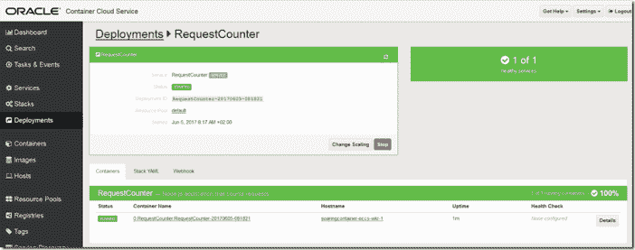

# 在 Oracle 云上运行 Node.js 应用程序

> 原文：<https://medium.com/oracledevs/running-any-node-application-on-oracle-container-cloud-service-108c98659b60?source=collection_archive---------0----------------------->

在[的一篇早期文章](https://technology.amis.nl/2017/05/21/running-node-js-applications-from-github-in-generic-docker-container/)中，我讨论了运行任何节点(Node)的通用 Docker 容器映像的创建。JS)应用程序，基于 GitHub 上该应用程序的源代码。当容器启动时，GitHub URL 作为参数传入，容器将下载源代码并运行应用程序。使用这个通用映像，您可以在任何可以运行 Docker 容器的地方运行您的节点应用程序。

可以运行 Docker 容器的地方之一是 Oracle Container Cloud Service(OCCS)，这是一种为管理容器环境提供平台的服务。在本文中，我将展示如何使用 OCCS 来运行我的通用 Docker 映像以运行节点应用程序，以及如何配置服务以运行 GitHub 中的特定节点应用程序。

我的同事 Luc Gorissen 在 AMIS 技术博客上的一篇文章中非常好地描述了 OCCS 入门: [Docker，Oracle Container Cloud Service 上的 WebLogic Image](https://technology.amis.nl/2017/05/24/docker-weblogic-image-oracle-container-cloud-service/)。我自己也是用他的文章入门的。

这些步骤是:

*   创建 OCCS 服务实例
*   配置 OCCS 实例(带有 Docker 容器映像注册表)
*   为所需的容器映像创建服务(通用节点应用程序运行程序)——这包括配置 Docker 容器参数，如端口映射和环境变量
*   部署服务(运行容器实例)
*   检查部署(状态、日志、分配的公共 IP)
*   测试部署—检查节点应用程序是否确实可用

# 创建 OCCS 服务实例

假设您有一个订购了 OCCS 的 Oracle 公共云帐户。转到 OCCS 的仪表板。点击创建服务

配置服务实例:

但是，不要把它做得太小。)(Oracle 云不是小份的):

所以现在有了允许的最小数据卷大小(对于无状态容器！)

这一次我通过了验证:

并且容器云服务实例被创建:

# 配置 OCCS 实例(带有 Docker 容器映像注册表)

一段时间后，当实例准备好了，我就可以访问它了:

如你所见，它相当大。

让我们访问容器控制台。

该控制面板提供了当前状态、实际部署(尚未部署)以及对服务、堆栈、容器、图像等的访问的概述。

首先要做的事情之一是配置一个(容器映像)注册中心，例如一个本地注册中心或 Docker Hub 上的一个帐户——我的帐户，其中保存了我需要在 Oracle 容器云中创建容器的容器映像:

我的详细信息已验证:

注册表已添加:

# 为所需的容器映像创建服务

服务是容器映像以及用于运行容器的配置。Oracle Container Cloud 附带了许多已经配置为服务的流行容器映像。我想为我自己的映像添加另一个服务:通用节点应用程序运行器)。为此，我从我的 Docker Hub 帐户中选择映像，然后配置 Docker 容器参数，如端口映射和环境变量

服务编辑器——定义映像(来自一个已配置的注册表)的表单，服务的名称(表示映像与一组配置设置的组合，以使其成为特定的*服务*)以及那些配置设置——端口映射、环境变量、卷等。

注意:我正在为映像创建一个服务，该服务可以运行 GitHub 中可用的任何节点应用程序(如下所述:[https://technology . amis . nl/2017/05/21/running-Node-js-applications-from-GitHub-in-generic-docker-container/](https://technology.amis.nl/2017/05/21/running-node-js-applications-from-github-in-generic-docker-container/))

# 部署服务(运行容器实例)

创建服务后，它现在可以作为运行新容器的蓝图。这是通过部署来完成的—这将服务与一些关于扩展、负载平衡等的运行时设置联系在一起:

为此服务的新部署设置部署详细信息:

完成这些详细信息后，按 deploy 继续运行新的部署。在这种情况下，它由单个实例组成(boring…)但是本来可以更投入的。

部署仍在开始。

稍后(几秒钟)容器开始运行:

查看一些细节:

要检查部署(状态、日志、分配的 IP)，请单击容器名称:

写入容器内部控制台的任何内容都可以从日志中访问:

要了解公开应用程序的公共 IP 地址，我们需要转到 Hosts 选项卡。

# 监控主机

深入查看一台特定主机:

并了解它的公共 IP 地址，在那里我们可以访问运行在已部署容器中的应用程序。

# 测试部署—检查节点应用程序是否确实可用

有了主机的公共 IP 地址，并且知道容器内部的端口 8080(还记得定义为 8080 的环境变量 APP_PORT，以传递给运行的通用节点应用程序)从外部映射到端口 8005，我们现在可以从本地浏览器调用部署在容器云服务上的容器内部运行的应用程序。

还有应用程序的输出(我从没说过它会很壮观……)

# 结论

在习惯了动作的顺序后:

*   配置注册表(可能仅一次)
*   配置服务(针对每个容器映像以及特定的配置参数设置，包括典型的 Docker 容器设置，如端口映射、卷、环境变量)
*   使用比例因子和其他部署详细信息定义和运行部署(从服务)
*   获取主机公共 IP 地址以访问容器中的应用程序

Oracle Container Cloud Service 提供了非常流畅的体验，与我见过的其他容器云服务和管理环境相比毫不逊色。至少从开发者的角度来看，OCCS 做得很好。现在谈论 OCCS 的行动还为时过早。

[容器](https://technology.amis.nl/tag/container/) [容器云](https://technology.amis.nl/tag/container-cloud/)[devo PS](https://technology.amis.nl/tag/devops/)[docker](https://technology.amis.nl/tag/docker/)[image](https://technology.amis.nl/tag/image/)[occs](https://technology.amis.nl/tag/occs/)[Oracle 云](https://technology.amis.nl/tag/oracle-cloud/) [注册表](https://technology.amis.nl/tag/registry/)

*原载于 2017 年 7 月 16 日*[*technology . amis . nl*](https://technology.amis.nl/2017/07/16/running-any-node-application-on-oracle-container-cloud-servicer/)*。*