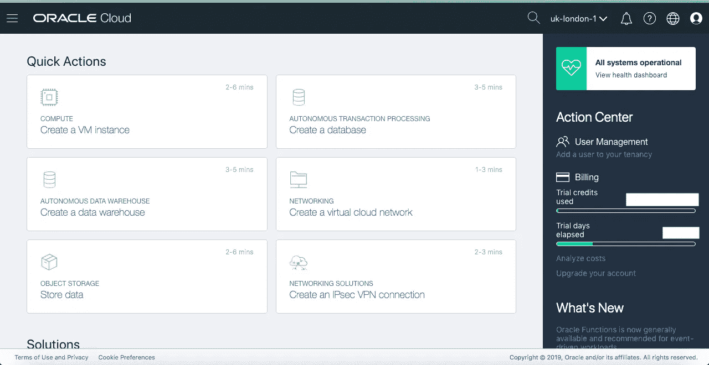
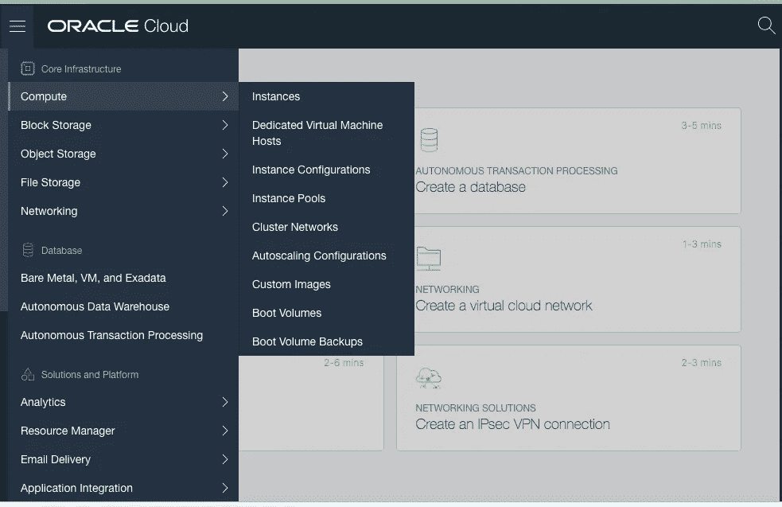
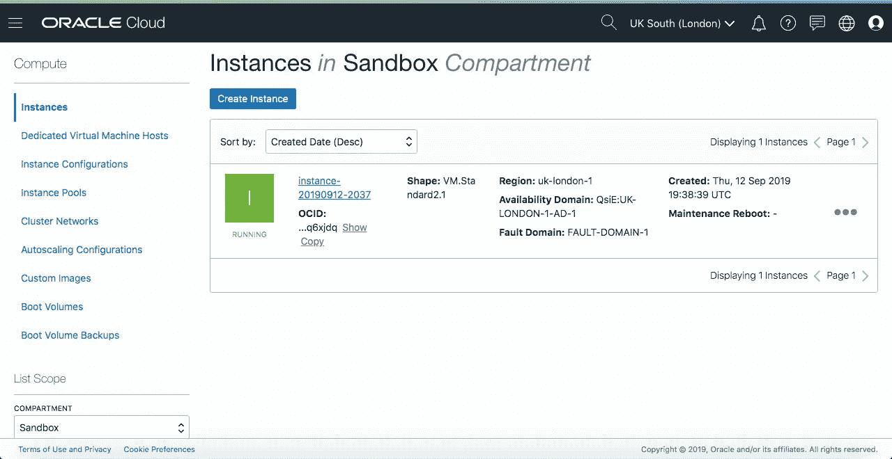
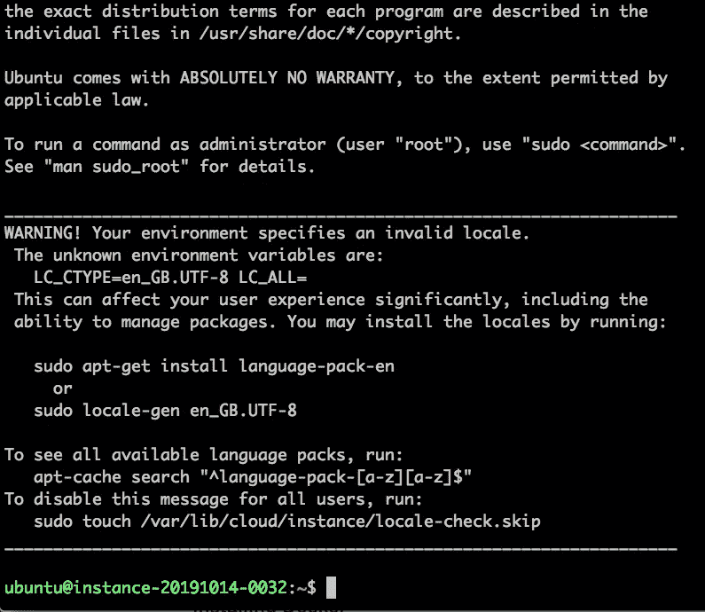
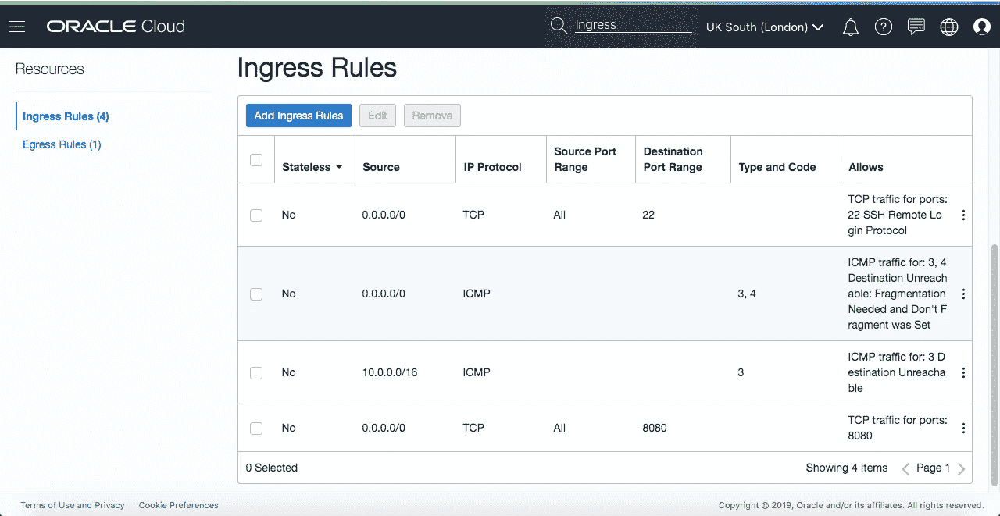
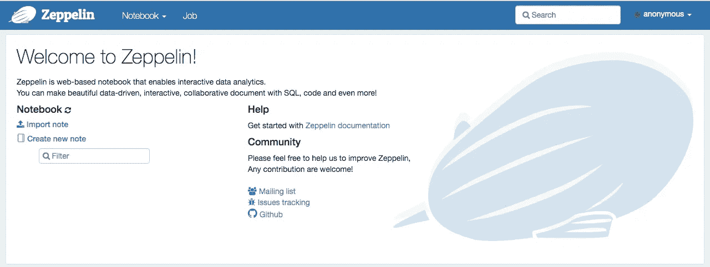
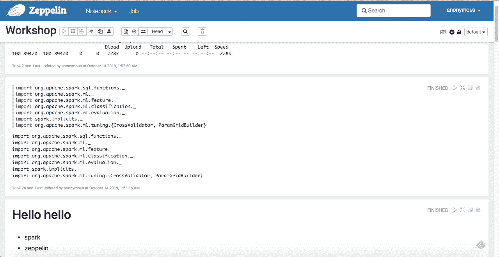
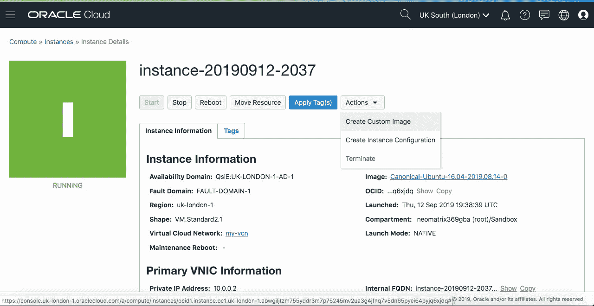
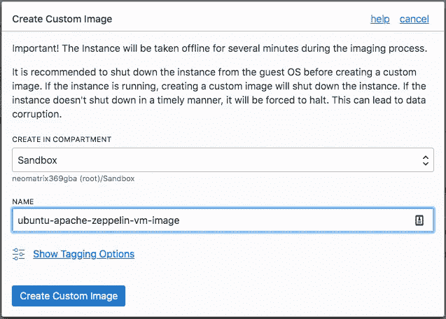

# 在云上运行 Apache Zeppelin

> 原文：<https://medium.com/oracledevs/running-apache-zeppelin-on-oracle-cloud-infrastructure-b0aecc79597a?source=collection_archive---------1----------------------->

# 介绍


这篇文章将由两篇文章的实践部分组成，一篇写于去年年底，另一篇写于几个月前。阿帕奇齐柏林飞艇:通往天堂的阶梯！(2018 年 12 月底)和[在甲骨文云基础设施上运行您的 JuPyTer 笔记本](/@neomatrix369/running-your-jupyter-notebooks-on-the-cloud-ed970326649f?source=---------4------------------)(2019 年 9 月初)。尽管这一次我们将让[阿帕奇齐柏林飞船](http://zeppelin.apache.org/)在[甲骨文云基础设施](http://cloud.oracle.com)上运行。

为了便于阅读和理解，我们将遵循与前几篇文章相似的结构。

同样为了简洁起见，在本文的其余部分，我们将使用术语 [OCI](http://cloud.oracle.com) 来指代[甲骨文云基础设施](http://cloud.oracle.com)。在某些情况下，我在帖子中用重复的步骤超链接和重定向读者(用一点叙述)，在某些情况下，我在帖子中根据当前主题逐字表达这些步骤，例如[阿帕奇齐柏林飞船](http://zeppelin.apache.org/)在 [OCI](http://cloud.oracle.com) 上。

*请不要直接从本文的截图或文本区域以及链接中使用类似 DNS 或 IP 地址或任何其他细节的信息。这些细节在您的案例中可能会有所不同，因此请尽量遵循流程背后的理念和原则。当你在你的终端设置时，你应该使用显示在你的控制台或浏览器界面上的细节，正如帖子中所指示的。*

# OCI:赶快开始吧

因此，开始之前，我们需要在 [OCI](http://cloud.oracle.com) 上有一个账户，设置起来非常简单。我建议阅读文章[在甲骨文云基础设施](/@neomatrix369/running-your-jupyter-notebooks-on-the-cloud-ed970326649f?source=---------4------------------)上运行 JuPyTer 笔记本的以下部分(提供截图帮助浏览步骤):

*   **简介**
*   **报名**
*   **设置**



*   **上云的动作**

当我们到达**动作的终点时，我们停下来进入云**部分。但是请确保你一路上安装好了所有的东西，以便为后面的文章准备好你需要的工具。跳过任何出现在 *Jupyter 笔记本*上的相关内容，因为我们接下来将设置[阿帕奇飞艇](http://zeppelin.apache.org/)。

当我们完成以上工作时，我们就处于一个很好的阶段，因为我们将拥有一个可以从浏览器和 CLI 访问的 VM 实例。然后我们可以进一步安装[阿帕奇飞艇](http://zeppelin.apache.org/)并开始。在继续之前，记下上面创建的 VM 实例的**公共 IP 地址**，在我的例子中是**132.145.60.249**。

# 齐柏林飞船:赶快开始吧

如果你已经知道了齐柏林飞艇，并且对它驾轻就熟，并且在浏览完这篇文章后很有信心:[阿帕奇齐柏林飞艇:通往 notes* haven 的阶梯！](/@neomatrix369/apache-zeppelin-stairway-to-notes-haven-28ec413a185a?source=---------6------------------)你可以直接进入文章的下一部分，即**运行阿帕奇飞艇**。

但是要熟悉[阿帕奇齐柏林飞艇](http://zeppelin.apache.org/)如果你过去没用过，我建议慢慢通读帖子:[阿帕奇齐柏林飞艇:笔记之梯*天堂！并让它在您的本地机器上工作。我们将采取进一步措施使其在云上运行，即](/@neomatrix369/apache-zeppelin-stairway-to-notes-haven-28ec413a185a?source=---------6------------------) [OCI](http://cloud.oracle.com) 。仅供参考，在撰写这篇文章时，我们使用了 Apache Zeppelin 0.8.0、Spark 2.4.3，并在 GraalVM 1.0.0-rc10 上运行，因为它被捆绑在 docker image[neo matrix 369/Zeppelin:0.1](https://hub.docker.com/layers/neomatrix369/zeppelin/0.1/images/sha256-0fb412fe5ba7cf69e4cd681786b92cd87f3c73019850238609dce145b0786d51)中。在这篇文章中，我们决定使用更新的版本，即阿帕奇齐柏林飞艇 0.8.1，Spark 2.4.4 和 GraalVM 19.2.0.1，你可以通过 docker image[neo matrix 369/Zeppelin:0.2](https://hub.docker.com/layers/neomatrix369/zeppelin/0.2/images/sha256-d9b7f16c514ddcfe01d758f84251b5b82b1e06ffc4bd58aeed4582545ea5a00f)访问它。

***注意:*** *我在这篇文章中避开了 Apache Zeppelin 0.8.0 和 0.8.2，因为它在我们的工作流程中引入了导致回归的新事物，对于这篇文章的所有意图和目的，我们可以使用 Apache Zeppelin 0.8.1。0.8.0 版本在我们尝试用 Scala 代码运行一段时产生* [*这个错误*](https://github.com/apache/zeppelin/pull/3206) *(在 0.8.1 版本中已解决)。*

还有，如果你已经注意到了，齐柏林世界把*笔记本*称为*笔记*，把*单元格*称为*段落*等等。

# 运行阿帕奇齐柏林飞艇

我们将直接在云上运行[阿帕奇齐柏林飞船](http://zeppelin.apache.org/)，因为我们已经有了在本地机器上运行它的经验。对你们中的一些人来说，现在这可能是一个显而易见的事情，因为步骤并不多，而且非常简单，因为我们已经为它奠定了基础。为了明确起见，相同的说明也适用于裸机或虚拟机实例。

# 登录到虚拟机实例

然后，您可以将 ***ssh*** 放入盒子中(参见[关于通过 ssh](https://docs.cloud.oracle.com/iaas/Content/Compute/Tasks/accessinginstance.htm?Highlight=ssh) 进行连接的文档),并继续下面的其余操作:

```
### Oracle Linux and CentOS images, user name: opc
### the Ubuntu image, user name: ubuntu$ ssh -i ~/.ssh/id_rsa ubuntu@132.145.60.249or$ ssh ubuntu@132.145.60.249
```

我们得到下一个提示，我们回答“是”:

```
The authenticity of host '132.145.60.249 (132.145.60.249)' can't be established. 
ECDSA key fingerprint is SHA256:USafjsySmPItXTdBOsQyiYbEdiFSa7Cs1so+9EnKC4M. 
Are you sure you want to continue connecting (yes/no)? yes
```

接下来是这个控制台，表示您现在已登录到虚拟机:



# 克隆 git repo

现在我们已经登录，并且在[https://github . com/neo matrix 369/awesome-ai-ml-dl/tree/master/examples/Apache-zeppelin](https://github.com/neomatrix369/awesome-ai-ml-dl/tree/master/examples/apache-zeppelin)中有了我们需要的所有脚本，我们可以克隆并运行它们。

如果您还没有，那么请运行下面的命令:

```
$ git clone [https://github.com/neomatrix369/awesome-ai-ml-dl/](https://github.com/neomatrix369/awesome-ai-ml-dl/)
$ cd examples/apache-zeppelin
```

# 安装 Docker

在 Ubuntu 上安装 Docker 的 Docker 文档可以在 Docker 网站上找到。虽然这里的目标操作系统是 Ubuntu 16.04 或更高版本，但是也提供了一个 bash 脚本来加速这个过程:

```
$ ./installDocker.sh
```

# **构建 Apache Zeppelin Docker 映像(可选)**

****Achtung！真的很抱歉，这个过程可能需要更长的时间，所以请走开，为自己和其他人制作咖啡，阅读** [**xkcd**](https://www.xkcd.com/) **，观看喜剧，然后在 15-20 分钟左右(取决于您的网络带宽)回来！****

**因此，我们可以选择继续或跳到下一步，并使用 docker 映像的旧版本:**

**我们可以通过运行构建脚本来构建我们最新的 Zeppelin Docker 容器:**

```
$ DOCKER_USER_NAME=<your Docker Hub username> IMAGE_VERSION=0.2 ./buildZeppelinDockerImage.sh
```

**我们看到这些信息飞逝而过:**

```
Sending build context to Docker daemon  34.82kBStep 1/21 : ARG ZEPPELIN_VERSION
Step 2/21 : FROM apache/zeppelin:${ZEPPELIN_VERSION}
---> 353d7641c769Step 3/21 : ARG SPARK_VERSION
---> Using cache
---> 2ca1b6703dd7Step 4/21 : ENV SPARK_VERSION=${SPARK_VERSION:-2.4.3}
---> Using cache
---> f507d31d0acaStep 5/21 : RUN echo "$LOG_TAG Download Spark binary" &&     wget -O /tmp/spark-${SPARK_VERSION}-bin-hadoop2.7.tgz [http://archive.apache.org/dist/spark/spark-${SPARK_VERSION}/spark-${SPARK_VERSION}-bin-hadoop2.7.tgz](http://archive.apache.org/dist/spark/spark-${SPARK_VERSION}/spark-${SPARK_VERSION}-bin-hadoop2.7.tgz)
---> Running in c94542e7eb00[ZEPPELIN_0.8.1]: Download Spark binary
--2019-10-13 19:55:16--  [http://archive.apache.org/dist/spark/spark-2.4.4/spark-2.4.4-bin-hadoop2.7.tgz](http://archive.apache.org/dist/spark/spark-2.4.4/spark-2.4.4-bin-hadoop2.7.tgz)
Saving to: ‘/tmp/spark-2.4.4-bin-hadoop2.7.tgz’[--snipped--]213350K .......... .......... .......... .......... .......... 94% 51.4K 3m0s
213400K .......... .......... .......... .......... .......... 94% 88.1K 2m59s
213450K .......... .......... .......... .......... .......... 95% 58.7K 2m59s
213500K .......... .......... .......... .......... .......... 95% 45.5K 2m58s
213550K .......... .......... .......... .......... .......... 95% 4.40M 2m57s
213600K .......... .......... .......... .......... .......... 95% 83.8K 2m56s
213650K .......... .......... .......... .......... .......... 95% 91.9K 2m55s
213700K .......... .......... .......... .......... .......... 95% 67.2K 2m55s
213750K .......... .......... .......... .......... .......... 95%  166K 2m54s
213800K .......... .......... .......... .......... .......... 95% 79.8K 2m53s[--snipped--]Step 21/21 : CMD ["bin/zeppelin.sh"]
---> Running in 843684f60302Removing intermediate container 843684f60302
---> 5833f13ff7c7Successfully built 5833f13ff7c7
Successfully tagged neomatrix369/zeppelin:0.2
```

**你已经注意到了，我们有一些变化:**

*   **对齐柏林飞艇码头文件的修改)**
*   **构建和运行脚本看起来也不同(buildZeppelinDockerImage.sh 和 runZeppelinDockerImage.sh)**
*   **我们也在使用 0.2 版本，请参见帖子中的 CLI 用法**

**希望这一切开始变得有意义(当我们说事情已经向前发展时，我给出了暗示……)。**

# **将 Docker 映像推送到 Docker Hub(可选)**

**一旦我们在上面的步骤中成功构建了包含 Apache Zeppelin 的 docker 映像，我们就可以通过以下方式轻松地将映像从本地存储库上传到远程存储库:**

```
$ DOCKER_USER_NAME=<your Docker Hub username> IMAGE_VERSION=0.2 ./push-apache-zeppelin-docker-image-to-hub.sh
```

**但是请注意，它需要几样东西:**

*   **Docker Hub 上的一个账户(即[neo matrix 369](https://hub.docker.com/u/neomatrix369))——*当然是你自己的账户***
*   **您已在本地登录您的 Docker Hub 帐户**
*   **您已经使用 Docker hub 帐户设置了 DOCKER_USER_NAME**

**否则你会得到错误信息，希望它们能引导你完成上传。**

*****注:*** *在我们的例子中，我们访问了 docker hub 上的 Docker 映像，参见*[*neomatrix 369/zeppelin on Docker Hub*](https://hub.docker.com/r/neomatrix369/zeppelin)*。***

# **从 Docker 映像运行 Apache Zeppelin**

**我们将下载 Docker Hub 上已经创建的图像:**

****版本 0.1 (Apache Zeppelin 0.8.0，Spark 2.4.3，GraalVM 1.0.0-rc10) —旧映像****

```
$ docker pull neomatrix369/zeppelin:0.1
$ ./runZeppelinDockerContainer.sh
```

****或****

****版本 0.2(阿帕奇齐柏林 0.8.1，Spark 2.4.4，GraalVM 19.2.0.1)——新镜像****

```
$ docker pull neomatrix369/zeppelin:0.2
$ IMAGE_VERSION=0.2 ./runZeppelinDockerContainer.sh
```

**上述命令应该会产生以下输出:**

```
ubuntu@instance-20191014-0101:~/awesome-ai-ml-dl/examples/apache-zeppelin$ IMAGE_VERSION=0.2 ./runZeppelinDockerContainer.shPlease wait till the log messages stop moving, it will be a sign that the service is ready! (about a minute or so)Once the service is ready, go to http://localhost:8080 to open the Apache Zeppelin homepagePid dir doesn't exist, create /zeppelin/runOpenJDK GraalVM CE 19.0.0 warning: ignoring option MaxPermSize=512m; support was removed in 8.0SLF4J: Class path contains multiple SLF4J bindings.SLF4J: Found binding in [jar:file:/zeppelin/lib/interpreter/slf4j-log4j12-1.7.10.jar!/org/slf4j/impl/StaticLoggerBinder.class]SLF4J: Found binding in [jar:file:/zeppelin/lib/slf4j-log4j12-1.7.10.jar!/org/slf4j/impl/StaticLoggerBinder.class]SLF4J: See http://www.slf4j.org/codes.html#multiple_bindings for an explanation.SLF4J: Actual binding is of type [org.slf4j.impl.Log4jLoggerFactory][---snipped---]WARNING: A HTTP GET method, public javax.ws.rs.core.Response org.apache.zeppelin.rest.CredentialRestApi.getCredentials(java.lang.String) throws java.io.IOException,java.lang.IllegalArgumentException, should not consume any entity.WARNING: The (sub)resource method createNote in org.apache.zeppelin.rest.NotebookRestApi contains empty path annotation.WARNING: The (sub)resource method getNoteList in org.apache.zeppelin.rest.NotebookRestApi contains empty path annotation.
```

## **在浏览器中打开 Apache Zeppelin 便笺**

**转到浏览器并尝试打开它:**

```
[http://132.145.60.249:8080](http://132.145.60.249:8080)
```

**但这不会起作用，因为我们还没有从我们的云网络内部(通过**入口规则，**了解更多信息[这里](https://docs.cloud.oracle.com/iaas/Content/Network/Concepts/securityrules.htm?Highlight=egress))向外部世界(公众)开放端口 8080:**

****

**我们需要将上述条目添加到**入口规则**部分，您可以通过导航菜单进入**入口规则**页面:**网络** > **虚拟云网络** > **虚拟云网络详细信息** *(通过单击 VCN 条目)* > **安全列表，**这将带您进入带有**默认安全列表**的页面。点击与您的**虚拟云网络(VCN)** 对应的安全列表，您将进入上述**入口规则**页面。**

**如果您仍然找不到，请在云控制台的任何页面上使用搜索工具搜索术语 ***安全*** (参见放大镜🔍在页面的顶部)。这将向您显示所有的**默认安全列表**，点击它会将您带到上面的**入口规则**页面(您可能只有一个安全列表条目)。 ***注意:入口是指进入网络/虚拟机实例的流量。*****

**为什么是端口 8080，那是因为我们在 docker 脚本中这样设置它，看看[源](https://github.com/neomatrix369/awesome-ai-ml-dl/tree/master/examples/apache-zeppelin#apache-zeppelin--)来找出原因和方法。**

**完成以上所有工作后:瞧！我们在浏览器中看到了[阿帕奇齐柏林飞船](http://zeppelin.apache.org/)的启动页面:**

****

# **使用阿帕奇齐柏林飞船笔记**

**看看[阿帕奇齐柏林飞船:通往笔记天堂的阶梯中**导入笔记**的部分！](/@neomatrix369/apache-zeppelin-stairway-to-notes-haven-28ec413a185a?source=---------6------------------)从这一节开始，你可以看到如何导入现有的笔记并执行它们。一旦我们导入并打开一个*便笺*，并运行它，它将看起来像这样:**

****

**导入这个注释还会在 VM 实例的*~/awesome-ai-ml-dl/examples/Apache-zeppelin/notebook*文件夹中创建一个 *"notes.json"* 文件。**

**更多的例子可以在[https://github.com/dylanmei/docker-zeppelin](https://github.com/dylanmei/docker-zeppelin)上找到，尽管这些需要对[阿帕奇飞艇](http://zeppelin.apache.org/)进行额外的安装和配置。**

# **创建自定义图像以供重复使用**

**由于我们已经能够从一个 VM 实例中成功运行 [Apache Zeppelin](http://zeppelin.apache.org/) ，我们可以保存这个映像供将来重用或与他人共享。在此之前，我将从 VM 实例的*~/awesome-ai-ml-dl/examples/Apache-zeppelin*中删除 ***logs*** 和 ***notebook*** 文件夹。**

**创建虚拟机实例的映像可以通过**计算>实例>实例详细信息**导航菜单完成，并从操作下拉菜单创建自定义映像:**

********

*****注意:*** *在创建自定义映像的过程中，您的原始虚拟机实例被关闭。根据原始虚拟机实例的大小，这可能需要几分钟才能完成。***

**成功创建后，下次我们创建新的虚拟机实例时，它将出现在可供选择的自定义映像列表中:**

****

# **超级用户**

**如果所有这些对你来说都是小菜一碟，或者你没有太多麻烦就挺过来了，那么试试这里的 [README 页面中提到的所有深层内容。](https://github.com/neomatrix369/awesome-ai-ml-dl/tree/master/examples/JuPyteR#jupyter)**

**为了能够在 [Apache Zeppelin](http://zeppelin.apache.org/) 环境中用其他 JVM 语言编码，您所需要的只是额外的扩展——这只是安装和配置的问题。你可以在这里了解他们的一切[，你也可以在](https://zeppelin.apache.org/docs/0.5.6-incubating/manual/interpreters.html)[阿帕奇飞艇](http://zeppelin.apache.org/)上用 Python 编码。了解如何为 Apache Zeppelin 编写自己的解释器。笔记本和解释器都可以分别通过[笔记本 API](https://zeppelin.apache.org/docs/0.5.6-incubating/rest-api/rest-notebook.html) 和[解释器 API](https://zeppelin.apache.org/docs/0.5.6-incubating/rest-api/rest-interpreter.html) 访问。**

# **签署**

```
[--snipped--]Oct 14, 2019 1:02:40 AM org.glassfish.jersey.internal.Errors logErrors
WARNING: The following warnings have been detected: WARNING: A HTTP GET method, public javax.ws.rs.core.Response org.apache.zeppelin.rest.InterpreterRestApi.listInterpreter(java.lang.String), should not consume any entity.
WARNING: A HTTP GET method, public javax.ws.rs.core.Response org.apache.zeppelin.rest.CredentialRestApi.getCredentials(java.lang.String) throws java.io.IOException,java.lang.IllegalArgumentException, should not consume any entity.
WARNING: The (sub)resource method createNote in org.apache.zeppelin.rest.NotebookRestApi contains empty path annotation.
WARNING: The (sub)resource method getNoteList in org.apache.zeppelin.rest.NotebookRestApi contains empty path annotation.^C
```

**如果您已经创建了一个便笺，它保存在名为(apache zeppelin directory)的子目录中，您可以使用 ***scp*** 从您的本地机器中检索该便笺(参见[这里的](https://linuxize.com/post/how-to-use-scp-command-to-securely-transfer-files/)关于如何做)。**

**确保你已经从 oracle.com 的和 cloud.oracle.com 的登录会话中注销了 ***，很容易忘记其中的一个。但是在此之前，请查看文档中的[资源清理](https://docs.cloud.oracle.com/iaas/Content/GSG/Tasks/terminating_resources.htm)页面——您不希望您的实例在您不查看它的时候永远运行！*****

# **结论**

****

**在这样做之后，在像 [OCI](http://cloud.oracle.com) ( [甲骨文云基础设施](http://cloud.oracle.com))这样的云提供商上运行笔记本服务，也就是[阿帕奇齐柏林](http://zeppelin.apache.org/)，看起来是一件很容易的事情。**

**实际上，如果我们总结这两篇文章的结论，阿帕奇齐柏林飞艇:通往天堂的阶梯！和[在 Oracle 云基础设施上运行您的 JuPyTer 笔记本电脑](/@neomatrix369/running-your-jupyter-notebooks-on-the-cloud-ed970326649f?source=---------4------------------)我们或多或少会说:**

**阿帕奇齐柏林飞艇给了我们:**

*   **与 Jupyter 笔记本电脑相似的灵活性，并允许通过配置和扩展来扩展功能**
*   **与 Jupyter 笔记本不同，每个段落(每个单元格)的执行进度总是(实时)显示**
*   **惰性执行有助于提高效率**
*   **表格数据和单元格(段落)可视化之间的往返导航**
*   **有时执行速度可能会比 Jupyter 笔记本慢一点**
*   **但是有一些解决方案可以加速这个过程(供以后的文章使用)**
*   **总而言之，这是一个让 Java/JVM 开发人员感觉宾至如归并在 JVM 上进行 ML 实验的好地方**

**[OCI](http://cloud.oracle.com) 给了我们:**

*   **易于使用的云环境**
*   **快速设置我们的环境，将我们希望快速推向市场的应用和解决方案推向市场**
*   **使我们能够运行 [Apache Zeppelin](http://zeppelin.apache.org/) (本地或通过 Docker 映像)**
*   **根据您的网络安全设置，可以公开或私下共享实例**
*   **提供了保护您的云基础设施的方法(我们在这里没有深入讨论)，但是请查看 OCI 文档页面上关于[安全性的文档以了解更多信息。](https://docs.cloud.oracle.com/iaas/Content/Security/Concepts/security.htm)**

*****请关注这个空间，并分享您的评论、反馈或任何有助于我们学习和成长的贡献到***[***@ theneomatrix 369***](http://twitter.com/@theNeomatrix369)**，*您可以通过*** [***关于我的页面***](http://neomatrix369.worpress.com/aboutme) ***找到更多关于我的信息。*****

# **资源**

****阿帕奇齐柏林飞艇****

*   **[阿帕奇齐柏林飞艇](http://zeppelin.apache.org/)**
*   **已经提供了那个东西的解释器**
*   **[下载页面](https://zeppelin.apache.org/download.html)**
*   **阿帕奇飞艇:[快速启动页面](https://zeppelin.apache.org/docs/0.8.0/quickstart/install.html)**
*   **[探索齐柏林飞艇 UI](https://zeppelin.apache.org/docs/0.8.0/quickstart/explore_ui.html)**
*   **[https://issues.apache.org/jira/browse/ZEPPELIN-3586](https://issues.apache.org/jira/browse/ZEPPELIN-3586)**
*   **[https://gist . github . com/conker 84/4 ffc 9 a2 f 0125 c 808 B4 DFC F3 b 7d 70 b 043 # file-zeppelin-docker file](https://gist.github.com/conker84/4ffc9a2f0125c808b4dfcf3b7d70b043#file-zeppelin-dockerfile)**
*   **[https://github . com/neo matrix 369/awesome-ai-ml-dl/tree/master/examples/Apache-zeppelin](https://github.com/neomatrix369/awesome-ai-ml-dl/tree/master/examples/apache-zeppelin)**
*   **[为 Apache Zeppelin 编写自己的解释器](https://zeppelin.apache.org/docs/0.5.6-incubating/development/writingzeppelininterpreter.html)**
*   **[笔记本 API](https://zeppelin.apache.org/docs/0.5.6-incubating/rest-api/rest-notebook.html)**
*   **[解释器 API](https://zeppelin.apache.org/docs/0.5.6-incubating/rest-api/rest-interpreter.html)**
*   *****例试*****
*   **[https://github.com/dylanmei/docker-zeppelin](https://github.com/dylanmei/docker-zeppelin)**
*   **[https://github . com/mmatloka/machine-learning-by-example-workshop](https://github.com/mmatloka/machine-learning-by-example-workshop)**
*   **[https://raw . githubusercontent . com/mmatloka/machine-learning-by-example-workshop/master/workshop . JSON](https://raw.githubusercontent.com/mmatloka/machine-learning-by-example-workshop/master/Workshop.json)**

****码头工人****

*   **[Docker Hub 注册](https://hub.docker.com/signup)**
*   **[在 Ubuntu 16.04 或更高版本上安装 Docker](https://docs.docker.com/install/linux/docker-ce/ubuntu/)**
*   **[Bash 脚本构建 Docker 容器](https://github.com/neomatrix369/awesome-ai-ml-dl/blob/master/examples/apache-zeppelin/buildZeppelinDockerImage.sh)**
*   **[](https://www.javaadvent.com/2018/12/apache-zeppelin-stairway-to-notes-haven.html)**。****

*****OCI/云*****

*   ***[入门](https://docs.cloud.oracle.com/iaas/Content/GSG/Concepts/baremetalintro.htm)***
*   ***[设置虚拟机实例的教程](https://docs.cloud.oracle.com/iaas/Content/GSG/Reference/overviewworkflow.htm)***
*   ***[安装 CLI](https://docs.cloud.oracle.com/iaas/Content/API/SDKDocs/cliinstall.htm)***
*   ***[CLI 文档](https://docs.cloud.oracle.com/iaas/Content/API/Concepts/cliconcepts.htm?Highlight=CLI)***
*   ***[资源清理](https://docs.cloud.oracle.com/iaas/Content/GSG/Tasks/terminating_resources.htm)***
*   ***[关于通过 ssh 连接到 OCI 的文档](https://docs.cloud.oracle.com/iaas/Content/Compute/Tasks/accessinginstance.htm?Highlight=ssh)***
*   ***新签到:[https://cloud.oracle.com/en_US/sign-in](https://cloud.oracle.com/en_US/sign-in)***
*   ***传统签到:[https://myaccount.cloud.oracle.com/](https://myaccount.cloud.oracle.com/)***
*   ***[联系支持](https://docs.cloud.oracle.com/iaas/Content/GSG/Tasks/contactingsupport.htm)***
*   ***[开发者工具](https://docs.cloud.oracle.com/iaas/Content/devtoolshome.htm?tocpath=Developer%20Tools%20%7C_____0)***
*   ***[文档](https://docs.cloud.oracle.com/iaas/Content/home.htm)***
*   ***[甲骨文云社区论坛](https://cloudcustomerconnect.oracle.com/resources/9c8fa8f96f/summary)***
*   ***[Oracle 云合规性](https://cloud.oracle.com/en_US/cloud-compliance)***
*   ***[甲骨文云基础设施博客](https://blogs.oracle.com/cloud-infrastructure/)***

*****安全*****

*   ***[安全规则/入口规则](https://docs.cloud.oracle.com/iaas/Content/Network/Concepts/securityrules.htm?Highlight=egress)***
*   ***[OCI 安全文件](https://docs.cloud.oracle.com/iaas/Content/Security/Concepts/security.htm)***