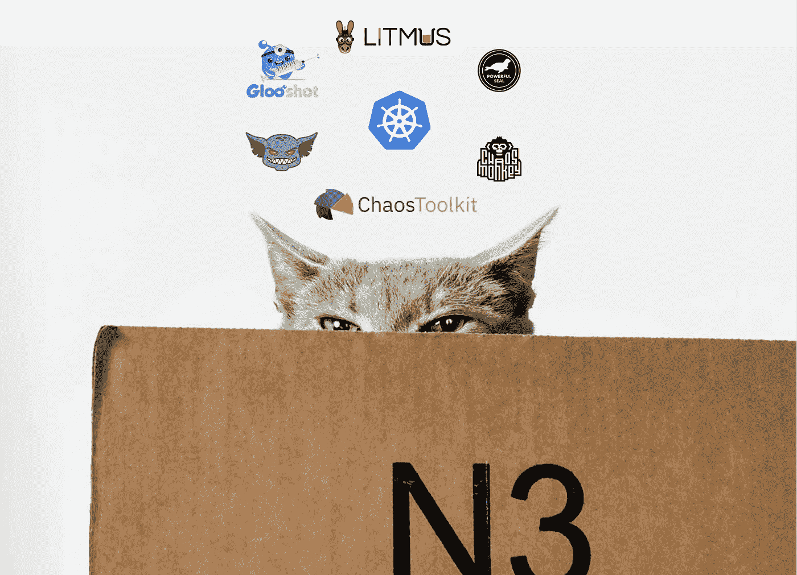
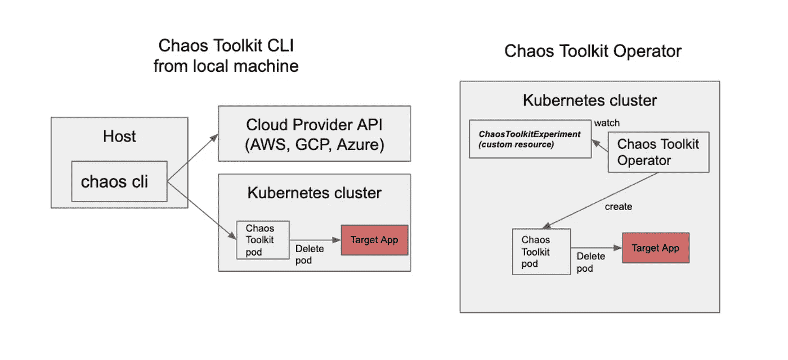
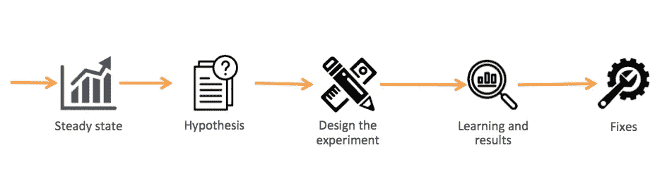
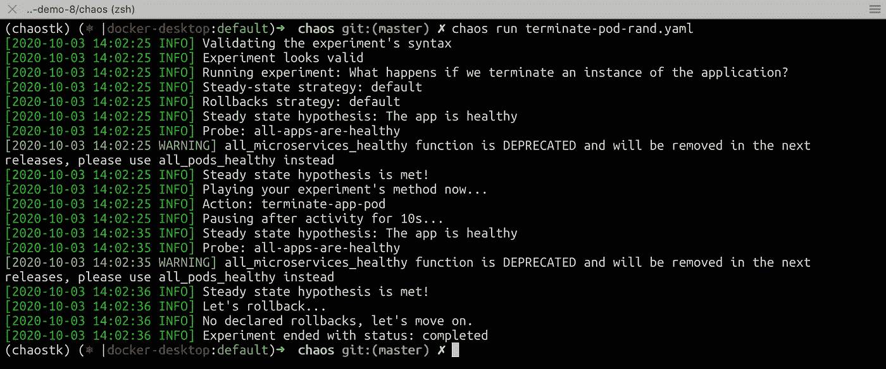
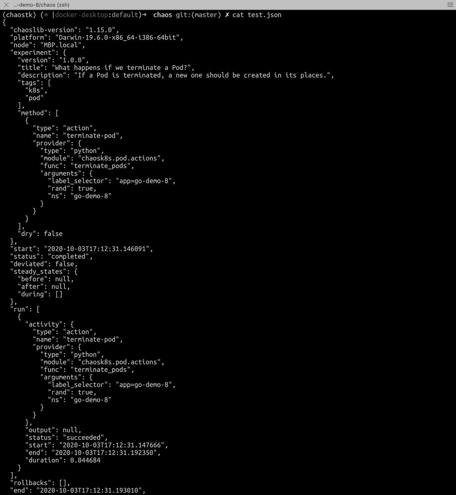
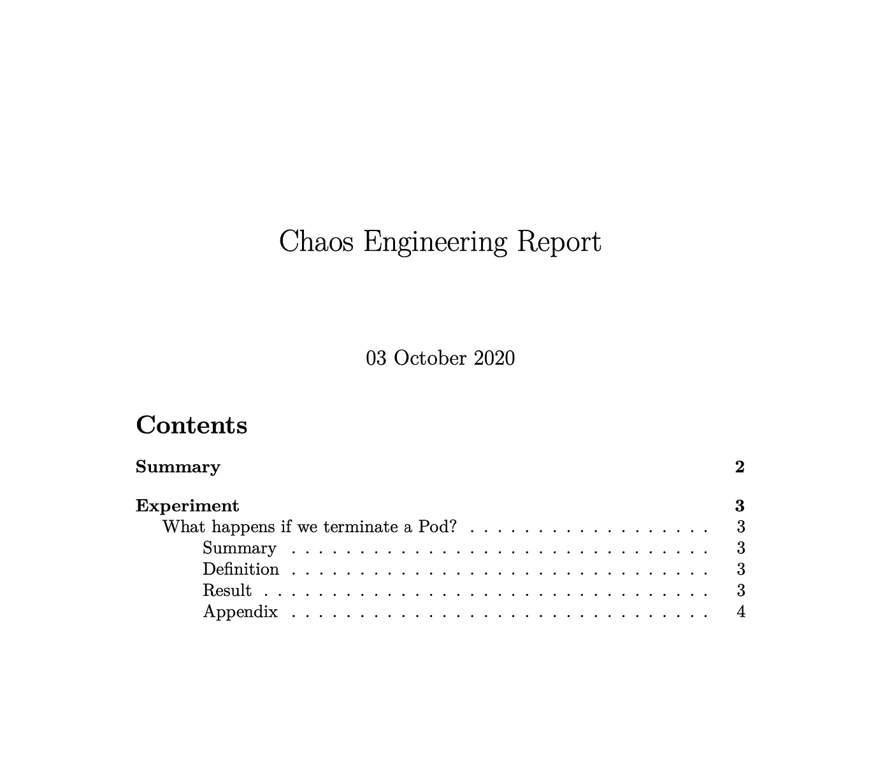
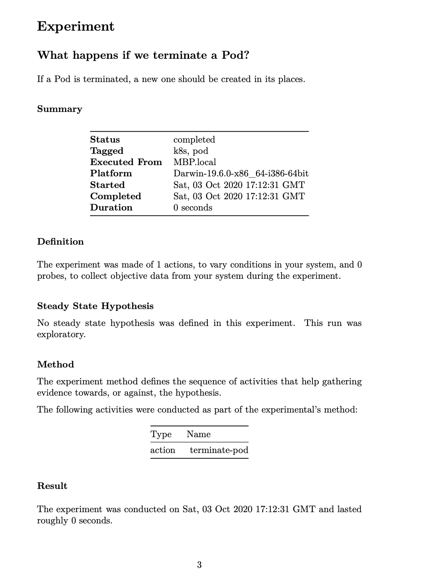
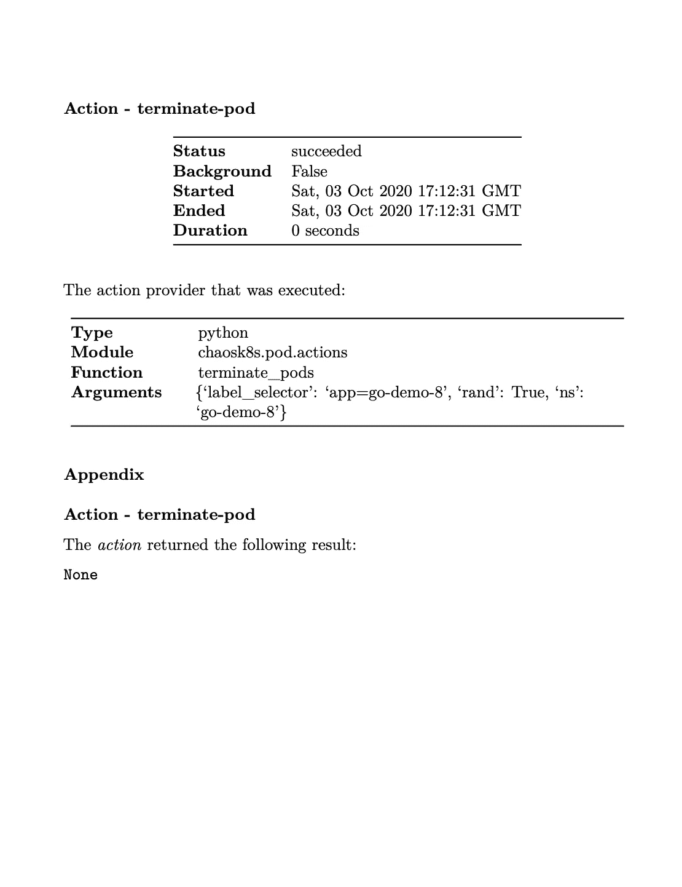
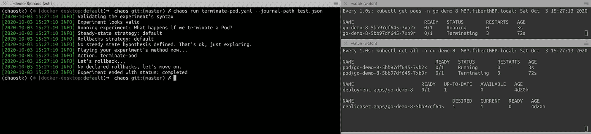

# 对 Kubernetes 星团进行混沌工程实验

> 原文：<https://medium.com/globant/running-chaos-engineering-experiments-against-a-kubernetes-clusters-b7909035d069?source=collection_archive---------0----------------------->

## 并通过 pdf 提供冷输出

对于那些不熟悉混沌工程实践的人来说，混沌是一门在生产中对软件系统进行实验的学科，目的是建立对系统承受动荡和意外条件的能力的信心。

这些实践已经被许多公司证明和采用，以便了解你的系统如何工作，测试可靠性，模拟 DoS，引入网络故障等。

## 可用工具

为了执行混沌工程，你可以开发你自己的脚本或软件来执行你的实验。但是让我与您分享一些有趣的工具来执行它:



> Pumba，Grembling，混沌猴，强力封印，kube-monkey，石蕊，Gloo 射击，混沌工具包

在这篇文章中，我们将使用混沌工具包，因为它是开源和多平台的。



Chaos Toolkit under the hood

## 混沌工程过程



当我们谈论混沌实验时，记住整个生态系统的“可观察性”是非常重要的。通过这样做，你将能够理解你正在做的实验(原因/结果),并允许你从实验中“学习”。

在开始做实验之前，准备好监控混沌实验的合适工具是关键条件。

## 设置环境

```
$ python3 -m venv ~/.venvs/chaostk
```

进入环境:

```
$ source ~/.venvs/chaostk/bin/activate 
```

安装混沌工具包+混沌工具包 Kubernetes 插件:

```
$ pip install -U chaostoolkit$ pip install -U chaostoolkit-kubernetes
```

安装完 chaostoolkit-kubernetes 插件后，它将为您提供许多可以用来创建实验的功能。
在我的例子中，我将使用:**all _ micro services _ healthy**来验证假设，使用 **terminate_pods** 和一个参数 **rand: true** 来终止名称空间中的任何 pod，在我的例子中是 **ns: go-demo-8。**

下面你会看到我的实验是什么样子的

注意:在[https://docs.chaostoolkit.org/](https://docs.chaostoolkit.org/)下，你可以找到很多其他的功能

## 实验

关键阶段:

**1-版本、标题、标签(用于识别实验的描述性部分) *2-假设(您定义一个探针来验证您的稳定状态)
3-实验(在方法下，您将描述您想要测试的内容，在我的情况下，杀死一个随机 pod)
4-回滚(如果有，在我的情况下，由于集群的自我修复，我还没有定义任何内容)***

```
version: 1.0.0
title: What happens if we terminate an instance of the application?
description: If an instance of the application is terminated, a new instance should be created
tags:
- k8s
- pod
- deployment
steady-state-hypothesis:
  title: The app is healthy
  probes:
  - name: all-apps-are-healthy
    type: probe
    tolerance: true
    provider:
      type: python
      func: all_microservices_healthy
      module: chaosk8s.probes
      arguments:
        ns: go-demo-8
method:
- type: action
  name: terminate-app-pod
  provider:
    type: python
    module: chaosk8s.pod.actions
    func: terminate_pods
    arguments:
      # label_selector: app=go-demo-8
      rand: true
      ns: go-demo-8
  pauses:
    after: 10
```

本实验旨在:

1-在 K8s 集群上运行
2-将使用函数“all_microservices_healthy”来验证我们的假设
3-杀死命名空间下的随机 Pod:go-demo-8

## 如何运行您的实验？

```
$ chaos run terminate-pod-rand.yaml
```



## 我们应该在哪里进行实验？

***应用层*** 你的代码有特性，有行为，有流程。试试看。

***缓存层*** 现代应用越来越依赖缓存。如果缓存不可用怎么办？如果事务/操作因缓存层问题而受到影响，会发生什么情况？

***数据库层*** 关闭数据库，放松一下，看看会发生什么。

***云层*** 2020 年，许多数字平台依赖云提供商，因此您可能会受到许多问题的影响:EC2s 不稳定、AZs 降级、网络延迟等。因此，在我们的实验中观察整个平台的行为是很有趣的。

## 做完实验后，我们应该做什么？

基本上有些答案是“生成报告”或“自动化纠正措施”，但如何做到这一点呢？

混沌工具包有它的答案，答案是:你必须生成一个“日志”。

```
$ chaos run terminate-pod.yaml — journal-path test.json
```

因此 test.json 应该是实验的输出，看起来应该是这样的:



正如您可能看到的 JSON，它有一个人可读的输出，但它不是一个友好的输出。

如果你试图使用一台机器来采取行动，这是可以的。但是，如果你需要向你的经理提交一份很好的报告，以便让另一个团队开始解决你在做混沌实验时可能发现的问题，那该怎么办呢？

## 在 PDF 上生成混沌工程报告

通过使用 chaos toolkit 报告工具，您可以创建一个非常漂亮的 PDF 报告。该工具采用 docker 格式，因此如果您熟悉它，可以使用:

```
$ docker container run \
    --user $(id -u) \ 
    --volume $PWD:/tmp/result \
    -it \
    chaostoolkit/reporting \
     -- report \
     --export-format=pdf \
    Test.json \
    report.pdf
```

在 docker 接收到您的日志(test.json)后，它将生成 report.pdf，并输出您的实验，如下所示:



在这里，您可以看到运行实验的实际环境，通过 kubectl 实验和 chaos toolkit CLI 输出进行监控



请记住，混沌的最后一个想法是在生产中进行实验以提高可靠性，了解我们的应用程序以生成剧本、运行手册并开发所需的 IT 适应性，例如处理网络星期一、黑色星期五或在我们的平台上面临未知的干扰问题。

如果你正在寻找更多混乱的例子，如测试 istio，增加集群的网络延迟或类似的，给我留言，我会单独发给你

希望这有助于开始改进您的应用程序。

帕布罗！

## 链接

 [## 混沌工具包

### 探索建立你自己的混沌工程实验的最简单和最容易的方法。

chaostoolkit.org](https://chaostoolkit.org/) [](https://github.com/chaostoolkit) [## 混沌工具包

### 解散 GitHub 是超过 5000 万开发者一起工作的家。加入他们，发展您自己的开发团队…

github.com](https://github.com/chaostoolkit)