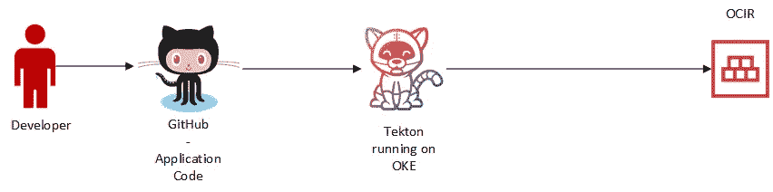

# 在 OKE 上运行与 Tekton 的持续集成

> 原文：<https://medium.com/oracledevs/running-continuous-integration-on-oke-with-tekton-353684c15730?source=collection_archive---------0----------------------->

现在 terraform-oci-oke 3.0 已经发布，我想探索在 Oracle Container Engine for Kubernetes(OKE)上运行“云原生”持续集成(ci)。我的标准相对简单。我应该能够:

1.  使用 maven/gradle/npm 等工具构建和测试应用程序。
2.  构建容器并将它们推送到安全的注册中心。
3.  最终使用基础设施作为连续交付(CD)的代码。

我选定了泰克顿。这是工作流程的样子:



CI Workflow

鉴于 Tekton 运行在 Kubernetes 集群上，我使用 terraform-oci-oke 提供了一个集群。我还启用了公共和私有负载平衡器的使用，并将首选负载平衡器类型设置为私有。原因是我最终想通过 OCI API 网关部署 API，但是在以后的文章中会有更多的介绍。为此，我在变量文件中设置了以下内容，然后运行 terraform apply:

```
lb_subnet_type = "both"
preferred_lb_subnets = "private"
```

这将创建集群，并选择专用负载平衡器子网作为 OKE 的首选子网。

在本文中，我将重点介绍如何使用 Tekton 运行 CI。

## 在 OKE 上部署 Tekton

遵循 [Tekton 安装指南](https://tekton.dev/docs/getting-started/)并从操作主机运行以下程序:

```
kubectl apply --filename https://storage.googleapis.com/tekton-releases/pipeline/latest/release.yaml
```

接下来，使用 CSI 卷插件，通过在名为 pvc.yaml 的文件中添加以下内容来创建一个持久卷:

```
apiVersion: v1
kind: PersistentVolumeClaim
metadata:
  name: tektonclaim
  namespace: tekton-pipelines
spec:
  storageClassName: "oci-bv"
  accessModes:
    - ReadWriteOnce
  resources:
    requests:
      storage: 50Gi
```

现在，我们希望现在就绑定 PVC，而不是等待运行任务，所以让我们通过将以下内容添加到 dummypod.yaml 来创建一个仅使用 PVC 的虚拟 pod:

```
apiVersion: v1                                                                                                                                                                                
kind: Pod                                                                                                                                                                                     
metadata:                                                                                                                                                                                     
  name: nginx                                                                                                                                                                                 
  namespace: tekton-pipelines                                                                                                                                                                 
spec:                                                                                                                                                                                         
  containers:                                                                                                                                                                                 
    - name: nginx                                                                                                                                                                             
      image: nginx:latest                                                                                                                                                                     
      ports:                                                                                                                                                                                  
        - name: http                                                                                                                                                                          
          containerPort: 80                                                                                                                                                                   
      volumeMounts:                                                                                                                                                                           
        - name: data                                                                                                                                                                          
          mountPath: /usr/share/nginx/html                                                                                                                                                    
  volumes:                                                                                                                                                                                    
    - name: data                                                                                                                                                                              
      persistentVolumeClaim:                                                                                                                                                                  
        claimName: tektonclaim
```

创建 pod:

```
kubectl create -f dummypod.yaml
```

检查 PVC 和 PV 的状态，确保它们报告为绑定:

```
$ k -n tekton-pipelines get pvc                                                                                                                                               
NAME          STATUS   VOLUME                                     CAPACITY   ACCESS MODES   STORAGECLASS   AGE                                                                                
tektonclaim   **Bound**    csi-dea15685-2fa9-4496-be86-f0c22da6e65f   50Gi       RWO            oci-bv         8m18s                                                                              
$ k get pv                                                                                                                                                                    
NAME                                       CAPACITY   ACCESS MODES   RECLAIM POLICY   STATUS   CLAIM                          STORAGECLASS   REASON   AGE                                     
csi-dea15685-2fa9-4496-be86-f0c22da6e65f   50Gi       RWO            Delete           **Bound**    tekton-pipelines/tektonclaim   oci-bv                  6m25s
```

删除窗格:

```
kubectl delete -f dummypod.yaml
```

现在让我们安装 tekton-cli:

```
sudo rpm -Uvh [https://github.com/tektoncd/cli/releases/download/v0.16.0/tektoncd-cli-0.16.0_Linux-64bit.rpm](https://github.com/tektoncd/cli/releases/download/v0.16.0/tektoncd-cli-0.16.0_Linux-64bit.rpm)
```

Tekton 仪表盘:

```
kubectl apply --filename https://github.com/tektoncd/dashboard/releases/latest/download/tekton-dashboard-release.yaml
```

## 测试 Tekton

现在我们已经完成了 Tekton 的安装，我们可以在 Tekton 网站上检查它是否与 Hello World 示例一起工作。创建一个文件任务-hello.yaml:

```
apiVersion**:** tekton.dev/v1beta1
kind**:** Task
metadata**:**
  name**:** hello
spec**:**
  steps**:**
    - name**:** hello
      image**:** ubuntu
      command**:**
        - echo
      args**:**
        - "Hello World!"
```

然后创建任务:

```
kubectl create -f task-hello.yaml
```

并开始任务:

```
tkn task start hello
```

最后，让我们看看任务是否已经成功运行:

```
tkn taskrun logs --last -f[hello] Hello World!
```

我们已经在 OKE 成功安装了 Tekton。

## 创建应用程序项目并将其存储在 GitHub 中

我们将使用 [Spring Boot](https://spring.io/projects/spring-boot) 作为应用框架。使用 Spring Initializr 或命令行来生成项目。我们将在这里使用 Spring Initializr，并确保我们添加了 Spring Web 依赖项:


Generating application code with Spring Initializr

单击“Generate”下载 zip 文件并将其解压缩到本地。

在 GitHub 中创建新的 repo，让我们将 helloworld 应用程序推送到 git:

```
cd /path/to/helloworld
git init
git add .
git commit -m "first commit"
git branch -m master main
git remote add origin [https://github.com/hyder/helloworld.git](https://github.com/hyder/helloworld.git)
git push -u origin main
```

我们还希望能够构建一个容器映像，因此我们将添加一个 docker 文件:

让我们首先创建一个 Dockerfile 文件，并将其添加到 repo 中:

```
FROM [container-registry.oracle.com/java/jdk:11-oraclelinux8](container-registry.oracle.com/java/openjdk:15.0.2-oraclelinux7)COPY target/*.jar /java -jar  /helloworld-0.0.1-SNAPSHOT.jar
```

我们当然可以在构建之前更新版本，但不要操之过急。

现在我们的应用程序代码已经在 GitHub 上了，我们想要做的是让 Tekton 做以下事情:

1.  克隆 helloworld 应用程序报告。
2.  构建应用程序代码。在 helloworld 应用程序中，我们使用 maven，所以我们希望能够使用 maven 进行构建。
3.  使用 Dockerfile 文件构建容器映像。
4.  将构建的容器映像推送到 OCIR。

## 为 Tekton 创建服务帐户

默认情况下，OCIR 是私有的，我们希望保持这种状态。为了能够将图像推送到 OCIR，我们需要一个存储在 Kubernetes 秘密中的[认证令牌](/@lmukadam/build-a-springboot-application-using-wercker-push-a-docker-image-to-ocir-and-deploy-to-oke-596f62554eae)，以便 Tekton 可以使用它向 OCIR 认证自己。

幸运的是，terraform-oci-oke 可以为我们创造这个秘密。您需要做的就是创建身份验证令牌，将其存储在 OCI 保险库密码中，然后将保险库密码的 id 提供给变量文件。你可以在这里按照[的指示](https://github.com/oracle-terraform-modules/terraform-oci-oke/blob/master/docs/instructions.adoc#creating-a-secret-for-ocir)。

```
secret_id = "ocid1.vaultsecret.oc1.ap-sydney-1…"
```

我们还需要一个 Kubernetes ServiceAccount，同样，我们可以通过在 terraform 变量文件中设置它来创建它:

```
create_service_account = true
service_account_name = "tekton"
service_account_namespace = "tekton-pipelines"
service_account_cluster_role_binding = "tekton-crb"
```

您可能需要再次运行 terraform apply 来创建密码和服务帐户。再次运行 terraform apply 后，检查是否已从操作员主机创建了密码和 ServiceAccount:

```
$ kubectl get secrets                                                                                                                                       
NAME                  TYPE                                  DATA   AGE                                                                                                
default-token-qk98l   kubernetes.io/service-account-token   3      20h                                                                                                
**ocirsecret** kubernetes.io/dockerconfigjson        1      20h$ kubectl get serviceaccount -n tekton-pipelines                                                                                                                           
NAME      SECRETS   AGE                                                                                                                                               
default   1         20h                                                                                                                                               
**tekton** 1         49s
```

此时，我们需要将 ServiceAccount 配置为使用 ocirsecret，以便 Tekton 可以对自身进行身份验证，并将图像推送到 OCIR。现在，问题是 ocirsecret 是在默认名称空间*中创建的，因此我们首先需要将它复制到 tekton-pipelines 名称空间中。我们在 terraform-oci-oke 项目上有一个[增强](https://github.com/oracle-terraform-modules/terraform-oci-oke/issues/268)，它将允许你指定列表、类型和首选名称空间。如果你想投稿，请给我们发一份简历。但是现在:*

```
$ kubectl get secret ocirsecret --namespace=default --export -o yaml |kubectl apply --namespace=tekton-pipelines -f -$ kubectl edit sa tekton
```

在“机密”下，添加机密名称:

```
apiVersion: v1                                                                                                                                                        
kind: ServiceAccount                                                                                                                                                  
metadata:                                                                                                                                                             
  name: tekton                                                                                                                                                        
  namespace: tekton-pipelines
  ...                                                                                                                                                 
secrets:                                                                                                                                                              
- name: tekton-token-jwmbn
- name: ocirsecret
```

类似地，如果您想使用来自[Oracle Container Registry](https://container-registry.oracle.com)(不要与 OCIR 混淆)的 [Java SE 映像](https://container-registry.oracle.com/pls/apex/f?p=113:4:28997522454400:::4:P4_REPOSITORY,AI_REPOSITORY,AI_REPOSITORY_NAME,P4_REPOSITORY_NAME,P4_EULA_ID,P4_BUSINESS_AREA_ID:41,41,Oracle%20Java%20SE%20(Server%20JRE),Oracle%20Java%20SE%20(Server%20JRE),1,0&cs=38MLqx9K2fzCxjB14glP6BVhx68eQeJ5qe0Bih7BepT0O-aAOtF6VoLJPIkxvsR41U1ljU-d9TD0N_fWzMfgtOQ)，而不是构建一个新的映像，您可以创建第二个密码来访问 Oracle Container Registry。

```
kubectl create secret docker-registry oracle-container-registry \ 
 -n tekton-pipelines \
 — docker-server=container-registry.oracle.com \
 — docker-username=$CONTAINER_REGISTRY_USER \
 — docker-password=$CONTAINER_REGISTRY_PASSWORD
```

用您的 Oracle SSO 帐户替换$CONTAINER_REGISTRY_ user 和 password。一旦创建了密码，就像我们为 OCIR 做的那样，将它添加到您的服务帐户中。

另一件事是，为了向 git 或容器注册中心认证自己，或者在必须使用多个 repos 并因此必须选择哪些凭证的情况下，tekton 需要一些注释。你可以在这里阅读[。](https://tekton.dev/docs/pipelines/auth/)

但本质上，我们需要在 ocirsecret 中添加一个注释:

```
apiVersion: v1                                                                                                                                                                                
kind: Secret                                                                                                                                                                                  
metadata:                                                                                                                                                                                     
  annotations:                                                                                                                                                                                                                                
    tekton.dev/docker-0: https://syd.ocir.io 
```

这将向 Tekton 表明，当访问位于[的悉尼 OCIR 时，此证书适用。否则，泰克顿会忽略这个秘密。](https://syd.ocir.io,)

## 创建任务

为了构建应用程序，我们需要做以下工作:

1.  使用 maven 构建应用程序代码。
2.  使用 Dockerfile 文件构建容器映像。
3.  将构建的容器映像推送到 OCIR。

我们可以使用我们自己的 maven 容器来构建这个，但是 Tekton 有这个令人愉快的外部任务目录，你可以安装，其中之一就是 maven。你可以在 [GitHub](https://github.com/tektoncd/catalog) 或 [Tekton Hub](https://hub.tekton.dev/) 上查看这些任务，这也给了你安装你需要的任务的命令。

因此，让我们安装以下外部任务:

*   git-克隆
*   专家
*   buildah

我们将使用 git-clone，因为我们现在只需要克隆；我们将使用 Maven，因为我们在创建 Sprint Boot 应用程序时使用了 Maven；最后，我们将使用 buildah，因为我的好伙伴 Avi Miller 是我的粉丝。

```
kubectl apply -f [https://raw.githubusercontent.com/tektoncd/catalog/master/task/git-clone/0.2/git-clone.yaml](https://raw.githubusercontent.com/tektoncd/catalog/master/task/git-clone/0.2/git-clone.yaml) -n tekton-pipelineskubectl apply -f [https://raw.githubusercontent.com/tektoncd/catalog/master/task/maven/0.2/maven.yaml](https://raw.githubusercontent.com/tektoncd/catalog/master/task/maven/0.2/maven.yaml) -n tekton-pipelineskubectl apply -f [https://raw.githubusercontent.com/tektoncd/catalog/master/task/buildah/0.2/buildah.yaml](https://raw.githubusercontent.com/tektoncd/catalog/master/task/buildah/0.2/buildah.yaml) -n tekton-pipelines
```

所以，我们要做的是:


以上每一项都可以是管道中的任务。要了解其中的区别，您可以查看 [Tekton 概念](https://tekton.dev/docs/concepts/)。因此，让我们创建一个管道和一个管道管路，然后:

管道由 3 项任务组成:

*   git-clone 类型的提取报告
*   maven-maven 类型的运行
*   build-buildah 类型的图像

您还会注意到，我们用 runAfter 命令它们:

```
# in maven-run
runAfter:
  - fetch-repo....
# in build-image
runAfter:
  - maven-run
```

通过这种方式，我们可以在管道中获得所需的任务顺序。另外，请注意工作区引用及其对 PVC 的使用，以及在 PipelineRun:

```
apiVersion: tekton.dev/v1beta1
kind: PipelineRun
metadata:
  name: helloworld-pipeline-run
spec:
  **serviceAccountName: tekton**
  pipelineRef:
    name: helloworld-build
  workspaces:
    - name: maven-settings
      emptyDir: {}
    - name: tekton-workspace
      persistentvolumeclaim:
        claimName: tektonclaim
params:
- name: repo-url
  value: [https://github.com/hyder/helloworld.git](https://github.com/hyder/helloworld.git)
- name: branch-name
  value: main
- name: image-name
  value: syd.ocir.io/**<object_storage_namespace>**/helloworld
```

对象存储命名空间是您的租用的命名空间。你需要这个，因为这是 OCIR 存储你的容器图像的地方。

创建一个 yaml 文件，并在文件中添加 Pipeline 和 PipelineRun，然后应用清单:

```
kubectl apply -f pipeline.yaml
```

让我们访问控制面板:

```
kubectl -n tekton-pipelines get pods | grep tekton-dashboard                                                                                                                      
tekton-dashboard-5675959458-s46sm                             1/1     Running     0          15hkubectl -n tekton-pipelines port-forward tekton-dashboard-5675959458-s46sm 9097:9097
```

我们现在可以使用浏览器访问控制面板:


List of PipelineRun

当我们选择管道管路时，我们可以看到以下内容:


在左侧，我们可以看到在这个管道中定义的 3 个任务和所选任务的 2 个步骤。截屏显示了 maven 运行，包括下载各种依赖项。任务完成后，您还会在您的 OCIR 中看到容器图像。

## 加速构建

但是，上面有一个问题。每次构建完成后，maven 都会一遍又一遍地下载依赖项(又名[下载互联网](https://dzone.com/articles/how-not-download-internet))，在这个实验中，构建平均花费了大约 4 分 16 秒。下面的屏幕截图显示了 5 个构建的计时结果。


Timing results for 5 builds

其中，maven-run 任务的 mvn-goals 步骤平均耗时 2 分 42 秒。，其中大部分时间花在下载依赖项上。还要记住，这是一个基本的 Spring Boot 项目，没有额外的依赖。当您开始添加更多的依赖项时，这将很快变得不可接受，尤其是当您有多个团队在构建时。

我们需要减少应用程序构建时间，我们可以通过让 maven 创建和使用本地缓存并避免重复下载依赖项来实现这一点。此外，我们需要在不同的管道、任务等之间共享这一点。[这篇博文](https://developers.redhat.com/blog/2020/02/26/speed-up-maven-builds-in-tekton-pipelines/)提供了一种可能的方法。然而，它也定义了自己的 maven 任务，而不是使用目录中可用的任务，还有 PipelineResources(我认为),这可能会被弃用。然而，这篇文章展示了使用 PVC 作为本地 maven repo 的工作空间的可能性。

相反，让我们考虑使用一个由 PersistentVolumeClaim 支持的独立工作区的想法，该工作区将保留本地 maven repo，但我们将修改目录中的现有 maven 任务。这里，由于我只在集群中试验了一个工作节点，所以我将使用块卷作为存储。但是，您也可以使用 [OCI 文件系统服务](https://blogs.oracle.com/cloud-infrastructure/using-file-storage-service-with-container-engine-for-kubernetes)，这样所有节点都可以访问“本地 maven repo”。让我们为本地 maven repo 定义另一个 PVC。

```
apiVersion: v1                                                                                                                                                                                
kind: PersistentVolumeClaim                                                                                                                                                                   
metadata:                                                                                                                                                                                     
  name: mavenclaim                                                                                                                                                                            
  namespace: tekton-pipelines                                                                                                                                                                 
spec:                                                                                                                                                                                         
  storageClassName: "oci-bv"                                                                                                                                                                  
  accessModes:                                                                                                                                                                                
    - ReadWriteOnce                                                                                                                                                                           
  resources:                                                                                                                                                                                  
    requests:                                                                                                                                                                                 
      storage: 50Gi
```

现在，问题是 Tekton 目录中的 Maven 任务只需要两个工作空间: *source* 和 *maven-settings* 。因此，为了将 maven repo 添加为工作区，我们将更改任务定义:

```
curl -o maven2.yaml [**https://raw.githubusercontent.com/tektoncd/catalog/master/task/maven/0.2/maven.yaml**](https://raw.githubusercontent.com/tektoncd/catalog/master/task/maven/0.2/maven.yaml)
```

我们将对其进行编辑，添加第三个工作区，并将任务的名称改为一个相当缺乏想象力的' *maven2* ':

```
apiVersion: tekton.dev/v1beta1                                                                                                                                                                
kind: Task                                                                                                                                                                                    
metadata:                                                                                                                                                                                     
  name: **maven2**
...
spec:
  workspaces:                                                                                                                                                                                 
    - name: source                                                                                                                                                                            
      description: The workspace consisting of maven project.                                                                                                                                 
    - name: maven-settings                                                                                                                                                                    
      description: >-                                                                                                                                                                         
        The workspace consisting of the custom maven settings                                                                                                                                 
        provided by the user.                                                                                                                                                                 **
    - name: maven-repo                                                                                                                                                                        
      description: The workspace to be used as local repo.**
```

并创建新的 maven 任务:

```
kubectl apply -f maven2.yaml -n tekton-pipelines
```

默认情况下，每个任务只能使用 [1 个 PVC，但是我们可以通过编辑 configmap 特性标志](https://github.com/tektoncd/pipeline/issues/3480)来解决这个问题:

```
kubectl -n tekton-pipelines edit configmap feature-flags
```

以及[禁用亲和助手](https://github.com/tektoncd/pipeline/issues/3480):

```
data:                                                                                                                                                                                         
  disable-affinity-assistant: "true"
```

现在，我们可以调整管道，将 maven repo 添加为工作区:

我们需要将 taskRef 从' *maven'* 更改为' *maven2 '* ，并添加以下参数:

```
**- -Dmaven.repo.local=$(workspaces.maven-repo.path)**
- -DskipTests
- clean
- package
```

这将迫使 maven 使用工作区作为其本地 repo 的位置。

我们现在可以预期第一次构建会和之前的一样长，但是后续的构建会快得多。让我们运行大约相同的次数，以获得平均值:


我们现在可以看到显著的改善。总体平均构建时间(克隆、maven 构建、应用构建)现在已经减少到大约 2 分 27 秒。这意味着构建时间缩短了 42%。如果您检查 mvn-goals 步骤所用的实际时间，这种改进甚至更显著，下降到 *9s only* ，改进了近 95%。

事后看来，我应该把这个任务命名为 flashmaven 或者什么超级英雄。

我希望这篇文章对你有用。

参考资料:

1.  [Tekton 文档](https://tekton.dev/docs/)
2.  [泰克顿教程](https://github.com/tektoncd/pipeline/blob/master/docs/tutorial.md)
3.  [通过 OKE 使用 OCI 文件存储](https://blogs.oracle.com/cloud-infrastructure/using-file-storage-service-with-container-engine-for-kubernetes)
4.  [使用 OKE 创建持久卷](https://docs.oracle.com/en-us/iaas/Content/ContEng/Tasks/contengcreatingpersistentvolumeclaim.htm)
5.  [加速 Tekton 管道中的 maven 构建](https://developers.redhat.com/blog/2020/02/26/speed-up-maven-builds-in-tekton-pipelines/)
6.  [tek ton 认证](https://github.com/tektoncd/pipeline/blob/master/docs/auth.md)

也可以顺便进入[我们的公共松弛频道](https://join.slack.com/t/oracledevrel/shared_invite/zt-1529xwkyv-YXfNmLHdB3z8w642ODXGzw)提问！