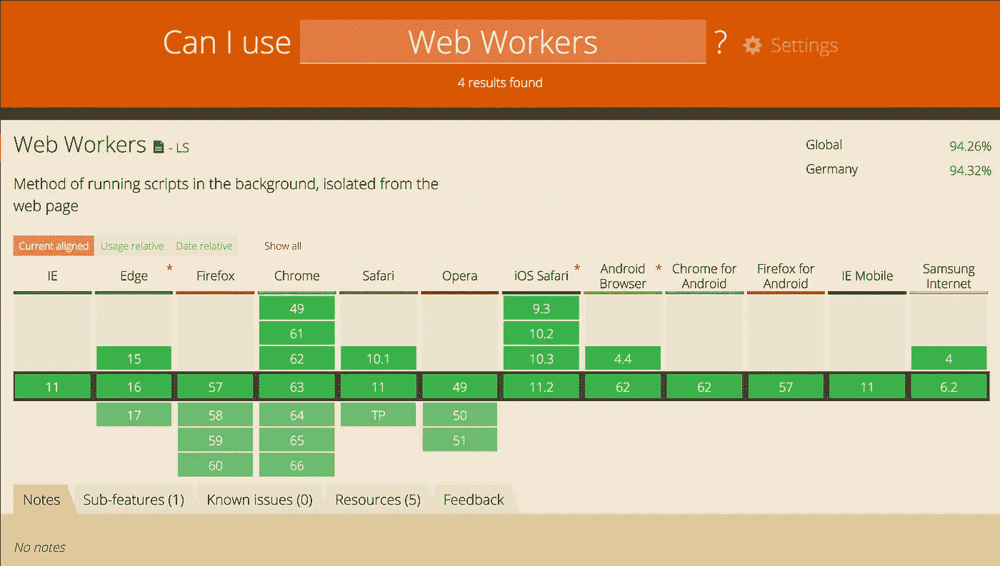
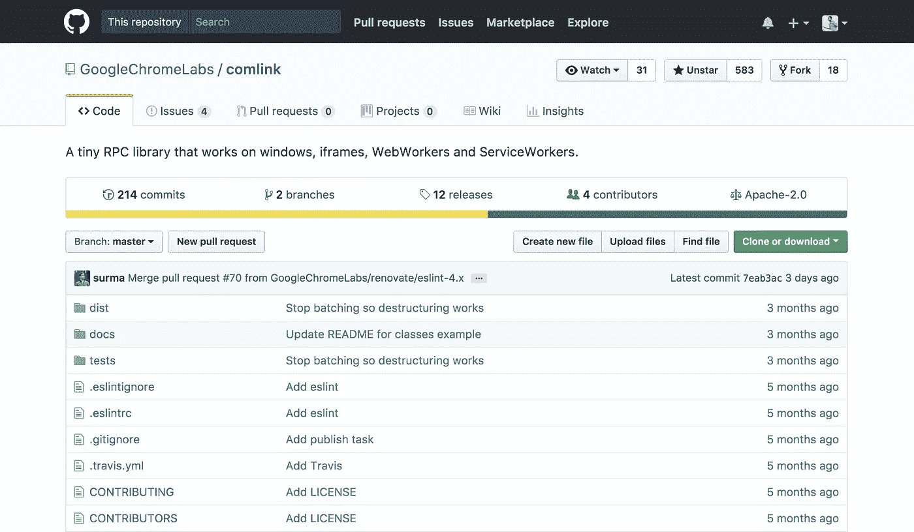
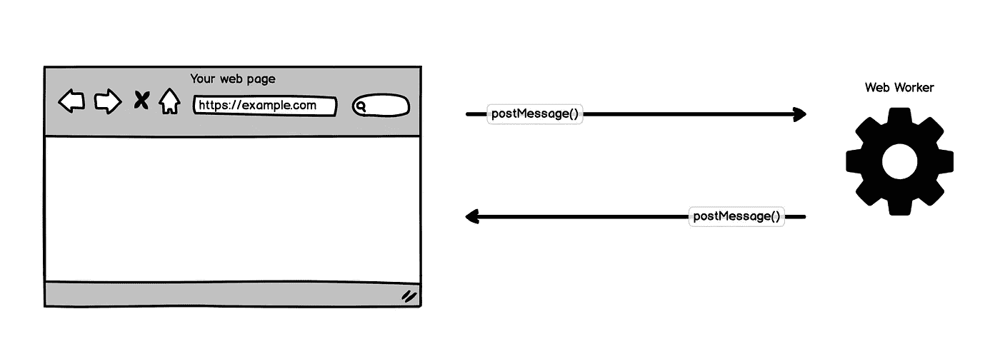
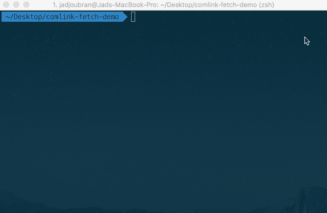
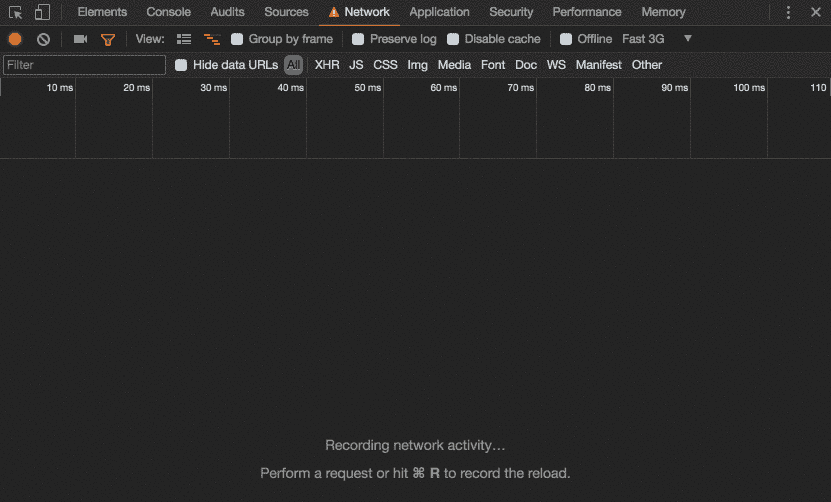

# 在 web worker 中运行 fetch

> 原文：<https://medium.com/google-developer-experts/running-fetch-in-a-web-worker-700dc33ac854?source=collection_archive---------0----------------------->


The greatest Web Worker of all time

性能是网络上最大的挑战之一&尤其是在移动设备上。以 60fps 的速度运行 web 应用程序并不是一件容易的事情。

虽然有许多因素会影响你的 web 应用程序的性能，但在这篇文章中，我将介绍 Web Worker，以及你如何在 Web Worker 中运行 [fetch](https://developer.mozilla.org/en-US/docs/Web/API/Fetch_API/Using_Fetch) ，以及你为什么要这样做。

JavaScript 代码阻塞了 DOM，这会降低用户界面的速度。例如，您会惊讶于 [JSON.parse](https://codetogo.io/how-to-parse-JSON-string-in-javascript/) 阻塞了 DOM。

随着你的数据源越来越大，你的 UI 性能会越来越差。这是因为 DOM 操作与 JavaScript 代码一起在**主线程**上运行。

我们能把这些操作从主线程中移走吗？

# 输入 Web Workers

有了 web workers，我们可以将那些昂贵的操作转移到在不同线程上运行的后台进程中。

Web Worker 是 Web 内容在后台线程中运行脚本的简单方法。可以把它想象成一个**后台**进程，运行一些您编写的 JavaScript 代码。

尽管您很可能看不到在 web worker 中运行 fetch 的性能优势，但本文将作为 Web worker 和 [Comlink](https://github.com/GoogleChromeLabs/comlink) 的介绍和解释。

## 我能从网络工作者那里访问 DOM 吗？

Web 工作者不能访问 DOM，因为 DOM 不是线程安全的。让 web 工作者可以访问 DOM 将会违背 Web 工作者的初衷，因为他们的实现将会慢得多。

## 我已经可以使用 Web Workers 了吗？



Browser support for Web Workers: a green paradise.

照片本身就说明了一切。😅

# Comlink

[Google chrome labs/Comlink](https://github.com/GoogleChromeLabs/comlink)让我们更容易在 web worker 中编写一个 **ES2015 类**并将其公开给我们的主线程。



Github repository for Comlink

Web Worker 和您的主线程之间唯一的通信方式是通过 [postMessage](https://developer.mozilla.org/en-US/docs/Web/API/Worker/postMessage) 。虽然您不一定需要 Comlink 来使用 web worker，但 Comlink 使在 Web worker 中编写一个类并公开它以便从主线程中使用变得容易得多。



Communication between Web Worker & Your web page happens through postMessage

Comlink 使用 postMessage 在 Web Worker 和您的页面之间进行通信。

我相信 Comlink 会促使开发者越来越依赖 Web 工作者。

# Fetch + Comlink

Comlink-fetch 允许您在通过 Comlink 公开的 web worker 中使用 fetch。

我最近在 [npm](https://www.npmjs.com/package/comlink-fetch) 上发布了版本 **0.1.2** 。它是这样工作的:

首先从 npm 安装 comlink-fetch:

```
npm install comlink-fetch --save
```



install comlink-fetch

然后创建一个加载 **index.js** 的最小 index.html 文件:

我使用 JavaScript 模块(`type="module"`)是因为我希望能够从那个 **index.js** 中进行`import` Comlink

现在用下面的代码创建一个 **index.js** :

下面是对这个 **index.js** 中发生的事情的分析:

*   你从 **comlink.es6.js** 导入 **Comlink**
*   从 comlink-fetch 的 [fetch.worker.js](https://github.com/jadjoubran/comlink-fetch/blob/master/src/fetch.worker.js) 创建一个新的 Web Worker
*   您使用`Comlink`为该工人创建一个代理

然后你就可以使用它了！我展示的其余代码是一个用例，您希望在后台加载一些额外的信息，例如您稍后将使用的**帖子**。

将它们加载到 web worker 中可以确保它们不会阻塞主线程，也不会降低用户界面的速度。



Network tab recording with Fast 3G network throttling

值得注意的是`GET /posts/1`和`GET /posts/2`是同时在后台执行的。

# Comlink-fetch 是如何构建的

一旦你看一看 comlink-fetch 的 [fetch.worker.js](https://github.com/jadjoubran/comlink-fetch/blob/master/src/fetch.worker.js) 的源代码，你就明白 comlink 为什么牛逼了。

我简单地定义了一个类`Fetch`，它是在 [fetch](https://developer.mozilla.org/en-US/docs/Web/API/Fetch_API) 之上的一个包装器，使得它有可能具有一些好的特性，比如设置一个基本 url、默认标题和默认主体。

你只需要在开始的时候导入 Comlink，然后公开你写的类，这样以后就可以从主线程代理它了。

看看我定义的类 **Fetch** 的签名:

如您所见，没有样板文件或不必要的代码。开头只是一个简单的**导入**，结尾是一个 **Comlink.expose** 。

# 性能优势

如果您使用 **comlink-fetch** ，是否会直接看到性能优势？很可能不会。正如由[康拉德·德兹温内尔](https://medium.com/u/f93bf4868810?source=post_page-----700dc33ac854--------------------------------)撰写的这篇 Stackoverflow [线程](https://stackoverflow.com/a/26219348/1599122)中所概述的，一个基于通用工人的获取不一定会提高你的性能。

但是，如果您必须对获取的数据进行一些繁重的处理，那么当您解析结果并在主线程之外处理它们时，这是有意义的。

ComLink 的其他替代品是由 Preact 和其他令人敬畏的软件包的作者[杰森·米勒](https://medium.com/u/30b8f5921914?source=post_page-----700dc33ac854--------------------------------)开发的 [workerize](https://github.com/developit/workerize) 和 [greenlet](https://github.com/developit/greenlet) 。

请继续关注关于如何在大型项目中使用 Web Workers 的更多技巧和诀窍，以及一些关于性能优势的数据。

查看我的互动课程:

*   [**学习编程**](https://learnprogramming.online)
*   [**学习 JavaScript**](http://learnjavascript.online)
*   [**反应过来教程**](https://react-tutorial.app)

*感谢*[*Ciro Nunes*](https://medium.com/u/c21d4da150d1?source=post_page-----700dc33ac854--------------------------------)*&*[*Nicole Saidy*](https://medium.com/u/2c972de40a20?source=post_page-----700dc33ac854--------------------------------)*对他们的反馈。*