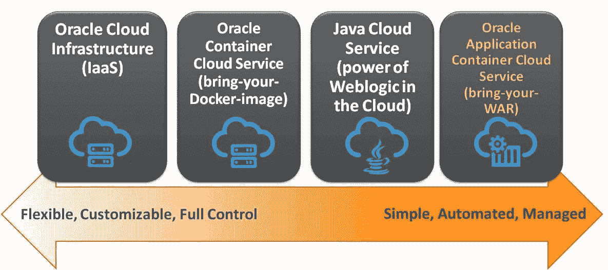
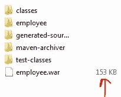
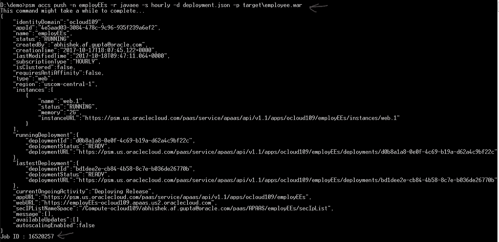
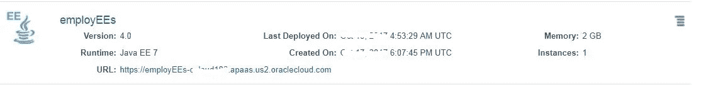
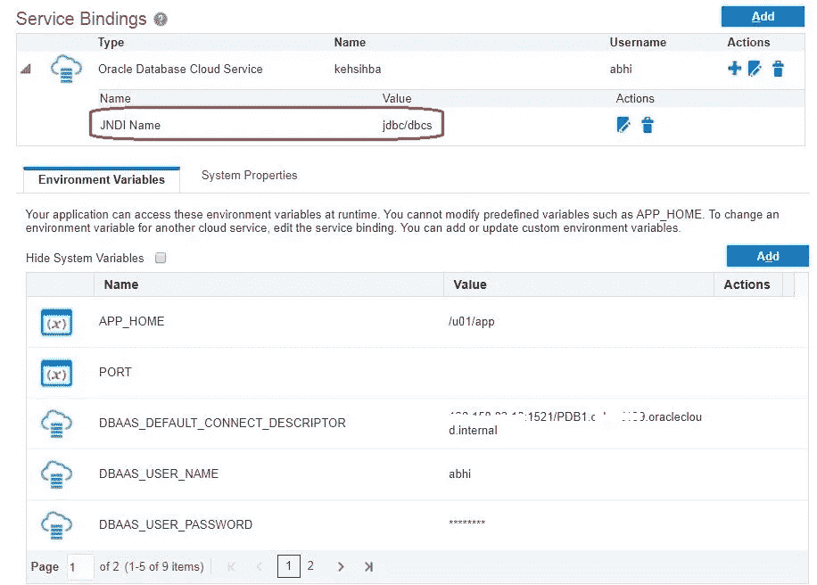
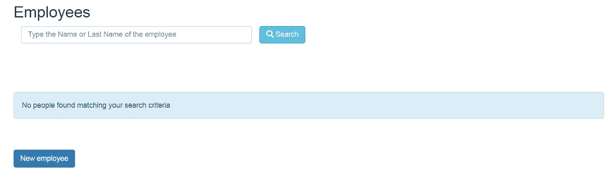
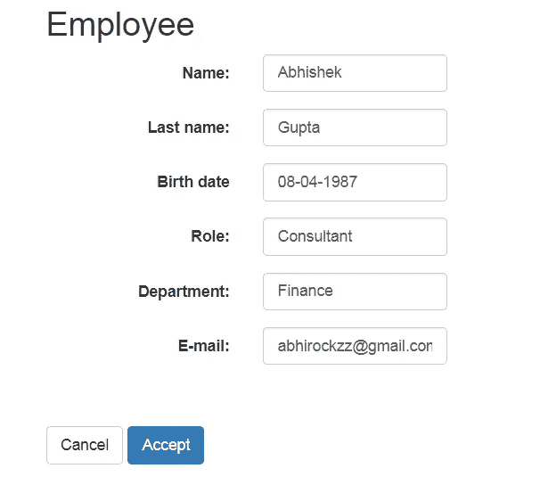
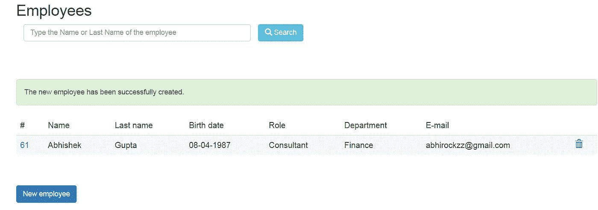
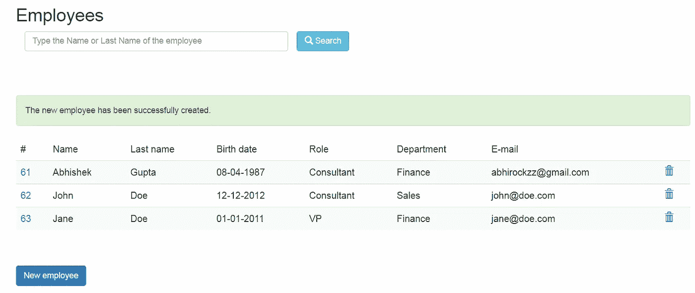
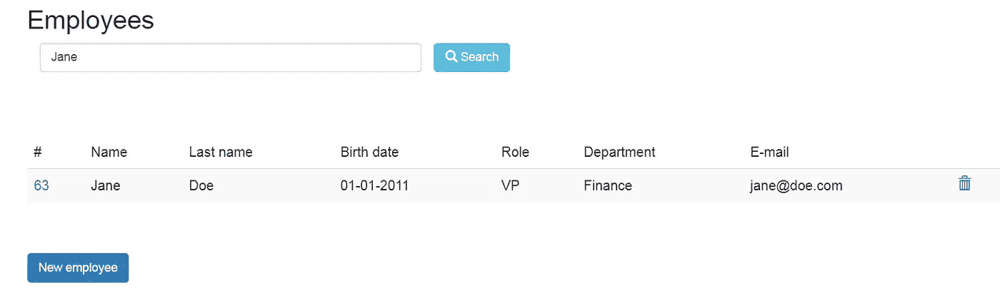

# 在 Oracle 应用容器云上运行 Java EE 7 应用

> 原文：<https://medium.com/oracledevs/running-java-ee-7-apps-on-oracle-application-container-cloud-e29df7254372?source=collection_archive---------0----------------------->

这篇博客介绍了 [Oracle 应用容器云](https://cloud.oracle.com/en_US/application-container-cloud)中的 [Java EE 7 运行时](http://www.oracle.com/technetwork/java/javaee/tech/index-jsp-142185.html)支持。

在对该功能进行高级概述之后，我们将看看一个简单而实用的员工管理应用程序作为示例

*   它是使用经典的 Java EE 组件——JPA、EJB、JAX-RS、Servlet、CDI、JSP——构建的
*   利用 [Oracle 数据库云](https://cloud.oracle.com/en_US/database)服务实现持久性
*   您还将看到**与 Oracle 数据库云服务的简化集成**，这要归功于*服务绑定*和*动态数据源创建*

# Java EE 选择

下图展示了您在 Oracle Cloud 上的 Java EE 方面的一系列选择(在撰写本文时)

*   从在 IaaS 上引导和管理 Java EE 容器开始( [Oracle 云基础设施](https://cloud.oracle.com/en_US/cloud-infrastructure))
*   采用一种策略，让 Java EE 应用服务器作为 Docker 容器在 Oracle 容器云上运行
*   通过 [Oracle Java 云服务](https://cloud.oracle.com/en_US/java)利用 Weblogic 的强大功能(Java EE 7 兼容)
*   只需将您的 WAR 文件带到 Oracle 应用程序容器云！



**Choice of Java EE on Oracle Cloud**

# Oracle 应用容器云上的 Java EE 支持

*   **Java EE 7**:Weblogic 12 . 2 . 1 . x 被用作运行时(在 Oracle JDK 8 上)
*   **放手**:你不需要管理 Weblogic 环境(打补丁等)。)—事实上你没有访问它的权限(SSH、管理控制台等)。).这符合该功能的简化、自动化和管理方法
*   **云原生**，12 因素风格的 Java EE 微服务——无状态、声明式依赖外部资源(数据库、消息传递层等)。)、外部化配置(环境变量)、CI/CD 授权等。
*   **弹性** —上/下(垂直)、进/出(水平)
*   **集成**:你可以使用[服务绑定](http://docs.oracle.com/en/cloud/paas/app-container-cloud/csjse/exploring-application-deployments-page.html#GUID-BCD4C8AA-0E1C-490D-92E8-6BAE003F5F5C)与不同的云服务对话——这包括 [Oracle Java Cloud](https://cloud.oracle.com/en_US/java) 、 [Oracle Database Cloud](https://cloud.oracle.com/en_US/database) 、[Oracle Event Hub Cloud](https://cloud.oracle.com/en_US/event-hub)(Kafka)、 [Oracle MySQL Cloud](https://cloud.oracle.com/en_US/mysql) 等。

# 示例应用程序

> 该应用程序在 Github 上[可用](https://github.com/abhirockzz/accs-javaee-emp-app)

## 概观

该应用程序是现有的[基于 Java SE 的教程](http://www.oracle.com/webfolder/technetwork/tutorials/obe/cloud/apaas/Basic_App_Embedded_Tomcat/basic_app-tomcat-embedded.html)(员工应用程序)的修改/返工版本。它和运行时(Tomcat)一起打包成一个优步 JAR

我们不需要再对*自带运行时*的咒语抱有宗教信仰，Oracle 应用容器云提供了 **Java EE 7** (由 Weblogic 实现)容器——现在，您所需要的只是一个(真正的)精简的 WAR 文件



lightweight Java EE WAR

## Java EE 规范

为了设置上下文，下面是使用 Java EE 组件的一些细节

*   **JPA** 被用来代替`DataSource`API(以及显式的 JDBC 代码)
*   **EJB** 用作与底层数据存储交互的门面层(使用 JPA 的 Oracle DB)
*   使用事实上的 **JAX-RS** 标准提供 REST API
*   Servlet 充当控制器层
*   CDI 用于依赖注入——将 EJB 引用注入 Servlet 以及 JAX-RS 端点
*   **JSP**按原样使用(与原始应用程序保持不变)

## 在 Java EE 应用程序中访问 Oracle 数据库云

通过 Java EE 应用程序访问 Oracle 数据库云(或 Oracle MySQL 云)非常简单。通常，您需要以特定于应用服务器供应商的方式设置数据源——您不需要在这里这样做！

您只需在数据源的`deployment.json`名称中声明对 Oracle 数据库云即服务绑定的依赖。这将动态创建所需的 Weblogic 数据源——在 JPA `persistence.xml`中引用

**deployment.json**

```
{
 “memory”: “2G”,
 “instances”: 1,
 “services”: [
 {
 **“type”: “DBAAS”**,
 “name”: “OracleDBOnCloud”,
 “username”: <DB user>,
 “password”: <DB password>,
 “properties”: {
 **“jndi-name”: “jdbc/dbcs”**
 }
 }]
}
```

**JPA persistence.xml**

```
<?xml version=”1.0" encoding=”UTF-8" standalone=”no”?>
<persistence
 xmlns=”[http://xmlns.jcp.org/xml/ns/persistence](http://xmlns.jcp.org/xml/ns/persistence)"
 xmlns:xsi=”[http://www.w3.org/2001/XMLSchema-instance](http://www.w3.org/2001/XMLSchema-instance)" version=”2.1" xsi:schemaLocation=”[http://xmlns.jcp.org/xml/ns/persistence](http://xmlns.jcp.org/xml/ns/persistence) [http://xmlns.jcp.org/xml/ns/persistence/persistence_2_1.xsd](http://xmlns.jcp.org/xml/ns/persistence/persistence_2_1.xsd)">
 <persistence-unit name=”employees_PU” transaction-type=”JTA”>
 <jta-data-source>**jdbc/dbcs**</jta-data-source>
 <exclude-unlisted-classes>false</exclude-unlisted-classes>
 <properties/>
 </persistence-unit>
</persistence>
```

文档中的更多[细节](http://docs.oracle.com/en/cloud/paas/app-container-cloud/dvcjv/preparing-java-ee-web-application-deployment.html)

# 构建和部署

## 建设

*   `git clone [https://github.com/abhirockzz/accs-javaee-emp-app](https://github.com/abhirockzz/accs-javaee-emp-app).git`
*   `mvn clean install`

构建过程将在`target` 目录中创建`employee.war`

## 推至云

借助 Oracle Application Container Cloud，您在部署应用程序方面有多种选择

*   **PSM CLI** —这是一个用于管理 Oracle 云服务的强大命令行界面(我们将使用它)
*   **控制台** —您可以使用 UI 来管理您的应用程序(更多信息请参见[文档](http://docs.oracle.com/en/cloud/paas/app-container-cloud/csjse/creating-application.html))
*   **甲骨文开发者云服务**:完整 CI/CD 风格。这在以前的博客中已经解释过了，这里有[文档](http://docs.oracle.com/en/cloud/paas/developer-cloud/csdcs/deploying-application-oracle-developer-cloud-service.html#GUID-6FE6D850-65DC-471D-A249-F7CCA9CAB56F)
*   REST API :您可以使用 cURL 命令调用 REST API 来部署您的应用程序。API [详情此处](http://docs.oracle.com/en/cloud/paas/app-container-cloud/apcsr/index.html)

在您的机器上下载并设置 PSM CLI(使用`psm setup` ) — [详细信息请点击](https://docs.oracle.com/en/cloud/paas/java-cloud/pscli/using-command-line-interface-1.html)

*   `cd <code_directory>`
*   修改`deployment.json`以填写与您的 Oracle 数据库云服务实例对应的详细信息(`name`、`username`、`password`和`jndi-name`属性)
*   `psm accs push -n employEEs -r javaee -s hourly -d deployment.json -p target/employee.war`

一旦执行，异步进程就会启动，CLI 会返回其作业 ID，以便您跟踪应用程序的创建



push to cloud using CLI

# 检查您的应用程序



Java EE app successfully deployed to Oracle Application Container Cloud

## 数据库绑定..

..这一点之前已经讨论过了



Simplified database connectivity

# 试用 Java EE 应用程序

## 先决条件:引导数据库

连接到云上的 Oracle 数据库实例

*   使用本教程中定义的 SSH 隧道技术[(推荐)，或者，](http://www.oracle.com/webfolder/technetwork/tutorials/obe/cloud/apaas/javaEE/java-ee-dbcs-accs/java-ee-dbcs-accs.html#SetUptheDatabase)
*   [编辑访问规则](https://docs.oracle.com/en/cloud/paas/database-dbaas-cloud/csdbi/enable-access-port.html)以暴露端口 1521

执行以下 SQL 脚本

1.  引导数据库表

```
CREATE TABLE **EMPLOYEE** (
      ID INTEGER NOT NULL,
      FIRSTNAME VARCHAR(255),
      LASTNAME VARCHAR(255),
      EMAIL VARCHAR(255),
      BIRTHDATE VARCHAR(10),
      TITLE VARCHAR(255),
      DEPARTMENT VARCHAR(255),
      PRIMARY KEY (ID)
	  );
```

2.创建自动生成主键的序列

```
CREATE SEQUENCE **EMPLOYEE_SEQ**
 START WITH     100
 INCREMENT BY   1;
```

有两种选择

*   使用用户界面
*   直接使用 REST API

## 使用 UI 享受一些 CRUD

*   导航至您的应用程序 URL，例如`[https://employees-<domain>.apaas.<region>.oraclecloud.com/](https://employees-ocloud109.apaas.us2.oraclecloud.com/)`



Landing page

*   首先创建一名新员工



Employee details



created employee

*   多创造几个…



list of all employees

*   搜索很简单(更新和删除也一样)



## 还有一个 REST API

*   获取所有员工

```
curl -X GET [https://employees-](https://employees-)<domain>.apaas.us2.oraclecloud.com/rest/employees
```

*   按 ID 获取员工

```
curl -X GET [https://employees-](https://employees-)<domain>.apaas.us2.oraclecloud.com/rest/employees/<id>
```

*   创建新员工

```
curl -X POST [https://employees-ocloud109.apaas.us2.oraclecloud.com/rest/employees](https://employees-ocloud109.apaas.us2.oraclecloud.com/rest/employees) -H “content-type: application/xml” -d “<employee><firstName>Bob</firstName><lastName>Doe</lastName><birthDate>12–12–2007</birthDate><title>CTO</title><department>Engineering</department><email>[bob@doe.com](mailto:bob@doe.com)</email></employee>”
```

*   更新现有员工

```
curl -X PUT [https://employees-ocloud109.apaas.us2.oraclecloud.com/rest/employees/](https://employees-ocloud109.apaas.us2.oraclecloud.com/rest/employees/)<id> -H “content-type: application/xml” -d “<employee><firstName>Bob</firstName><lastName>Doe</lastName><birthDate>12–12–2007</birthDate><title>VP</title><department>Sales</department><email>[bob@doe.com](mailto:bob@doe.com)</email></employee>”
```

*   删除现有员工

```
curl -X DELETE [https://employees-](https://employees-)<domain>.apaas.us2.oraclecloud.com/rest/employees/<id>
```

这篇博文到此为止！

# 不要忘记…

*   查看 Oracle 应用容器云教程[——每个运行时都有一些内容！](https://docs.oracle.com/en/cloud/paas/app-container-cloud/create-first-applications.html)
*   [应用容器云上的其他博客](http://bit.ly/2gR3nrV)

干杯！

> 本文表达的观点是我个人的观点，不一定代表甲骨文的观点。