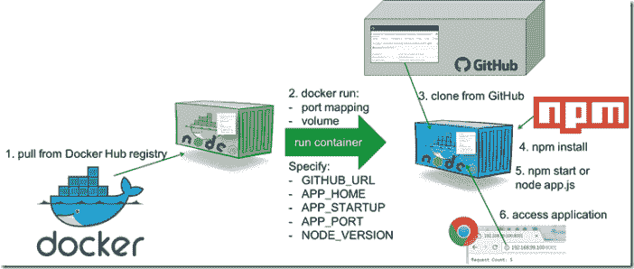
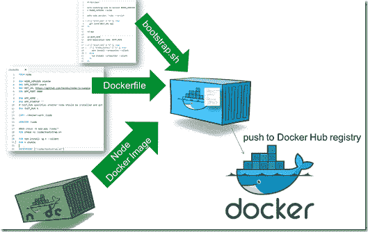
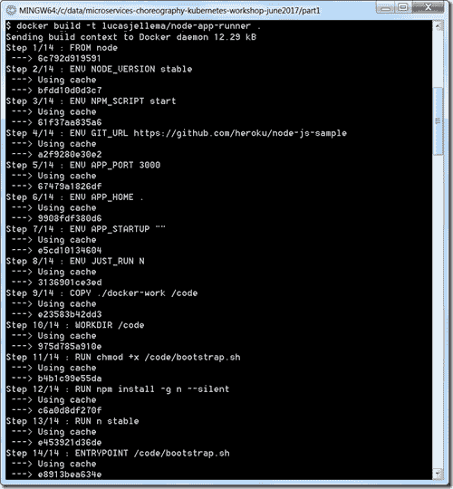
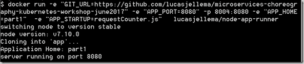
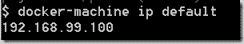
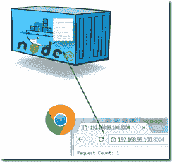
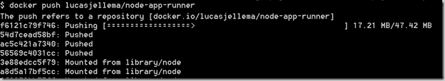
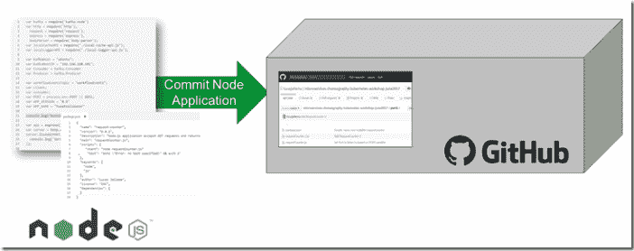

# 在通用 Docker 容器中从 GitHub 运行 Node.js 应用程序

> 原文：<https://medium.com/oracledevs/running-node-js-applications-from-github-in-generic-docker-container-950f7dbcef0e?source=collection_archive---------4----------------------->

本文展示了我如何创建一个通用 Docker 容器映像来运行任何节点。JS 应用程序基于 GitHub 上该应用程序的源代码。此 Docker 图像的用法如下图所示:



任何节点。任何公共 GitHub repo 中的 JS 应用程序都可以使用这个 Docker 容器映像运行。当从这个映像运行一个容器时，GitHub Repo 的 url 作为环境变量传入——以及(可选)Repo 中运行应用程序的目录、要运行的文件名和要使用的节点运行时的特定版本。要使用的命令行示例:

> docker run-e " GIT _ URL = https://github . com/lucasjellema/micro services-choreography-kubernetes-workshop-June 2017 "-e " APP _ PORT = 8080 "-p 8005:8080-e " APP _ HOME = part 1 "-e " APP _ STARTUP = request counter . js " lucasjellema/node-APP-runner

该命令将在指定 URL 的 GitHub 中找到的 repo 的 part1 目录中运行脚本 requestCounter.js。它将一个额外的环境变量 APP_PORT 传递给运行时，以便在节点应用程序(process.env.APP_PORT)中使用。它以标准的 Docker 方式将容器内部的端口 8080 映射到主机上的端口 8005。

要运行完全不同的 Node.js 应用程序，我可以使用以下命令:

> docker run-e " GIT _ URL =[https://github . com/lucasjellema/nodejs-serversentevents-quick start "](https://github.com/lucasjellema/nodejs-serversentevents-quickstart%22)-p 8010:8888-e " PORT = 8888 "- e " APP _ HOME =。"-e " APP _ STARTUP = APP . js " lucasjellema/node-APP-runner

启动同一个映像，传递不同的 GIT_URL 和关于目录和要运行的脚本的不同指令，以及一个不同的环境变量 PORT。

注:本作品基于 jakubknejzlik 创建的 Docker 镜像——参见【https://hub.docker.com/r/jakubknejzlik/docker-git-node-app/】的和[的 https://github . com/jakubknejzlik/Docker-git-node-app/blob/master/Docker file](https://github.com/jakubknejzlik/docker-git-node-app/blob/master/Dockerfile)。

我自己的来源是位于[https://GitHub . com/lucasjellema/micro services-choreography-kubernetes-workshop-June 2017](https://github.com/lucasjellema/microservices-choreography-kubernetes-workshop-june2017)的 GitHub 知识库的一部分，其中包含关于微服务、Choreography、Docker、Kubernetes、Node.jS、Kafka 等的研讨会资源。

本文中描述的步骤:



1.Docker 文件来构建容器

2.启动容器时要运行的 bootstrap.sh 文件

3.从容器创建图像

4.将图像推送到公共 Docker Hub 注册表([https://hub.docker.com/r/lucasjellema/node-app-runner/](https://hub.docker.com/r/lucasjellema/node-app-runner/))

(5.创建 Node.js 应用并推送到 GitHub)

6.通过从前面步骤中创建的映像启动 Docker 容器，从 GitHub 存储库中运行 Node.js 应用程序

# 1.Docker 文件来构建容器

这里显示了 Docker 文件

```
FROM node 
ENV NODE_VERSION stable 
ENV NPM_SCRIPT start 
ENV GIT_URL [https://github.com/heroku/node-js-sample](https://github.com/heroku/node-js-sample) 
ENV APP_PORT 3000 
ENV APP_HOME . 
ENV APP_STARTUP "" 
# JUST_RUN specifies whether node should be installed and git should be cloned 
ENV JUST_RUN N 
COPY ./docker-work /code WORKDIR /code 
#RUN chown -R app:app /code/* 
RUN chmod +x /code/bootstrap.sh 
RUN npm install -g n --silent 
RUN n stable ENTRYPOINT ["/code/bootstrap.sh"]
```

它始于 Docker 图像节点——官方基础图像(详见 https://hub.docker.com/_/node/[)。脚本定义了许多具有(默认)值的环境变量；当容器运行时，这些值可以被覆盖。目录 *docker-work* (当前工作目录下)的内容被复制到 docker 镜像内的目录/代码中。文件 bootstrap . sh——位于 docker-work 目录中——成为可执行文件。安装了 NPM 包 n(](https://hub.docker.com/_/node/)[https://www.npmjs.com/package/n](https://www.npmjs.com/package/n))来进行 Node.js 的版本管理，并且安装了 Node.js 的当前*稳定*版本——除了 Node Docker 映像中提供的 Node.js 版本之外。最后，入口点被设置为 bootstrap . sh——这意味着当一个容器基于映像启动时，这个文件将被执行。

# 2.启动容器时要运行的 bootstrap.sh 文件

启动容器时会执行 bootstrap.sh 文件。这个文件负责

*如果需要，安装 Node.js 运行时的特殊版本

*克隆 Git 存储库——将应用程序源代码放入容器

*通过运行 npm install 安装所有必需的节点模块

*运行 Node.js 应用程序

该文件为这些操作使用了许多环境变量:

–NODE _ VERSION—如果需要特定版本的节点运行时

–GIT _ URL—包含应用程序源代码的 GIT 存储库的 URL

–APP _ HOME—存储库中包含 package.json 和应用程序运行的启动脚本的目录

–APP _ STARTUP—应该执行的文件(节点$ APP _ STARTUP)；如果没有传递该参数，应用程序将根据 package.json 中的启动脚本使用 npm start 启动

–JUST _ RUN—当此变量的值为 Y 时，容器将不会尝试安装新版本的 Node.js，也不会(再次)克隆 Git repo

```
#!/bin/bash 
if [ "$JUST_RUN" = "N" ]; then 
  echo switching node to version $NODE_VERSION 
  n $NODE_VERSION --quiet 
fi echo node version: `node --version` if [ "$JUST_RUN" = "N" ]; then 
  git clone $GIT_URL app 
fi cd app cd $APP_HOME 
echo Application Home: $APP_HOME if [ "$JUST_RUN" = "N" ]; then 
  if [ "$YARN_INSTALL" = "1" ]; then 
    yarn install --production --silent 
  else 
    npm install --production --silent 
  fi 
fi if [ "$APP_STARTUP" = "" ]; then 
  npm run $NPM_SCRIPT 
else 
  node $APP_STARTUP 
fi
```

# 3.构建容器映像

在我的环境中，我使用的是 Windows7 笔记本电脑。在这台笔记本电脑上，我安装了 Docker 工具。我在 Docker Tools Quickstart 终端(fka boot2docker)上运行——Docker 机器在 Linux 客户机上运行一个小型的 Oracle VirtualBox VM。

我使用这个命令从 Dockerfile 文件构建容器映像:

> docker build-t lucasjellema/node-app-runner。



为了检查映像是否包含设置，我可以运行映像并启动一个 Bash shell——只需检查文件系统的内容:

> *docker run-it–entry point/bin/bash lucasjellema/node-app-runner*

我现在可以使用这样的命令来试验这个图像:

> *docker run-e " GIT _ URL =*[*https://github . com/lucasjellema/micro services-choreography-kubernetes-workshop-June 2017"*](https://github.com/lucasjellema/microservices-choreography-kubernetes-workshop-june2017%22)*-e " APP _ PORT = 8080 "-p 8004:8080-e " APP _ HOME = part 1 "-e " APP _ STARTUP = request counter . js " lucasjellema/node-APP-runner*



这将运行一个容器，在指向目录/code/app 的指定 URL 处克隆 Git repo，导航到目录/code/app/part1，执行 npm 安装以获取所需的模块，并使用 Node.js 运行 requestCounter.js，在端口 8004 侦听主机上转发到容器内端口 8080 的 http 请求。

为了访问我的 Windows 主机上的应用程序，我需要知道 Docker 机器的 IP 地址——在 VirtualBox 中运行 Docker 服务器的 Linux VM 实例。这是通过使用

> *docker-machine ip 默认*

这将返回分配给虚拟机的 IP 地址。



然后我可以在 [http://IP_ADDRESS:8004](http://ip_address:8004/) 访问 Node.js 应用程序。



4.(可选)将图像推送到公共 Docker Hub 注册表([https://hub.docker.com/r/lucasjellema/node-app-runner/](https://hub.docker.com/r/lucasjellema/node-app-runner/))

图像已经证明了自己，我们现在可以把它推到一个公共或私人注册。要推送至 Docker Hub:

> *docker 登录*
> 
> *docker push lucasjellema/node-app-runner*



5.创建 Node.js 应用程序并推送到 GitHub



6.通过从前面步骤中创建的映像启动 Docker 容器，从 GitHub 存储库中运行 Node.js 应用程序

我有几个想要运行的 Node.js 应用程序——每个都在自己的容器中，在自己的端口监听。这现在非常简单明了——使用几个对 docker run 的调用，每个调用都有不同的 GIT_URL、APP_HOME 和 APP_STARTUP 以及 APP_PORT 或 PORT 值。

例如，并行运行三个容器:

> *docker run-e " GIT _ URL =*[*https://github . com/lucasjellema/micro services-choreography-kubernetes-workshop-June 2017"*](https://github.com/lucasjellema/microservices-choreography-kubernetes-workshop-june2017%22)*-e " APP _ PORT = 8080 "-p 8001:8080-e " APP _ HOME = part 1 "-e " APP _ STARTUP = request counter . js " lucasjellema/node-APP-runner*
> 
> *docker run-e " GIT _ URL =*[*https://github . com/lucasjellema/micro services-choreography-kubernetes-workshop-June 2017"*](https://github.com/lucasjellema/microservices-choreography-kubernetes-workshop-june2017%22)*-e " APP _ PORT = 8080 "-p 8005:8080-e " APP _ HOME = part 1 "-e " APP _ STARTUP = request counter-2 . js " lucasjellema/node-APP-runner*
> 
> *docker run-e " GIT _ URL =*[*https://github . com/lucasjellema/nodejs-serversentevents-quick start "*](https://github.com/lucasjellema/nodejs-serversentevents-quickstart%22)*-p 8010:8888-e " PORT = 8888 "- e " APP _ HOME =。"-e " APP _ STARTUP = APP . js " lucasjellema/node-APP-runner*

我们可以从一个容器中查看日志:

> *码头工人日志<集装箱 id>*

我们可以停止每个容器:

> *码头工人停止<集装箱 id>*

列出所有正在运行和已停止的容器:

> *码头集装箱 ls -all*

重启一个容器(现在重启的时间很短):

> *码头工人开始<集装箱 id>*

# 7.将容器变成图像

注意:很容易将运行特定 Node.js 应用程序本身的这些容器之一转换成一个映像，从该映像中可以运行后续的容器。这个映像将包含 Node.js 的正确版本以及应用程序及其所有依赖模块，从而允许更快的启动时间。步骤:

> *docker commit CONTAINER _ ID NAME _ OF _ IMAGE*

例如:

> *docker 提交 a771 请求计数器*

随后，我们可以基于这个映像运行一个容器；注意，这一次我们没有指定 GIT _ URL——因为应用程序和所有 node_modules 都被放入了映像中。bootstrap.sh 和应用程序中使用的环境变量仍然可以传递。该容器的启动时间应该非常短，因为几乎不需要执行任何准备工作:

> *docker RUN-e " APP _ PORT = 8080 "-p 8004:8080-e " APP _ HOME = part 1 "-e " JUST _ RUN = Y "-e " APP _ STARTUP = request counter . js "请求计数器*

# 笔记

注意:移除旧容器

列出退出的容器:

> *docker ps -aq -f 状态=已退出*

移除它们([http://blog . yohan liyanage . com/2015/05/docker-clean-up-after-yourself/)](http://blog.yohanliyanage.com/2015/05/docker-clean-up-after-yourself/))

> *docker rm -v $(docker ps -a -q -f 状态=已退出)*

移除悬挂图像

列出它们:

> *docker images-f " dangling = true "-q*

移除它们:

> *docker RMI $(docker images-f " dangling = true "-q)*

*原载于 2017 年 5 月 21 日*[*technology . amis . nl*](https://technology.amis.nl/2017/05/21/running-node-js-applications-from-github-in-generic-docker-container/)*。*