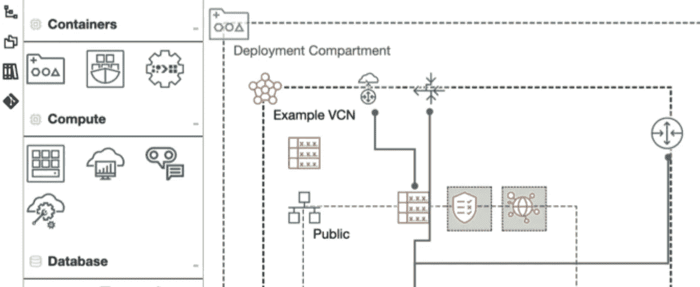
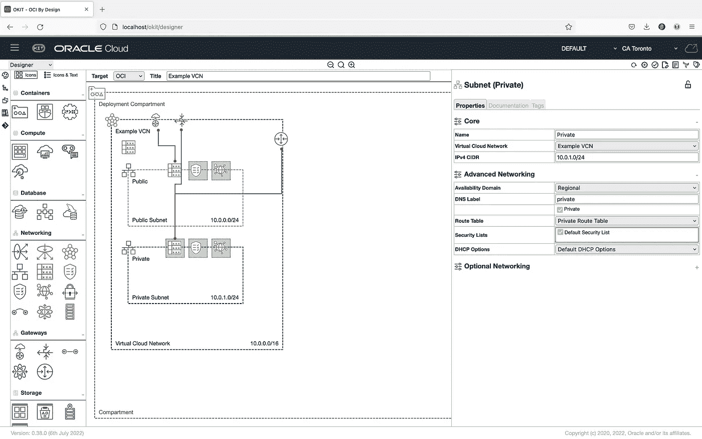

# 使用 colima 在 MacOS 上运行 OCI 设计工具包(OKIT)

> 原文：<https://medium.com/oracledevs/running-oci-designer-toolkit-okit-on-macos-with-colima-e19232a67f8?source=collection_archive---------4----------------------->



[OCI 设计师工具包(OKIT)](https://github.com/oracle/oci-designer-toolkit) 是一个可视化设计工具，用于为 [Oracle 云基础设施(OCI)](https://cloud.oracle.com) 创建云基础设施部署架构图，这些图可以导出到 [Terraform](https://terraform.io) 配置中以供应资源。

 [## GitHub-Oracle/OCI-designer-toolKIT:OCI 设计者工具包(OKIT)是一套工具，用于实现…

### OCI 设计师工具包(OKIT)是一套工具，通过一个…

github.com](https://github.com/oracle/oci-designer-toolkit) 

这篇短文将介绍如何使用容器化部署在 **MacOS** 上开始使用 OKIT，**而不需要** **Docker 桌面**，由于 Docker 的许可政策，Docker 桌面不再对许多企业用户可用。

## 设置 colima

为了在没有 Docker 桌面的 MacOS 上运行容器，我使用了带有 docker cli 工具的 colima。

```
$ **brew install colima docker**
```

注意这里的 **docker** 安装是针对 Docker CLI 工具的自制**公式**，而不是安装 Docker Desktop 的木桶。

colima 负责在后台运行 Linux VM，这是 docker 真正运行的地方。

```
$ **colima start**
INFO[0000] starting colima                              
INFO[0000] runtime: docker                              
INFO[0000] preparing network ...                      context=vm
INFO[0000] creating and starting ...                  context=vm
INFO[0030] provisioning ...                           context=docker
INFO[0031] starting ...                               context=docker
INFO[0036] done
```

现在我们可以使用常规的 docker 命令从 MacOS 命令行访问 Docker。

```
$ **docker ps**
CONTAINER ID   IMAGE   COMMAND   CREATED   STATUS    PORTS     NAMES
```

## 下载 OKIT 并构建本地容器

将 OCI 设计师工具包 git 库克隆到您的本地机器上，然后构建容器，这将需要几分钟的时间。

```
$ **git clone** [**https://github.com/oracle/oci-designer-toolkit.git**](https://github.com/oracle/oci-designer-toolkit.git)$ **cd** [**oci-designer-toolkit**](https://github.com/oracle/oci-designer-toolkit.git)$ **docker build --tag okit --force-rm .**
```

## 运行 OKIT 容器

将 OKIT 作为容器运行时，您需要将一些本地文件位置挂载为卷，以便直接访问文件。其中包括:

*   `**~/.oci**`为您的 [OCI 配置文件](https://docs.oracle.com/en-us/iaas/Content/API/Concepts/sdkconfig.htm)
*   `**~/.ssh**`用于访问用于存储 OKIT 模型和导出 Terraform 的远程 git 存储库所需的 SSH 密钥(*可选*)
*   用于存储 OKIT 模型文件的`**models**`文件夹，例如`~/okit/models`
*   用于存储 OKIT 模型模板的`**templates**`文件夹，例如`~/okit/templates`
*   用于本地存储远程 git 位置的`**git**`文件夹，例如`~/.okit/git` ( *可选*)

使用 Docker run 命令启动 OKIT。

```
$ **docker run -p 80:80 \** **--restart unless-stopped \
   ****--volume ${HOME}/.oci:/root/.oci \
    --volume ${HOME}/.ssh:/root/.ssh \
    --volume ${HOME}/okit/models:/okit/instance/local \
    --volume ${HOME}/okit/templates:/okit/instance/templates/user \
    --volume ${HOME}/okit/git:/okit/instance/git \
    --name okit okit** *******************************************************************
**                                                               **
**  Updating OKIT From GitHub                                    **
**                                                               **
*******************************************************************
Already up-to-date.
*******************************************************************
**                                                               **
**  Run WebServer                                                **
**                                                               **
*******************************************************************
[2022-07-06 13:33:11 +0000] [38] [INFO] Starting gunicorn 20.0.4
[2022-07-06 13:33:11 +0000] [38] [INFO] Listening at: http://0.0.0.0:80 (38)
```

现在，您可以从本地机器 [http://localhost:80](http://localhost:80) 访问 OKIT



OCI Designer Toolkit (OKIT)

## 停止和重新启动

当您不再需要使用 OKIT 时，您可以停止 colima，这会关闭后台 VM(并释放资源)。

```
$ **colima stop**
INFO[0000] stopping colima                              
INFO[0000] stopping ...                               context=docker
INFO[0012] stopping ...                               context=vm
INFO[0016] done
```

要再次访问，只需重新启动 colima。由于 docker run 命令中使用了`--restart`选项，OKIT 应该会自动再次运行

```
$ **colima start**
```

你觉得怎么样？在[公懈](https://bit.ly/devrel_slack)让我们知道！