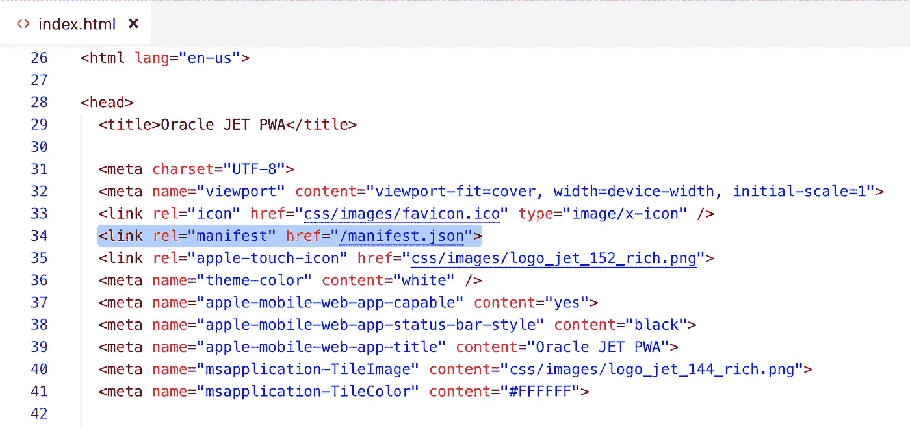

# 将 Oracle JET 作为渐进式 Web 应用程序运行

> 原文：<https://medium.com/oracledevs/running-oracle-jet-as-progressive-web-app-2c6ed8e4efd0?source=collection_archive---------0----------------------->

渐进式 web 应用程序(PWA)是目前 Web 开发中的一个热门话题。阅读更多相关信息— [渐进式网络应用](https://developers.google.com/web/progressive-web-apps/)。PWA 背后的美丽和力量——用户可以在自己的移动设备上安装 web 应用程序，而无需通过应用程序商店。这也简化了更新过程，当一个新版本的应用程序可用时，用户会立即得到它，因为它本质上是一个网页，包装看起来像一个已安装的应用程序。

受这个帖子的启发——[一个简单的渐进式 Web 应用教程](/james-johnson/a-simple-progressive-web-app-tutorial-f9708e5f2605)，我决定将 PWA 配置添加到 Oracle JET 应用中，并测试它如何工作(在 Android 上，没有在 iOS 上测试，但没有任何 JET 特定的内容，如果 PWA 在 iOS 上受支持，它应该可以工作)。

Oracle JET PWA 示例应用程序部署在 Heroku 上(PWA 只有在应用程序通过 HTTPS 时才能工作),可在此 [URL](https://pwa-jet-node.herokuapp.com/) 下获得。示例应用程序可以在 GitHub [repo](https://github.com/abaranovskis-redsamurai/pwa-jet-app) 上获得。该示例的 Node.js 包装器在另一个 GitHub [repo](https://github.com/abaranovskis-redsamurai/pwa-jet-node) 中可用，您可以使用它在 Heroku 或另一个服务上部署。

访问 JET 应用程序 [URL](https://pwa-jet-node.herokuapp.com/) ，应用程序将被加载，您应该会在底部看到 Android 通知。谷歌 Chrome 移动浏览器通过清单自动识别 PWA 应用程序，并通过添加到主屏幕来“安装”它:

选择通知，您将收到一条确认消息:

选择“添加”，Web 应用程序将被添加到主屏幕。对于用户来说，它将看起来像一个真正的移动应用程序。例如，用户可以获得应用的运行时统计数据，检查存储和数据使用指标:

应用程序被添加到主屏幕(查找 Oracle JET 图标):

选择应用程序图标，应用程序将被打开。标题中没有 URL 地址栏，实际上它看起来像一个移动应用程序，而不是一个网页:

如果实施了某些配置步骤，该应用程序将被识别为 PWA。其中一个——你需要添加清单文件(在 Oracle JET 中添加到与 index.html 相同的文件夹中),并提供应用程序图标、名称等。：

清单文件必须通过引用包含在应用程序入口点-索引页面中(例如 Oracle JET index.html 页面):

除了 manifest 之外，应用程序还必须定义一个服务工作者(与 manifest 文件相同，您可以在与 Oracle JET index.html 相同的目录中创建此文件)。PWA 不仅仅是把真实 app 的视觉体验带到了 Web 应用上。您可以为应用程序文件定义缓存存储，这意味着下次离线时，应用程序文件将从本地缓存存储中加载，无需从互联网下载:

服务工作人员可以从 main.js 文件注册，Oracle JET context 在应用程序初始加载时在该文件中初始化。在 main.js 底部添加服务人员注册:

这篇文章的目的是分享一个简单的 Oracle JET PWA 示例。这应该有助于您快速开始使用 Oracle JET 应用程序的 PWA 支持配置。

*最初发表于*[*【http://andrejusb.blogspot.com】*](https://andrejusb.blogspot.com/2019/06/running-oracle-jet-as-progressive-web.html)*。*