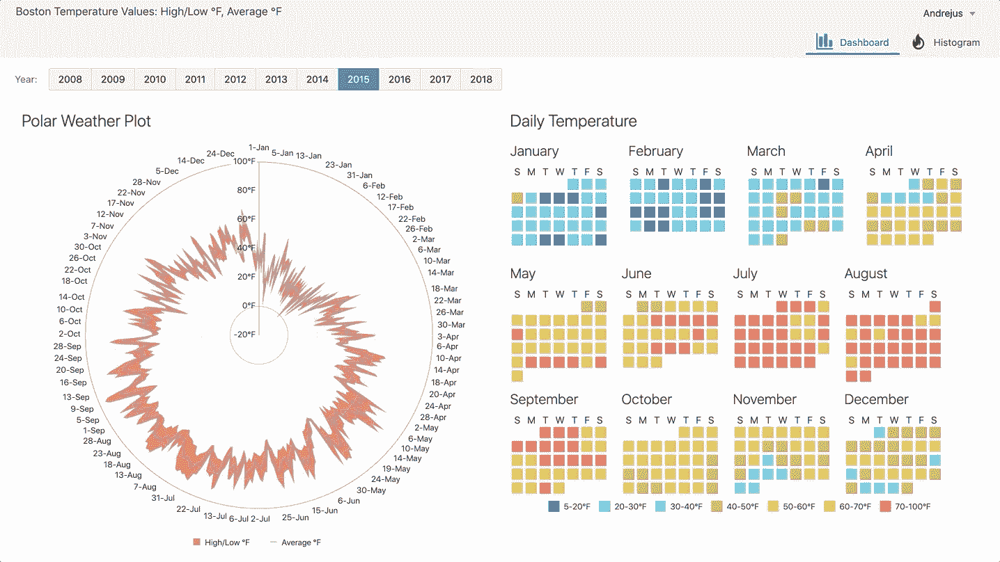
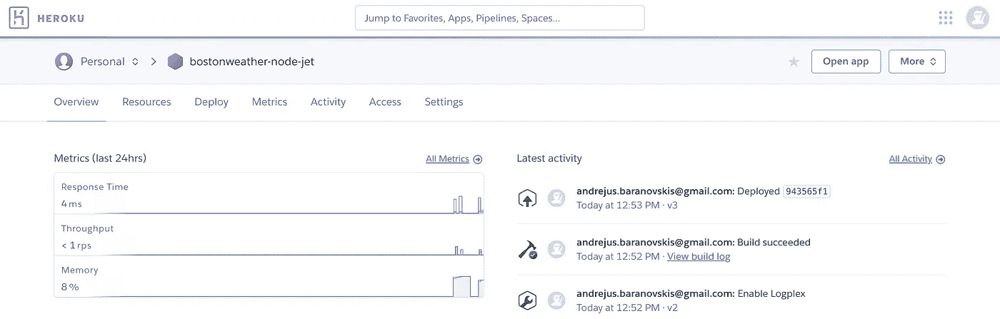
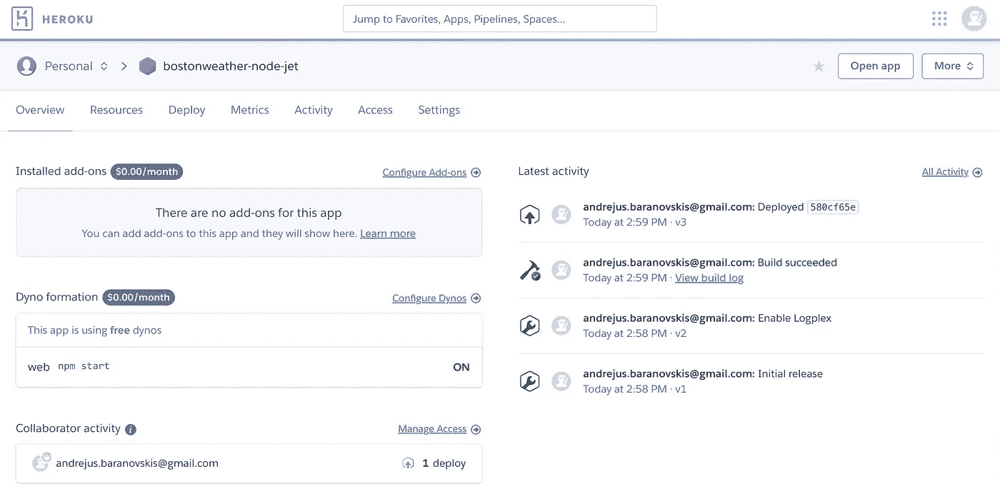
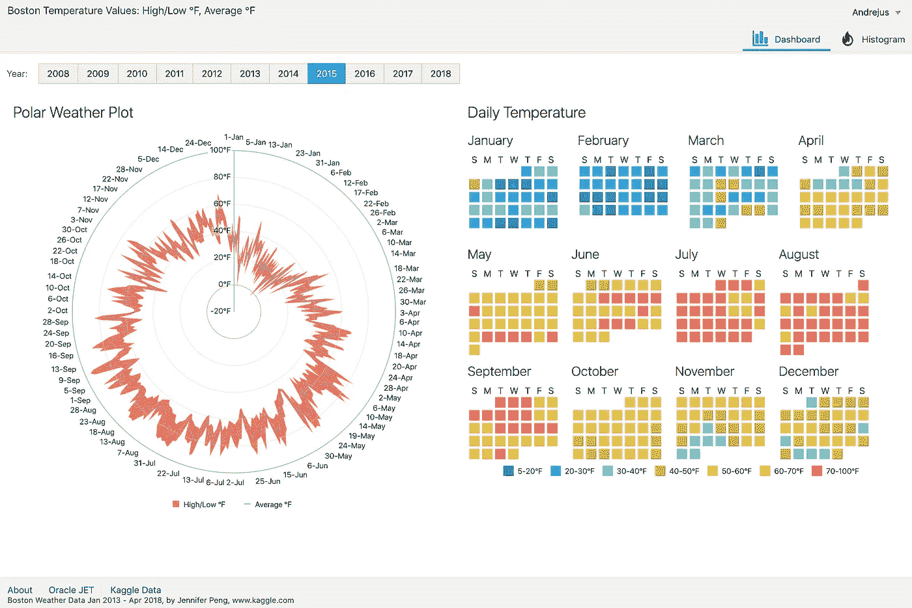
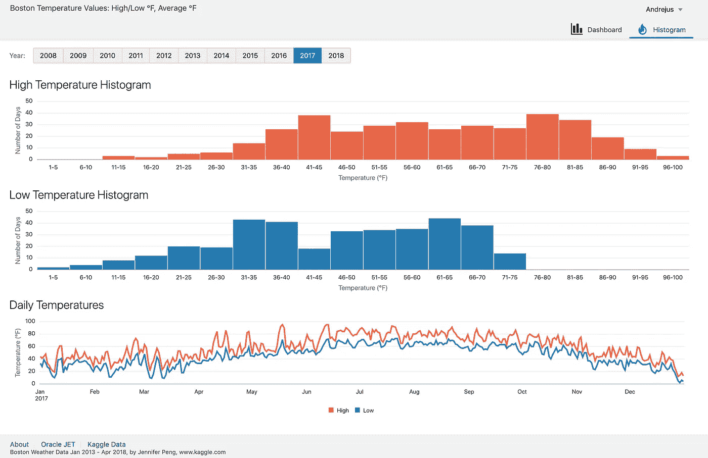
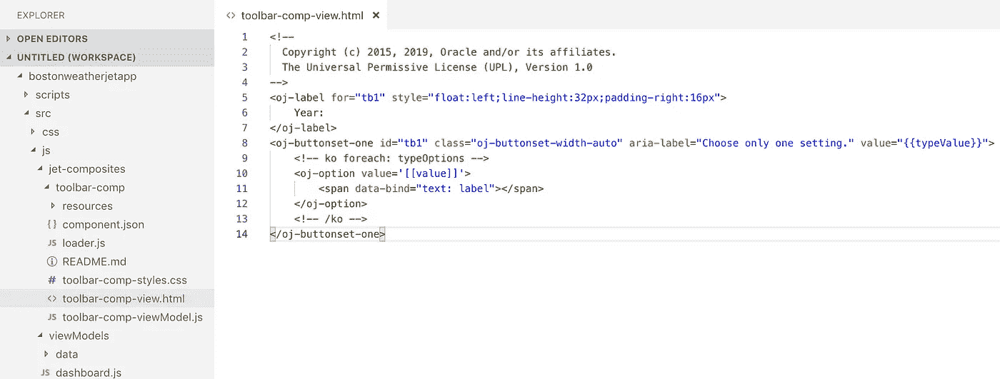
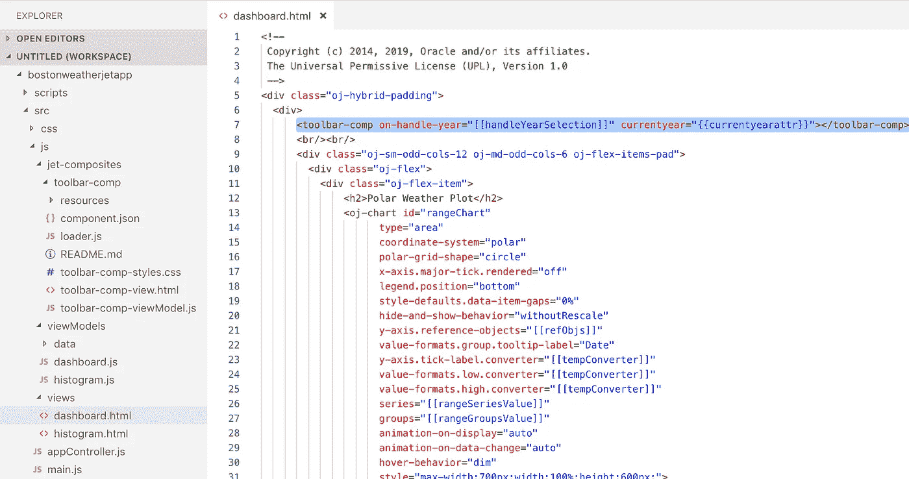
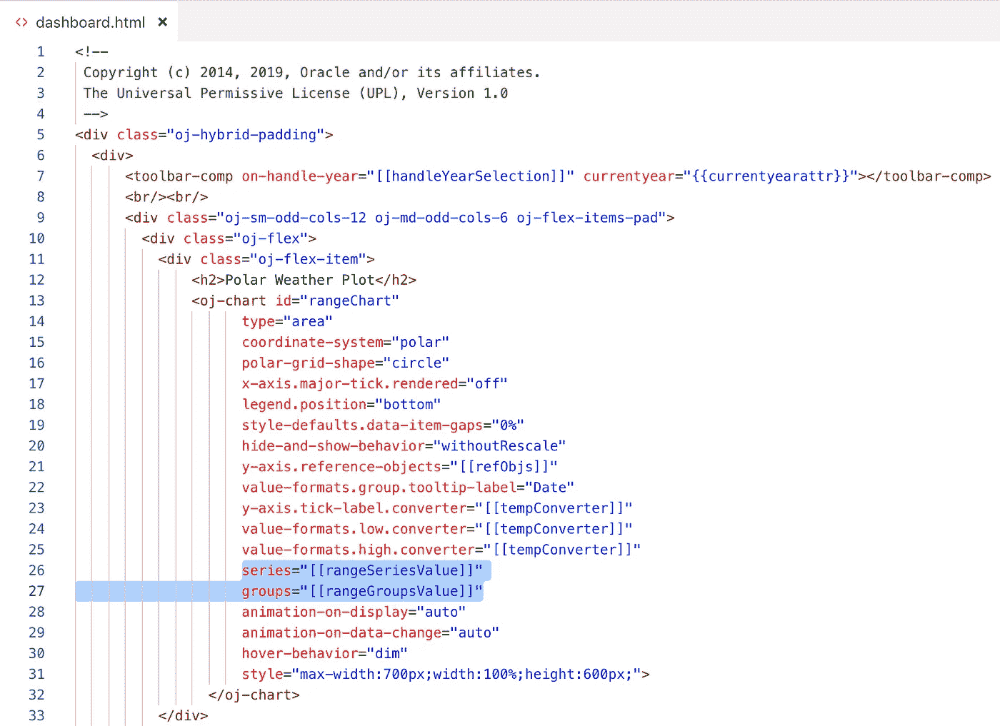
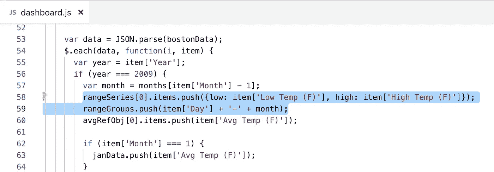

# 使用 Node.js 在 Heroku 上运行 Oracle JET(JET Showcase)

> 原文：<https://medium.com/oracledevs/running-oracle-jet-on-heroku-with-node-js-jet-showcase-755030b7fcd8?source=collection_archive---------0----------------------->

我已经实现了 JET(更多关于 Oracle JET 的信息)showcase 应用程序和数据可视化组件的使用。这个应用程序显示波士顿市的历史天气数据，数据集取自 Kaggle。切换年份使数据可视化改变并显示新数据——我喜欢 polar chat 的更新方式。日历使用 JET picto 图表组件显示一年中每天的温度:

App 部署在 [Heroku](https://www.heroku.com/) 上，可通过此 [URL](https://bostonweather-node-jet.herokuapp.com/) 获得。Heroku 提供每月 7 美元的账户，提供分析和更好的资源，但也有免费选项(30 分钟不活动后会睡觉)——免费选项有利于实验，就像这种情况一样。

已部署 JET 应用程序的 Heroku 仪表板:

免费部署不带分析选项:

应用程序有两个选项——仪表板和直方图。仪表板允许在年份之间切换，并显示极坐标图和每日温度日历:

直方图在不同的视图中显示相同的数据:

这个应用程序带有 Web 组件实现，是的，Web 组件是 JET 的标准功能。工具栏是作为 Web 组件实现的，您可以在其中切换年份:

Web 组件用于两种用户界面—仪表板和直方图:

可视化组件正在通过 Knockout 获取数据。JS 可观察变量:

变量在 JS 函数中初始化:

1.  Node.js 的 Heroku 部署指南
2.  部署在 Heroku — [GitHub](https://github.com/abaranovskis-redsamurai/bostonweather-node-jet) 上的 Node.js app。JET 内容位于公共文件夹中。运行 *ojet build — release* 后，JET 内容从 JET app web 文件夹中复制
3.  Oracle JET app — [GitHub](https://github.com/abaranovskis-redsamurai/bostonweatherjetapp)

*原载于*[*http://andrejusb.blogspot.com*](https://andrejusb.blogspot.com/2019/06/running-oracle-jet-on-heroku-with.html)*。*