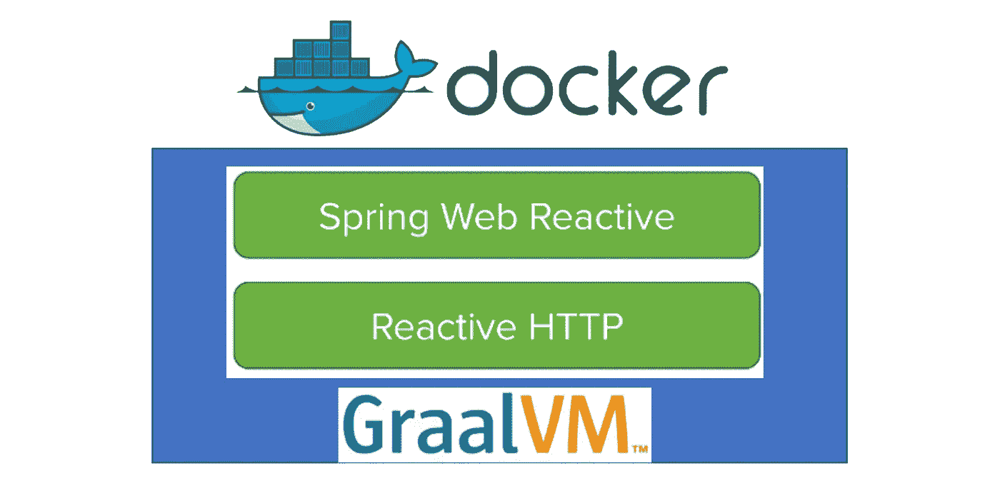

# 在 Docker 中的 GraalVM 上运行反应式 Spring Boot

> 原文：<https://medium.com/oracledevs/running-reactive-spring-boot-on-graalvm-in-docker-b36744fe299c?source=collection_archive---------1----------------------->

GraalVM 是一个开源的多语言 VM，可以很容易地混合和匹配不同的语言，如 Java、Javascript 和 r。它能够(有一些限制)将代码编译成本地可执行文件。这当然提供了巨大的性能优势。最近，GraalVM Docker 文件和图像变得可用。见[此处](https://github.com/oracle/docker-images/tree/master/GraalVM/CE)。因为 Spring Boot 是一个流行的 Java 框架，而且在 Spring Boot 实现的反应式(非阻塞)RESTful 服务/客户端看起来也很有趣，我想；让我们将这些结合起来，生成一个在 GraalVM 上运行反应式 Spring Boot 应用程序的 Docker 映像。我使用并组合了以下内容

作为基础，我使用了下面的 Git 库[中提供的代码。在“complete”文件夹(本教程的最终结果)中是一个示例反应式 RESTful Web 服务和客户端。](https://github.com/spring-guides/gs-reactive-rest-service)



## 反应式 Spring Boot RESTful web 服务和客户端

在查看这个示例时，您可以看到如何实现一个非阻塞的 web 服务和客户端。基本上这意味着你使用。

*   org . spring framework . web . reactive . function . server . server request 和 ServerResponse，而不是 org . spring framework . web . bind . annotation . rest controller
*   Mono <serverresponse>用于 web 服务的响应</serverresponse>
*   对于 web 服务客户端，您使用 org . spring framework . web . reactive . function . client . client response 和 Mono <clientresponse>来获得响应</clientresponse>
*   因为您不会使用带有 RequestMapping 注释的(经典阻塞)RestController，所以您需要创建自己的配置类，该类使用 org . spring framework . web . reactive . function . server . router functions 定义路由

因为响应不是直接的 POJO，所以需要像 res.bodyToMono(String.class)那样将其转换为显式的。更多细节请看[本教程](https://spring.io/guides/gs/reactive-rest-service/)或浏览[本资源库](https://github.com/spring-guides/gs-reactive-rest-service)

就我个人而言，我希望有一个类似 ReactiveRestController 的东西，并保持其余部分(双关语)不变。这将使得对反应式服务和客户端的重构更加容易。

## GraalVM

GraalVM 是 Oracle 开源的多语言 VM。它有社区版和企业版，提供改进的性能(更小的内存占用)和更好的安全性(本机代码的沙箱功能)，如这里的[所示](https://www.graalvm.org/docs/faq/)。社区版可以从 GitHub 下载，企业版可以从 Oracle 的技术网下载。对 GraalVM for Windows 的支持目前仍在开发中，尚未发布。使用 GraalVM 的 Oracle 面临的一个挑战是保持它所支持的多语言系统保持最新版本。这已经是一个挑战，例如 Oracle 数据库中的 R 支持和应用程序容器云服务中的节点支持。见[此处](https://www.oracle.com/technetwork/database/database-technologies/r/r-enterprise/overview/index.html)。

当您下载 GraalVM CE 时，您将获得带有特定 OpenJDK 8 版本的 GraalVM(对于 GraalVM 1.0.0-rc8，这是 1.8.0_172)。当你从 OTN 下载 GraalVM EE 时，你会得到相同版本的 Oracle JDK 8。

要查看哪些组件可用，您可以:

```
bash-4.2# gu available
Downloading: Component catalog
ComponentId Version Component name
 — — — — — — — — — — — — — — — — — — — — — — — — — — — — — — — — 
python 1.0.0-rc8 Graal.Python
R 1.0.0-rc8 FastR
ruby 1.0.0-rc8 TruffleRuby
```

**GraalVM 和 LLVM**

GraalVM 支持 LLVM。LLVM 是一个流行的工具集，为特定平台提供语言无关的代码编译和优化。LLVM 是许多编程语言最近开始流行的原因之一。点击阅读更多关于 LLVM [的信息，或者点击](https://www.infoworld.com/article/3247799/development-tools/what-is-llvm-the-power-behind-swift-rust-clang-and-more.html)访问他们的网站[。如果你能把一种语言编译成 LLVM 位代码或者 LLVM 中间表示(IR)，你就能在 GraalVM 上运行它(见](https://llvm.org/)[此处](https://www.graalvm.org/docs/reference-manual/languages/llvm/))。GraalVM 对 LLVM 位代码进行了额外的优化，以获得更好的结果。

**GraalVM 和 R**

GraalVM 使用基于 GNU-R 的 FastR，它是 R 的参考实现。这是 R 语言在 GraalVM 上的替代实现，因此不是真正的 R！例如:“对 dplyr 和 data.table 的支持正在进行中”。点击阅读更多[。特别是如果你在 R 中使用外来包，我认为会有兼容性问题。将 GraalVM 上的 FastR 的性能与将 R 代码编译成 LLVM 指令并在 GraalVM 上运行(使用类似](https://github.com/oracle/fastr) [RLLVMCompile](https://github.com/duncantl/RLLVMCompile) 的东西)进行比较是很有趣的。不过，我还没试过。GraalVM 目前似乎有势头，我对 RLLVMCompile 不太确定。

**更新 GraalVM 的 JVM**

你可以点击查看下面这篇关于用 JDK 8 版本构建 GraalVM 的文章[。这里的](https://neomatrix369.wordpress.com/2018/06/11/building-wholly-graal-with-truffle/)指的是 GitHub [上的文档。](https://github.com/oracle/graal/blob/master/compiler/README.md)

> Graal 依赖于支持 JVMCI (JVM 编译器接口)兼容版本的 JDK。JDK 8 有一个 JVMCI 端口，从 JDK 11 (build 20 或更高版本)开始，JDK 中内置了所需的 JVMCI 版本。

我没有尝试过，但是从支持不同 JDK 的源代码中编译 GraalVM 似乎相对容易。

## 停靠栏中的 GraalVM

Oracle 最近提供了 GraalVM 作为 Docker 映像，并将 Docker 文件放在他们的 Github 存储库中。见[此处](https://github.com/oracle/docker-images/tree/master/GraalVM/CE)。这些仅适用于社区版。由于 GitHub 上提供了 docker 文件，所以如果需要，可以很容易地创建自己的 GraalVM EE 映像(例如，希望使用 Oracle JDK 而不是 OpenJDK 来测试 GraalVM)。

要签出 GraalVM，可以像下面这样运行容器:

```
docker run -it oracle/graalvm-ce:1.0.0-rc8 bash
```

## Spring Boot 在码头的 GraalVM

如何在 Docker 中运行一个 Spring Boot 应用程序相对简单，在这里[描述](https://spring.io/guides/gs/spring-boot-docker/)。我也在各种虚拟机上运行过 Spring Boot 应用程序，并在这里描述了如何实现这个[的过程。如上所述，我已经使用了这个](http://javaoraclesoa.blogspot.com/2018/03/running-spring-boot-in-docker-container.html) [Ubuntu 开发虚拟机](https://github.com/MaartenSmeets/provisioning/tree/master/ubuntudev)。

```
sudo apt-get install maven
git clone [https://github.com/spring-guides/gs-reactive-rest-service.git](https://github.com/spring-guides/gs-reactive-rest-service.git)
cd gs-reactive-rest-service/complete
```

现在创建一个 Dockerfile 文件:

```
FROM oracle/graalvm-ce:1.0.0-rc8
VOLUME /tmp
ARG JAR_FILE
COPY ${JAR_FILE} app.jar
ENTRYPOINT [“java”,”-Djava.security.egd=file:/dev/./urandom”,”-jar”,”/app.jar”]
```

编辑 pom.xml 文件

向属性标签添加一个前缀变量:

```
<properties>
<java.version>1.8</java.version>
**<docker.image.prefix>springio</docker.image.prefix>** </properties>
```

添加构建插件

```
<build>
<plugins>
<plugin>
<groupId>org.springframework.boot</groupId>
<artifactId>spring-boot-maven-plugin</artifactId>
</plugin>
**<plugin>
<groupId>com.spotify</groupId>
<artifactId>dockerfile-maven-plugin</artifactId>
<version>1.3.6</version>
<configuration> <repository>${docker.image.prefix}/${project.artifactId}</repository>
<buildArgs><JAR_FILE>target/${project.build.finalName}.jar</JAR_FILE></buildArgs>
</configuration>
</plugin>** </plugins>
</build>
```

现在你可以做:

```
mvn clean package
mvn dockerfile:build
```

并运行它:

```
docker run -p 8080:8080 -t springio/gs-reactive-rest-service:latest
```

就这么简单！

*原载于 2018 年 11 月 10 日*[*【javaoraclesoa.blogspot.com】*](http://javaoraclesoa.blogspot.com/2018/10/running-reactive-spring-boot-on-graalvm.html)*。*