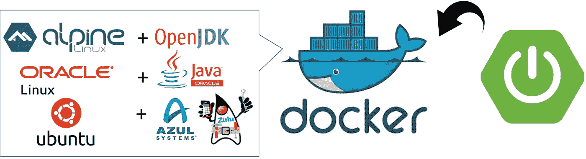
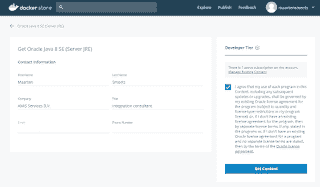
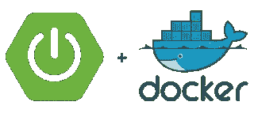
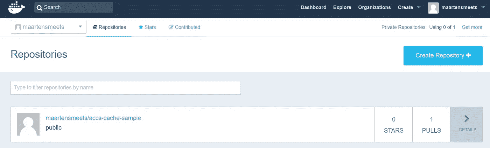

# 在 OpenJDK、Oracle JDK、Alpine Linux 上的 Zulu、Oracle Linux、Ubuntu 上的 Docker 容器中运行 Spring Boot

> 原文：<https://medium.com/oracledevs/running-spring-boot-in-a-docker-container-on-openjdk-oracle-jdk-zulu-on-alpine-linux-oracle-c9dd56b75f76?source=collection_archive---------0----------------------->

Spring Boot 非常适合在 Docker 容器中运行。Spring Boot 应用程序“直接运行”。Spring Boot 应用程序具有嵌入式 servlet 引擎，使其独立于应用服务器。有一个 Spring Boot Maven 插件可以轻松地创建一个包含所有必需依赖项的 JAR 文件。这个 JAR 文件可以用一个命令行运行，比如“java -jar SpringBootApp.jar”。要在 Docker 容器中运行它，您只需要一个基本操作系统和一个 JDK。在这篇博文中，我将举例说明如何在 Docker 中开始使用不同的操作系统和不同的 JDK。最后，我将给出一个例子，说明如何用 Spring Boot 应用程序构建 Docker 图像。



# Docker 入门

## 安装 Docker

当然你需要一个 Docker 安装。我不会在这里详细说明，但是；

**甲骨文 Linux 7**

```
yum-config-manager — enable ol7_addons
yum-config-manager — enable ol7_optional_latest
yum install docker-engine
systemctl start docker
systemctl enable docker
```

**Ubuntu**

```
curl -fsSL [https://download.docker.com/linux/ubuntu/gpg](https://download.docker.com/linux/ubuntu/gpg) | sudo apt-key add -
add-apt-repository "deb [arch=amd64] [https://download.docker.com/linux/ubuntu](https://download.docker.com/linux/ubuntu) $(lsb_release -cs) stable"
apt-get update
apt-get install docker-ce
```

您可以将用户添加到 docker 组或授予其 sudo docker 权限。但是它们允许用户成为主机操作系统的 root 用户。

## 运行 Docker 容器

请参阅下面的命令，您可以执行这些命令来在前台或后台启动容器并访问它们。对于以下示例中的“mycontainer ”,您可以填写自己喜欢的名称。图像的名称可以在下面的描述中找到。例如，当使用 [Oracle Container Registry](http://container-registry.oracle.com/) 或 store/oracle/serverjre:8(例如来自 [Docker Store](http://store.docker.com/) 的 jre 映像)时，这可以是 Oracle Linux 7 映像 container-registry.oracle.com/os/oraclelinux:7。

如果您正在使用 Oracle Container Registry(例如获取 Oracle JDK 或 Oracle Linux docker 映像),您首先需要

*   前往 container-registry.oracle.com，启用您的 OTN 帐户
*   转到您要使用的产品并接受许可协议
*   do docker 登录-u 用户名-p 密码 container-registry.oracle.com

如果您正在使用 Docker 商店，您首先需要

*   去 store.docker.com 创建一个账户
*   找到您想要使用的图像。单击获取内容并接受许可协议
*   do docker 登录-u 用户名-p 密码

在前台启动容器

```
docker run — name mycontainer -it imagename /bin/sh
```

在后台启动容器

```
docker run — name mycontainer -d imagename tail -f /dev/null
```

要“进入”正在运行的容器:

```
docker exec -it mycontainer /bin/sh
```

/bin/sh 存在于 Alpine Linux、Oracle Linux 和 Ubuntu 中。对于 Oracle Linux 和 Ubuntu，您还可以使用/bin/bash。“tail -f /dev/null”用于启动一个没有其他运行进程来保持其运行的“空操作系统”容器。来自[这里](https://stackoverflow.com/questions/25775266/how-to-keep-docker-container-running-after-starting-services)的一个建议。

## 清理

知道如何在摆弄完图像/容器后清理它们是很好的。此处见[。](https://techoverflow.net/2013/10/22/docker-remove-all-images-and-containers/)

```
#!/bin/bash
# Delete all containers
docker rm $(docker ps -a -q)
# Delete all images
docker rmi $(docker images -q)
```

# JDK 的选择

当然，在 Docker 容器中运行 JDK 还有更多选择。这些只是一些比较常用的。

## Oracle Linux 上的 Oracle JDK


当您在 Oracle 云中运行时，您可能已经注意到在它下面运行的操作系统通常是 Oracle Linux(目前也通常是 7.x 版本)。例如，当运行应用程序容器云服务时，它使用 Oracle JDK。如果想在本地类似的环境下运行，可以使用 Docker 镜像。值得一提的是，Oracle 服务器 JRE 包含的不仅仅是常规的 JRE，还不包括完整的 JDK。Oracle 建议尽可能使用服务器 JRE 而不是 JDK，因为服务器 JRE 的受攻击面较小。在这里阅读更多。关于路线图和支持的问题，请阅读[下面的博客文章](https://blogs.oracle.com/developers/official-docker-image-for-oracle-java-and-the-openjdk-roadmap-for-containers)。

**store.docker.com**

从 store.docker.com 获得 Oracle JDK / Oracle Linux 的 Docker 映像的步骤如下:

在 store.docker.com 上创建一个帐户。前往[https://store.docker.com/images/oracle-serverjre-8.](https://store.docker.com/images/oracle-serverjre-8.)点击获取内容。接受协议，您就可以登录、拉取和运行了。



```
#use the store.docker.com username and password
docker login -u yourusername -p yourpassword
docker pull store/oracle/serverjre:8 #To start in the foreground:
docker run — name jre8 -it store/oracle/serverjre:8 /bin/bash
```

**container-registry.oracle.com**

您可以使用容器注册表中的图像。首先，与运行操作系统一样，启用您的 OTN 帐户并登录。

```
#use your OTN username and password
docker login -u yourusername -p yourpassword container-registry.oracle.com
docker pull container-registry.oracle.com/java/serverjre:8#To start in the foreground:
docker run — name jre8 -it container-registry.oracle.com/java/serverjre:8 /bin/bash
```

## Alpine Linux 上的 OpenJDK


当运行 Docker 容器时，您希望它们尽可能小，以允许快速启动、停止、下载、缩放等。 [Alpine Linux](https://alpinelinux.org/) 是一个适用于小型容器的 Linux 发行版，并且被经常使用。不过，Alpine Linux 可能存在一些线程挑战。例如，参见此处的[和此处的](https://github.com/devpi/devpi/issues/474)和。在 Docker 容器中运行 Alpine Linux 中的 OpenJDK 比您想象的更容易。你不需要任何特定的帐户，也没有登录。当你拉 openjdk:8 的时候，你会得到一个 Debian 9 的镜像。为了在 Alpine Linux 上运行，你可以这样做

```
docker pull openjdk:8-jdk-alpine
```

接下来你可以做

```
docker run — name openjdk8 -it openjdk:8-jdk-alpine /bin/sh
```

## Ubuntu Linux 上的祖鲁语


你也可以考虑基于 OpenJDK 的 JDK，比如阿祖尔的祖鲁。这基本上是一样的，只是图像名称有点像“azul/zulu-openjdk:8”。祖鲁图像是基于 Ubuntu 的。

## 自己做

当然，你可以用 JDK 创造你自己的形象。例如见此处的。这需要您下载 JDK 代码并自己构建图像。不过，这很容易。

# 码头工人集装箱里的 Spring Boot



基于已经有 JDK 的图像，用 Spring Boot 应用程序创建一个容器很容易。这里[描述的是](https://spring.io/guides/gs/spring-boot-docker/)。您可以创建一个简单的 Dockerfile，如下所示:

```
FROM openjdk:8-jdk-alpine
VOLUME /tmp
ARG JAR_FILE
ADD ${JAR_FILE} app.jar
ENTRYPOINT ["java","-Djava.security.egd=file:/dev/./urandom","-jar","/app.jar"]
```

“自”图像也可以是上面提到的甲骨文 JDK 或祖鲁 JDK 图像。

向 com . Spotify . dockerfile-maven-plugin 添加一个依赖项，并向 pom.xml 文件添加一些配置，以便在拥有 Spring Boot JAR 文件后自动构建 Dockerfile。完整示例参见 pom.xml 和 Dockerfile，此处也为。pom.xml 文件的相关部分如下。

```
<build>
  <finalName>accs-cache-sample</finalName>
  <plugins>
   <plugin>
    <groupId>org.springframework.boot</groupId>
    <artifactId>spring-boot-maven-plugin</artifactId>
   </plugin>
   <plugin>
    <groupId>com.spotify</groupId>
    <artifactId>dockerfile-maven-plugin</artifactId>
    <version>1.3.6</version>
    <configuration>
     <repository>${docker.image.prefix}/${project.artifactId}</repository>
     <buildArgs>
      <JAR_FILE>target/${project.build.finalName}.jar</JAR_FILE>
     </buildArgs>
    </configuration>
   </plugin>
  </plugins>
 </build>
```

要实际构建允许在本地使用的 Docker 映像，您可以执行以下操作:

```
mvn install dockerfile:build
```

如果您想分发它(让其他人可以轻松地拉和运行它)，您可以用

```
mvn install dockerfile:push
```

当然，这仅在您以 maartensmeets 身份登录时有效，并且仅适用于 Docker hub(对于本例)。下面的截图是将图像推送到 hub.docker.com 后的截图。既然是公开的，你可以在那里找到。



```
#Running the container
docker run -t maartensmeets/accs-cache-sample:latest
```

*原为 2018 年 3 月 18 日在*[*javaoraclesoa.blogspot.com*](https://javaoraclesoa.blogspot.nl/2018/03/running-spring-boot-in-docker-container.html)*发布。*