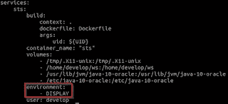
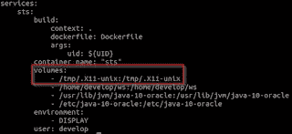
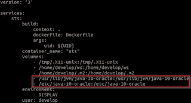
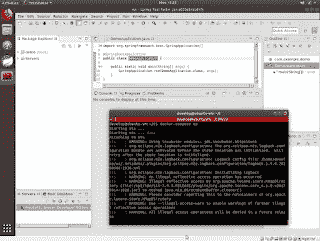

# 从 Docker 容器运行 Spring 工具套件和其他 GUI 应用程序

> 原文：<https://medium.com/oracledevs/running-spring-tool-suite-and-other-gui-applications-from-a-docker-container-3c5d66fc7b3d?source=collection_archive---------0----------------------->

在 Docker 容器中运行应用程序有助于将应用程序与主机操作系统隔离开来。从 Docker 容器中运行 GUI 应用程序(例如 IDE)是一项挑战。我将解释您可能会遇到的几个问题以及如何解决它们。为此，我将使用 Spring 工具套件作为例子。代码(Dockerfile 和 docker-compose.yml)也可以在[这里](https://github.com/MaartenSmeets/provisioning/tree/master/docker/STS)找到。由于(几个)安全问题，不建议在生产环境中这样做。


# 从 Docker 容器运行 GUI

为了从 Docker 容器运行 GUI 应用程序并在主机 OS 上显示其 GUI，需要几个步骤；

## 使用哪个显示器？

容器需要知道要使用的显示器。为了使显示可用，可以将 display 环境变量传递给容器。docker-compose 描述了 docker 容器的环境/卷映射/端口映射和其他内容。这使得以快速和可再现的方式运行容器变得更加容易，并且避免了长命令行。

**docker-compose**

您可以通过在 docker-compose.yml 文件中提供它来做到这一点。参见下面的例子。环境指示主机显示变量作为显示变量传递给容器。



**码头工人**

在 Docker 命令中(不使用 docker-compose 时)，您可以使用-e 标志或— env 来实现这一点。比如说；

```
docker run — env DISPLAY=$DISPLAY containername
```

## 允许访问显示器

需要允许 Docker 容器在 Docker 主机上显示它的屏幕。这可以通过执行以下命令来完成:

```
xhost local:root
```

执行后，在会话期间，允许 root 使用当前用户显示。由于 Docker 守护进程作为 root 运行，Docker 容器(一般来说！)现在可以使用当前用户显示。如果您想保持这一点，您应该将其添加到启动脚本中。

## 共享 X 套接字

最后要做的是共享 X 插座(不要问我细节，但这是必需的……)。这可以通过在 Docker 命令行或 docker-compose.yml 文件中定义卷映射来实现。对于 Ubuntu，这看起来就像你在下图中看到的。



# 来自 Docker 容器的 Spring 工具套件

为了给出一个完整的工作示例，我将展示如何从 Docker 容器运行 Spring Tool Suite。在这个例子中，我使用 Docker 主机 JVM，而不是在容器中安装 JVM。如果您想让 JVM 也在容器中(而不是使用主机 JVM)，查看下面的并将其添加到 docker 文件中。作为基础图片，我使用的是官方的 Ubuntu 图片。

我使用了以下 Dockerfile 文件:

```
FROM ubuntu:18.04MAINTAINER Maarten Smeets <maarten.smeets@amis.nl>

ARG uid

LABEL nl.amis.smeetsm.ide.name=”Spring Tool Suite” nl.amis.smeetsm.ide.version=”3.9.5"

ADD [https://download.springsource.com/release/STS/3.9.5.RELEASE/dist/e4.8/spring-tool-suite-3.9.5.RELEASE-e4.8.0-linux-gtk-x86_64.tar.gz](https://download.springsource.com/release/STS/3.9.5.RELEASE/dist/e4.8/spring-tool-suite-3.9.5.RELEASE-e4.8.0-linux-gtk-x86_64.tar.gz) /tmp/ide.tar.gz

RUN adduser — uid ${uid} — disabled-password — gecos ‘’ develop

RUN mkdir -p /opt/ide && \
    tar zxvf /tmp/ide.tar.gz — strip-components=1 -C /opt/ide && \
    ln -s /usr/lib/jvm/java-10-oracle /opt/ide/sts-3.9.5.RELEASE/jre && \
    chown -R develop:develop /opt/ide && \
    mkdir /home/develop/ws && \
    chown develop:develop /home/develop/ws && \
    mkdir /home/develop/.m2 && \
    chown develop:develop /home/develop/.m2 && \
    rm /tmp/ide.tar.gz && \
    apt-get update && \
    apt-get install -y libxslt1.1 libswt-gtk-3-jni libswt-gtk-3-java && \
    apt-get autoremove -y && \
    apt-get clean && \
    rm -rf /var/lib/apt/lists/* && \
    rm -rf /tmp/*

USER develop:develop
WORKDIR /home/develop
ENTRYPOINT /opt/ide/sts-3.9.5.RELEASE/STS -data /home/develop/ws
```

指定的包需要能够在容器内运行 STS，并创建 GUI 以在主机上显示。我使用了以下 docker-compose.yml 文件:

```
version: ‘3’services:
    sts:
        build:
            context: .
            dockerfile: Dockerfile
            args:
                uid: ${UID}
        container_name: “sts”
        volumes:
            - /tmp/.X11-unix:/tmp/.X11-unix
            - /home/develop/ws:/home/develop/ws
            - /home/develop/.m2:/home/develop/.m2
            - /usr/lib/jvm/java-10-oracle:/usr/lib/jvm/java-10-oracle
            - /etc/java-10-oracle:/etc/java-10-oracle
        environment:
            - DISPLAY
        user: develop
        ports:
            "8080:8080"
```

注意，这个 docker-compose 文件依赖于主机操作系统。它希望将 JDK 10 安装在/usr/lib/jvm/java-10-oracle 中，并在/etc/java-10-oracle 中进行配置。它还希望/home/develop/ws 和/home/develop/.m2 出现在主机上，以便映射到容器。已经提到了. X11-unix 映射是显示 GUI 屏幕所必需的。在这个文件中还有一些其他需要注意的事情。

## 用户标识

首先是在容器内部创建非特权用户的方式。这个用户是用作为参数提供的用户 id (uid)创建的。我为什么这么做？由容器用户创建的映射卷中的文件将使用容器内用户拥有的 uid 来创建。如果容器内的用户拥有与容器外不同的 uid，这将导致问题。假设我在用户开发平台上运行容器。主机上的这个用户的 uid 是 1002。在容器内部，还有一个 uid 为 1000 的用户 develop。映射卷上的文件是用 uid 1000 创建的；容器中用户的 uid。然而，在主机上，uid 1000 是不同的用户。主机上的开发用户(uid 为 1002)无法访问这些由容器创建的文件。为了避免这种情况，我在 VM 内部创建了一个开发用户，其 uid 与在 VM 外部使用的用户相同(docker 组中发出启动容器命令的用户)。

## 工作区文件夹和 Maven 存储库

当使用 Docker 容器时，通常的做法是避免在容器中存储状态。状态可以是各种各样的东西。我认为 STS 应用程序工作空间文件夹和 Maven 存储库也在其中。这就是为什么我在容器中创建了文件夹，并在 docker-compose 文件中将它们映射到主机。他们将在主机上使用相同名称的文件夹(/home/develop/.m2 和/home/develop/ws)。

## Java 语言(一种计算机语言，尤用于创建网站)

我的 Docker 容器只有 Spring 工具套件，它已经足够大了，内部没有超过 300Mb 的 JVM(在 Linux 上，Java 10 的大小几乎是 Java 8 的两倍)。我使用的是主机 JVM。我在我的 Ubuntu 开发虚拟机上安装了主机 JVM，如这里的[所述](http://javaoraclesoa.blogspot.com/2018/07/automate-installation-of-oracle-jdk-8.html)。

为了在 Docker 容器中使用主机 JVM，我需要做两件事:将两个文件夹映射到容器:



并将 JVM 路径映射到 STS 上的 JRE 文件夹:ln-s/usr/lib/JVM/Java-10-Oracle/opt/ide/STS-3 . 9 . 5 . release/JRE。

# 看到它工作

首先允许访问显示器:

```
xhost local:root
```

接下来使变量 UID 可用:

```
export UID=$UID
```

然后构建:

```
docker-compose build
Building sts
Step 1/10 : FROM ubuntu:18.04
 — -> 735f80812f90
 Step 2/10 : MAINTAINER Maarten Smeets <maarten.smeets@amis.nl>
 — -> Using cache
 — -> 69177270763e
 Step 3/10 : ARG uid
 — -> Using cache
 — -> 85c9899e5210
 Step 4/10 : LABEL nl.amis.smeetsm.ide.name=”Spring Tool Suite” nl.amis.smeetsm.ide.version=”3.9.5"
 — -> Using cache
 — -> 82f56ab07a28
 Step 5/10 : ADD [https://download.springsource.com/release/STS/3.9.5.RELEASE/dist/e4.8/spring-tool-suite-3.9.5.RELEASE-e4.8.0-linux-gtk-x86_64.tar.gz](https://download.springsource.com/release/STS/3.9.5.RELEASE/dist/e4.8/spring-tool-suite-3.9.5.RELEASE-e4.8.0-linux-gtk-x86_64.tar.gz) /tmp/ide.tar.gz

 — -> Using cache
 — -> 61ab67d82b0e
 Step 6/10 : RUN adduser — uid ${uid} — disabled-password — gecos ‘’ develop
 — -> Using cache
 — -> 679f934d3ccd
 Step 7/10 : RUN mkdir -p /opt/ide && tar zxvf /tmp/ide.tar.gz — strip-components=1 -C /opt/ide && ln -s /usr/lib/jvm/java-10-oracle /opt/ide/sts-3.9.5.RELEASE/jre && chown -R develop:develop /opt/ide && mkdir /home/develop/ws && chown develop:develop /home/develop/ws && rm /tmp/ide.tar.gz && apt-get update && apt-get install -y libxslt1.1 libswt-gtk-3-jni libswt-gtk-3-java && apt-get autoremove -y && apt-get clean && rm -rf /var/lib/apt/lists/* && rm -rf /tmp/*
 — -> Using cache
 — -> 5e486a4d6dd0
 Step 8/10 : USER develop:develop
 — -> Using cache
 — -> c3c2b332d932
 Step 9/10 : WORKDIR /home/develop
 — -> Using cache
 — -> d8e45440ce31
 Step 10/10 : ENTRYPOINT /opt/ide/sts-3.9.5.RELEASE/STS -data /home/develop/ws
 — -> Using cache
 — -> 2d95751237d7
 Successfully built 2d95751237d7
 Successfully tagged t_sts:latest
```

下次运行:

```
docker-compose up
```



当您在容器内部的端口 8080 上运行 Spring Boot 应用程序时，您可以在端口 8080 上的主机上使用例如 Firefox 来访问它。

*原载于 2018 年 8 月 6 日*[*【javaoraclesoa.blogspot.com】*](http://javaoraclesoa.blogspot.com/2018/08/running-spring-tool-suite-and-other-gui.html)*。*