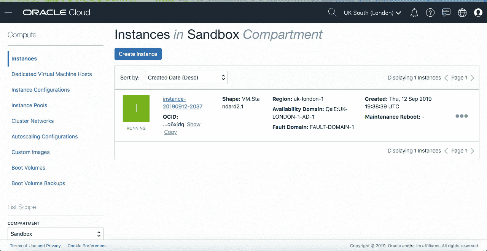
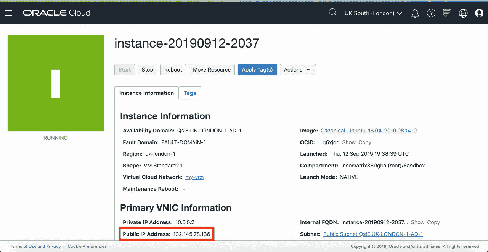
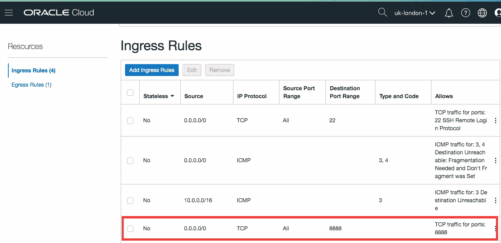
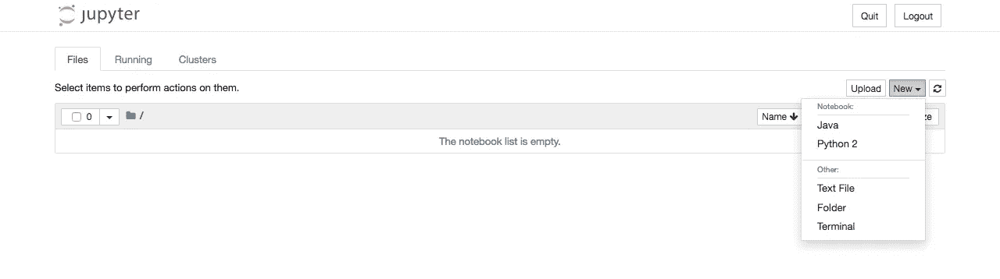
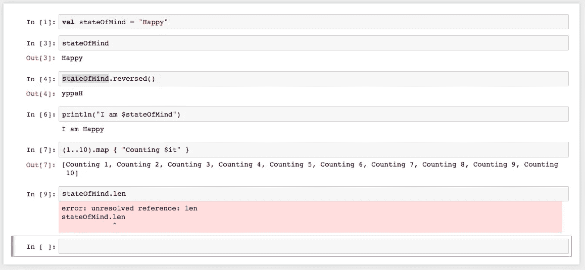
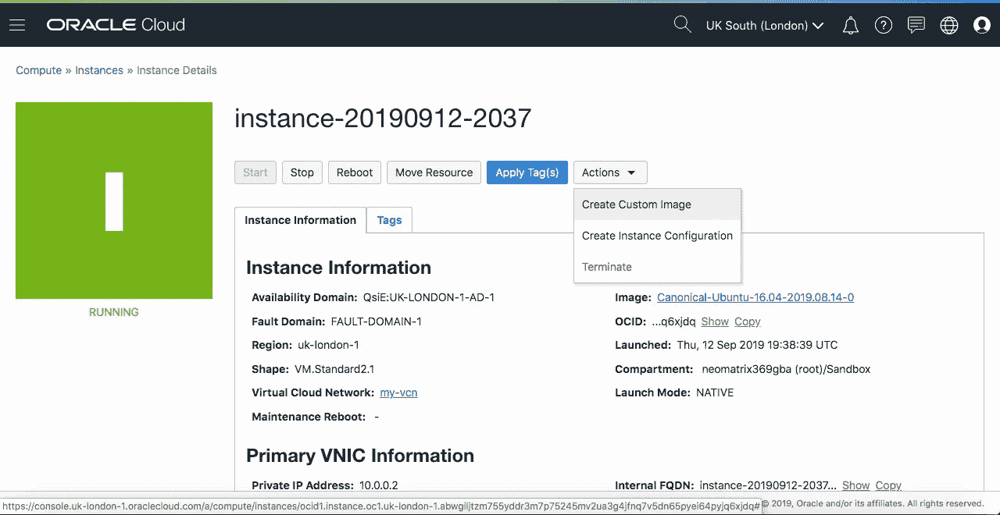
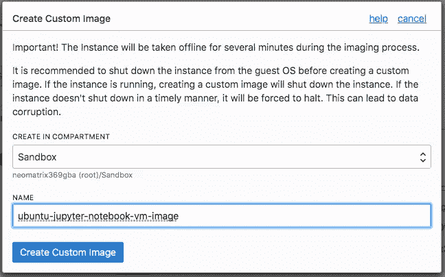
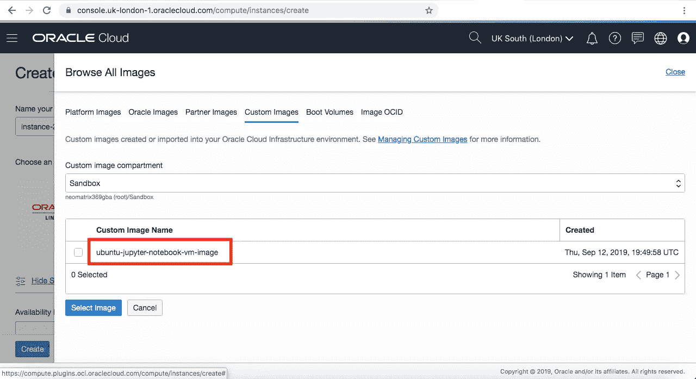
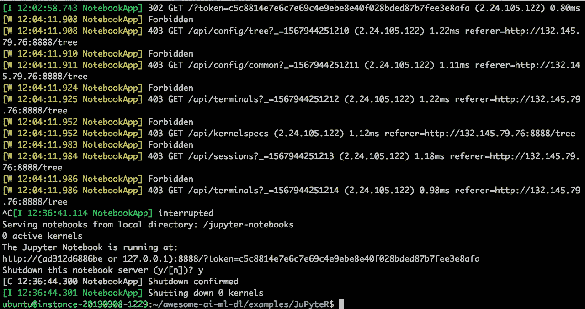

# 在云端运行您的 JuPyTeR 笔记本电脑

> 原文：<https://medium.com/oracledevs/running-your-jupyter-notebooks-on-the-cloud-ed970326649f?source=collection_archive---------0----------------------->


# 介绍

在我之前关于如何用 Jupyter 构建和运行 docker 容器的分享之后，我将进一步讨论如何在云平台上运行。

我们将尝试在[甲骨文云基础设施(OCI)](http://cloud.oracle.com/) 上这样做。理论上，我们应该能够在任何虚拟机或裸机实例上做博客中的任何事情。如果您是 Oracle 云的新手，我建议您熟悉一下[文档](https://docs.cloud.oracle.com/iaas/Content/GSG/Concepts/baremetalintro.htm)的[文档](https://docs.cloud.oracle.com/iaas/Content/GSG/Concepts/baremetalintro.htm)和[入门](https://docs.cloud.oracle.com/iaas/Content/GSG/Concepts/baremetalintro.htm)部分。你还会在这篇文章的底部找到几个信息链接，在**资源**部分。

我发现设置 VM 实例的[教程简单而有用——我建议浏览一下并按照步骤操作。在实际开始创建虚拟机实例和***ssh***-之前，记下先决条件，这将涉及在创建虚拟机之前创建隔离专区、子网、安全列表等。](https://docs.cloud.oracle.com/iaas/Content/GSG/Reference/overviewworkflow.htm)

# 报名

您会注意到，您必须拥有一个帐户才能访问云控制面板并继续操作。

你可以去[oracle.com](http://oracle.com/)和[cloud.oracle.com](https://myservices.us.oraclecloud.com/mycloud/signup?sourceType=_ref_coc-asset-opcSignIn&language=en)报名——推荐通过这些门户网站报名。一旦你这样做了，你甚至有资格获得免费的信用点数(足够你花一个周末来运行你最喜欢的实例)。

# 设置

**仪表板—签到**

一旦你注册了，你通过[cloud.oracle.com/sign-in](https://cloud.oracle.com/sign-in)登录，它会带你到这样一个页面


按照[教程中描述的说明来设置一个 VM 实例](https://docs.cloud.oracle.com/iaas/Content/GSG/Reference/overviewworkflow.htm)，并给你的 VM 和其他资源起一个容易识别的名字(用首字母作为前缀)。这将启动创建虚拟机的请求(如果您的所有条目都有效)，并且在不到 15 秒的时间内，您应该有一个可以使用的虚拟机。

一旦创建了 VM 实例，记下该实例的**公共 IP 地址**。通过转到左侧导航菜单上的**计算>实例**，可以找到所有正在运行的虚拟机:


通过单击选择正在运行的虚拟机:



这将带您进入虚拟机详细信息页面，在这里您可以找到**公共 IP 地址**:



***注意:公共 IP 地址对于每个创建的虚拟机都是不同的，以上是临时的。***

CLI

可以使用名为 **oci-cli** 的命令行工具访问 OCI，该工具可以按照 [CLI 文档](https://docs.cloud.oracle.com/iaas/Content/API/Concepts/cliconcepts.htm?Highlight=CLI)中提到的说明进行[安装。安装后，调用它的命令称为 **oci** ，您可以通过执行以下操作来调用它:](https://docs.cloud.oracle.com/iaas/Content/API/SDKDocs/cliinstall.htm)

# 上云的行动

```
$ oci --helpUsage: oci [OPTIONS] COMMAND [ARGS]...Oracle Cloud Infrastructure command line interface, with support for
Audit, Block Volume, Compute, Database, IAM, Load Balancing, Networking, DNS, File Storage, Email Delivery and Object Storage Services.Most commands must specify a service, followed by a resource type and then an action. For example, to list users (where $T contains the OCID of the current tenant):oci iam user list --compartment-id $TOutput is in JSON format.For information on configuration, see
[https://docs.cloud.oracle.com/Content/API/Concepts/sdkconfig.htm](https://docs.cloud.oracle.com/Content/API/Concepts/sdkconfig.htm).Options:
<-- snipped -->Commands:
<-- snipped -->
```

因此，从现在开始，我们将不再需要仪表板。在本文中，我们也不会涉及 CLI 工具的使用。

**登录虚拟机实例**

然后，您可以将 ***ssh*** 放入盒子中(参见[关于通过 ssh](https://docs.cloud.oracle.com/iaas/Content/Compute/Tasks/accessinginstance.htm?Highlight=ssh) 进行连接的文档),并继续下面的其余操作:

```
### Oracle Linux and CentOS images, user name: opc
### the Ubuntu image, user name: ubuntu$ ssh -i ~/.ssh/id_rsa ubuntu@132.145.78.136or$ ssh ubuntu@132.145.78.136
```

**安装 git**

对于这篇博文，我们选择了**Canonical Ubuntu Linux**(*Canonical-Ubuntu-16.04–2019 . 08 . 14–0*)作为我们的操作系统镜像，它附带了 ***apt-get*** 和 *git* ，因此我们不需要在那里做任何事情。

# 运行 Jupyter 笔记本电脑

**克隆我们的回购**

我们可以克隆我们的回购并执行其余步骤:

```
$ git clone [https://github.com/neomatrix369/awesome-ai-ml-dl](https://github.com/neomatrix369/awesome-ai-ml-dl)
$ cd awesome-ai-ml-dl/examples/JuPyteR
```

**安装对接器**

在 Ubuntu 上安装 Docker 的 Docker 文档可以在 Docker 网站上找到。虽然这里的目标操作系统是 Ubuntu 16.04 或更高版本，但是也提供了一个 bash 脚本来加速这个过程:

```
$ cd build-docker-image
$ ./installDocker.sh
```

***注意:*** *如果您在创建虚拟机时选择了另一个操作系统映像，您将需要使用 Docker 中的文档手动安装 Docker，或者修改上述脚本以使其适用于目标操作系统。*

**打造 Jupyter Docker 形象**

```
$ cd build-docker-image
$ sudo ./buildDockerImage.sh
```

*在这个特定的环境中，我们需要在每个 docker 命令之前传递****sudo****关键字。在您的本地环境或其他地方，您可能不必这样做。*

**将 Jupyter 笔记本作为 Docker 容器运行**

```
$ cd [back into the project root folder]
$ sudo ./runDockerContainer.sh
```

这将向您显示如下控制台:

```
<--- snipped --->OpenJDK Runtime Environment (build 9.0.4+11)
OpenJDK 64-Bit Server VM (build 9.0.4+11, mixed mode)
PATH=/home/jupyter/.local/bin:/opt/java/openjdk/bin:/usr/local/sbin:/usr/local/bin:/usr/sbin:/usr/bin:/sbin:/bin~~~ JDK9, Linux only: We are enabling JVMCI flags (enabling Graal as Tier-2 compiler) ~~~
~~~ Graal setting: please check docs for higher versions of Java and for other platforms ~~~
JAVA_OPTS=-XX:+UnlockExperimentalVMOptions -XX:+EnableJVMCI -XX:+UseJVMCICompiler
JAVA_TOOL_OPTIONS=-XX:+UnlockExperimentalVMOptions -XX:+UseCGroupMemoryLimitForHeap -XX:+UnlockExperimentalVMOptions -XX:+EnableJVMCI -XX:+UseJVMCICompilerAvailable kernels:
  python2    /home/jupyter/.local/share/jupyter/kernels/python2
  java       /usr/share/jupyter/kernels/java[I 13:39:35.993 NotebookApp] Writing notebook server cookie secret to /home/jupyter/.local/share/jupyter/runtime/notebook_cookie_secret
[I 13:39:36.293 NotebookApp] Serving notebooks from local directory: /home/jupyter
[I 13:39:36.294 NotebookApp] The Jupyter Notebook is running at:
[I 13:39:36.295 NotebookApp] [http://(81dde8675279](http://(81dde8675279) or 127.0.0.1):8888/?token=bb0c81ef7e9f3932355b953163702aa2d9f75e18005e6e48
[I 13:39:36.297 NotebookApp] Use Control-C to stop this server and shut down all kernels (twice to skip confirmation).
[C 13:39:36.310 NotebookApp]To access the notebook, open this file in a browser:
        file:///home/jupyter/.local/share/jupyter/runtime/nbserver-28-open.html
    Or copy and paste one of these URLs:
        [http://(81dde8675279](http://(81dde8675279) or 127.0.0.1):8888/?token=bb0c81ef7e9f3932355b953163702aa2d9f75e18005e6e48
```

记下网址，用你的**公共 IP 地址**即*132.145.78.136*替换 *127.0.0.1* 。

您还可以从上面的日志中看到，我们正在使用 Java 9(构建在 [AdoptOpenJDK](http://adoptopenjdk.net/) farm 上)并启用 [GraalVM 编译器](https://github.com/oracle/graal/blob/master/compiler/README.md)作为 HotSpot 的 [C2 编译器](http://openjdk.java.net/groups/hotspot/docs/HotSpotGlossary.html)(参见[开关以启用 Java 9 中的 GraalVM 编译器](https://github.com/neomatrix369/awesome-ai-ml-dl/blob/master/examples/JuPyteR/README.md#switches-to-enable-the-graalvm-compiler-in-java-9)来启用 [GraalVM 编译器](https://github.com/oracle/graal/blob/master/compiler/README.md))。也是因为 Jupyter 的 [Java 扩展需要 Java 9 或更高版本才能工作。](https://github.com/SpencerPark/IJava)

**在浏览器中打开 Jupyter 笔记本**

转到浏览器并尝试打开它:

```
[http://132.145.78.136:8888/?token=bb0c81ef7e9f3932355b953163702aa2d9f75e18005e6e48](http://132.145.78.136:8888/?token=bb0c81ef7e9f3932355b953163702aa2d9f75e18005e6e48)
```

啊！它不起作用！

这是因为我们还没有从我们的云网络内部(通过**入口规则，**了解更多信息[这里](https://docs.cloud.oracle.com/iaas/Content/Network/Concepts/securityrules.htm?Highlight=egress))向外部世界(公众)开放端口 8888:



我们需要将上述条目添加到**入口规则**部分，您可以通过导航菜单进入**入口规则**页面:**网络** > **虚拟云网络** > **虚拟云网络详细信息** > **安全列表，**这将带您进入带有**默认安全列表**的页面。点击与您的**虚拟云网络(VCN)** 对应的安全列表，您将进入上述**入口规则**页面。

如果您仍然找不到，请在云控制台的任何页面上使用搜索工具搜索术语 ***安全*** (参见放大镜🔍在页面的顶部)。这将向您显示所有的**默认安全列表**，点击它会将您带到上面的**入口规则**页面(您可能只有一个安全列表条目)。 ***注意:入口是指进入网络/虚拟机实例的流量。***

为什么是端口 8888，那是因为我们在 docker 脚本中像那样设置了它，看看[源](https://github.com/neomatrix369/awesome-ai-ml-dl/tree/master/examples/JuPyteR#jupyter)来找出原因和方法。

完成以上所有工作后:瞧！我们在浏览器中看到 Jupyter 启动页面:



您可以看到一个基于 Java 的笔记本可供使用！通过在浏览器中创建新的 Java 笔记本来尝试以下内容:



[https://github . com/ligee/kot Lin-jupyter/raw/master/samples/screenshotinjupyter . png](https://github.com/ligee/kotlin-jupyter/raw/master/samples/ScreenShotInJupyter.png)

您也可以自由地创建 Python 笔记本，而不仅仅是 Java 笔记本——这就是 Jupyter 笔记本的魅力所在。

# 在裸机或虚拟机环境中安装 Jupyter

为了简洁起见，我们没有涉及这一方面，但是如果您查看与构建和运行 Jupyter 实例相关的脚本，您将会看到 docker 构建脚本在单独脚本的帮助下构建和运行实例，这些脚本可以按以下顺序单独执行:

```
$ cd build-docker-image
$ [*install Java 9 SDK and set the PATH and JAVA_HOME]*
$ ./install-jupyter-notebooks.sh
$ ./install-java-kernel.sh
$ ./runLocal.sh
```

如果您想了解这是如何工作的，请在实例的本地环境中运行上面的脚本，其余的指令应该会像预期的那样工作。

# 创建自定义图像以供重复使用

由于我们已经能够从虚拟机实例内部成功运行 Jupyter Notebook，因此我们可以保存此映像以供将来重复使用或与其他人共享。创建虚拟机实例的映像可以通过导航菜单中的**计算>实例>实例详细信息**来完成，并从操作下拉菜单中创建自定义映像:



***注意:*** *在创建自定义映像的过程中，您的原始虚拟机实例被关闭。根据原始虚拟机实例的大小，这可能需要几分钟才能完成。*

成功创建后，下次我们创建新的虚拟机实例时，它将出现在可供选择的自定义映像列表中:



# 超级用户

如果所有这些对你来说都是小菜一碟，或者你没有太多麻烦就挺过来了，那么试试这里的 [README 页面中提到的所有深层内容](https://github.com/neomatrix369/awesome-ai-ml-dl/tree/master/examples/JuPyteR#jupyter)。

为了能够在 Jupyter 环境中用其他语言编写代码，您所需要的只是一个 Jupyter 扩展——这只是安装和配置的问题。你可以在这里了解关于这个[的一切。](https://github.com/neomatrix369/awesome-ai-ml-dl/tree/master/examples/JuPyteR#get-started-manual-steps-via-cli)

# 签署



如果您已经创建了一个笔记本，它会保存在名为 *jupyter/notebooks* 的子目录中，您可以使用 ***scp*** 从您的本地机器中检索它(参见[此处的](https://linuxize.com/post/how-to-use-scp-command-to-securely-transfer-files/)了解如何操作)。

确保你已经从[oracle.com](http://oracle.com/)和[cloud.oracle.com](http://cloud.oracle.com/)的登录会话中 ***退出，很容易忘记其中一个。但是在这之前，也请看看文档中的[清理资源](https://docs.cloud.oracle.com/iaas/Content/GSG/Tasks/terminating_resources.htm)页面——您不希望您的实例在您不查看它的时候永远运行！***


# 结论

一套好的脚本(包括 Docker)和一个易于使用的云环境可以在许多方面提供帮助。在这种情况下，使我们能够运行 Jupyter 笔记本实例，根据您的网络安全设置，可以公开或私下共享该实例。

Jupyter 环境非常灵活，允许通过配置和扩展来扩展功能。

我们没有涉及诸如云安全和用户实例分区之类的东西——这超出了本文的范围。如果这些对你很重要，请进一步调查。请确保它满足您的应用程序或用例所需的安全级别。查看 OCI 文档页面上关于[安全性的文档，了解更多信息。](https://docs.cloud.oracle.com/iaas/Content/Security/Concepts/security.htm)

# 资源

**将军**

*   [用 Jupyter 构建并运行 docker 容器](https://github.com/neomatrix369/awesome-ai-ml-dl/tree/master/examples/JuPyteR#jupyter)
*   [牛逼 Graal](http://github.com/neomatrix369/awesome-graal)
*   [牛逼 AI-ML-DL](http://github.com/neomatrix369/awesome-ai-ml-dl)

**码头工人**

*   [Docker Hub 注册](https://hub.docker.com/signup)
*   [在 Ubuntu 16.04 或更高版本上安装 Docker](https://docs.docker.com/install/linux/docker-ce/ubuntu/)
*   [构建 Docker 容器的 Bash 脚本](https://github.com/neomatrix369/awesome-ai-ml-dl/blob/master/examples/JuPyteR/buildJuPyteRDockerImage.sh)

**OCI/云**

*   [入门](https://docs.cloud.oracle.com/iaas/Content/GSG/Concepts/baremetalintro.htm)
*   [设置虚拟机实例的教程](https://docs.cloud.oracle.com/iaas/Content/GSG/Reference/overviewworkflow.htm)
*   安装 CLI
*   CLI 文档
*   [资源清理](https://docs.cloud.oracle.com/iaas/Content/GSG/Tasks/terminating_resources.htm)
*   [关于通过 ssh 连接到 OCI 的文档](https://docs.cloud.oracle.com/iaas/Content/Compute/Tasks/accessinginstance.htm?Highlight=ssh)
*   新签到:[https://cloud.oracle.com/en_US/sign-in](https://cloud.oracle.com/en_US/sign-in)
*   传统签到:[https://myaccount.cloud.oracle.com/](https://myaccount.cloud.oracle.com/)
*   [联系支持人员](https://docs.cloud.oracle.com/iaas/Content/GSG/Tasks/contactingsupport.htm)
*   [开发者工具](https://docs.cloud.oracle.com/iaas/Content/devtoolshome.htm?tocpath=Developer%20Tools%20%7C_____0)
*   [文档](https://docs.cloud.oracle.com/iaas/Content/home.htm)
*   [甲骨文云社区论坛](https://cloudcustomerconnect.oracle.com/resources/9c8fa8f96f/summary)
*   [Oracle 云合规性](https://cloud.oracle.com/en_US/cloud-compliance)
*   [甲骨文云基础设施博客](https://blogs.oracle.com/cloud-infrastructure/)

**安全**

*   [安全规则/入口规则](https://docs.cloud.oracle.com/iaas/Content/Network/Concepts/securityrules.htm?Highlight=egress)
*   [OCI 安全文件](https://docs.cloud.oracle.com/iaas/Content/Security/Concepts/security.htm)