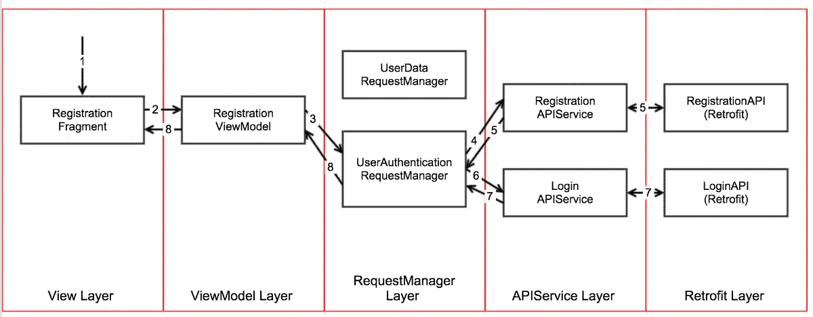

# RxJava 2: Android MVVM 生命周期应用程序结构与改进 2

> 原文：<https://medium.com/capital-one-tech/rxjava2-android-mvvm-lifecycle-app-structure-with-retrofit-2-cf903849f49e?source=collection_archive---------0----------------------->


我写这篇关于 [MVVM、RxJava 和翻新](/@manuelvicnt/rxjava-android-mvvm-app-structure-with-retrofit-a5605fa32c00#.ltpf9ie2c)的帖子已经两年多了。现在对我来说似乎有点过时了。一年能学到这么多，真让人吃惊！你回头看看，你可能会为自己的代码感到尴尬。不仅仅是代码本身，还有你到达那里的过程。**所有这些对我来说都是遗留代码**。

在本文中，我将尝试用新的场景和库来改进我的第一篇文章。让我们继续同一个例子(点击了解更多信息)。这一次，我将在一个真实的例子中使用 RxJava 2，这个例子是在一个使用改型的 **MVVM 结构**中。我们还将讨论如何通过响应视图生命周期的网络请求来**提高应用**的性能。

## 迎头赶上



App structure

如果我们快速浏览不同的层…

*   改造层:它实际上提出了网络请求。
*   APIService 层:它负责发出网络请求，解析响应，并在需要时进行处理。
*   RequestManager 层:准备要发送的数据并链接不同的网络请求。
*   视图模型层:处理视图所需的逻辑。
*   视图层:视图是虚拟的。只处理用户输入。

# 把手放在某物或者某人身上

在这篇文章中，我将提到和谈论很多关于一个宠物项目，在这个项目中你可以看到所有的东西是如何实现的。

[](https://github.com/manuelvicnt/RxJava2-MVVM-Android-Structure) [## manuel vicnt/rx Java 2-MVVM-Android-结构

### 在 GitHub 上创建一个帐户，为 RxJava2-MVVM-Android-Structure 开发做贡献。

github.com](https://github.com/manuelvicnt/RxJava2-MVVM-Android-Structure) 

# 生命周期导致视图和视图模型之间的问题？

在使用 RxJava 1 的上一篇文章中，我们在视图模型中有主题，这些主题将信息回复给使用订阅者的视图。你还记得我说我在两年内学到了很多吗？这是一个例子。

我们都遇到过同样的问题:如果 **app 到后台**我不想取消网络请求或者多做一个。

我们在这里面临的一个问题是，订阅者/观察者 onNext()或 onComplete()方法被调用，而视图不在屏幕上。如果订阅者试图与视图通信(通过 BusManager 或回调)，并且在该方法中我们试图更新任何 UI 小部件，**应用程序可能会崩溃**。主题在掌握信息时很有帮助，直到视图似乎明白了。

如果您看一下新的 repo，视图和视图模型之间的通信是通过一个名为 Contract 的接口(回调)进行的。**这给了你在 ViewModel** 上即插即用任何视图的灵活性。想象一下，你有不同的视图，这取决于它是智能手机、平板电脑还是智能手表……所有这些都可能共享同一个视图模型，但不一定相反。

## 如何解决生命周期问题？

界面被定义为交流每时每刻发生的事情。

```
public interface Lifecycle {

    interface View {

    }

    interface ViewModel {

        void onViewResumed();
        void onViewAttached(@NonNull Lifecycle.View viewCallback);
        void onViewDetached();
    }
}
```

该视图将调用生命周期。ViewModel#onViewResumed()在其 onResume()方法中。生命周期。ViewModel#onViewAttached(this)在 onStart() one 和生命周期中。onDestroy()中的 ViewModel#onViewDetached()。

这样，**ViewModel 就知道生命周期**，并且决定何时显示或不显示某个内容的逻辑会转到 ViewModel(就像它应该做的那样),因此它可以相应地采取行动，并在获得信息时通知视图。

## 视图和视图模型之间的契约

契约定义了视图需要从视图模型中得到什么，反之亦然。虽然您也可以按功能定义合同，但通常您是按屏幕定义合同的。

在我们的例子中，我们有主屏幕，它能够刷新用户数据。我们可以将合同定义为:

```
public interface HomeContract {

    interface View extends Lifecycle.View {

        void showSuccessfulMessage(String message);
    }

    interface ViewModel **extends Lifecycle.ViewModel** {

        void getUserData();
    }
}
```

这个契约是从生命周期契约扩展而来的，所以视图模型也将是生命周期感知的。

# RxJava 2 反应流类型

在 RxJava 2 中，引入了一些概念，并重命名了其他一些概念。[查看文档了解更多信息](https://github.com/ReactiveX/RxJava/wiki/What%27s-different-in-2.0)。

它们之间的主要区别是背压处理。基本上，在 RxJava2 中，一个**可流动的**是一个处理背压的观察器。同样的关系将一个**流处理器**链接到一个主题，将一个**订户**链接到一个观察者，等等。

*记住一个* ***可完成的*******单个的*******也许*** *不处理反压。***

**出于学习的目的，我们将使 Retrofit 返回一个可观察的对象。如果我们想处理反压力呢？如果我们知道我们期望的结果，并且想要优化我们的代码来指定我们想要得到的流，那该怎么办呢？我们会谈到这一点。**

## **使用 Completable**

**让我们以注册呼叫为例。因为 RegistrationAPIService 正在处理信息，所以我们不希望返回流，因为 RequestManager 层不使用响应。**我们只关心通话是否成功**。为此，我们返回一个 Completable 对象，忽略从可观察对象中获得的元素。**

```
**public **Completable** register(RegistrationRequest request) {

    return registrationAPI.register(request)
            .doOnSubscribe(disposable -> isRequestingRegistration = true)
            .doOnTerminate(() -> isRequestingRegistration = false)
            .subscribeOn(Schedulers.*io*())
            .observeOn(AndroidSchedulers.*mainThread*())
            .onErrorResumeNext(this::handleRegistrationError)
            .doOnNext(registrationResponse -> processRegistrationResponse(request, registrationResponse))
 **.ignoreElements();** }**
```

## **使用可能**

**如果我们想要将响应传递回 RequestManager 层，但是因为它是一个网络请求**，我们知道我们将只接收一个对象**，我们可以使用 Maybe(可能主体是空的，所以我们使用 Maybe 来避免空对象时的异常)。**

**记住使用 **singleElement()** 操作符，而不是 firstElement()操作符。如果您使用第二个元素，但什么也没有得到，它将抛出一个异常，因为它总是试图访问第一个元素，即使它不在那里。**

```
**public **Maybe<LoginResponse>** login(LoginRequest request) {

    return loginAPI.login(request.getNickname(), request.getPassword())
            .doOnSubscribe(disposable -> isRequestingLogin = true)
            .doOnTerminate(() -> isRequestingLogin = false)
            .subscribeOn(Schedulers.*io*())
            .observeOn(AndroidSchedulers.*mainThread*())
            .onErrorResumeNext(this::handleLoginError)
            .doOnNext(this::processLoginResponse)
 **.singleElement();** }**
```

## **使用可流动**

**正如我们之前所说的，可流动的物体将具有与可观察物体相同的行为，但是将处理背压。为此，**当将一个可观察对象转换为一个可流动对象时，我们必须指定我们想要使用的策略**。**

**这些是不同的策略:**

*   **BUFFER:缓冲所有 onNext 值，直到下游使用它。**
*   **DROP:如果下游跟不上，则丢弃最近的 onNext 值。**
*   **错误:发出 MissingBackpressureException 信号以防下游跟不上。(这与可观察到的行为相同。)**
*   **LATEST:仅保留最新的 onNext 值，如果下游跟不上，则覆盖任何以前的值。**
*   **MISSING:写入 onNext 事件时没有任何缓冲或丢弃。**

**在我们的游戏示例中，我们将使用**缓冲策略**，因为我们不想在下游跟不上的情况下丢失任何游戏。可能会慢一些，但他们都会在那里。**

```
**public **Flowable<GamesResponse>** getGames(GamesRequest request) {

    return gamesAPI.getGamesInformation(request.getNickname())
            .doOnSubscribe(disposable -> isRequestingGames = true)
            .doOnTerminate(() -> isRequestingGames = false)
            .subscribeOn(Schedulers.*io*())
            .observeOn(AndroidSchedulers.*mainThread*())
            .doOnError(this::handleAccountError)
 **.toFlowable(BackpressureStrategy.*BUFFER*);** }**
```

## **使用 Zip 运算符同时发出不同的网络请求**

**如果您想同时发出不同的网络请求，并且只在所有请求都成功时得到通知，那么您应该使用 Zip 操作符。它真的很强大，是我的最爱之一！**

```
**#UserDataRequestManager.javapublic Flowable<Object> getUserData() {

    return **Flowable.*zip***(
                getAccount(),
                getGames(),
                this::processUserDataResult);
}private Flowable<AccountResponse> getAccount() {

    return accountAPIService.getAccount(createAccountRequest());
}

private Flowable<GamesResponse> getGames() {

    return gamesAPIService.getGames(createGamesRequest());
}**
```

## **连接不同的网络请求**

**我们可以看到每个网络请求如何返回不同类型的流。让我们看看怎样才能把它们锁起来。这个想法是让注册请求、登录和用户数据一次完成。**

**UserData 返回一个可流动的，但是，登录请求返回一个可能，所以我们必须匹配它们:**

```
**#AuthenticationRequestManager.javaprivate MaybeSource<Object> **makeGetUserDataRequest**(LoginResponse loginResponse) {

    return userDataRequestManager.getUserData().singleElement();
}**
```

**如果响应成功，登录请求将获得用户数据。由于我们准备了 getUserDataRequestMethod 来返回一个 Maybe，我们可以用一个 **flatMap()操作符**将它们连接起来:**

```
**#AuthenticationRequestManager.javapublic MaybeSource<Object> **login()** {

    return loginAPIService.login(createLoginRequest())
            .**flatMap**(this::makeGetUserDataRequest);
}**
```

**现在，如果我们想发出注册调用，然后发出登录请求，我们只需在 Completable 完成后调用它。我们用**和 Then()操作符**来做这件事。**

```
**#AuthenticationRequestManager.javapublic MaybeSource<Object> **register()** {

    return registrationAPIService.register(createBodyForRegistration())
            .**andThen**(makeLoginRequest());
}private MaybeSource<Object> makeLoginRequest() {

    return login();
}**
```

# **观察源**

**如果我们看一下文档，我们可以看到**观察者**(对于可观察的)和**订户**(对于可流动的)如何在他们的接口中公开一个新方法: **onSubscribe()** 。**

**一个观察者用一个 **Disposable，**来订阅，这让它可以处理/取消订阅。一个**订阅者**订阅了一个订阅，除了取消它之外，它还可以请求项目(我们可以在这里看到背压功能)。**

**大多数情况下，我们不希望在观察者或订阅者中覆盖 onSubscribe 方法(就像我们以前在 RxJava 1 中做的那样)。为此，我们只需通过 **DisposableObserver** 或 **DisposableSubscriber** 订阅流。**

**当你观察一个流时，如果你想获得 Subscription/Disposable 你必须使用方法 **subscribeWith()** 而不是 subscribe()。**

**如果您不打算取消订阅，可以使用 subscribe():**

```
**public void getUserData() {

    userDataRequestManager.getUserData()
            .**subscribe**(new HomeSubscriber());
}**
```

**如果您想退订/处理:**

```
**public void getUserData() {

    **Disposable** userDataSubscription = userDataRequestManager.getUserData()
            .**subscribeWith**(new HomeSubscriber());

    userDataSubscription.dispose();
}**
```

# ****后台处理和生命周期****

**为了避免在视图不在屏幕上时通知视图，我们希望保留信息直到视图变得可见(准备好做应该做的事情)，然后发送信息。在我们的用例中，当应用程序在后台或视图不在那里时，我们只想发出一个网络请求，而不是多个请求。**

****选项 1:使用生命周期合同方法****

**使用生命周期方法，我们创建了一个抽象类，它将为我们处理请求状态。我们可以保存状态和在那里发生的最后一个错误。**

**我们还必须根据流的类型创建不同的观察器。例如，登录请求由一个 MaybeObserver 处理。**

```
**protected class MaybeNetworkObserver<T> extends DisposableMaybeObserver<T> {

    @Override
    public void onSuccess(T value) {

        requestState = *REQUEST_SUCCEEDED*;
    }

    @Override
    public void onError(Throwable e) {

        lastError = e;
        requestState = *REQUEST_FAILED*;
    }

    @Override
    public void onComplete() {

    }
}**
```

**正如您所看到的，onSuccess(T)是在这种情况下将 requestState 设置为 SUCCEEDED 的方法，因为它是一个 DisposableMaybeObserver(如果它是一个 DisposableObserver，那么它应该在 onComplete()方法中)。当发出网络请求时，登录视图模型将使用这个观察器。如果我们看一下这个类，这些方法被定义为:**

```
**public class LoginViewModel extends **NetworkViewModel** implements **LoginContract.ViewModel** { public void login() {

       authenticationRequestManager.login()
            .**subscribe**(new LoginObserver());
   }}private class LoginObserver extends MaybeNetworkObserver<Object> {

    @Override
    public void onSuccess(Object value) {

        onLoginCompleted();
    }

    @Override
    public void onError(Throwable e) {

        onLoginError(e);
    }

    @Override
    public void onComplete() {

    }
}**
```

**onLoginError()和 onLoginCompleted()是类中定义的方法，用于处理快乐和悲伤的场景。如你所见，在这种情况下，我们可以在 authenticationRequestManager Maybe 流上调用 subscribe()，因为**我们不会取消订阅它**。**

****app 到后台**我们怎么处理这个？我们使用 onViewResumed()方法:**

```
**@Override
public void onViewResumed() {

    @RequestState int requestState = getRequestState();
    if (requestState == ***REQUEST_SUCCEEDED***) {
        onLoginCompleted();
    } else if (requestState == ***REQUEST_FAILED***) {
        onLoginError(getLastError());
    }
}**
```

**当视图恢复时，如果我们的状态是 REQUEST_SUCCEEDED，那么我们通知视图。如果失败，我们会通知错误。您可能已经注意到，当响应到来时，LoginObserver 类中的代码已经被调用。如果它在那里，我们会通知它的，对吗？我们需要一个空检查来避免调用不存在的视图。请参见下面的代码:**

```
**private void onLoginCompleted() {

    if (**viewCallback != null**) {

        viewCallback.hideProgressDialog();
        viewCallback.launchHomeActivity();
    }
}**
```

## ****选项 2:使用处理器(有反压支持的对象)****

**当我们在 HomeActivity 上拉刷新时，HomeViewModel 将获取 UserData。我们将使用一个**处理器**，而不是使用普通用户。**

**该解决方案的设计考虑到了的**拉取刷新行为。我们总是想提出那个网络请求；如果您不想发出多个网络请求，而只想得到最后一个响应，那么实现会略有不同。****

**对于这个例子，我们将使用一个 **AsyncProcessor** ，因为我们只想要源发出的尚未使用的最后信息，而不是所有的元素。**

**当我们拉刷新时，我们总是发出 getUserData()网络请求。然而，当视图从视图模型中分离时，**我们不取消网络请求，而是在视图恢复时处理信息**。**

**关键是异步处理器。这个对象将订阅用户数据流，并且**它将保存该信息，直到订阅者请求它**。**

**因为我们总是想发出网络请求，所以我们每次都创建一个新的 AsyncProcessor。然后，我们向 AsyncProcessor 订阅我们希望获得响应的对象，并将它保存在一个本地字段中(这样我们就可以在分离视图时释放它)。最后，我们使用 AsyncProcessor 作为订阅者发出网络请求。**

```
**# HomeViewModel.java
private **AsyncProcessor<Object> userDataProcessor**;
private **Disposable userDataDisposable**;public void getUserData() {

    userDataProcessor = AsyncProcessor.***create***();
    userDataDisposable = userDataProcessor.subscribeWith(new HomeSubscriber());

        userDataRequestManager.getUserData().subscribe(userDataProcessor);
}**
```

****视图分离后会发生什么**？我们取消了现有的一次性用品。请注意，网络请求没有被取消，因为它已经被 AsyncProcessor 订阅了。**

```
**@Override
public void onViewDetached() {

    this.viewCallback = null;

    if (isNetworkRequestMade()) {
        userDataDisposable.dispose();
    }
}private boolean isNetworkRequestMade() {

    return userDataDisposable != null;
}**
```

**当视图恢复时，我们检查是否发出了网络请求。如果是，我们将订户重新连接到异步处理器。如果网络请求正在路上，我们会在它到达时得到通知。如果它已经来了，我们会马上得到通知。**

```
**@Override
public void onViewResumed() {

    if (isNetworkRequestMade()) {

        userDataProcessor.subscribe(new HomeSubscriber());
    }
}**
```

****这种解决方案的特点是用户的代码永远不会在后台执行。**因此，我们不必检查视图的可空性，因为 viewCallback 对象永远不会为空。**

```
**private class HomeSubscriber extends DisposableSubscriber<Object> {

    @Override
    public void onNext(Object o) {

    }

    @Override
    public void onError(Throwable t) {

        viewCallback.showSuccessfulMessage("Refreshed");
    }

    @Override
    public void onComplete() {

        viewCallback.showSuccessfulMessage("Refreshed");
        viewCallback.hideLoading();
    }
}**
```

# **模仿改造网络的要求**

**如果你看一下这个项目，我正在模拟客户端的网络请求，并添加了一个延迟，这样我就可以在应用程序进入后台时测试它。**

**使用改装生成器上的**RxJava 2 calladapterfactory**启用改装的 rx Java 2 功能。**

```
**public static Retrofit getAdapter() {

    OkHttpClient okHttpClient = new OkHttpClient.Builder()
            .**addInterceptor(new MockInterceptor())**
            .build();

    return new Retrofit.Builder()
            .baseUrl("http://www.mock.com/")
            .client(okHttpClient)
            .addConverterFactory(GsonConverterFactory.*create*())
            .addCallAdapterFactory(RxJava2CallAdapterFactory.*create*())
            .build();
}**
```

**拦截器总是在两秒钟后返回成功的响应。它可以改进，检查发出了哪个请求，然后将正确的 JSON 响应作为主体的一部分返回。**

```
**public class MockInterceptor implements Interceptor {

    @Override
    public Response intercept(Chain chain) throws IOException {

 **addDelay();** 
        return new Response.Builder()
                .code(200)
                .message("OK")
                .request(chain.request())
                .protocol(Protocol.*HTTP_1_0*)
                .body(ResponseBody.*create*(MediaType.*parse*("application/json"), "{}"))
                .build();
    }

    private void addDelay() {
        try {
            Thread.*sleep*(2000);
        } catch (InterruptedException e) {
            e.printStackTrace();
        }
    }
}**
```

# ****其他考虑事项****

**如果你看一看回购，**代码的某些部分相当差**。你注意到单件的使用了吗？(例如，UserDataRequestManager)它伤害了我的眼睛，但我没有时间让它变得更好。**

**你可能会想…有什么问题？嗯，**单元测试单件是可怕的**，因为它们在单元测试之间保持它们的状态。**

**你会如何解决这个问题？**依赖注入！你可以手动完成，四处传递对象(这并不理想)，或者你可以集成 Dagger 2(这比 Dagger 1 好得多，因为这都是在编译时)。我会避免手动操作，因为你最终会在顶层架构类(主要在视图中)中使用大量的方法，这些方法会创建和传递只在底层架构中使用的对象(**叹气* *)。想象一下，一个片段必须创建一个 APIService 并通过所有层传递它！恐怖！****

# ****结论****

**确保当您将代码迁移到 RxJava2 时，您使用了您想要的流和观察器。**

**这是一个很好的总结，关于如何使用 MVVM 构建你的应用，并以一种有效的方式处理视图生命周期。**

# ****其他文章****

**让所有这些在配置更改后继续存在怎么样？看看我写的另一篇文章。**

**[](/@manuelvicnt/surviving-configuration-changes-using-dagger-b08042f67092) [## 使用 Dagger 幸存的配置更改

### 自己动手！

medium.com](/@manuelvicnt/surviving-configuration-changes-using-dagger-b08042f67092) 

*披露声明:这些观点是作者的观点。除非本帖中另有说明，否则 Capital One 不属于所提及的任何公司，也不被其认可。使用或展示的所有商标和其他知识产权都是其各自所有者的所有权。本文为 2017 首都一。***