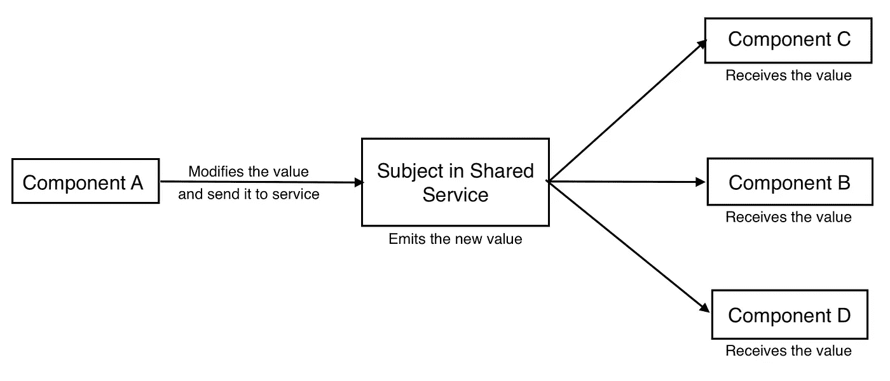
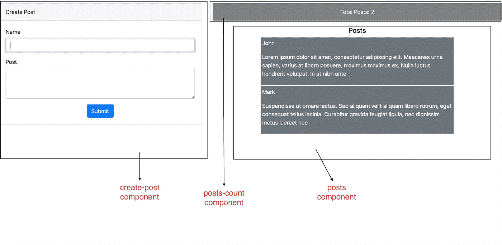

# RxJS 主题-完整的专业知识

> 原文：<https://medium.com/globant/rxjs-subjects-the-complete-know-how-3dc1e7e341a0?source=collection_archive---------0----------------------->

## 了解 RxJS 主题如何对 Angular 中的组件交互做出贡献。


Image by [Goumbik](https://pixabay.com/users/goumbik-3752482/?utm_source=link-attribution&utm_medium=referral&utm_campaign=image&utm_content=2717066) from [Pixabay](https://pixabay.com/?utm_source=link-attribution&utm_medium=referral&utm_campaign=image&utm_content=2717066)

在 Angular 组件之间传递数据有多种方式。在本文中，我们将研究使用共享服务和 RxJS 主题的组件交互。

如果你不了解服务，服务是 Angular 中的一个类，用`@injectable` decorator 来修饰。它有两个主要目的:

1.  在不同组件之间传递数据。
2.  从组件中分离出某些处理任务，如网络调用及其错误处理、直接登录到控制台等。

# **什么是 RxJS 主题？？**

Subject 是 RxJS 库中一种特殊的可观察对象，它允许我们向订阅它的组件多播值。每当 Subject 发出一个值时，它的每个订阅者都会得到关于发出的值的通知。



它有三种方法:

1.  `next(value)` -该方法用于发出一个新值。
2.  `error(error)` -此方法用于发送错误通知。
3.  `complete()` -这种方法表明受试者已经完成了工作。一旦`complete()`方法被调用，调用`next()`或`error()`将不会有任何效果。

Credit: [https://giphy.com/](https://giphy.com/)

我们将创建一个小应用程序，其中:

1.  用户将创建一个帖子( ***创建-帖子组件*** )。
2.  提交后，帖子会显示在 ***帖子*** 组件中，计数会递增并反映在 ***帖子-计数*** 组件中。



Snapshot of application

让我们使用下面的命令创建一个新的应用程序。

```
ng new my-app
```

我们将有三个组成部分。

1.  ***创建-发布*** —该组件将包含一个表单，用户将在其中输入详细信息。
2.  ***帖子*** —该组件将显示所有帖子
3.  ***帖子数*** —该组件将显示帖子总数。

我们还将创建一个 ***共享服务*** 。

使用以下命令，通过 Angular-CLI 创建组件和服务

```
ng generate component create-post
ng generate component posts
ng generate component posts-countng generate service shared
```

## **共享服务**

1.  从`‘rxjs’`导入`Subject`。
2.  使用`new Subject()`创建一个`posts`主题。
3.  编写一个方法`setPosts`，使用`next()`方法发出值。

```
import { Injectable } from '@angular/core';
import { Subject } from 'rxjs';@Injectable({
  providedIn: 'root'
})export class SharedService {
  public posts = new Subject(); constructor() { } setPost(post) {
   this.posts.next(post);
  } getPosts() {
    return this.posts;
  }
}
```

## **创建-发布组件**

该组件有一个用于捕获用户输入的反应式表单。提交后，我们调用服务的`setPost`方法来发出帖子。

**TS**

```
import { Component, OnInit } from '@angular/core';
import { FormGroup, FormControl } from '@angular/forms';
import { SharedService } from '../services/shared.service';@Component({
  selector: 'app-create-post',
  templateUrl: './create-post.component.html',
  styleUrls: ['./create-post.component.css']
})export class CreatePostComponent implements OnInit {
  public postForm: FormGroup; constructor(private sharedService: SharedService) { } ngOnInit(): void {
    this.postForm = new FormGroup({
      name: new FormControl(''),
      post: new FormControl('')
    })
  } submit() {
    const post = {
      name: this.postForm.get('name').value,
      post: this.postForm.get('post').value
    }
    this.sharedService.setPost(post);
   }
}
```

**HTML**

```
<div class = "card">
  <div class = "card-header">Create Post</div>
  <div class = "card-body">
    <form [formGroup] = "postForm">
      <div class="form-group">
        <label>Name</label>
        <input type="email" 
               class="form-control" 
               formControlName = "name">
      </div>
      <div class="form-group">
        <label>Post</label>
        <textarea class="form-control" 
                  rows="3" 
                  formControlName = "post">
        </textarea>
      </div>
      <div class = "text-center">
        <button class = "btn btn-primary" 
                (click) = "submit()">Submit
        </button>
      </div>
    </form>
  </div>
</div>
```

## **岗位-组件**

在这个组件中，我们将调用共享服务的`getPosts`方法。由于`getPosts`方法返回一个主题，我们将为设置订阅而订阅它。

每次`posts`主体发出帖子，我们都会将帖子值推送到`posts`数组。

在`ngOnDestroy()`生命周期挂钩中，我们取消订阅。如果我们不在组件被破坏之前取消订阅，就会导致内存泄漏。

**TS**

```
import { Component, OnDestroy, OnInit } from '@angular/core';
import { Subscription } from 'rxjs';
import { SharedService } from '../services/shared.service';@Component({
  selector: 'app-posts',
  templateUrl: './posts.component.html',
  styleUrls: ['./posts.component.css']
})export class PostsComponent implements OnInit, OnDestroy {
  public posts = [];
  public postsSubscription: Subscription; constructor(private shareService: SharedService) { } ngOnInit(): void {
    this.postsSubscription =  this.shareService.getPosts()
    .subscribe(response => {
      this.posts.push(response);
    })
  } ngOnDestroy() {
    this.postsSubscription.unsubscribe();
  }
}
```

使用`ngFor`指令，我们将呈现帖子。

```
<ng-container *ngIf = "posts.length>0">
  <h5 class = "mt-3 text-center">Posts</h5>
  <div class = "col-sm-8 mt-1 p-1 mx-auto text-white bg-secondary"
       *ngFor = "let post of posts">
    <p>{{post.name}}</p>
    <p>{{post.post}}</p>
  </div>
</ng-container>
```

## **岗位-计数组件**

这与文章组件相同。每发出一个值，我们就增加一个`posts`计数器。

**TS**

```
import { Component, OnDestroy, OnInit } from '@angular/core';
import { Subscription } from 'rxjs';
import { SharedService } from '../services/shared.service';@Component({
  selector: 'app-posts-count',
  templateUrl: './posts-count.component.html',
  styleUrls: ['./posts-count.component.css']
})export class PostsCountComponent implements OnInit, OnDestroy {
  public postsCount = 0;
  public postsSubscription: Subscription;
  constructor(private sharedService: SharedService) { }

  ngOnInit(): void {
    this.postsSubscription = this.sharedService.getPosts()
    .subscribe(response => {
      this.postsCount++;
    })
  } ngOnDestroy() {
    this.postsSubscription.unsubscribe();
  }
}
```

**HTML**

```
<div class = "box text-center text-white">
  Total Posts: {{postsCount}}
</div>
```

Credit: [https://giphy.com/](https://giphy.com/)

请记住，对于普通主题，订阅者只能获得他们订阅后发出的值。如果你想得到最后发出的值，你可以使用`BehaviorSubject`或`ReplaySubject`。

主题有*三种类型。让我们一个一个来看。*

***行为主体** `BehaviorSubject`存储最后发出的值。当新用户订阅时，他将立即获得存储值。在创建 BehaviorSubject 时，我们必须提供初始值。*

*语法:*

```
*import { BehaviorSubject } from 'rxjs';const subject = new BehaviorSubject(inital_value);*
```

***replay subject** `ReplaySubject`可以向新订阅者发出多个旧值。创建 ReplaySubject 时，您必须指定要存储多少旧值以及要保留多长时间。*

*语法:*

```
*import { ReplaySubject } from 'rxjs';const subject = new ReplaySubject(No_of_values, Time);*
```

***AsyncSubject** `AsyncSubject`与`BehaviorSubject`和`ReplaySubject`相比有所不同。它只发出最后一个值，并且当它的执行完成时发出最后一个值。*

*语法:*

```
*import { AsyncSubject } from 'rxjs';const subject = new AsyncSubject();*
```

***总结一下吧！！***

*简而言之，主题对于将值多播到 Angular 中的不同组件非常有用。每当主体发出一个值时，组件都会得到通知。`BehaviorSubject`、`ReplaySubject`、`AsyncSubject`是主语的三个变体。*

*`next(value)`、`error(error)`和`complete()`是与 Subject 关联的三个方法，分别用于发出值、发送错误通知和执行完成通知。*

*希望以上信息能帮助你对主题有一个清晰的了解！！*