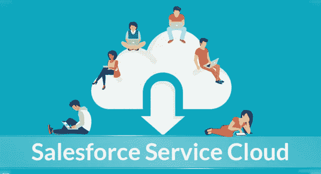
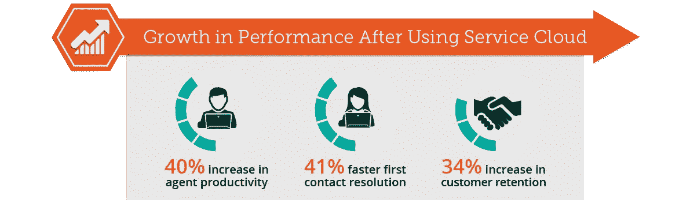
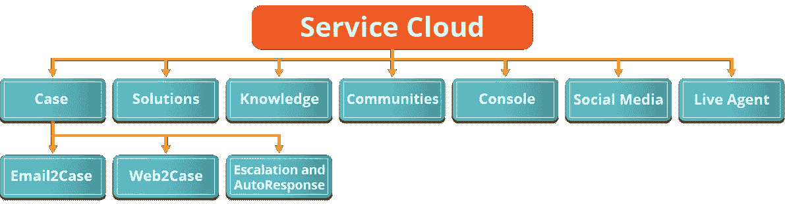
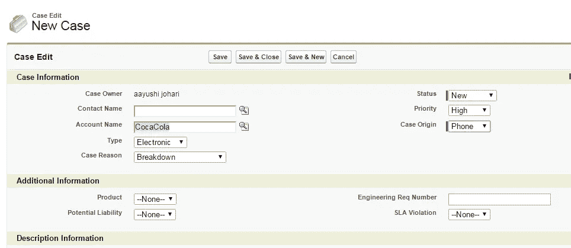
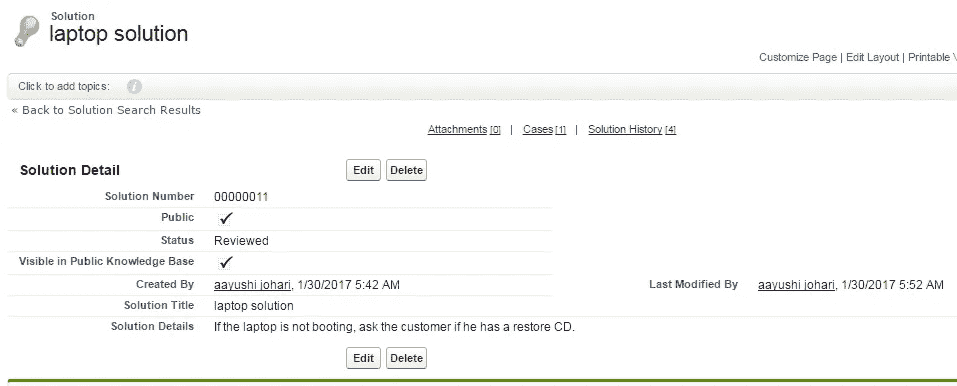
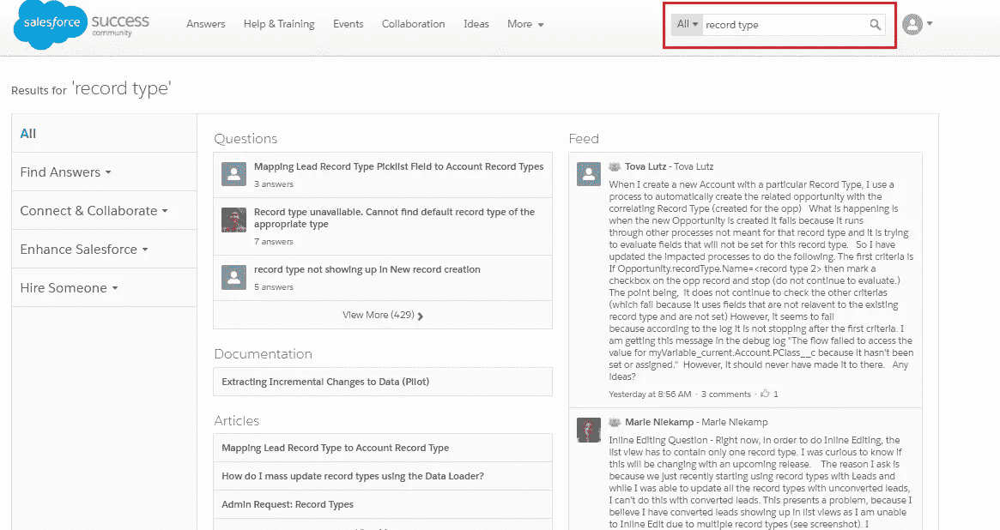
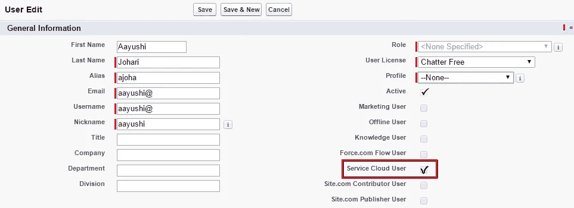
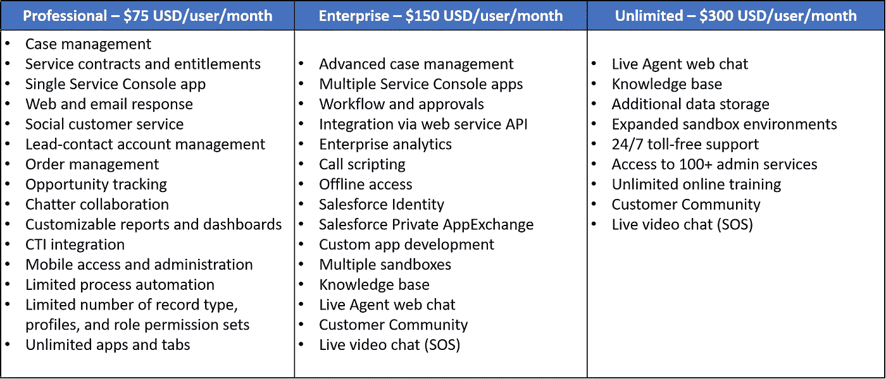

# Salesforce 服务云综合指南

> 原文：<https://medium.com/edureka/salesforce-service-cloud-b8b8dbdae9f9?source=collection_archive---------0----------------------->

Salesforce Service Cloud — Edureka

作为 CRM 的 Salesforce 用于连接人员和信息。在本文中，我将解释核心服务之一——sales force Service Cloud，以及它如何通过简化组织与其客户之间的交互来彻底改变客户支持。在我的上一篇文章中，您学习了如何创建自定义 Salesforce 应用程序。接下来，我将帮助您了解 Salesforce Service Cloud 如何为您的业务增加价值。首先，我将解释对 Salesforce Service Cloud 的需求，它是什么，以及它提供了哪些服务来吸引您的客户。最后，我将解释一个使用案例，说明可口可乐如何成功地使用服务云提升客户体验。

那么，让我们从为什么您的组织应该选择 Salesforce Service Cloud 开始。

# 为什么选择 Salesforce 服务云？

如果您的公司非常关心客户服务，那么 Salesforce Service Cloud 是您应该选择的。不管你是在 B2C 还是 B2B 领域，你都会有一些客户定期提出问题和询问。这些票将会被你的服务代理收到。Salesforce Service Cloud 帮助您高效地跟踪和解决这些票证。
这不是改变客户体验的唯一方式。让我们更深入地了解一下 Salesforce Service Cloud 是如何创造印象的。

*   **最大限度地提高代理的工作效率** —使用服务云，代理可以在任何地方工作。利用可用的简单管理选项(如基于 web 的应用程序、移动设备、知识库)，提高了代理的工作效率，从而降低了代理的管理费用。
*   **转变客户体验** —客户关系显著增强——通过实时代理与每一位客户建立一对一的联系。您可以提高您的客户忠诚度、满意度和客户保留率，从而从现有客户那里获得回头客，增加客户的 LTV(终身价值)，为您的品牌带来正面口碑。
*   **安全性** —借助服务云平台，您的数据完全安全可靠。它采用多层方法来保护对您的业务至关重要的信息。
*   **利用社交媒体平台** —您还可以在脸书或 Twitter 等社交媒体上与客户实时互动。
*   **案例跟踪** —跟踪帮助您更快地解决案例。这可以更好地管理一个人的日常活动，并大大减少人工错误。

总之，Salesforce Service Cloud 无疑有助于改善您的运营流程，从而为您的客户带来更好的体验。根据对使用 Salesforce Service Cloud 的公司进行的一项研究，性能指标的增长大幅增加。如果您看到下面的信息图，代理的工作效率提高了 40%，案例解决率提高了 41%，最终导致客户保持率提高了 31%。

这种增长说明了为什么人们更喜欢 Salesforce Service Cloud，以及它如何在改善您的客户支持团队方面发挥重要作用。

现在，让我们了解什么是 Salesforce Service Cloud，以及它必须提供哪些服务。

# 什么是 Salesforce 服务云？

Salesforce 提供服务云即软件即服务。服务云构建于 Salesforce 客户成功平台之上，为您提供 360 度的客户视角，使您能够提供更智能、更快速、更个性化的服务。

借助 Salesforce Service Cloud，您可以在一个平台上创建互联知识库、实现实时代理聊天、管理案例交互。您可以进行个性化的客户互动，甚至根据他/她过去的活动数据追加销售您的产品/服务。

现在，您可能想知道如何访问服务云。让我向您介绍访问服务云控制台的步骤。
**第一步:**登录 login.salesforce.com
**第二步:**创建一个 SF 控制台 App
**第三步:**选择其显示
**第四步:**自定义推送通知
**第五步:**授予用户控制台权限— Sc 用户

# 它提供什么服务？

正如我前面提到的，有案例跟踪和知识库功能。Salesforce Service Cloud 还提供了其他几项服务，使您能够提供与众不同的客户体验。您可以参考下图，了解 Salesforce Service Cloud 能为您提供什么。

您可以通过学习 Salesforce 中的以下功能将您的控制台提升到一个新的水平:

## **案例管理**

客户提出的任何问题通常都会作为案例被捕获和跟踪。案例可以进一步分为以下几类:

*   **电子邮件转个案**:当电子邮件被发送到您公司的一个电子邮件地址(如 support@edureka.co)时，电子邮件转个案可帮助您自动创建个案。这些生成的案例将显示在“电子邮件相关列表”中。此电子邮件相关列表包括您的客户就特定案例发送的所有电子邮件，以及电子邮件线程。
*   **在线个案**:每当支持请求直接来自您公司的网站时，在线个案帮助您在 Salesforce 中自动创建新个案。要启用它，您可以转到设置→构建→自助服务→在线个案设置。
    选中“启用在线个案”复选框。您可以选择一个自动响应模板，并将默认案例来源选择为“Web”。
*   **升级和自动响应**:案例升级规则用于当案例在指定时间段内未关闭时，重新分配并选择性地通知个人。此外，您可以配置自动响应规则来响应来自 web 或电子邮件的案例。

服务云的核心是“案例”模块。让我们用一个例子来理解案例模块。假设在像可口可乐这样的大型组织中，很少有员工的系统崩溃，让我们称之为“笔记本电脑崩溃”。现在，您需要尽快解决这个问题，以确保业务连续性。服务云帮助你跟踪进度，为你提供每一个可口可乐代理商的所有必要信息。你可以通过创建一个案例来解决问题。然后，您可以将它们分配为“高”优先级，并对该案例的来源进行分类(如电话、电子邮件或网络)，然后单击“保存”。参考下面的截图，以获得更好的理解。

## **解决方案**

您可以将您的解决方案分类为查询类型，从而使您的解决方案搜索更容易，结案更快。这样，代理不需要每次都为现有查询创建新的解决方案。这有助于提高代理的工作效率。解决方案不需要任何额外的许可证。

对于同样的可口可乐场景，如果你想作为代理人解决一个案件，那么你肯定会搜索解决方案。首先，您可以检查解决方案是否已经存在。如果不存在，您的管理员可以创建一个解决方案，声明该案例已经解决，因此可以关闭。可以参考下面附上的截图。

正如你在上面的截图中看到的，我已经创建了一个解决方案——“笔记本电脑解决方案”，它显示了所创建的解决方案的标题、状态和详细信息。

## **知识**

Salesforce Knowledge 是一个知识库，用户可以在其中编辑、创建和管理内容。知识文章是信息的文档。客户可以去该公司的网站搜索解决方案。与解决方案不同，知识文章可以在案例关闭之前与案例关联。Salesforce Knowledge 需要购买单独的许可证。

## **社区**

社区是与不属于您组织的业务伙伴和客户、分销商、经销商和供应商协作的一种方式。通常，这些人不是您的常规 SFDC 用户，但是您希望为他们提供一些与您的组织联系的渠道，并为他们提供对一些数据的访问。

在 Salesforce 中，如果您转到“呼叫中心”下拉菜单，您会发现**成功社区**。Salesforce 用户可以使用他们的用户 id 和密码登录。该社区对所有开发人员、职能顾问或管理员开放。在这个社区中，用户可以搜索任何东西，因为它有很多东西，如文档、文章、知识、提要、问题等等。例如:如果你想了解记录类型，那么你可以在这里搜索。看看下面附上的截图。

正如你在上面的搜索中看到的，你得到了很多客户的问题、文档、已知问题、想法等。您现在可以开始探索它们，了解客户面临的主要问题，并相应地解决它们。

## **控制台**

代理控制台提供统一的代理体验。它通过将所有信息放在一起减少了响应时间。在一个控制台中，您可以在一个位置找到从客户资料、案例历史到仪表板的所有内容。

正如我在本文开始时向您展示了如何设置 Salesforce 控制台的基础知识。管理员可以向用户授予控制台访问权限，服务云为您提供控制台访问权限，您可以向其分配用户。参考下面的截图，您可以为控制台分配用户配置文件。此外，您可以将 Service Cloud 用户许可证分配给具有这些配置文件的代理，以便他们可以开始使用您的控制台。

## **社交媒体**

服务云让你可以利用社交媒体平台，如脸书、推特，来吸引访客。使用 Salesforce Social Studio，客户请求会直接升级到您的社会服务团队。社交媒体在弥合虚拟世界的鸿沟、让他们实时参与方面发挥着重要作用。

## **真人代理**

现场代理处理 1:1 的客户互动。代理可以通过客户聊天和键盘快捷键更快地提供答案。他们与客户保持完全的联系，因为他们的团队成员会立即得到提示以解决问题。此外，通过实时协助，它使代理在流程中更加智能和高效。这反过来提高了客户满意度。

Salesforce Service Cloud 旨在为您的客户提供服务，并与他们建立关系。您可以使用其他功能，如呼叫中心、电子邮件和聊天、电话、谷歌搜索、合同和权利、chatter 和呼叫脚本。

# Salesforce 服务云的成本是多少？

Salesforce Service Cloud 提供三种定价包-专业版、企业版和无限版。您可以参考下表，并相应地选择您的计划。

> “我们的代理喜欢 Salesforce CRM 服务。他们告诉我们，它是多么容易使用，在推动更好的客户体验方面，它是多么非凡”“ **Charter**

这就是 Salesforce Service Cloud 如何彻底改变客户通过互联网使用服务与组织互动的方式。现在，让我们看看可口可乐是如何实施 Salesforce 服务云来解决其业务挑战的。

# Salesforce 服务云用例:可口可乐

许多全球性组织利用 Salesforce Service Cloud 获得更好的客户关系管理解决方案。在这里，我将谈谈可口可乐德国公司是如何使用服务云来分析消费者行为和构建数据驱动的商业战略的。此使用案例将让您了解如何在任何领域广泛使用服务云。
Salesforce Service Cloud 是连接全球员工、客户和供应商的集成平台。

早些时候，可口可乐在管理他们的客户时面临着几个问题。其中一些列举如下:

*   该公司的内部维修设施以前有技术人员在纸上跟踪他们的工作。他们花了很多时间和精力。
*   呼叫中心和维修部门频繁停机。
*   全移动体验缺乏速度、功能、可扩展性和连接性。
*   缓慢的移动应用程序同步。
*   整体用户体验不理想。

> “过去，大公司的竞争力强于小公司。但那是历史。今天，快公司在竞争中胜过慢公司，”可口可乐 *首席执行官 ***尤里克·内哈默解释道。****

现在，当技术人员连接到 Salesforce 服务云时，他们会收到关于客户问题的实时警报。这有助于显著缩短响应时间。此外，呼叫中心支持代理可以即时访问客户历史记录。有了这些，可口可乐德国技术服务部门的生产率已经飙升了 30%。

# 可口可乐的一次大修理

借助服务云，他们希望了解客户的需求，并更有效地满足他们的需求。以下是促成他们优秀的一些关键点。

*   **客户满意度** —通过任何渠道或产品为客户提供一对一支持，并提供视频聊天等应用服务或代理即时指导他们找到解决方案。
*   **移动应用** —使用应用移动支持，客户可以通过实时代理视频聊天、屏幕共享和屏幕引导协助进行互动。这些服务改变了客户支持，让客户感到满意。
*   **分析** —使用 Salesforce Service Cloud，通过自定义仪表板收集和评估所有信息。可口可乐进行分析以检查过去的交易，并立即在他们服务的地方采取行动。这有助于他们在更短的时间内做出更好、更有利可图的决策。
*   **代理工作效率大幅提升** —凭借电子邮件转个案、基于技能的路由、里程碑跟踪等功能，服务云为他们的代理提供了在任何渠道快速高效地响应客户的工具。这就是可口可乐如何提高整体生产力的。

> 可口可乐公司业务流程专家和移动解决方案负责人 ***安德里亚·马伦德*** 说:“这对我们来说是一个巨大的进步。“我惊讶于实现的速度和流畅程度。”

这就是可口可乐如何实施 Salesforce 服务云，从而让他们的客户满意。还有其他几个 Salesforce Service Cloud 使用案例，展示了各种公司如何从中受益并发展其业务。

# 适用于 Salesforce 服务云的集成

Salesforce Service Cloud 支持与各种应用程序和业务系统集成，如下图所示:

由于每个人和所有东西都连接在一个平台上，您肯定应该选择 Salesforce Service Cloud。希望你喜欢读我的文章。如果你希望查看更多关于人工智能、DevOps、道德黑客等市场最热门技术的文章，那么你可以参考 [Edureka 的官方网站。](https://www.edureka.co/blog/?utm_source=medium&utm_medium=content-link&utm_campaign=salesforce-service-cloud)

请留意本系列中解释 Salesforce 各个方面的其他文章。

> 1.[什么是 Salesforce？](/edureka/what-is-salesforce-5df4830aee98)
> 
> 2. [Salesforce 教程](/edureka/salesforce-tutorial-5bac7659e0c5)
> 
> 3. [Salesforce 开发人员教程](/edureka/salesforce-developer-1051ba8ce733)
> 
> 4. [Salesforce 营销云](/edureka/salesforce-marketing-cloud-d057c266d87f)

*原载于 2017 年 2 月 6 日 www.edureka.co**的* [*。*](https://www.edureka.co/blog/salesforce-service-cloud/)