# 了解如何创建自己的 Salesforce 应用程序

> 原文：<https://medium.com/edureka/salesforce-tutorial-5bac7659e0c5?source=collection_archive---------3----------------------->

在上一篇文章中，您学习了什么是 Salesforce。在本文中，我将向您展示如何创建自定义 Salesforce 应用程序。我将创建一个名为 *StudentForce* 的应用程序，可用于维护学生记录。

这个应用程序将包含三个不同的对象(表)来存储数据。第一个名为*学生数据*的对象将包含学生的姓名和他们的个人信息，如电子邮件 id、电话号码和籍贯。学生所属的学院将被存储在名为*学院*的第二个对象中，名为*分数*的第三个对象将包含学生在各个科目中获得的分数。

在本文中，我已经通过分步说明和屏幕截图介绍了以下主题:

*   如何打造 app 环境？
*   什么是选项卡，如何在应用中创建选项卡？
*   什么是配置文件，如何自定义用户配置文件？
*   如何在 app 中创建对象？
*   如何在对象中创建字段并定义其数据类型？
*   如何在这些对象中添加条目(字段)？
*   如何链接两个不同的对象(在它们之间创建关系)？

在我开始创建应用程序之前，让我向您介绍构建 Salesforce 应用程序的云环境。

# Salesforce 组织

Force.com 为您或您的组织提供的[云计算](https://www.edureka.co/blog/what-is-cloud-computing?utm_source=medium&utm_medium=content-link&utm_campaign=salesforce-tutorial)空间称为 Salesforce org。它也称为 Salesforce 环境。开发人员可以在 Salesforce Org 上创建自定义 Salesforce 应用程序、对象、工作流、数据共享规则、Visualforce 页面和 Apex 编码。

现在让我们深入了解 Salesforce 应用程序，并了解它的工作原理。

# 销售力量应用程序

Salesforce 应用程序的主要功能是管理客户数据。Salesforce 应用程序提供了一个简单的 UI 来访问存储在对象(表)中的客户记录。应用程序还通过链接字段来帮助建立对象之间的关系。

应用程序包含一组对最终用户可见的相关选项卡和对象。下面的截图显示了 *StudentForce* 应用的样子。

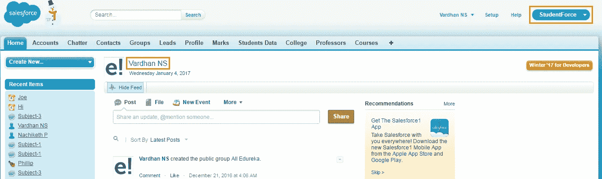

截图右上角高亮显示的部分显示了 app 名称: *StudentForce* 。个人资料图片旁边突出显示的文字是我的用户名: *Vardhan NS* 。

在创建对象和输入记录之前，您需要设置应用程序的框架。您可以按照以下说明来设置应用程序。

## 设置应用程序的步骤

1.  点击右上角应用名称旁边的*设置*按钮。
2.  在左侧的栏中，转到*构建* →从下拉菜单中选择*创建* →选择*应用*。

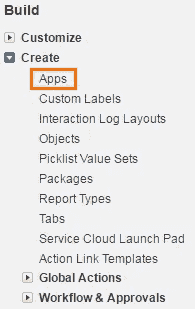

3.点击*新建*，如下图截图所示。

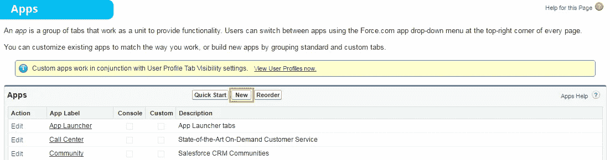

4.选择*自定义 App* 。

5.进入 *App 标签*。 *StudentForce* 是我的 app *的标签。*点击*下一个*。

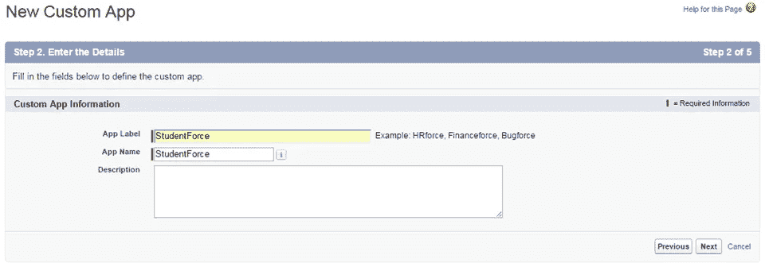

6.为你的应用选择个人资料图片。点击下一个的*。*

7.选择你认为必要的标签。点击下一个的*。*

8.选择您想要将*应用*分配到的不同配置文件。点击*保存*。

在步骤 7 和 8 中，要求您选择相关的选项卡和配置文件。选项卡和简档是 Salesforce 应用程序不可或缺的一部分，因为它们帮助您管理 Salesforce 中的对象和记录。

在本 salesforce 教程中，我将向您详细介绍选项卡、简档，然后向您展示如何创建对象并向其添加记录。

# Salesforce 选项卡

选项卡用于访问 Salesforce 应用程序中的对象(表)。它们出现在屏幕顶部，类似于工具栏。它包含多个对象的快捷链接。单击选项卡中的对象名称，将显示该对象中的记录。选项卡还包含指向外部 web 内容、自定义页面和其他 URL 的链接。以下屏幕截图中突出显示的部分是 Salesforce 选项卡。

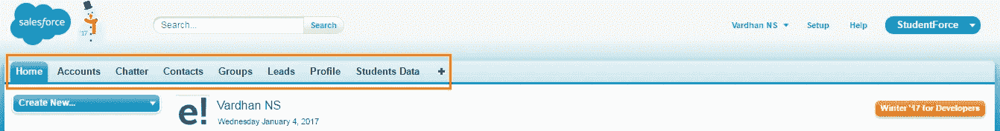

默认情况下，所有应用程序都有一个*主页*标签。点击选项卡菜单中的“ *+* ”可选择标准选项卡。客户、联系人、组、潜在客户、简档是 Salesforce 提供的标准选项卡。例如，*帐户*选项卡将显示 SFDC 组织中的帐户列表，而*联系人*选项卡将显示 SFDC 组织中的联系人列表。

## 添加选项卡的步骤

1.  单击选项卡菜单中的“+”。
2.  点击右侧的*自定义选项卡*。
3.  选择您选择的选项卡，并点击*保存*。

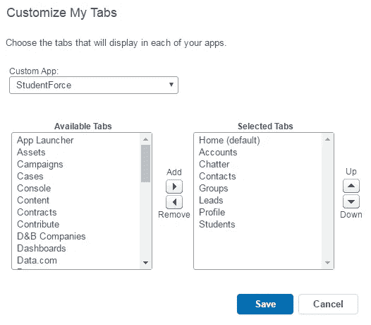

除了标准选项卡，您还可以创建自定义选项卡。你在上面的截图中看到的*学生*选项卡是我创建的自定义选项卡。这是到达自定义对象的快捷方式:*学生*。

# 创建自定义选项卡的步骤

1.  导航至设置→构建→创建→选项卡。
2.  点击*新建*。
3.  选择要为其创建选项卡的对象名称。我的情况是*学生数据*。这是我创建的一个自定义对象(创建该对象的说明将在本文后面介绍)。
4.  选择您偏好的标签样式并输入描述。
5.  点击下一步→保存。新的*学生数据*选项卡将出现，如下所示。

# Salesforce 简档

需要访问数据或 SFDC 组织的每个用户都将被链接到一个配置文件。简档是设置和权限的集合，控制用户在 Salesforce 中可以查看、访问和修改的内容。

简档控制用户权限、对象权限、字段权限、应用程序设置、选项卡设置、apex 类访问、Visualforce 页面访问、页面布局、记录类型、登录时间和登录 IP 地址。

您可以根据用户的背景定义配置文件。例如，可以为不同的用户设置不同的访问级别，如系统管理员、开发人员和销售代表。

与选项卡类似，我们可以使用任何标准配置文件或创建自定义配置文件。默认情况下，可用的标准配置文件包括:只读、标准用户、市场营销用户、合同经理、解决方案经理和系统管理员。如果您想要创建自定义配置文件，您必须首先克隆标准配置文件，然后编辑该配置文件。请注意，一个配置文件可以分配给多个用户，但一个用户不能分配多个配置文件。

## 创建配置文件的步骤

1.  单击设置→管理→管理用户→配置文件
2.  然后，您可以通过点击*编辑*来克隆任何现有的配置文件。

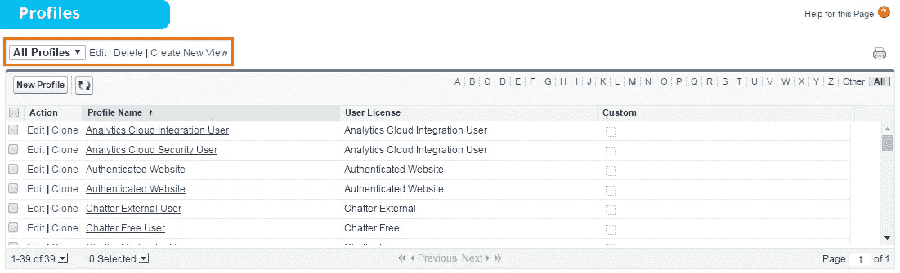

一旦为您的应用程序设置了选项卡和配置文件，您就可以将数据加载到其中。因此，本文的下一节将介绍如何将数据以记录和字段的形式添加到对象中。

# Salesforce 中的对象、字段和记录

对象、字段和记录是 Salesforce 的构建块。因此，了解它们是什么以及它们在构建应用程序中扮演什么角色非常重要。

对象是存储数据的 Salesforce 中的数据库表。Salesforce 中有两种类型的对象:

*   **标准对象:**sales force 提供的对象称为标准对象。例如，客户、联系人、潜在客户、业务机会、活动、产品、报告、仪表板等。
*   **自定义对象:**用户创建的对象称为自定义对象。

对象是记录的集合，记录是字段的集合。

对象中的每一行都由许多字段组成。因此，对象中的记录是相关字段的组合。请看下面的 excel 图表。

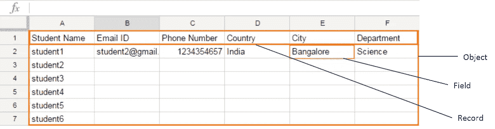

我将创建一个名为*学生数据*的对象，其中包含学生的个人详细信息。

创建自定义对象的步骤:

1.  导航至设置→构建→创建→对象
2.  点击*新建自定义对象*。
3.  填写*对象名称*和*描述*。从下图可以看出，对象名为*学生数据*。

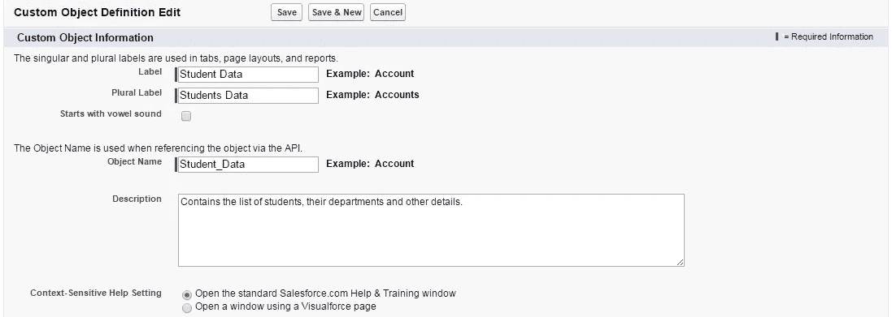

4.点击*保存*。

如果您想将这个自定义对象添加到选项卡菜单中，那么您可以按照本文前面提到的说明进行操作。

创建对象后，您需要在该对象中定义各种字段。例如，学生记录中的字段将是学生姓名、学生电话号码、学生电子邮件 ID、学生所属的系和他的家乡城市。

只有在定义字段后，您才能向对象添加记录。

## 添加自定义字段的步骤

1.  导航至设置→构建→创建→对象
2.  选择要添加字段的对象。我的情况是*学生数据*。
3.  向下滚动到该对象的自定义字段和关系，然后单击*新建*，如下图所示。

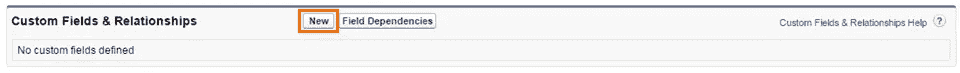

4.你需要选择特定字段的数据类型，然后点击*下一步*。我选择了*文本*格式，因为我将在这个字段中存储字母。
*不同数据类型的字段将在本文的下一部分详细解释。*

5.然后会提示您输入字段的名称、字段的最大长度和描述。

6.您还可以使其成为可选/必填字段，并通过选中复选框来允许/禁止不同记录的重复值。请看下面的截图，以便更好地理解。

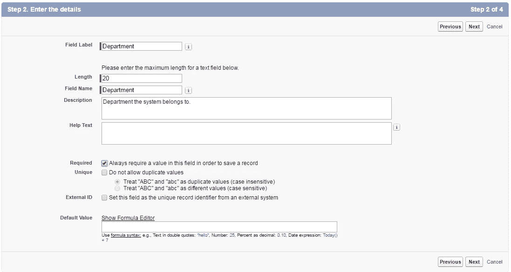

7.点击下一个的*。*

8.选择可以在以后编辑该文本字段的各种简档。点击下一个的*。*

9.选择应包含此字段的页面布局。

10.点击*保存*。

正如您从下面的截图中看到的，有两种类型的字段。默认情况下为每个对象创建的标准字段和我自己创建的自定义字段。我为*学生数据*创建的四个字段是城市、部门、电子邮件 ID 和电话号码。您会注意到所有自定义字段都带有后缀“__C ”,表示您有权编辑和删除这些字段。而有些标准字段可以编辑，但不能删除。

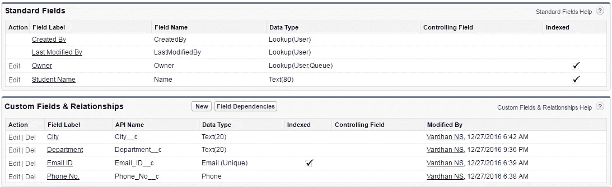

现在，您可以将学生记录(整行)添加到您的对象中。

## 添加记录的步骤

1.  从选项卡菜单转到对象表。*学生数据*是我要添加记录的对象。
2.  正如您在下图中看到的，没有现有记录。点击*新增*添加新的学生记录。

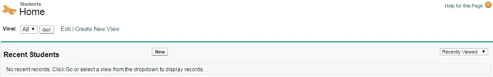

3.将学生的详细信息添加到不同的字段中，如下图所示。点击*保存*。

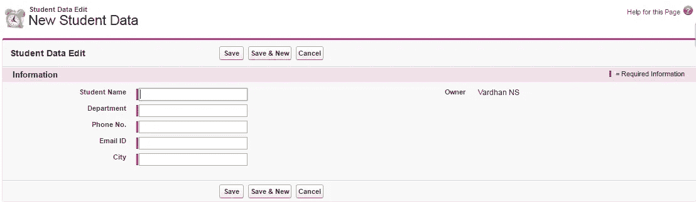

4.您可以创建任意数量的学生记录。我已经创建了 4 个学生记录，如下图所示。

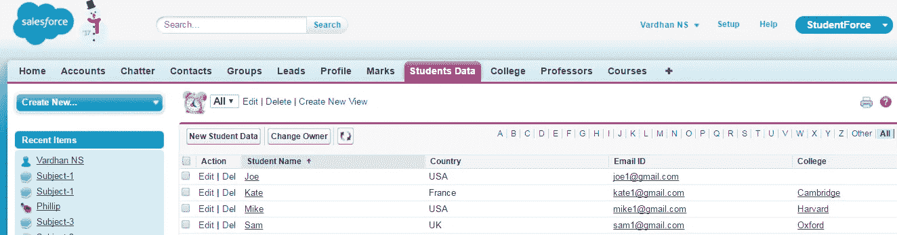

5.如果您想编辑学生的详细信息，您可以点击*编辑*，如下图所示。

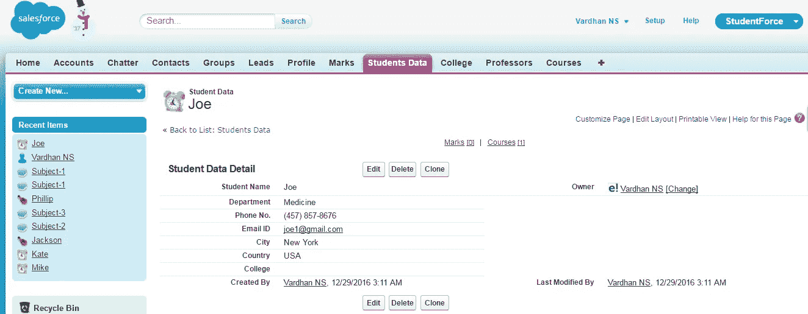

# 字段的数据类型

数据类型控制字段中可以存储的数据类型。记录中的字段可以有不同的数据类型。例如:

*   如果是电话号码字段，可以选择*电话*。
*   如果是名称或者文本字段，可以选择*文本*。
*   如果是日期/时间字段，可以选择*日期/时间*。
*   通过选择*选项列表*作为字段的数据类型，您可以在该字段中写入预定义值并创建下拉列表。

您可以为自定义字段选择任何一种数据类型。下面是列出不同数据类型的屏幕截图。

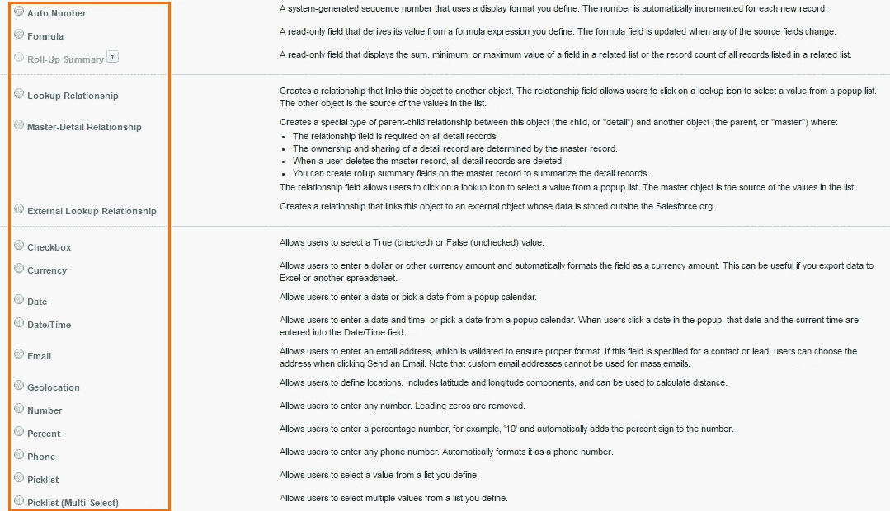

像*查找关系、主从关系和外部查找关系*这样的数据类型用于在一个或多个对象之间创建链接/关系。对象之间的关系是本文讨论的下一个主题。

# Salesforce 中的对象关系

顾名思义，对象关系在 Salesforce 中用于创建两个对象之间的链接。你脑海中的问题是，为什么需要它？我用一个例子来说一下需要。

在我的 *StudentForce* app 中，有一个*学生数据*对象，里面包含了学生的个人信息。关于学生的分数和他们以前的大学的详细信息呈现在不同的对象中。我们可以使用关系来链接这些使用相关字段的对象。学生和学院的标记可以与*学生数据*对象的*学生姓名*字段关联。

选择数据类型时可以定义关系。它们总是在子对象中定义，并引用主对象中的公共字段。当所需的数据存在于不同的对象中时，创建这样的链接将帮助您轻松地搜索和查询数据。对象之间可以存在三种不同类型的关系。它们是:

*   主-细节
*   检查
*   连接

让我们逐一看看:

## 主从关系(1:n)

主从关系是一种父子关系，其中主对象控制从属对象的行为。这是一个 1:n 的关系，父母只能有一个，但孩子可以有很多。在我的例子中，*学生数据*是主对象，而*标记*是子对象。

让我给你举一个主从关系的例子。*学生数据*对象包含学生记录。每个记录都包含学生的个人信息。然而，学生获得的分数存在于另一个名为*分数*的记录中。看下面*标记*对象的截图。

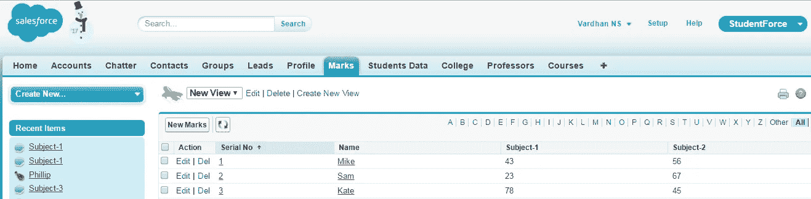

我使用学生的名字在这两个对象之间创建了一个链接。以下是在建立主从关系时你必须记住的几点。

*   作为控制对象，主字段不能为空。
*   如果主对象中的记录/字段被删除，相关对象中的相应字段也会被删除。这称为级联删除。
*   从属字段将从其主字段继承所有者、共享和安全设置。

您可以定义两个自定义对象之间的主/从关系，或者自定义对象和标准对象之间的主/从关系，只要标准对象是关系中的主对象。

## 查找关系(1:n)

当您想要在两个对象之间创建链接，但不依赖于父对象时，可以使用查找关系。你可以认为这是一种亲子关系，只有一个父母，但有许多孩子，即 1:n 关系。以下是在建立查找关系时您必须记住的几点。

*   子对象上的查找字段不是必需的。
*   不能通过删除父对象中的记录来删除子对象中的字段/记录。因此，子对象中的记录不会受到影响。
*   子字段不会继承其父字段的所有者、共享和安全设置。

在我的例子中，查找关系的一个例子是一个 *College* 对象。您可以在下面的截图中看到子对象:*学生数据*。您会注意到第一条记录中有一个空的*学院*字段。这表明依赖性不是必需的。

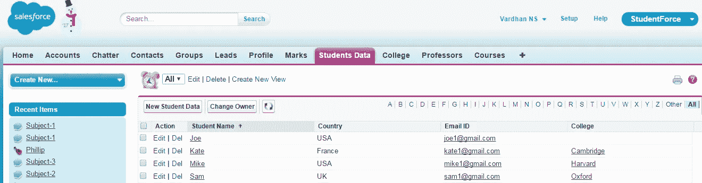

下面是两种关系的模式图的屏幕截图。*学院-学生数据*形成查找关系，而*学生数据-分数*形成主从关系。

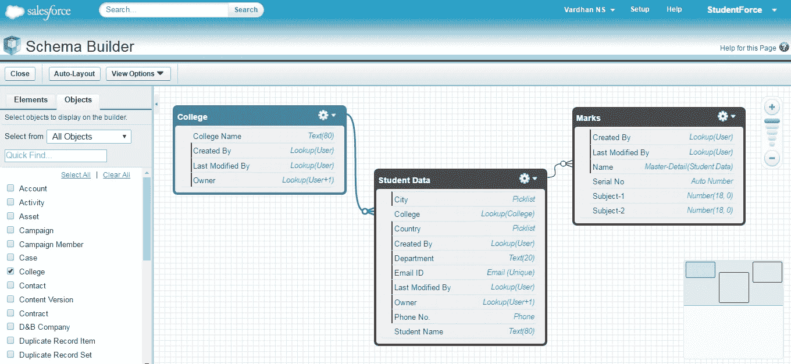

## 自我关系

这是一种查找关系的形式，其中关系在同一个表/对象中，而不是两个表/对象。因此得名自我关系。这里，查找引用了同一个表。这种关系也叫层级关系。

## 连接关系(多对多)

当需要创建两个主-详细信息关系时，可以存在这种关系。通过链接 3 个自定义对象，可以创建两个主-详细信息关系。这里，两个对象将是主对象，第三个对象将依赖于这两个对象。简单地说，它将是两个主对象的子对象。

为了举例说明这种关系，我创建了两个新对象。

*   一个叫*的硕士对象*教授。里面有教授的名单。
*   名为*课程*的子对象。它包含了可供选择的课程列表。
*   我将使用*学生数据*对象作为另一个主对象。

我已经创建了一个多对多的关系，这样在*课程*对象中的每个记录必须至少有一个学生和一个教授。这是因为每门课程都是学生和教授的结合。事实上，一门课程可以有一个或多个学生和教授与之相关联。

对*学生*和*教授*对象的依赖使得*课程*成为子对象。*学生*和*教授*因此是主对象。下面是*课程*对象的截图。

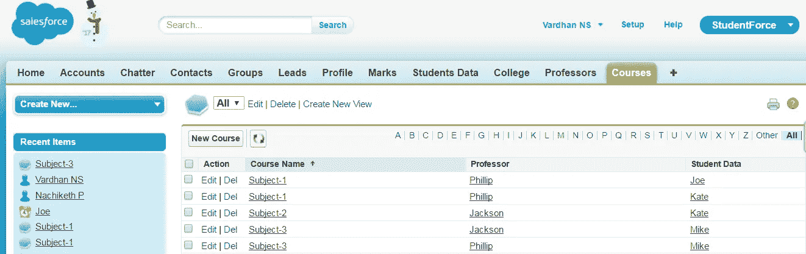

你会注意到这些学科有不同的教授和学生组合。例如，Kate 与两门课程相关联，并且这两门课程中的每一门都有两位不同的教授。Mike 只与一门课程相关联，但是该课程有两个不同的教授。乔和凯特都与同一个课程和同一个教授有联系。在下面的截图中，你会发现这种关系的示意图。

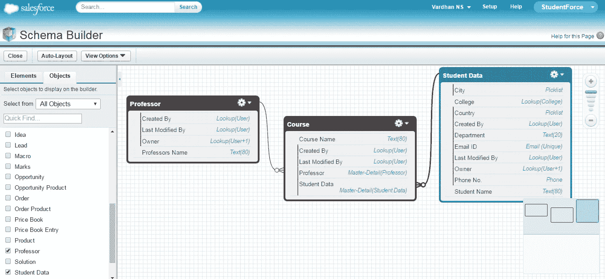

恭喜你。成功构建了 *StudentForce* 应用。上面给出的两个架构图显示了不同对象在我的 Salesforce 应用程序中是如何链接的。

这就到了本 Salesforce 教程的结尾。我希望你理解了本文中解释的各种概念，如应用程序、标签、个人资料、字段、对象和关系。

如果你想查看更多关于人工智能、DevOps、道德黑客等市场最热门技术的文章，那么你可以参考 [Edureka 的官方网站。](https://www.edureka.co/blog/?utm_source=medium&utm_medium=content-link&utm_campaign=salesforce-tutorial)

请留意本系列中解释 Salesforce 各个方面的其他文章。

> 1.[什么是 Salesforce？](/edureka/what-is-salesforce-5df4830aee98)
> 
> 2. [Salesforce 开发人员教程](/edureka/salesforce-developer-1051ba8ce733)
> 
> 3. [Salesforce 服务云](/edureka/salesforce-service-cloud-b8b8dbdae9f9)
> 
> 4. [Salesforce 营销云](/edureka/salesforce-marketing-cloud-d057c266d87f)

*原载于 2017 年 1 月 4 日 www.edureka.co***。**