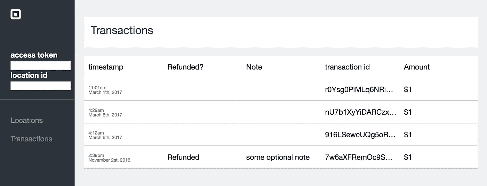
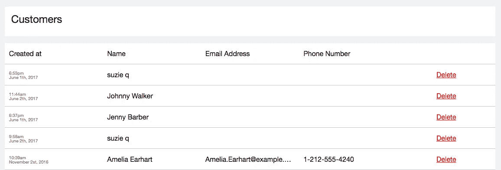

# 沙盒仪表板第 3 部分:客户

> 原文：<https://medium.com/square-corner-blog/sandbox-dashboard-part-3-customers-d8ea3371e03f?source=collection_archive---------0----------------------->

*这是我们系列的第三篇文章，展示了如何为你的沙盒开发者账户制作一个仪表盘。更多上下文，请看一下* [*第一部分*](/square-corner-blog/using-squares-rest-apis-to-build-a-sandbox-dashboard-part-1-authentication-locations-3e5b5a551cc7) *和* [*第二部分*](/square-corner-blog/building-a-sandbox-dashboard-pt-2-adding-a-transactions-list-49fd754e659b) *。*

> 注意，我们已经行动了！如果您想继续了解 Square 的最新技术内容，请访问我们的新家[https://developer.squareup.com/blog](https://developer.squareup.com/blog)

在之前的帖子中，我们增加了[查看位置信息](/square-corner-blog/using-squares-rest-apis-to-build-a-sandbox-dashboard-part-1-authentication-locations-3e5b5a551cc7)以及所有交易的完整[记录](/square-corner-blog/building-a-sandbox-dashboard-pt-2-adding-a-transactions-list-49fd754e659b)的功能。对于我们的沙盒仪表板系列的第三部分，我们将添加功能来显示我们的沙盒客户并与之交互。让我们看看上次我们结束的地方:

## 添加附加结构

首先，我们将在导航栏中添加一个新项目，以便我们可以访问客户页面，并为所有代码创建一个新的 php 文件。现在我们的导航栏看起来像这样:

为了显示客户，我们可以采用与事务页面类似的方法，使用一个包含所有客户及其相关信息的表。为此，我们可以调用`ListCustomers`端点并遍历返回的客户数组。

现在，我们有了一个新页面，列出了所有 sandbox 客户以及客户选择提供的任何其他联系信息:电子邮件地址或电话号码，以及删除客户的链接。仪表板或任何 GUI 最重要的用途之一是让您能够以一种比从命令行运行命令更简单的方式来运行命令。

## 删除客户

每当你点击“删除”按钮时，它就会调用一个 javascript 函数，向执行删除操作的 PHP 脚本发出一个`AJAX`请求，并将要删除的客户的`id`作为一个`POST`变量发送出去。它还会创建一个对话框来确认删除，以及在出错时记录到开发人员控制台。

实际删除客户的 PHP 脚本非常简单。它做了一些错误检查，然后使用 [Square 的 PHP SDK](https://github.com/square/connect-php-sdk) 调用提供的`id`上的`deleteCustomer()`方法。

这就是我们的沙盒仪表板客户标签的总结！您可以在 GitHub 上看到这个[示例的工作进展，如果您有反馈或建议，可以随时添加任何评论。](https://github.com/square/connect-php-sdk/tree/tristans/add-sandbox-dashboard-sample/examples/sandbox-dashboard-tutorial)

如果你认为你可能对这样的项目感兴趣，看看我们在[Square.com/Careers](https://squareup.com/careers)的空缺职位。我们开发者的团队在招人！