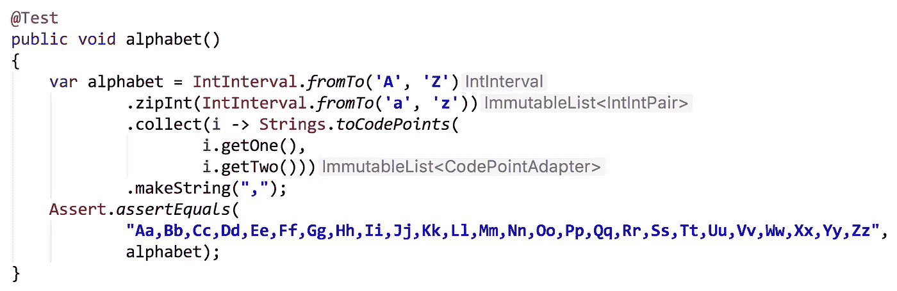
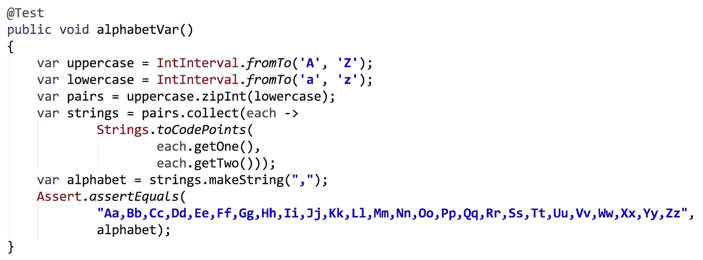
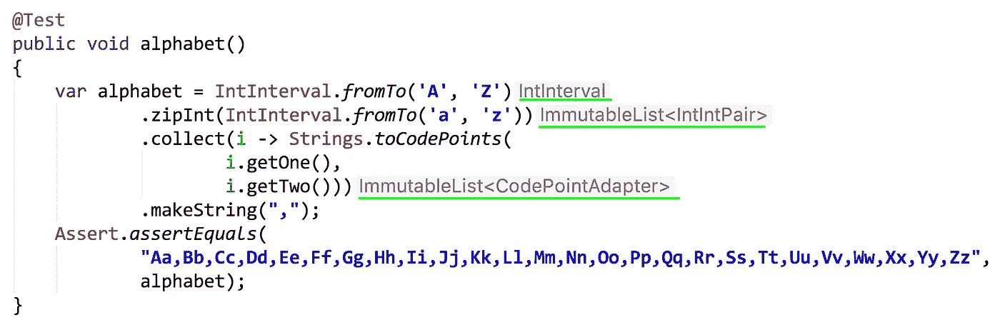
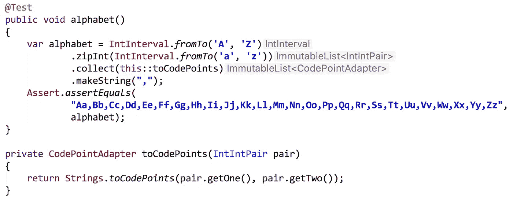
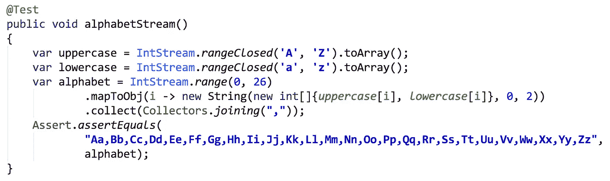

# 周六晚上可以写代码

> 原文：<https://medium.com/oracledevs/saturday-nights-alright-for-coding-461f86d91299?source=collection_archive---------1----------------------->

周六晚上用 Java 和 [Eclipse 集合](https://github.com/eclipse/eclipse-collections)进行编程的乐趣。



Combining upper and lowercase letters of the English alphabet

# 你曾经坐下来写代码吗？

有时候我只是喜欢坐在我的 IDE 前写一些 Java 代码。我并不总是知道我要写什么，如果我发现我没有创造任何有用的东西，我就会放弃工作。其他时候，我发现自己在创造一些东西，这些东西可能成为一种新的代码形式，或者可能成为一种新的有用的 API。

周六晚上，我开始编写代码，并决定尝试使用 Eclipse 集合中的原始 API 快速、流畅地创建一个包含大写和小写字母的字母表。

```
@Test
public void alphabet()
{
    var alphabet = IntInterval.*fromTo*(**'A'**, **'Z'**)
            .zipInt(IntInterval.*fromTo*(**'a'**, **'z'**))
            .collect(i -> Strings.*toCodePoints*(
                    i.getOne(),
                    i.getTwo()))
            .makeString(**","**);
    Assert.*assertEquals*(
            **"Aa,Bb,Cc,Dd,Ee,Ff,Gg,Hh,Ii,Jj,Kk,Ll,Mm,Nn,"** +
                    **"Oo,Pp,Qq,Rr,Ss,Tt,Uu,Vv,Ww,Xx,Yy,Zz"**,
            alphabet);
}
```

这不是我最初写代码的方式。我开始用 JDK 8 使用中间类型编码，然后切换到 JDK 11，这样我就可以使用`var`。代码的原始版本如下所示。

```
@Test
public void alphabet()
{
    IntInterval uppercase = IntInterval.*fromTo*(**'A'**, **'Z'**);
    IntInterval lowercase = IntInterval.*fromTo*(**'a'**, **'z'**);
    ImmutableList<IntIntPair> pairs = uppercase.zipInt(lowercase);
    ImmutableList<CodePointAdapter> strings =
            pairs.collect(pair ->
                    Strings.*toCodePoints*(
                            pair.getOne(),
                            pair.getTwo()));
    String alphabet = strings.makeString(**","**);
    Assert.*assertEquals*(
            **"Aa,Bb,Cc,Dd,Ee,Ff,Gg,Hh,Ii,Jj,Kk,Ll,Mm,Nn,"** +
                    **"Oo,Pp,Qq,Rr,Ss,Tt,Uu,Vv,Ww,Xx,Yy,Zz"**,
            alphabet);
}
```

用`var`替换所有类型使得代码看起来像这样。



The code is less dense, but I also have less information about the intermediate types

在 Java 中使用流畅的编码风格时，IntelliJ 通过在右边显示中间类型，使事情变得非常清楚和简单。请参见下面带绿色下划线的文本。在这里使用 JDK 11 号并没有太大的区别，因为`var`只比`String`短三个字符。



No need to type on the left, as the IDE displays intermediate types on the right

# 流畅的原语

拥有一个流畅的原语 API 使得用原语类型编码变得更加有趣和高效。在上面的例子中，我能够利用`IntInterval`来创建大写和小写字母。然后使用`zipInt`方法，我能够将两个`IntInterval`实例合并成一个`IntIntPair`的`ImmutableList`。然后我能够使用 collect 方法将`IntIntPair`实例转换成`CodePointAdapter`实例。`CodePointAdapter`实现了`CharSequence`接口，这个接口也是由 Java 中的`String`类实现的。最后，`makeString(“,”)`创建一个逗号分隔的`String`来组合所有的`CodePointAdapter`实例。

当我必须创建`IntIntPair`和`CodePointAdapter`实例时，这里需要的装箱数量是有限的。但是为了继续流畅的调用，我从来没有将任何`int`值打包到它们的`Integer`包装器中。

# 方法引用首选项

比起 Java 中的 lambdas，我更喜欢方法引用。方法引用通常比 lambdas 更简洁，并且通常是自文档化的。我不得不使用λ将`IntIntPair`转换成使用`Strings.toCodePoints`的`CodePointAdapter`。

我想知道是否值得在以`IntIntPair`作为参数的`Strings`类中添加一个新的重载`toCodePoints`方法。我还想知道是否值得添加一个同样采用`IntIterable`的方法版本。现在，`[toCodePoints](https://www.eclipse.org/collections/javadoc/9.2.0/org/eclipse/collections/impl/factory/Strings.html#toCodePoints-int...-)`接受一个`int`数组。

如果我使用方法引用而不是 lambda，代码看起来会是这样。我将 lambda 中包含的代码提取到一个名为`toCodePoints`的方法中。我发现这些天我经常这样做。



也许下次我在周六晚上写代码的时候，我会看看在 Eclipse 集合的`Strings`类中添加一个或者两个`toCodePoints`实用方法是否有意义。

# 周日晚上适合写博客和写代码

我想我会在周日晚上写完这个博客，但是后来我决定尝试使用 Java 和 Streams 编写一些额外的代码。我很好奇是否能想出一个类似的流畅的解决方案来使用原始 Java 流创建大写/小写字母。我无法在一次流畅的调用中保持所有内容，但这是我能想到的仅使用内置 Java 类型和 API 的最佳解决方案。



Not quite as fluent as I had to turn the IntStreams into int arrays

# 最后的想法

将来，我可能会将这些代码示例转化为 Eclipse 集合和 Java 流的新代码表。在此之前，如果您想自己尝试这些 API，这里是原始文本的最终版本。

## Eclipse 集合版本

```
@Test
public void alphabet()
{
    var alphabet = IntInterval.*fromTo*(**'A'**, **'Z'**)
            .zipInt(IntInterval.*fromTo*(**'a'**, **'z'**))
            .collect(this::toCodePoints)
            .makeString(**","**);
    Assert.*assertEquals*(
            **"Aa,Bb,Cc,Dd,Ee,Ff,Gg,Hh,Ii,Jj,Kk,Ll,Mm,Nn,"** +
                    **"Oo,Pp,Qq,Rr,Ss,Tt,Uu,Vv,Ww,Xx,Yy,Zz"**,
            alphabet);
}

private CodePointAdapter toCodePoints(IntIntPair pair)
{
    return Strings.*toCodePoints*(pair.getOne(), pair.getTwo());
}
```

## Java 流版本

```
@Test
public void alphabetStream()
{
    var upper = IntStream.*rangeClosed*(**'A'**, **'Z'**).toArray();
    var lower = IntStream.*rangeClosed*(**'a'**, **'z'**).toArray();
    var alphabet = IntStream.*range*(0, 26)
            .mapToObj(i ->
                    new String(new int[]{*upper*[i], *lower*[i]}, 0, 2))
            .collect(Collectors.*joining*(**","**));
    Assert.*assertEquals*(
            **"Aa,Bb,Cc,Dd,Ee,Ff,Gg,Hh,Ii,Jj,Kk,Ll,Mm,Nn,"** +
                    **"Oo,Pp,Qq,Rr,Ss,Tt,Uu,Vv,Ww,Xx,Yy,Zz"**,
            alphabet);
}
```

编码快乐！

[*月食收藏*](https://github.com/eclipse/eclipse-collections) *为* [*投稿*](https://github.com/eclipse/eclipse-collections/blob/master/CONTRIBUTING.md) *。如果你喜欢这个库，你可以在 GitHub 上让我们知道。*