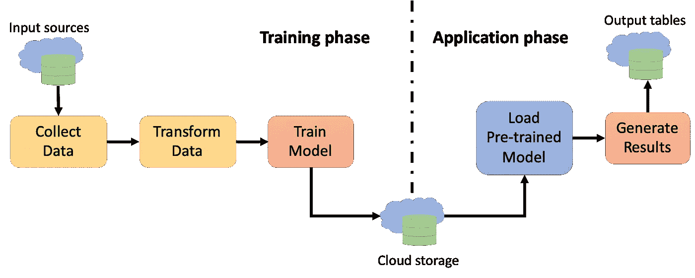

# 云平台中使用 PySpark 保存和检索 ML 模型

> 原文：<https://medium.com/walmartglobaltech/saving-and-retrieving-ml-models-using-pyspark-in-cloud-platform-d8b1db9e91b1?source=collection_archive---------2----------------------->



Machine learning pipeline for cloud applications

PySpark 已经成为许多数据科学和机器学习(ML)爱好者扩展数据科学和 ML 模型的首选平台，因为它具有卓越且易于使用的并行计算能力，以及与外部 Python 库轻松集成的能力。通常，需要在训练后保存一个模型，以便以后被其他应用程序检索和使用。在本文中，我将解释使用 PySpark 保存和检索 ML 模型的两种方法。第一种方法使用 Spark 的原生 [MLlib](https://spark.apache.org/mllib/%22%20/t%20%22_blank) 模块，而第二种方法基于一种定制方法，主要专注于使用最少的存储量存储大量的模型文件。这些方法在谷歌云平台的(GCP) [dataproc](https://cloud.google.com/sdk/gcloud/reference/dataproc) 集群和[存储](https://cloud.google.com/storage)中得到了应用和验证，所以下面分享的代码片段大多是针对 GCP 的。

这篇文章假设你已经熟悉使用 PySpark 和熊猫 UDF。如果没有，这里有一个快速简单的[总结](/walmartglobaltech/multi-time-series-forecasting-in-spark-cc42be812393)。此外，本文跳过了一些琐碎的步骤，如数据清理，因为这里的主要焦点是保存和加载 ML 模型。

# 获取数据

这里的数据集作为`parquet`文件存储在 Google Storage (GS)中。以下代码片段将数据集加载到 PySpark DataFrame 中。

```
sc = SparkContext()#........Read data from parquet files........#
dataDir = "gs://mlmodels/data/*"
dataTable = spark.read.parquet(dataDir)
dataTable.createOrReplaceTempView("inputTable")inputDf = spark.sql('select * from inputTable ')
```

# **方法 1 —使用 PySpark ML** lib 模块

MLlib 是 Spark 的原生 API，用于大规模构建 ML 模型。下面的代码片段首先将输入数据分成训练集和测试集，然后使用训练数据训练随机森林(RF)模型。(*注:参数值应根据输入数据选择。)*

```
from pyspark.mllib.tree import RandomForest, RandomForestModel

*# Split the data into training and test sets* (trainingData, testData) = inputDf.randomSplit([0.8, 0.2])

model = RandomForest.trainRegressor(trainingData, numTrees = 10, categoricalFeaturesInfo={}, featureSubsetStrategy="auto",
impurity='variance', maxDepth=5)
```

使用 save 方法保存训练好的模型非常简单:

```
model.save(sc,"gs://mlmodels/models/myRF")
```

生成的目录包含几个文件夹，其中有多个拼花文件。根据数据的大小和复杂程度，文件的数量可能会有所不同(在我的例子中，每个 RF 型号几乎有 350 个文件)。

为了检索先前保存的模型，我们需要使用 load 方法:

```
savedModel = RandomForestModel.load(sc,"gs://mlmodels/models/myRF")
```

# 方法 2 —使用 joblib 和 gsutil

> 为什么需要第二种方法？
> 
> *如您所见，使用 MLlib 简单明了。但是用这种方法保存和检索模型有点耗费时间和资源。对于大多数用例来说，这可能不是问题，但是如果您正在构建一个必须使用尽可能少的存储空间尽可能快地生成、保存和加载多个模型(在我的例子中，有 100 多个模型)的应用程序，那么使用 MLlib 可能不是最佳选择。这让我们想到了第二种方法。*

对于这种方法，我们根据它们的 ID 对数据集进行分组，然后应用熊猫 UDF 为每个组创建一个 RF 模型。对于每个组，首先将其数据框架分为训练集和测试集(80:20 的比例)。然后用训练数据集实例化和训练 RF 模型。

```
from sklearn.model_selection import train_test_split#........Define schema for output dataframe here........#
outSchema = StructType([...])#........Define pandas UDF........#
[@pandas_udf](http://twitter.com/pandas_udf)(outSchema, PandasUDFType.GROUPED_MAP)
def generate model(df):
   label = np.array(df['label'])
   features = df.drop('label', axis = 1) # splitting training and testing data
   train_features, test_features, train_labels, test_labels = train_test_split(features, label, test_size = 0.2, random_state = 42)

   # Instantiate model with decision trees
   model = RandomForestRegressor(bootstrap = True, max_depth = 5, max_features = 'auto', min_samples_leaf = 2, min_samples_split = 8, n_estimators = 10, oob_score = True, random_state = 42)

   # Train the model on training data
   model.fit(train_features, train_labels) ...outputDf = inputDf.groupby('id').apply(generate_model)
```

> 保存模型

现在我们有了自己的模型，是时候拯救它了。让我们将问题分成两部分:1)我们需要找到一种方法将模型对象保存到文件中，2)将相应的文件上传到 GS bucket 中。

对于第一部分，我们使用一个名为 *joblib 的包。*`joblib.dump()`方法允许我们将一个对象压缩并存储到一个文件中。它有三个参数——要转储的对象、应该转储的目录位置以及转储时使用的压缩算法。我根据 *joblib* [docs](https://joblib.readthedocs.io/en/latest/generated/joblib.dump.html) 使用`compress = 3`，这个算法是大小和速度之间的一个很好的折衷。现在，让我们将模型保存在一个本地目录中，并根据相应的组 ID 对其进行命名。

```
import joblibfileName = str(id) + "_rf.joblib"
joblib.dump(model, "./" + fileName, compress = 3)
```

这将创建一个单独的`.joblib`文件，而不是方法 1 中的多个拼花文件。大小取决于定型数据的数量，但仍然比 MLlib 为同一模型生成的文件的总大小小得多。此外，这里的执行时间也快得多。

一旦我们有了模型文件，就该上传它了。令人惊讶的是，在我项目的大部分时间里，这是我一直坚持的部分！如果这是一个 Python 项目，而不是 PySpark，解决方案将会很简单。我们将使用 GCP 的*存储库*并将模型文件从本地目录上传到 GS bucket，如下所示:

```
from google.cloud import storagesrcPath = "./" + fileName
bucketName = "mlmodels/"storage_client = storage.Client()
bucket = storage_client.bucket(bucketName)
blob = bucket.blob('models')with open(srcPath, "w") as f:
    blob.upload_from_file(f)
```

但对 PySpark 来说，这个过程相当复杂。第一个问题是 PySpark 对 UDF 熊猫的处理方式。为了实现可扩展性，Spark 将数据集组分发到工作节点。因此，模型文件是在工作者的本地存储中创建的。但*存储*库只有在从主节点执行时才起作用(不确定为什么，但在我的情况下就是这样！).为了从工作者节点上传文件，我们需要一种不同的方法。当我通过终端登录到各个节点时，我发现[*gsutil*](https://cloud.google.com/storage/docs/gsutil)*命令(`cp`或`rsync`)都是功能性的。要在我们的应用程序中使用 *gsutil* 命令，我们需要使用子流程包中的`Popen`方法。在 PySpark 中，应用程序文件的默认本地目录是`/hadoop/spark/tmp/` *。*我们的代码是这样的:*

```
*from subprocess import Popen, PIPEsrcPath = "/hadoop/spark/tmp/" + fileName
destPath = "gs://mlmodels/models/"p = Popen("gsutil -m rsync -r "+srcPath+" "+destPath, shell=True, stdout=PIPE, stderr=PIPE)*
```

*但使用这个之后，我发现只有保存在主节点中的模型被上传了！相同的命令在通过终端发送时有效(ssh-ing 到工作节点)，但在应用程序中不起作用！我真的不知道为什么！经过多日对无数在线资源的搜索，我终于在这里找到了解决方案[，感谢霍天华！以下是他的解释:](https://stackoverflow.com/questions/45973386/dataproc-pyspark-workers-have-no-permission-to-use-gsutil/45991873#45991873)*

> *对于在 shade 容器中运行的东西，尽管作为用户`yarn`运行，如果您只运行`sudo su yarn`，您将在 Dataproc 节点上看到`~`解析为`/var/lib/hadoop-yarn`，shade 实际上将`yarn.nodemanager.user-home-dir`传播为容器的 homedir，这默认为`/home/`。因此，即使可以`sudo -u yarn gsutil ...`，它的行为方式也不同于 same 容器中的 gsutil，自然，只有`root`能够在基本`/home/`目录中创建目录。*

*解决方案相当简单——我们需要在 *gsutil* 命令之前添加 HOME =/var/lib/Hadoop-three。*注:丹尼斯提出了其他解决方案，我没有尝试；更多细节请阅读他的答案。)**

```
*p = Popen("HOME=/var/lib/hadoop-yarn gsutil -m rsync -r "+srcPath+" "+destPath, shell=True, stdout=PIPE, stderr=PIPE)*
```

**万岁！*魅力十足！所有工作节点的所有模型文件都已上载到指定的 GS 存储桶。*

*以下是我在解决这个问题时发现的其他一些技巧:*

*I)最初使用`/hadoop/spark/tmp/`作为保存模型文件的目录可能有风险，因为这是 Spark 的默认临时目录，其他一些进程可能会覆盖你的文件。相反，请使用其他目录。但是 worker 节点中的大多数目录都是写保护的，所以您可能需要花时间来找到合适的目录。在我的情况下，我发现`/usr/local/man/`是一个。*

*ii)由于 Spark 的*【懒惰】*和并行计算，很难预测模型文件将在何时何地被创建。如果您在转储后立即上传模型文件，您可能会丢失一些文件。原因是在执行上传代码时，相应的文件尚未创建。因此，最好在一个 UDF 中生成并转储模型文件，然后在另一个中上传模型文件。这将确保所有文件在上传前完全转储。最后的代码片段是:*

```
*#........Define schema for output dataframe here........#
outSchema = StructType([...])
uploadSchema = StructType([...])#........UDF for generating and dumping models........#
[@pandas_udf](http://twitter.com/pandas_udf)(outSchema, PandasUDFType.GROUPED_MAP)
def generate model(df):
    label = np.array(df['label'])
    features = df.drop('label', axis = 1) # splitting training and testing data
    train_features, test_features, train_labels, test_labels = train_test_split(features, label, test_size = 0.2, random_state = 42)

    # Instantiate model with decision trees
    model = RandomForestRegressor(bootstrap = True, max_depth = 5, max_features = 'auto', min_samples_leaf = 2, min_samples_split = 8, n_estimators = 10, oob_score = True, random_state = 42)

    # Train the model on training data
    model.fit(train_features, train_labels) fileName = str(id) + "_rf.joblib"
    joblib.dump(model, "/usr/local/man/" + fileName, compress = 3)
    ...#........UDF for uploading models to gcs bucket........#
[@pandas_udf](http://twitter.com/pandas_udf)(uploadSchema, PandasUDFType.GROUPED_MAP)
def upload_model(df):
    destPath = gs://mlmodels/models/
    srcPath = "/usr/local/man/*"
    p = Popen("HOME=/var/lib/hadoop-yarn gsutil -m rsync -r "+srcPath+" "+destPath, shell=True, stdout=PIPE, stderr=PIPE)
    return pd.DataFrame({"comment":"Success"},index=[0])outputDf = inputDf.groupby('id').apply(generate_model)
uploadDf = outputDf.groupby('id').apply(upload_model)*
```

*请注意，熊猫 UDF 总是需要返回一个数据帧。在第二个 UDF 中，尽管我们没有要返回的内容，但是我们返回了一个伪数据帧。此外，outputDf 应该有足够多的组，以便在所有工作节点中执行第二个 UDF。*

*iii)同样，由于 Spark 的“*lazy”*和并行计算，第二个 UDF 可能在所有文件完成上传之前返回(即，上传已启动但尚未完成)。所以事后最好加个延迟，以防万一。*

> *检索模型*

*为了使用上述方法检索先前保存到 GS 的模型文件，我们需要将文件从 GS 下载到集群节点(假设我们将使用所有的模型文件)。第一步是获取 GS bucket 中的文件列表，然后我们可以将它们逐个添加到 Spark 上下文中。这会将所有文件下载到主节点。代码如下所示:*

```
*from subprocess import Popen, PIPEsrcPath = "gs://mlmodels/models/"
p = Popen("gsutil ls " + srcPath, shell=True, stdout=PIPE, stderr=PIPE)
saved_files = str(p.stdout.read())[2:-1].split("\\n")[1:-1]for filePath in saved_files:
   sc.addFile(filePath)*
```

*一旦所有文件下载完毕，我们可以使用`joblib.load()`来加载模型。我们需要提供相应模型文件的本地路径，可以通过`SparkFiles.get()`方法检索。由于所有文件都存储在主节点中，这种方法也可以用于熊猫 UDF，因为所有工作节点都可以访问主节点的文件系统。*

```
*from pyspark import SparkFiles model = joblib.load(SparkFiles.get(fileName))*
```

# *结论*

*第二种方法的代码可能比使用 MLlib 更复杂，但在生成大量模型时，它在执行时间和所需存储方面更有效。不过需要注意的是，在我的例子中，每个组的数据集都不是很大，所以第二种方法可能会导致非常大的数据集出现内存不足的异常。*

*我花了很长时间才完成，因为有很多障碍要克服，但我喜欢这段旅程。我真诚地希望这篇文章能帮助人们更快地找到类似问题的解决方案。如果您有任何建议或问题，请发表评论。*

# *资源*

1.  *https://spark.apache.org/mllib/*
2.  *谷歌云 data proc—【https://cloud.google.com/sdk/gcloud/reference/dataproc *
3.  *谷歌云存储—【https://cloud.google.com/storage *
4.  *Spark 中的多时间序列预测—[https://medium . com/walmartglobaltech/multi-Time-Series-Forecasting-in-Spark-cc 42 be 812393](/walmartglobaltech/multi-time-series-forecasting-in-spark-cc42be812393)*
5.  **gsutil* 工具—[https://cloud.google.com/storage/docs/gsutil](https://cloud.google.com/storage/docs/gsutil)*