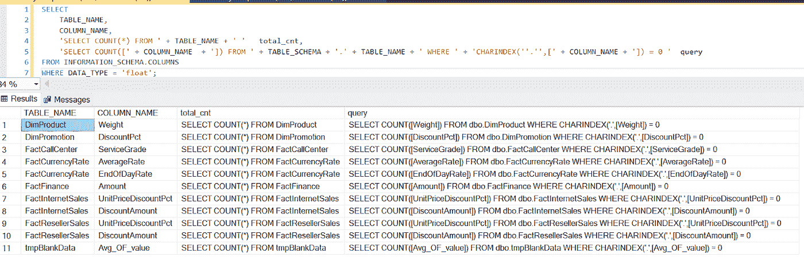
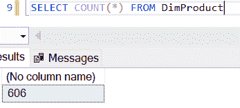
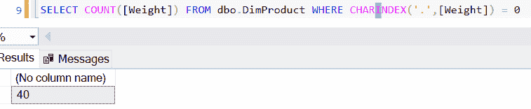
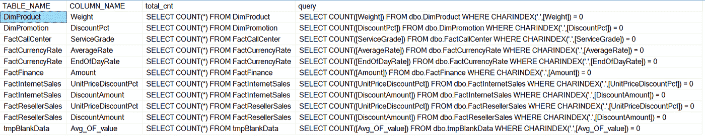
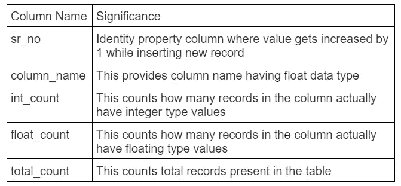
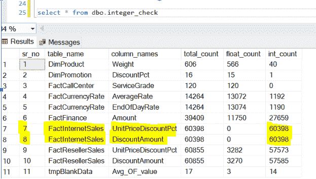

# 节省空间和提高速度:数字在数据库中的存储

> 原文：<https://medium.com/globant/saving-space-and-gaining-speed-numbers-storage-in-databases-82da74b1a05d?source=collection_archive---------0----------------------->

如何发现数据库表中的改进机会


Photo by [Sawyer Bengtson](https://unsplash.com/@sawyerbengtson?utm_source=medium&utm_medium=referral) on [Unsplash](https://unsplash.com?utm_source=medium&utm_medium=referral)

按照标准惯例，使用 float 数据类型列来存储整数值是不好的；它需要更多的空间并影响查询性能。通过分析存储在 float 列中的值，我们可能会发现我们是否真的需要 float 数据类型，然后我们将能够做出正确的决定。但是，如果我们想通过手动操作知道哪些 float 类型的列有整数值，这将非常耗时，而且出错的几率很高。

在本文中，我们将看到如何找到具有整数值的数据库表的浮点类型列的列表，以实现可能的列类型优化。撰写本文是考虑到您在 Azure SQL、临时表和动态查询编写方面具有中级专业知识。

# 问题陈述

一般来说，我们根据预期的数据来定义列数据类型，如果其他类型的值进入该列，可能会影响性能并产生错误。在我们的例子中，不建议使用浮点字段来存储整数值。我们可以手动检测这样的列，但是这需要很多时间，并且错误发生率会更高。对于大量的表和列，不建议继续手动操作。我们希望:

1.查找哪些列是数字

2.查找可以优化的列

# 查找哪些列是数字

开始时，我们需要找出数据库中数据类型为 float 的表列的列表。我们可以从 [INFORMATION_SCHEMA 中获得这些细节。在 DATA _TYPE 列上应用值为“float”的筛选器后的列](https://www.mssqltips.com/sqlservertutorial/183/information-schema-columns/)表。

```
SELECT TABLE_NAME
 ,COLUMN_NAME
 ,'SELECT COUNT(*) FROM ' + TABLE_NAME total_cnt
 ,'SELECT COUNT([' + COLUMN_NAME + ']) FROM ' + TABLE_SCHEMA + '.' + TABLE_NAME + ' 
WHERE ' + 'CHARINDEX(''.'',[' + COLUMN_NAME + ']) = 0 ' total_int
FROM INFORMATION_SCHEMA.COLUMNS
WHERE DATA_TYPE = 'float';
```

在上面的 SQL 语句中，我们获得了表名、列名和两个 SQL 动态查询，以获得表的总记录数和总整数数。请参考下面的 SQL 语句结果截图。



SQL Statement Output

我们生成了两个动态查询来获得关于列的结果。以下查询计算每个表中有多少条记录。

```
SELECT COUNT(*) FROM <table_ name>
```



Total Record Count from Table

第二个查询让我们知道这些记录中有多少是整数值。

```
SELECT COUNT([<column_name>]) FROM <table_ name> WHERE CHARINDEX('.',[<column_name>]) = 0
```



Total Integer Records present in the Table

我们可以通过检查它在某处是否有一个(十进制)句点来确定该值是 float 还是 integer 如果不是，就是一个整数值。我们使用 [CHARINDEX](https://docs.microsoft.com/en-us/sql/t-sql/functions/charindex-transact-sql) 函数检查是否有一个周期:如果不存在，它返回零。

# 查找可以优化的列

在我们在“从整个数据库中查找列”一节中定义的查询上创建一个游标将提供如下输出。现在，我们将获得 float 数据类型的 table_name、Column_name 的详细信息，一个查询将为我们提供具有 float 数据类型列的表中的记录总数，另一个查询将为 Float 数据类型列提供整数记录数。



Cursor Output

我们将一次浏览光标的一行。我们创建了一个变量计数器来记录 declare 部分中正在处理的记录的数量。我们需要一个[临时表](https://www.sqlservertutorial.net/sql-server-basics/sql-server-temporary-tables/)来存储表的总记录数，其中包含带有[标识](http://identity)属性的列 sr_no、int_count、column_name、float_count 和 total_count。以下语句创建表。

```
CREATE TABLE [dbo].[integer_check] (
 [sr_no] [int] IDENTITY(1, 1) NOT NULL
 ,[int_count] [int] NULL
 ,[table_name] [nvarchar](100) NULL
 ,[column_names] [nvarchar](100) NULL
 ,[total_count] [int] NULL
 ,[float_count] [int] NULL
 );
```

为了更好地理解，见下文。



Result Saving Table’s Details

现在让我们开始工作部分吧。如前所述，我们已经用 float 数据类型的过滤记录创建了游标。我们将循环处理它，直到记录的[获取状态](https://www.sqlshack.com/an-overview-of-the-sql-cursor-fetch_status-functions/)为 0。对于循环的每个记录，我们将把计数器变量值加 1。下面是在循环内部执行的实际步骤。

```
WHILE @@Fetch_Status = 0
BEGIN
 SET [@counter](http://twitter.com/counter) = [@counter](http://twitter.com/counter) + 1; – Step 1TRUNCATE TABLE #tmp_table; – Step 2INSERT dbo.integer_check (int_count)
 EXECUTE ([@v_query](http://twitter.com/v_query));        – Step 3INSERT #tmp_table
 EXECUTE ([@total_cnt](http://twitter.com/total_cnt)); – Step 4UPDATE dbo.integer_check
 SET [column_names] = [@COLUMN_NAME](http://twitter.com/COLUMN_NAME)
  ,[table_name] = [@TABLE_NAME](http://twitter.com/TABLE_NAME)
  ,[total_count] = (
   SELECT *
   FROM #tmp_table
   )
 WHERE sr_no = [@counter](http://twitter.com/counter); – Step 5
 UPDATE dbo.integer_check
SET float_count = (CAST(total_count AS INT) - CAST(int_count AS INT)); – Step 6
```

上述方框中提到步骤依次解释如下

1.  在我们在[声明](https://www.sqlshack.com/sql-variables-basics-and-usage/#:~:text=SQL%20Variable%20declaration&text=The%20DECLARE%20statement%20is%20used,data%20type%20of%20the%20variable.)中定义的循环中，我们每次都将计数器变量值增加 1。
2.  我们将首先截断临时表。
3.  针对整数计数的过滤 SQL 查询将使用[执行命令](https://www.sqlservertutorial.net/sql-server-stored-procedures/sql-server-dynamic-sql/)从编写的动态查询中动态提供结果。由于 identity 属性，该结果将存储在 Interger_check 结果表的 int_count 列中，而该顺序值将存储在 sr_no 列中。
4.  我们将把表的记录总数的过滤动态查询提供的结果放入一个临时表中。
5.  我们将更新 integer_check 结果表的列 table_name、column_name from cursor 的 table_name 和 column_name 以及 total_count 列，方法是从临时表中获取 total count 的值，同时将 sr_no 与计数器进行匹配，例如，如果我们正在处理第 2 条记录，则 sr_no 值和计数器值将为 2，这将确保更新正确的记录。
6.  我们已经使用游标和循环处理了所有过滤的记录。我们在 integer_check 表中有值的总计数和整数计数。我们将从总计数中减去整数计数，得到浮点计数值，如下所示

这里要记住的一点是，浮点计数也会考虑空值。如果有一个数据类型为 float 的列全部为空，那么 float 计数将等于总计数。最终输出如下所示。



Final Output Of code

从输出中，我们看到第 7 行和第 8 行都是整数值，我们可能会得出结论，我们错误地定义了数据类型。在下结论之前，考虑一下我们为什么定义 float 数据类型:从列名本身，我们可以说它是一个折扣百分比，它可以是一个整数，但也可能不是！对折扣金额的推理表明它可能具有非整数值；这将取决于折扣的计算。简而言之，在考虑只根据结果改变数据类型时要注意，但也要考虑使用 float 数据类型的目的或未来的场景。

# 结论

我们知道在 float 列中保存整数值不是一个好的做法，因为这会影响查询的性能。使用提供的解决方案，我们可以在几分钟内准确无误地获得这些详细信息。额外的好处是，我们可以使用这个结果来检查我们是否需要该列的数据类型；如果没有，我们可以在分析后更改它。

请参考下面的链接，这将有助于您更好地编写 SQL 查询。

[https://www.techonthenet.com/sql_server/index.php](https://www.techonthenet.com/sql_server/index.php)

https://www.w3schools.com/sql/

# **代号**

请看一下代码块供你参考。您也可以根据自己的需要将这段代码转换成一个过程。

```
DECLARE [@v_query](http://twitter.com/v_query) NVARCHAR(1000)
 ,[@TABLE_NAME](http://twitter.com/TABLE_NAME) NVARCHAR(1000)
 ,[@COLUMN_NAME](http://twitter.com/COLUMN_NAME) NVARCHAR(1000)
 ,[@total_cnt](http://twitter.com/total_cnt) NVARCHAR(100)
 ,[@count](http://twitter.com/count) INT
 ,[@counter](http://twitter.com/counter) INT = 0;
IF EXISTS (
  SELECT *
  FROM sys.objects
  WHERE object_id = OBJECT_ID(N'[dbo].[integer_check]')
  )
BEGIN
 DROP TABLE [integer_check];
END;
CREATE TABLE [dbo].[integer_check] (
 [sr_no] [int] IDENTITY(1, 1) NOT NULL
 ,[int_count] [int] NULL
 ,[table_name] [nvarchar](100) NULL
 ,[column_names] [nvarchar](100) NULL
 ,[total_count] [int] NULL
 ,[float_count] [int] NULL
 );
DROP TABLE IF EXISTS #tmp_table;SELECT 1 AS val INTO #tmp_table;DECLARE cur_new CURSOR
FOR
SELECT TABLE_NAME
 ,COLUMN_NAME
 ,'SELECT COUNT(*) FROM ' + TABLE_NAME total_cnt
 ,'SELECT COUNT([' + COLUMN_NAME + ']) FROM ' + TABLE_SCHEMA + '.' + TABLE_NAME + ' 
WHERE ' + 'CHARINDEX(''.'',[' + COLUMN_NAME + ']) = 0 ' total_int
FROM INFORMATION_SCHEMA.COLUMNS
WHERE DATA_TYPE = 'float';OPEN cur_newFETCH NEXT FROM cur_new INTO [@TABLE_NAME](http://twitter.com/TABLE_NAME),[@COLUMN_NAME](http://twitter.com/COLUMN_NAME),[@total_cnt](http://twitter.com/total_cnt),[@v_query](http://twitter.com/v_query)WHILE @@Fetch_Status = 0
BEGIN
 SET [@counter](http://twitter.com/counter) = [@counter](http://twitter.com/counter) + 1;TRUNCATE TABLE #tmp_table;INSERT dbo.integer_check (int_count)
 EXECUTE ([@v_query](http://twitter.com/v_query));INSERT #tmp_table
 EXECUTE ([@total_cnt](http://twitter.com/total_cnt));UPDATE dbo.integer_check
 SET [column_names] = [@COLUMN_NAME](http://twitter.com/COLUMN_NAME)
  ,[table_name] = [@TABLE_NAME](http://twitter.com/TABLE_NAME)
  ,[total_count] = (
   SELECT *
   FROM #tmp_table
   )
 WHERE sr_no = [@counter](http://twitter.com/counter);FETCH NEXT FROM cur_new INTO [@TABLE_NAME](http://twitter.com/TABLE_NAME),[@COLUMN_NAME](http://twitter.com/COLUMN_NAME),[@total_cnt](http://twitter.com/total_cnt),[@v_query](http://twitter.com/v_query);
END;
CLOSE cur_new;
DEALLOCATE cur_new;UPDATE dbo.integer_check
SET float_count = (CAST(total_count AS INT) - CAST(int_count AS INT));
```