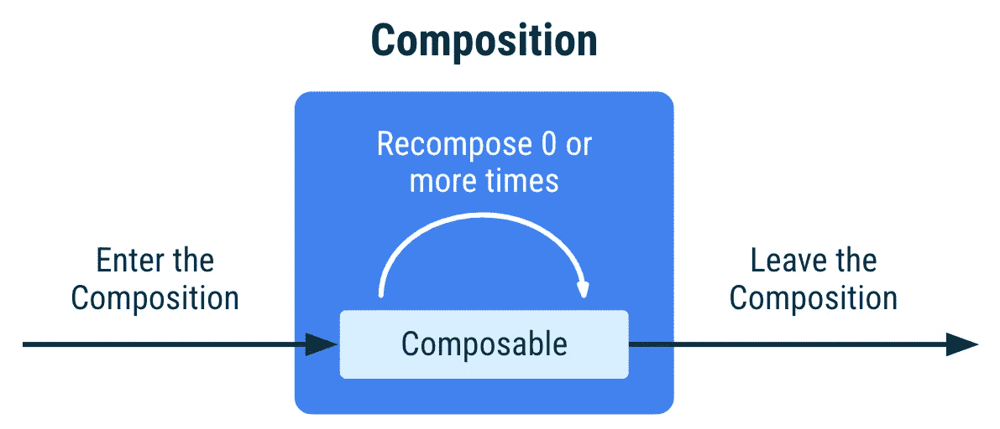
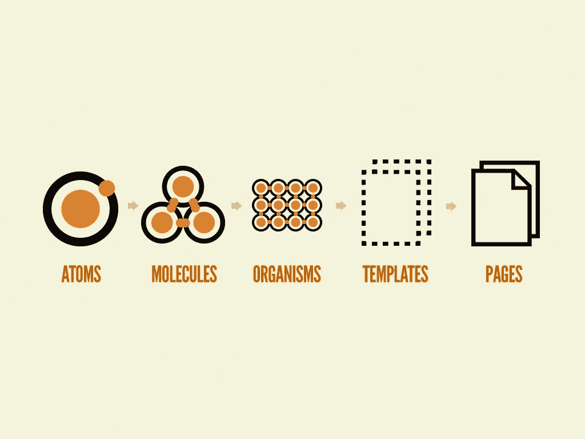
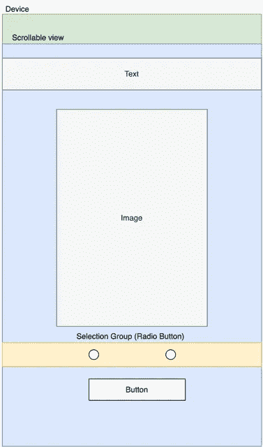
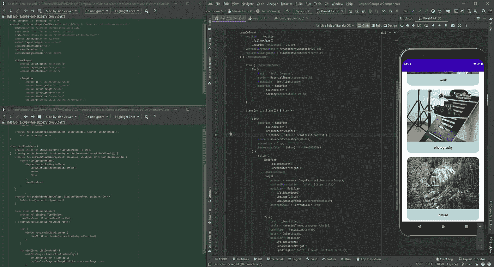
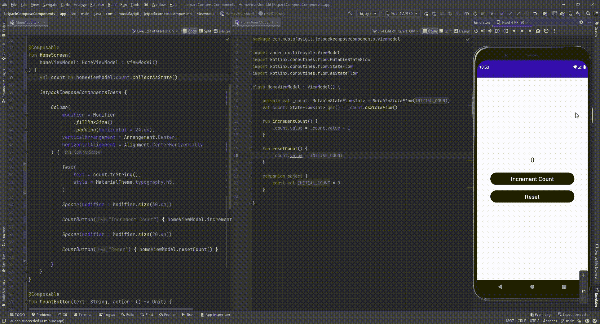

# 打招呼👋Jetpack 编写并与 XML 进行比较

> 原文：<https://blog.kotlin-academy.com/say-hello-to-jetpack-compose-and-compare-with-xml-6bc6053aec13?source=collection_archive---------0----------------------->


# 介绍

大家好👋我会试着解释一下 ***Jetpack Compose 基础知识*** 和 ***我为什么要用 Jetpack Compose。Jetpack Compose 很重要，因为它是在 Android 中构建现代 UI 的一种新方式。*让我们深入研究一下没有 XML 的 Android 中的 UI 开发。**

> 在我看来，Jetpack Compose 是 Android UI 开发的未来，我们必须尽快采用。

# 什么是 Jetpack Compose？

> Jetpack Compose 是 Android 用于构建原生 UI 的现代工具包。它简化并加速了 Android - Google 上的 UI 开发

Jetpack Compose 是一个现代的工具包，它允许我们以声明的方式编写更少的代码来构建我们的屏幕。Android UI 开发现在更加强大，也更加去耦合。

在 Jetpack Compose 之前，我们使用 XML 布局来构建原生 UI。当我们用 XML 构建屏幕时，我们有一个非常依赖的结构。此外，片段对于 UI 来说是非常沉重的组件。Jetpack Compose 允许我们用声明式 UI 方法和更少的代码构建相同的 UI。

# 为什么我应该使用 Jetpack Compose？

在我看来，从 XML 和科特林·❤️来看，这要容易得多

如果我们从技术上看:

*   声明式用户界面比命令式用户界面更简洁、易读、高效。
*   与 XML 相比，Compose 允许您用更少的代码做更多的事情。
*   作曲很直观。这意味着您只需要告诉 Compose 您想要向用户显示什么。
*   Compose 与您现有的所有代码兼容:您可以从视图调用 Compose 代码，也可以从 Compose 调用视图。还集成了许多 Jetpack 库。
*   撰写提高您的建设时间和 APK 的大小。

# XML 设计与 Jetpack 合成

## 合成—重组—状态管理

每个组件都有一个**初始组合**。只有当我们第一次在屏幕上看到一个视图时，初始合成才会运行。

组件可以保持一个**状态**并在状态改变时重新运行。这叫做**重组**。



## 原子设计

在 Compose 中，组件继承是用函数实现的，因为组件就是函数。一个可组合函数只能在另一个可组合函数中调用。当我们编写更小的组件时，我们得到了更灵活的组件结构。



# XML 与 Jetpack 组合代码示例

## 1.基本用户界面组件

现在让我们使用 Xml 和 Jetpack Compose 构建同一个视图，看看代码方面的区别。
以下是目标视图结构:



example-view-structure

**使用 Xml 构建**

**使用 Jetpack 构建**

## 2.列表项目

**用 Xml 构建**

我们需要用 Xml 在屏幕上显示列表的几个文件/类:

1.  adapter_item_list.xml
2.  ListItemAdapter.kt
3.  ListItemViewHolder(内部类)
4.  填充活动/片段

**使用 Jetpack 构建**

我们只需要 ***惰性栏*** 就可以在屏幕上显示列表项。不需要适配器类或项目设计 xml 文件。我们可以在**项目/项目** **范围内描述项目设计。**



# 状态管理

> "应用程序中的状态是任何可以随时间变化的值."-谷歌

Compose 是声明性的，所以更新它的唯一方法是用不同的参数调用。

> ***初始合成:*** *第一次运行 composables 创建合成。*
> 
> ***重组:*** *当数据(状态)发生变化时，重新运行组件可以更新合成。*

用**存储一个数据记住:**

```
val data by remember { mutableStateOf(INITIAL_VALUE) } 
```



如果您想在配置改变时保留数据，您应该使用**remembers saveable:**存储数据

```
var tite by rememberSaveable { mutableStateOf("") }
Text(
    text = title,
    modifier = Modifier.padding(bottom = 10.dp),
    style = MaterialTheme.typography.h5
)
```

# 航行

一切都是可组合的，甚至导航。我们需要导航主机和屏幕。每个屏幕都应该有一条**路线**。

> ***Route:*** *定义你的可组合路径的字符串。每个目的地应该有一个独特的路线。*
> 
> ***navgraphbuilder . composable:****一个使用导航图绑定唯一路线的函数。*

下面是一个用于创建 NavHost 的可组合函数:

*   **MainActivity.kt:**

```
@Composable
fun AppNavigation() {
    val navController = rememberNavController()
    NavHost(
        navController = navController,
        startDestination = NavScreen.getStartDestination()
    ) {
        composable(NavScreen.Home.route) { HomeScreen(navController) }
        composable(NavScreen.Explore.route) { ExploreScreen(navController) }
    }}sealed class NavScreen(val route: String) {
    object Home : NavScreen("home")
    object Explore : NavScreen("explore") companion object {
        fun getStartDestination() = Home.route
    }
}
```

*   **HomeScreen.kt:**

```
@Composable
fun HomeScreen(
    navController: NavController = rememberNavController(),
    homeViewModel: HomeViewModel = viewModel()
) {
    Column(
        modifier = Modifier.fillMaxSize(),
        horizontalAlignment = Alignment.CenterHorizontally,
        verticalArrangement = Arrangement.Center
    ) {
        Text(text = homeViewModel.getTitle()) Button(
            onClick = { navController.navigate(NavScreen.Explore.route) },
        ) {
            Text(text = "Go to Explore screen")
        }
    }
}
```

*   **ExploreScreen.kt**

```
@Composable
fun ExploreScreen(
    navController: NavController = rememberNavController(),
    exploreViewModel: ExploreViewModel = viewModel()
) {
    Column(
        modifier = Modifier.fillMaxSize(),
        horizontalAlignment = Alignment.CenterHorizontally,
        verticalArrangement = Arrangement.Center
    ) {
        Text(text = exploreViewModel.getTitle()) Button(
            onClick = { navController.navigateUp() },
        ) {
            Text(text = "back to previous screen")
        }
    }
}
```

# 结论

我们结束了。在本文中，我想解释 Jetpack Compose 的内容以及 Compose 和基于 XML 的设计之间的区别。

对我来说，Jetpack Compose 是 Android UI 开发的一次革命。更少的代码和更容易理解的代码、声明式 UI 方法、管理状态等等。此外，它可以直接与 jetpack 库一起工作。

我希望这篇文章是有帮助的。如果是这样，你可以离开鼓掌👏 👏如果你觉得不对劲，请给我留言。

[**Twitter**](https://twitter.com/mustafayigitt_)**&**[**Linkedin**](https://www.linkedin.com/in/mustafayigitt/)**&**[**Github**](https://github.com/mustafayigitt)

# 资源

*   [**Github**](https://github.com/mustafayigitt/JetpackComposeComponents)
*   **其他来源**

[https://developer.android.com/jetpack/compose/why-adopt](https://developer.android.com/jetpack/compose/why-adopt)

https://developer.android.com/jetpack/compose/ergonomics

[喷气背包作曲——前后](https://medium.com/androiddevelopers/jetpack-compose-before-and-after-8b43ba0b7d4f)

[https://medium . com/androiddevelopers/jetpack-compose-before-and-after-8b 43 ba 0 b 7d 4 f](https://medium.com/androiddevelopers/jetpack-compose-before-and-after-8b43ba0b7d4f)

[https://developer.android.com/jetpack/compose/mental-model](https://developer.android.com/jetpack/compose/mental-model)

**子线程**

*   [合成/重组](https://developer.android.com/jetpack/compose/state#state-and-composition)
*   [状态管理](https://developer.android.com/jetpack/compose/state)
*   [记住/记住可保存/不可修改](https://developer.android.com/jetpack/compose/state#state-in-composables)
*   [动画](https://developer.android.com/jetpack/compose/animation)
*   [副作用](https://developer.android.com/jetpack/compose/side-effects)
*   [声明式用户界面](https://developer.android.com/jetpack/compose/mental-model#paradigm)