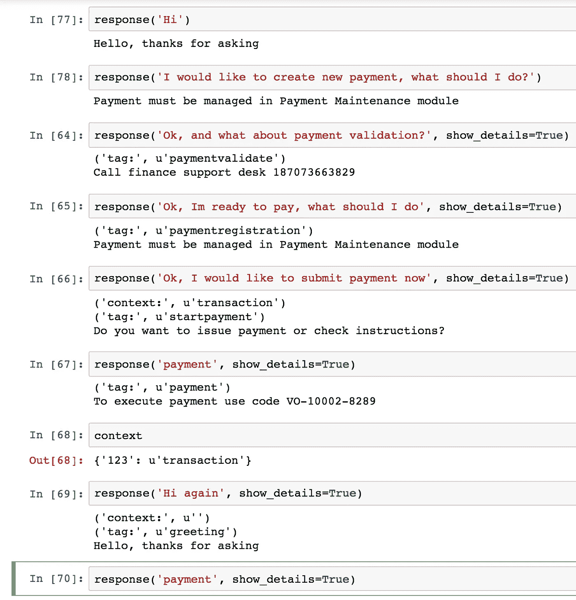
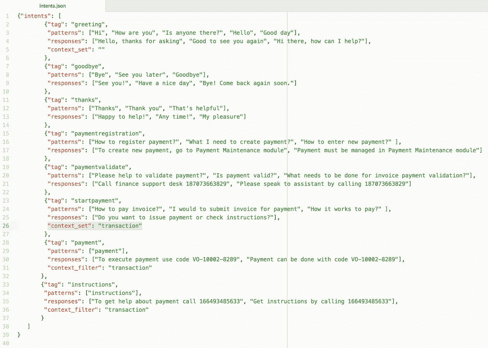
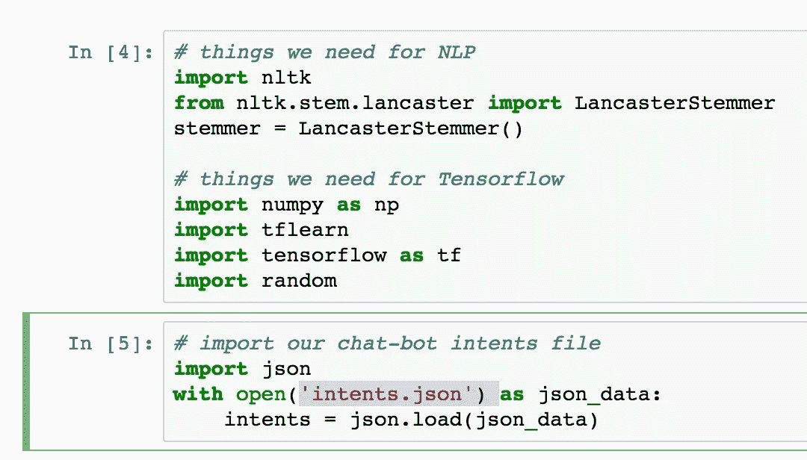
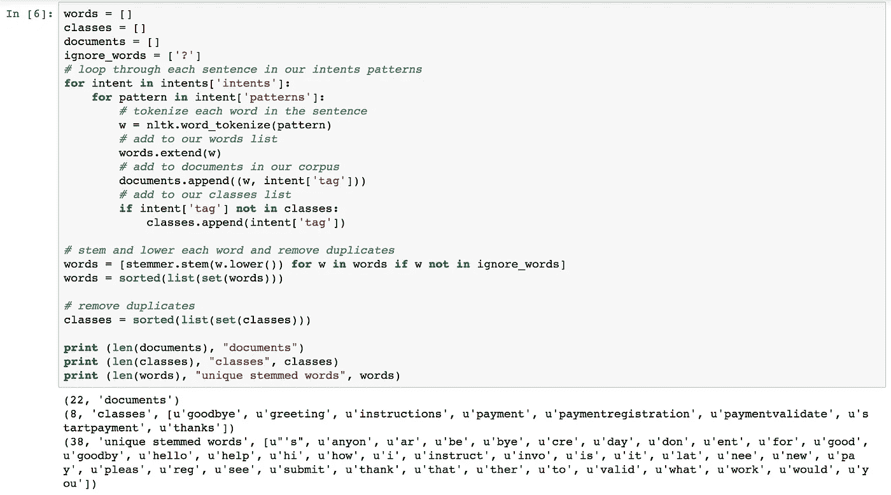
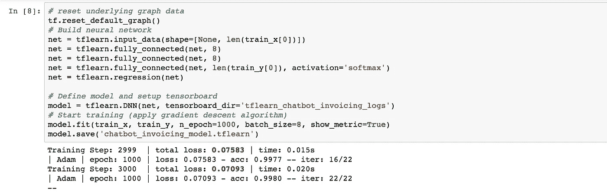
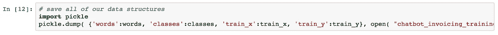
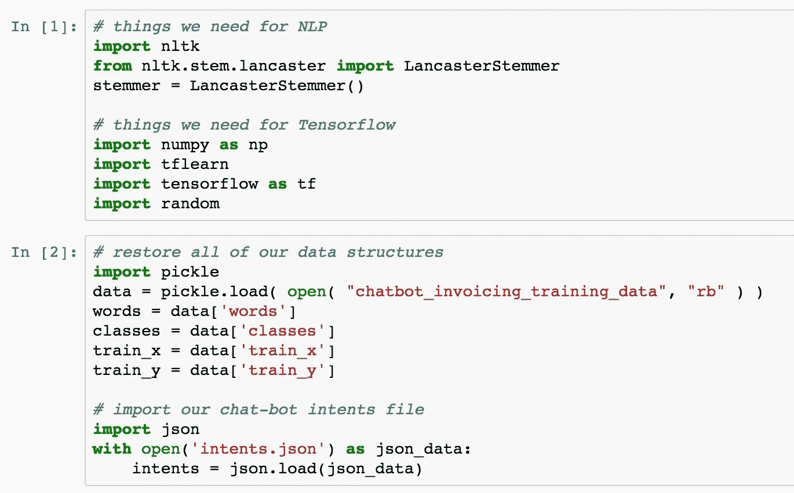
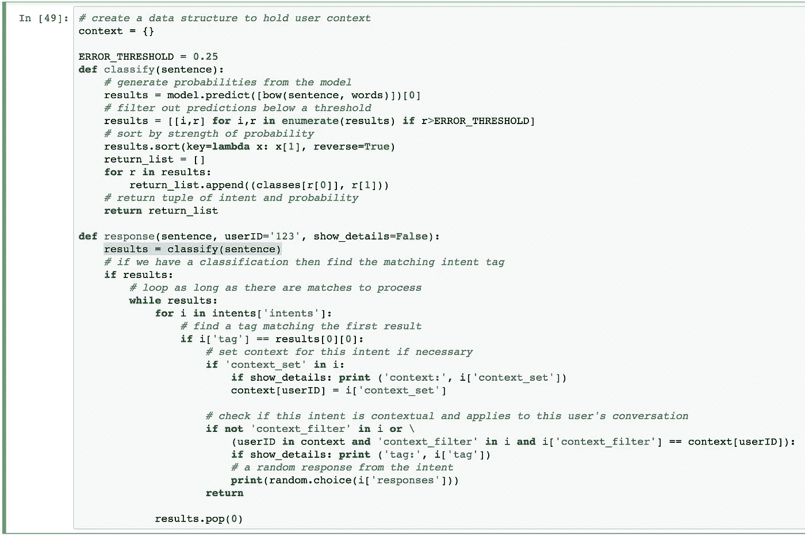

# 向具有 TensorFlow 深度神经网络学习的红色武士情境聊天机器人问好

> 原文：<https://medium.com/oracledevs/say-hello-to-red-samurai-contextual-chatbot-with-tensorflow-deep-neural-network-learning-aa69dd3be04f?source=collection_archive---------0----------------------->

我们正在建立自己的企业聊天机器人。这个聊天机器人帮助企业用户运行各种任务——发票处理、库存审查、保险案例审查、订单处理——它将与各种客户应用程序兼容。聊天机器人基于 TensorFlow 机器学习进行用户输入处理。机器学习有助于识别用户意图，我们的定制算法有助于设置对话上下文并返回响应。上下文可以控制一个主题下的对话顺序，允许聊天机器人根据用户的问题/答案进行有意义的讨论。UI 部分以两种不同的版本实现— JET 和 ADF，以支持与 ADF 和 JET 应用程序的集成。

以下是与聊天机器人的对话痕迹:

用户声明*好的，我想现在提交付款*设置上下文*交易*。如果在*交易*的上下文中输入单词*支付*，则返回支付处理响应。否则如果没有上下文，word *payment* 不返回任何响应。问候语—重置上下文。

意图是在 JSON 结构中定义的。意图列表是用模式和标签定义的。当用户键入文本时，TensorFlow 机器学习有助于识别模式，并返回匹配标签的概率。选择概率最高的标记，或者如果设置了上下文，则从上下文标记。根据提供的列表，随机返回意向响应。意图可以与上下文相关联，这有助于对多个相关意图进行分组:

情境聊天机器人是基于优秀教程[实现的，情境聊天机器人采用 Tensorflow](https://chatbotsmagazine.com/contextual-chat-bots-with-tensorflow-4391749d0077) 。大概这是基于 TensorFlow 的聊天机器人最好的教程之一。我们的聊天机器人代码严格遵循那里描述的思想和代码。您可以在您的 TensowFlow 环境中运行相同的程序——代码可从 [GitHub](https://github.com/abaranovskis-redsamurai/redsamchatbot) 获得。你应该先运行*模型*，然后再运行*响应* Python 笔记本。

*模型*笔记本训练神经网络识别意图模式。我们将 JSON 文件加载到 TensorFlow 中:

意图模式列表被准备成适于馈送给神经网络。模式被翻译成词干:

学习部分用 TensorFlow 深度学习库完成— [TFLearn](http://tflearn.org/) 。这个库通过提供更高级别的 API，使得使用 TensorFlow 进行机器学习变得更加简单。特别是对于我们的聊天机器人，我们使用深度神经网络模型——[DNN](http://tflearn.org/models/dnn/):

一旦训练完成，模型创建完成，我们可以保存它供将来重用。这允许将模型保持在聊天机器人响应处理逻辑之外，并且在需要时更容易根据新的意图集重新训练模型:

在响应模块中，我们加载回保存的模型:

功能*响应*作为我们聊天机器人的入口点。它获取用户输入并调用*分类*函数。分类功能基于学习的模型，为识别的意图返回建议标签的列表。算法通过标签定位意图，并从相关回复列表中返回随机回复。如果返回基于上下文的回复，仅当先前设置了上下文时:

请继续关注更多关于这个话题的博客文章。

*原载于 2018 年 2 月 4 日*[*andrejusb.blogspot.com*](https://andrejusb.blogspot.lt/2018/02/say-hello-to-red-samurai-contextual.html)*。*