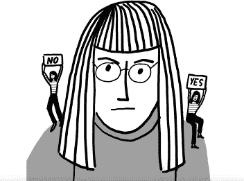
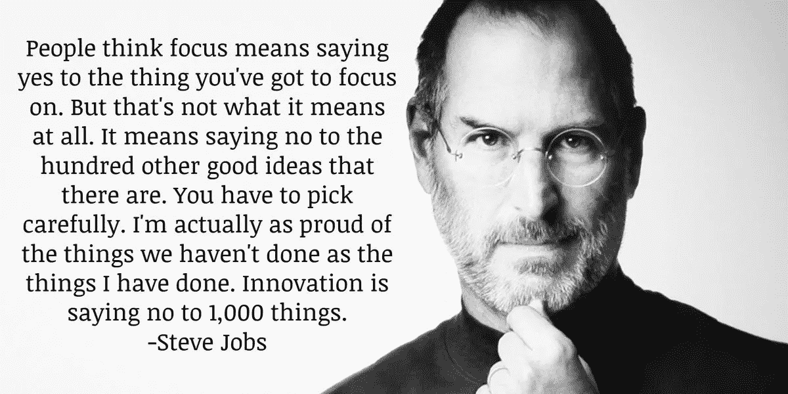
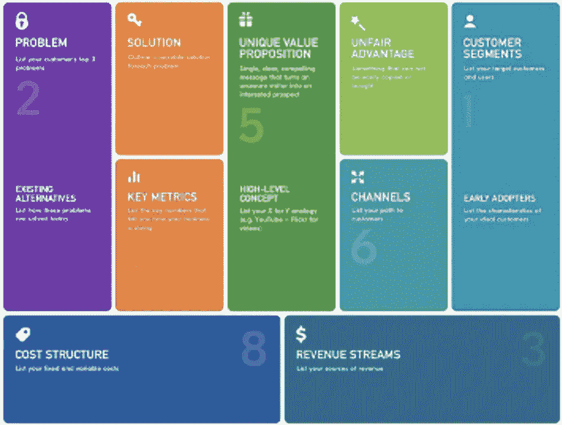
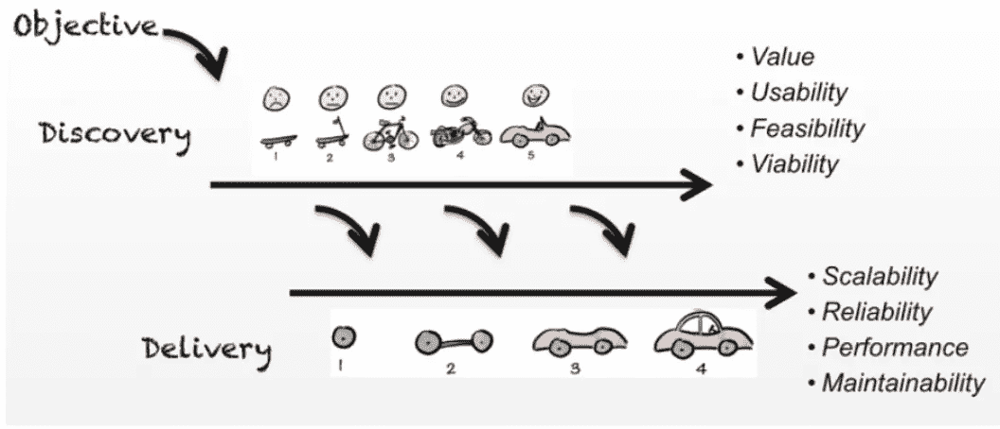
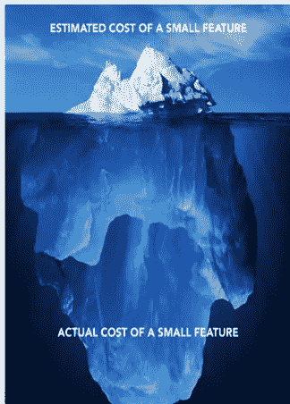
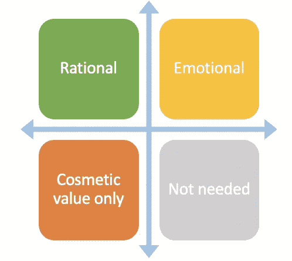

# 说“不”,不要让你的商业利益相关者不高兴

> 原文：<https://medium.com/walmartglobaltech/say-no-without-making-your-business-stakeholders-unhappy-8be069bc9437?source=collection_archive---------0----------------------->

> 领导艺术就是说不，而不是说是。很容易说是"
> 
> *~托尼·布莱尔*

T *对所有人说“是”是一种渴望，但作为产品经理，掌握说“不”的艺术是必须的。首先，说“不”是可以的，而不要说“可能”或“让我想想”或“以后”。但是，当你实际上是在否定某人的想法时，你如何每次都做对而不冒犯任何人呢？*

*Source: Book ‘*[*The art of being indispensable at work*](https://learning.oreilly.com/library/view/the-art-of/9781633698505/Text/chapter_4.xhtml)*’*

“不”是一个非常有力的词，需要大量的练习才能习惯自信地说出来。说“不”的艺术不仅适用于产品管理领域，也适用于生活和职业的所有领域。

产品经理需要定期做出选择，这意味着他们别无选择，只能拒绝更多的想法或功能，以达成为客户带来最高价值的决策。复杂程度很高，因为每个利益相关者都期望他们的问题得到更快的解决，没有人喜欢被放在优先级列表的第二位。

**为什么要说‘不’？**

假设您正在构建一个产品，以确定小学课程中应该包含哪一门学科。比方说，如果你对所有利益相关者说“是”:

Source: [Daily Quotes](https://dailysuccesquotes.blogspot.com/2018/08/steve-jobs-quotes-on-focus.html)

这位首席执行官表示，数学是人类思维和日常逻辑应用的核心部分之一，因此应该是必修课。

运营代表说，英语应该成为一门必修课，因为它对于交流是必不可少的。

有人说，在小学阶段，我们应该把重点放在道德科学上，因为这将有助于学生辨别是非。

如果你对所有人都说是，那么将会有太多的科目，学生将无法集中精力学习任何科目，从而影响他们的工作效率。从长远来看，家长最终会选择其他学校。因此，最终产品将变成负债，而不是资产。

史蒂夫·乔布斯的一个视频准确地触及了这个话题“[聚焦就是说不](https://www.youtube.com/watch?v=H8eP99neOVs)”，值得一看！

每种产品都可以用成千上万种方法制造，但只有少数几种能与你的最终用户联系起来。作为一名产品经理，你需要不断地团结起来，确定那些精选的功能，牢记有限的时间和资源，以及它应该与最终客户联系的事实。你需要不断地在 10000 英尺视图和 2 英寸视图之间切换，当你这样做时，并不是你的利益相关者的每一个功能/要求都适合。因此，学习何时说“是”以及如何带着同理心说“不”的艺术可以带来一些终极控制机制。

请继续阅读，了解如何掌握说不的艺术，同时又不伤害你与利益相关者的关系。

**产品经理如何在不破坏关系的情况下说“不”的工具包**

1.  **透明**

Source: [WMG FTMSc Blog Collection](https://warwick.ac.uk/fac/sci/wmg/testpmc/study-blogs-21/collection/?newsItem=8a17841a77b4f55d0177ca20e5d23a48)

“开放的和服”是一个流行的商业术语，它强调对他人完全透明的重要性。作为产品经理，说明自己的立场，做到完全透明。其中一个有效的方法是将所有要点放在一张[精益画布](https://blog.leanstack.com/what-is-the-right-fill-order-for-a-lean-canvas-f8071d0c6c8c)上，并就某些决策的潜在影响展开公开对话。你的精益画布应该在高层次上包括愿景、战略、权衡和价值。

除此之外，做一个产品路线图来解释产品如何随着时间的推移而发展。在这些对话中，考虑触及所有的需求和特性，例如，如果特性 X 的优先级降低而支持特性 y，会产生什么样的成本。

2.**花时间在产品发现和 MVP/原型上，以验证假设**

Source: [SVPG Blog](https://svpg.com/skateboards-vs-cars-revisited/)

在过程的早期失败比最终失败要好。与其进行大爆炸式的交付，不如寻找如何进行迭代和增量开发。Henrik Kniberg 在他的博客[中强调了如何从基本敏捷方法中获得价值。](https://blog.crisp.se/2016/01/25/henrikkniberg/making-sense-of-mvp)

让我们举个例子:

想象一下，你的利益相关者希望每天早上得到一份完整的报告，帮助他了解他的商店销售情况。这是一个非常宽泛的要求，许多指标和 KPI 都可以压缩到这个报告中。那么，你如何识别什么对涉众有价值呢？这就是产品发现发挥作用的地方，因为它可以帮助您确定要生产的正确产品。首先，创建一个基本的原型，它也可以在 excel 中。布局所有能以最佳方式讲述故事的指标。根据利益相关者的反馈，这个原型可能会进行 10-15 次迭代，但在最后，将会有一个关于需要构建什么的明确方向。俗话说，“一个问题说得好，就是解决了一半。”参考 Marty Cagan 的[博客](https://svpg.com/skateboards-vs-cars-revisited/)阅读更多关于产品发现的内容。

3.**评估所有相关成本和风险**

作为一个产品经理，你需要在无数的任务和有限的资源之间涉猎，因此，如果有人想在路线图中添加 X 特性，你需要真正评估一下是否需要这样做。很多时候，构建的时间很短，但是维护本身却很高。

例如，涉众想要添加一个删除记录按钮。

Source: [Intercom Blog](https://blog.intercom.com/product-strategy-means-saying-no/)

**开发成本** —开发成本低。

**潜在风险** —关联风险等级高。如果某个数据记录被错误地删除了，那么我们应该有一个机制来检索这些值。因此，出于缓解的目的，需要构建其他特征。

**系统影响** —评估对更广泛系统的影响？

**技术债务** —如果实现了这个特性，会有技术债务吗？

**对客户的不利影响** —如果相关的风险缓解功能没有与功能本身一起构建，这可能会疏远和降低对产品的信任。

**4。推后说‘现在不行，我们会把它添加到产品待办事项列表中’**

很多时候，由于时间或资源的有限性，很难将工作项目压缩到路线图中。因此，这不是一个直截了当的“不”,而是你打算在以后阶段加入的东西。例如，假设利益相关者想要智能过滤器，而不是基本过滤器。这是一个很好的想法，会增加整个产品的价值，但不是你想在第一个版本中构建的东西。因此，您可以保留 backlog 并添加到未来的路线图中。上面的矩阵可用于对功能进行分组，以便更清晰地评估路线图中应该考虑的内容。

另外请注意，产品经理会说很多次“我们将增加产品积压”，希望随着时间的推移，这一点会被遗忘。但是，如果您不打算将任何想法/功能请求包含在最终产品中，请注意不要将它们添加到产品 backlog 中。在这种情况下，当你看到一个特性不应该被添加到产品中时，对涉众透明，推理并抛弃它。透明度是关键！

**5。** **看提供替代方案**

实现确切的想法/需求本身是不可能的，但是当调整到类似的东西时，你不仅增加了产品的价值，还让你的利益相关者高兴。因此，与其直接说“不”，你可以花时间去倾听利益相关者的想法，并对其进行评估。一个产品经理需要有远见，并且是一个能够正确引导利益相关者的思想领袖。

不停地说“不，不，不！”可能听起来令人沮丧，但是用“是”代替所有的“不”最终会造成伤害。因此，仔细评估你的选择，保持透明，毫不犹豫地说“不”！

**供进一步阅读的参考链接**

[https://www . mind the product . com/just-say-no-hard-decisions-in-product-management-2/](https://www.mindtheproduct.com/just-say-no-hard-decisions-in-product-management-2/)

[https://blog . crisp . se/2016/01/25/henrikkniberg/making-sense-of-MVP](https://blog.crisp.se/2016/01/25/henrikkniberg/making-sense-of-mvp)

https://svpg.com/skateboards-vs-cars-revisited/

【https://svpg.com/beyond-lean-and-agile/ 

[https://www . prod pad . com/2014/05/saying-tough-love-product-managers/](https://www.prodpad.com/2014/05/saying-tough-love-product-managers/)

[https://MAA 1 . medium . com/my-product-management-toolkit-20-the-art-of-say-no-27 cdda 76 D5 de](https://maa1.medium.com/my-product-management-toolkit-20-the-art-of-saying-no-27cdda76d5de)

[http://www . clever pm . com/2015/02/24/saying-no-without-saying-no/](http://www.cleverpm.com/2015/02/24/saying-no-without-saying-no/)

[https://blog.intercom.com/start-with-a-cupcake/](https://blog.intercom.com/start-with-a-cupcake/)

[https://blog . lean stack . com/what-the-right-fill-order-for-a-lean-canvas-f 8071d 0 c 6 c 8 c](https://blog.leanstack.com/what-is-the-right-fill-order-for-a-lean-canvas-f8071d0c6c8c)