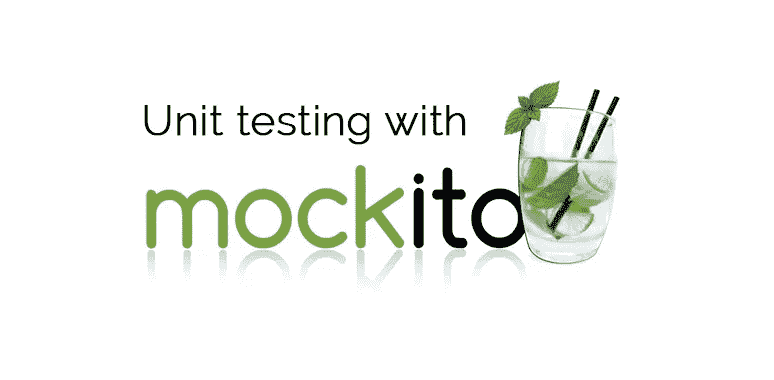

# 说什么？开发自己的 Mockito 库？

> 原文：<https://medium.com/globant/say-what-develop-own-mockito-library-661ece5f2add?source=collection_archive---------2----------------------->

我们可以创建自己的 Mockito 库吗？还是想学习莫奇托图书馆的幕后？

这是一个有点固执己见的问题，因为有人会问你为什么要重新发明轮子？这是事实。但是如何才能深入了解 Mockito 或者其他任何嘲讽框架内部是如何工作的呢？引擎盖下是什么？因为开发和理解事物是截然不同的(感谢 StackOverflow) ).



Mockito

```
*whenever*(mockObject.methodYouWantedToMock())
    .thenReturn(*resultYouWanted*)
```

假设我对你说这很容易？会激励你在嘲讽框架的引擎盖下学习吗？那我们开始吧…

@copyrights with [giphy](https://giphy.com/)

有两种类型的模仿框架，或者我们可以说有两种类型的模仿策略。

1.  **基于代理的框架**
2.  **字节码操作框架**

最简单的框架是基于代理的框架，因为要转化字节码，你需要更好地理解字节码本身。

**两种框架的区别**:

1.  基于代理的框架更容易实现，但是有其自身的局限性。
2.  字节码操纵就像成为复仇者，我不是开玩笑，是真的。因为它需要像黑客电影中显示的屏幕一样理解字节码的人。而基于代理的框架更容易理解。

目前，在这个故事中，我们将坚持基于代理的框架。
让我们先了解一下代理:
代理只是一个对象，它将被用来代替原来的对象本身。如果一个方法被调用，那么代理对象将决定:
1。处理呼叫本身。
2。委托给原始类。

> 注意:传递给原始类的方法被称为刺探，因为我们正在记录或刺探它从原始方法获取/返回的数据。
> 在测试框架之外还有另一个术语，叫做类委托。

## 代理人的限制

对代理有一些重要的限制。不可能:

*   拦截静态方法调用
*   拦截私有方法调用
*   拦截最终方法调用
*   为最终类构建一个代理

为了克服限制，我们需要进行字节码操作，这就是 PowerMockito 的用武之地，因为它使用字节码操作策略来克服代理的限制。

@copyrights with [giphy](https://giphy.com/)

好了，现在，我停止所有的理论，让我们继续代码

# **创建代理？怎么会？**

java 反射 API 提供了一个代理类。

```
Proxy.*newProxyInstance*(MockProxy.class.getClassLoader(), new Class[]{clazz}, invocationHandler);//Method parameters
//public static Object newProxyInstance(ClassLoader loader,
                                      Class<?>[] interfaces,
                                      InvocationHandler h)
```

“newProxyInstance”方法采用类加载器、接口和调用处理程序。让我们一步一步来:

1.  ` Classloader `:它引用了代理类。我们的自定义代理类负责所有的处理，比如模仿和存储被模仿的方法和返回值的引用。
2.  接口:我们要模仿的接口需要类引用。
3.  Invocationhandler:它用于方法的调用，所以当我们想要模仿某个方法时，我们通常设置 mock(obj.method())。那么 Return(返回值)所以当我们写这个签名时由代理类调用的类是 invocationHandler。为了标记方法，我们需要通过从 invoke 方法获取数据来发送这个返回值。

> 注意:newProxyInstance 只接受接口，如果你想模仿类，我会发表另一篇文章继续讲述如何模仿类的基础知识。

创建 MockProxy 类

```
class MockProxy {

    companion object {
        private var lastMockInvocationHandler: MockInvocationHandler? = null

        */**
         * Creates a mock based on a class.
         *
         ** ***@param*** *clazz the class of the mock
         ** ***@param*** *<T>   the type of the mock
         ** ***@return*** *the mock object
        </T> */* fun <T> **mock**(clazz: Class<T>): T {
            val invocationHandler = MockInvocationHandler()
            return Proxy.newProxyInstance(
                MockProxy::class.*java*.*classLoader*,
                *arrayOf*<Class<*>>(clazz),
                invocationHandler
            ) as T
        }

        */**
         * This class is just needed to ERHALTEN the type information. So that we
         * have the type information for the When::thenReturn method.
         *
         ** ***@param*** *obj the value which we doesn't need.
         ** ***@param*** *<T> the type of the return value
         ** ***@return*** *an instance of When with the correct type information
        </T> */* fun <T> `when`(obj: T?): When {
            return When()
        }
    }

    class When{

        */**
         * Sets the return value for the last method call.
         *
         ** ***@param*** *retObj the return value
         */* fun thenReturn(retObj: Any) {
            lastMockInvocationHandler!!.setRetObj(retObj)
        }
    }
}
```

所以在 MockProxyClass 内部，我们创建了一个静态方法 mock(或者我可以用 Kotlin 语言说是 companion method)。

在 mock
1 中，我们需要做两种类型的签名。模拟界面
2。模拟方法

为了模拟接口，我们在 MockProxy 类中有一个模拟方法。它将一个类作为参数，并使用我们之前看到的“ **newProxyInstance** ”方法给出一个模拟的代理对象。现在我们有了一个模拟对象，我们可以模拟这个方法了。

> 您可能会想，我们不能直接模拟方法吗？不，我们不能。
> 为什么？
> 因为我们之前检查过，模拟代理有他的局限性，代理不能模拟静态方法。

为了模仿这个方法，我们创建了` **when** `方法，就像 Mockito 一样。

好了，现在我们需要理解调用如何发生背后的逻辑，以便可以解释 when 方法和其他调用类的下一个代码。

所以首先让我们看一个模仿接口的模仿方法。

```
fun <T> **mock**(clazz: Class<T>): T {
 **val invocationHandler = MockInvocationHandler()**
    return Proxy.**newProxyInstance**(
        MockProxy::class.*java*.*classLoader*,
        *arrayOf*<Class<*>>(clazz),
        **invocationHandler**
    ) as T
}
```

这将创建一个 invocationHandler 并将其传递给代理类以进行代理。

```
MockProxy.`**when**`(fooInterfaceMock.foo()).**thenReturn**("Foo Fighters!")
```

> 注意，每当我们调用 mockobject.method()时，每次都会调用 MockInvocationHandler。
> 为什么？
> 因为我们已经创建了一个代理接口，它就像一个没有任何功能的空白类，所以一切都将由我们来做。
> 为了可读性，我们使用了语法 mock proxy . `**when**`(foointerfacemock . foo())
> 如果我们查看 when 方法的签名，它只是返回 When()类，而没有对参数做任何事情，我们只是在 then return 方法之前调用处理程序，以获得调用的方法和参数，以及需要返回的数据。

当我们要模拟这个方法时，这个调用处理程序对象将被调用，我们需要带走所有东西，如**方法**、**方法参数、**和**返回对象**，这样当我们试图调用时，我们就知道需要返回什么。

现在我们可以清楚地看到，这个方法是在“when()”之后被我们调用的，所以我们需要保存所有的引用。我们创建了一个类。

```
inner class DataHolder(
    val method: Method?,
    val args: Array<Any>?,
    val retObj: Any?
)
```

接受方法、方法参数和返回对象的数据容器类。

```
private class **MockInvocationHandler : InvocationHandler** {

    private var lastMethod: Method? = null
    private var lastArgs: Array<Any>? = null
    private val dataHolders = ArrayList<DataHolder>()

    */**
     * Intercepts the method call and decides what value will be returned.
     */* @Throws(Throwable::class)
    **override fun invoke(proxy: Any?, method: Method?, args: Array<Any>?): Any?** {
        lastMockInvocationHandler = this
        lastMethod = method
        lastArgs = args

        // checks if the method was already called with the given arguments
        for (dataHolder in dataHolders) {
            if (dataHolder.method == method && Arrays.deepEquals(dataHolder.args, args)) {
                // if so than return the stored value
                return dataHolder.retObj
            }
        }

        // otherwise return null
        return null
    }

    */**
     * Adds the return value for the last called method with the last given arguments.
     *
     ** ***@param*** *retObj the return value
     */* fun setRetObj(retObj: Any?) {
        dataHolders.add(DataHolder(lastMethod, lastArgs, retObj))
    }
}
```

这里，MockInvocationHandler 实现了 InvocationHandler，为什么？由于“Proxy.newProxyInstance”将“InvocationHandler”接口作为参数，我们需要一个逻辑来存储模拟的方法和参数。
每当我们试图使用代理对象的方法时，就会调用“invoke”方法。我们将模拟方法和参数的值存储到“lastMethodInvocation”和 lastMethodArguments 变量中。
又糊涂了？为什么我们需要将它存储在“lastVariable”中？因为直到现在我们都没有返回对象，所以如果我们没有返回对象，就没有必要向数组中添加数据。

当我们调用 thenReturn 时，它将从“lastInvocationhandler”中调用“setRetObj”方法，我们只是将所有细节添加到数组列表中。

**注意:**我们没有检查我们是否已经模仿了那个方法，所以如果你运行上面的代码，它将不会更新新的返回数据。更新一下，下面是代码:

```
*/**
 * Adds the return value for the last called method with the last given arguments.
 *
 ** ***@param*** *retObj the return value
 */* fun setRetObj(retObj: Any?) {
    var isFound = false
    for (dataHolder in dataHolders) {
        if (dataHolder.method == lastMethod && Arrays.deepEquals(
                dataHolder.args,
                lastArgs
            )
        ) {
            dataHolder.retObj = retObj
            isFound = true
        }
    }
    if (!isFound)
        dataHolders.add(DataHolder(lastMethod, lastArgs, retObj))
}
```

现在，我们将所有细节和模拟数据类添加到数组中，可以开始测试了。

创建一个接口和 JUnit 测试文件

```
public interface FooInterface {

    public String foo();

    public String echo(String val);

}
-------------------------------------------object MainTest {

    @JvmStatic
    fun main(args: Array<String>) {

        // java.lang.reflect.Proxy
        *println*("# MockProxy")
        val fooInterfaceMock = MockProxy.mock(FooInterface::class.*java*)
        MockProxy.`when`(fooInterfaceMock.foo()).thenReturn("Foo Fighters!")
        MockProxy.`when`(fooInterfaceMock.foo()).thenReturn("Foo Fighters again changed!")
        *println*(fooInterfaceMock.foo())
        MockProxy.`when`(fooInterfaceMock.echo("echo")).thenReturn("echo")
        *println*(fooInterfaceMock.echo("echo"))
        MockProxy.`when`(fooInterfaceMock.echo("hello")).thenReturn("world")
        *println*(fooInterfaceMock.echo("hello"))
        *println*()
    }
}
```

输出将是:

```
# MockProxy
Foo Fighters again changed!
echo
world
```

我们结束了我们的测试定制 Mockito 库。

@copyrights with [giphy](https://giphy.com/)

**TL'DR**

使用这种类型的自定义代理类，您可以尝试很多事情。我们已经检查了代理是如何生成的？，它是如何工作的？调用处理程序如何像黑魔法一样工作，为方法调用创建了一个小代理，并返回我们自己的数据。

我的要点链接，这个自定义 Mockito，找到这个链接。-> [链接](https://gist.github.com/parthdave93/a3ee2241cd118fe0eb5990bbfb904301)