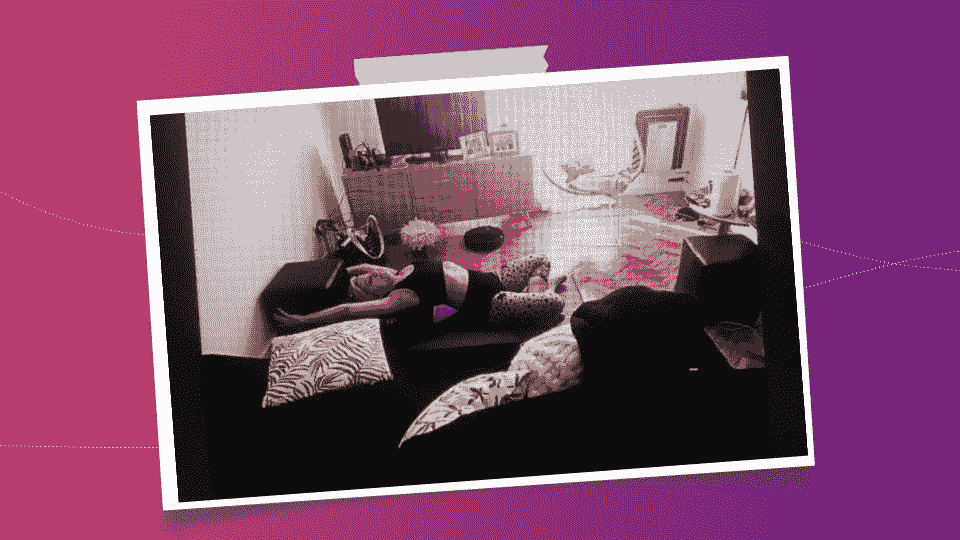
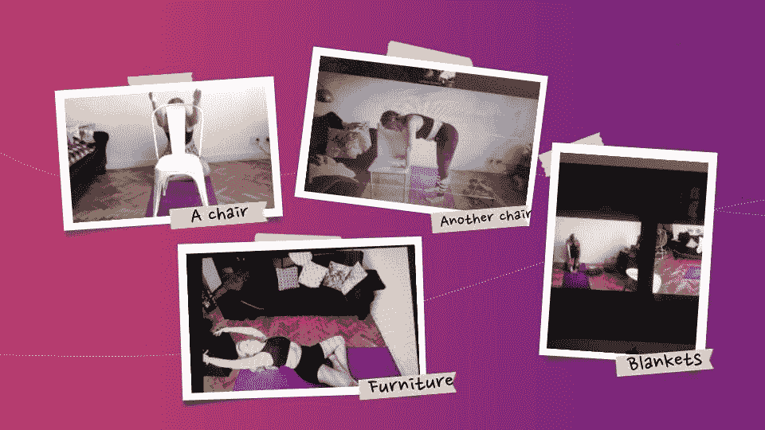
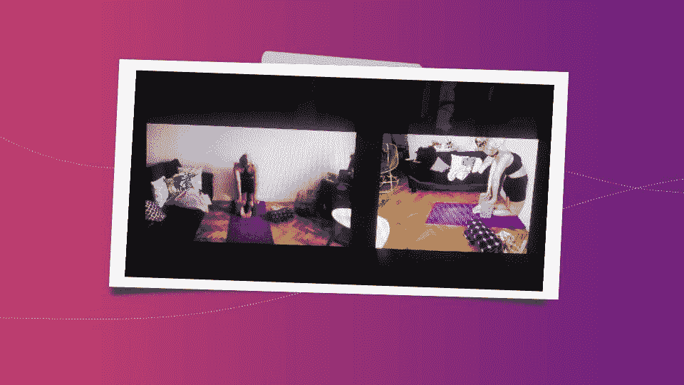
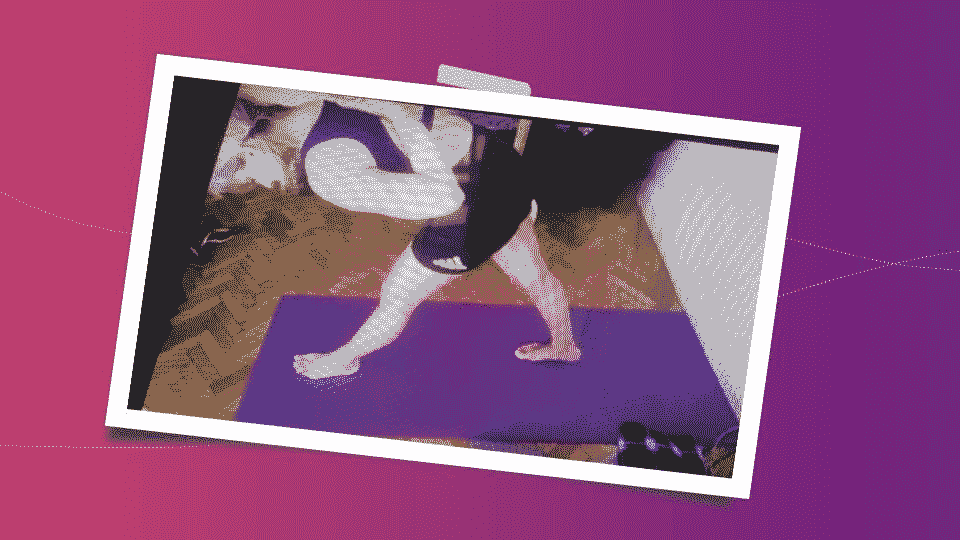
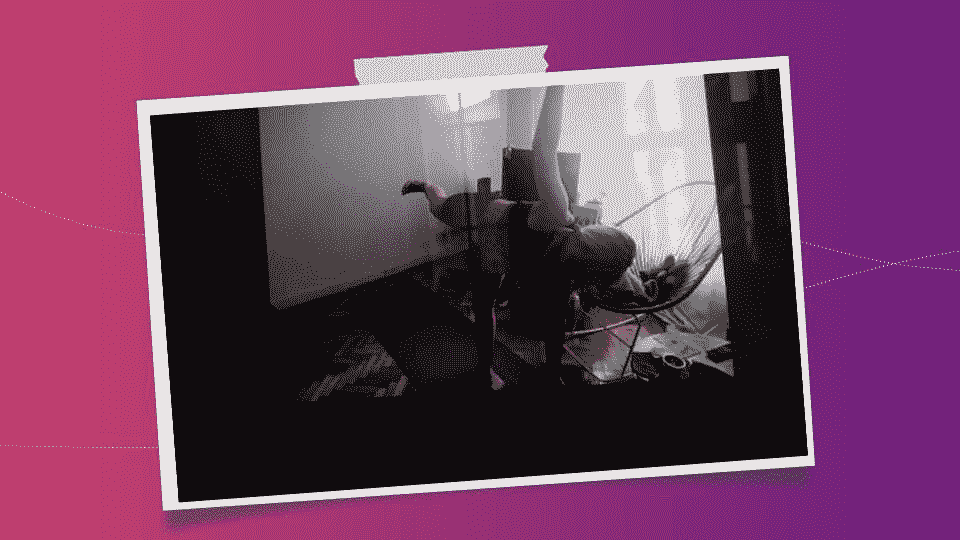
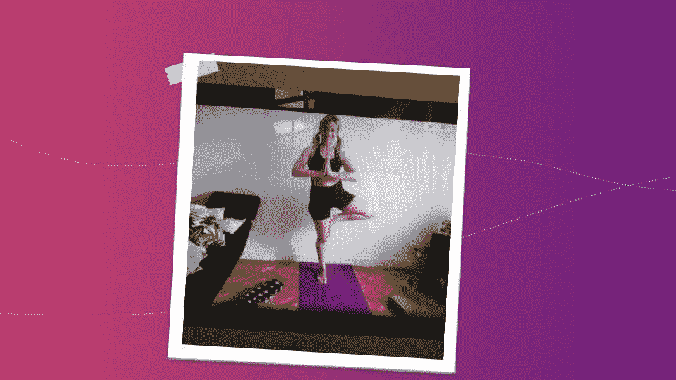
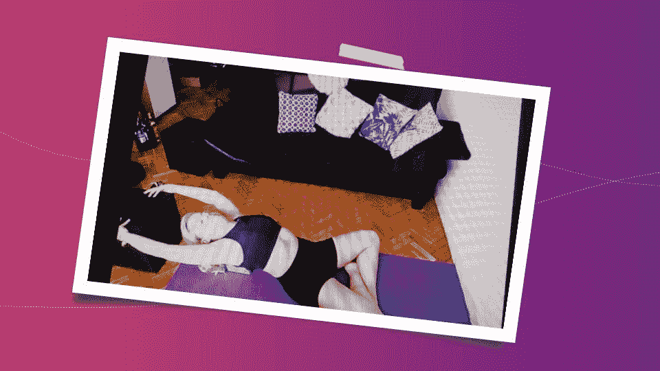
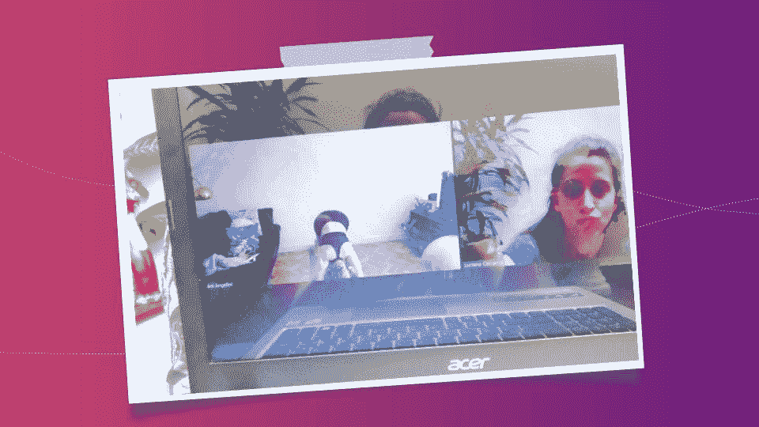

# 搭建通向组织敏捷性的道路

> 原文：<https://medium.com/globant/scaffolding-your-way-into-organizational-agility-d64d9a563d97?source=collection_archive---------1----------------------->

疫情让我从我的愿望清单上划掉了一件事:练习瑜伽。我过去常常责怪布宜诺斯艾利斯和糟糕的通勤时间，因为我不能挤在另一个活动中。疫情有着如此深远的影响，以至于我甚至把自己神圣的周日都献给了瑜伽。我在我的好朋友卢拉的指导下开始练习艾扬格瑜伽，她是一名瑜伽教练。每个星期天早上我醒来，准备练习的空间(也就是我的客厅)，打开 Zoom，让自己被卢拉的声音指引。

我发现在我努力的每一次练习中，学习新的语言、动作以及其他东西都需要时间。慢慢地，在练习过程中，我开始有了这些灵光一现的时刻，把练习和我的工作联系起来。几年来，我一直在帮助和支持组织实现组织敏捷性，Iyengar 的实践方法、我对此的理解以及 Lula 和我就此进行的对话都让我反思了自己实践敏捷性的方式。

当我谈论组织敏捷性时，我在谈论什么？还有另一种敏捷吗？在我看来，组织敏捷性是一个组织发展其工作方式以适应环境、发展弹性和发现新的可能性，同时驾驭不确定性的能力。这将敏捷性带到了另一个层次，从团队需要持续交付价值的实践，到整个组织思考其业务、内部结构和文化的方式。我并不是说在团队层面实践敏捷是错误的，许多公司都是这样开始的。然而，停留在那里是不够的，有时组织采用敏捷实践的方法并没有把他们带到组织的敏捷。

组织的敏捷性需要发展足够灵活的肌肉，以支持持续的进化(避免未来痛苦的转变)。很像瑜伽吧？

因此，这里是我的一些见解，可能有助于您实现组织敏捷性。不过，这并不打算成为一个完全自定进度的指南——毕竟我是一名顾问；)

# 不要从第一天开始就完全颠倒

倒置体式(瑜伽姿势，将你身体的自然位置倒置，将你的头放在你的腿上)是最困难的。掌握它们需要时间，但更重要的是，你不会在第一次练习时就达到目的，有时需要几年才能达到目的。

经历了向组织敏捷性的深刻转变的组织，看起来肯定与过去基于职能的层级组织结构非常不同。但是从一个时刻到另一个时刻颠倒结构的组织已经遭受了很多，并且受到了深深的(如果不是致命的)伤害。这并不能保证你达到了目的:他们可能有新的名字，比如部落、分会和小队，但是他们根本不练习敏捷。因此，就像你在你的第一个练习计划中没有包括倒体式一样，你也不打算在制定组织转型的策略时把你的组织搞得天翻地覆。

几年前，我偶然发现了相邻的可能理论，这是一种解释自然创新的理论。我对理论的理解是，给定一个有机体的特定时刻和环境，它有许多进化的可能性，但不是无限的。当有机体进化时，另一组可能性出现，与选择另一条路不同。我完全将这一理论与组织中的变化联系起来，这些组织实际上是复杂的生命体。我们不能推动变化，我们不能强迫它，我们不能跳过步骤，我们肯定不能追踪路线图。我们必须选择前面最可行的可能性之一，迈出一小步，并考虑新出现的组织。

你在照片中看到的不是一个倒置的体式，但是你仍然可以看到我使用了一个脚手架结构来达到这个体式。我有两块支撑着背上的拱门，还有一件家具作为手臂的参照物。

在通往组织敏捷性的道路上导航的建议也是使用脚手架结构和元素:例如，我建议与组织的高级经理一起创建临时团队，其使命是支持组织向转型:他们进行实验，如果成功，反过来将成为组织变革。每个人都将他们在组织中所扮演的角色带到桌面上，并贡献他们的知识和力量来做出决策和改变政策。

重要的是不要让脚手架提前倒塌，因为如果你这样做，一切都可能会崩溃。

# 从你所拥有的开始

每当我开始一项新活动时，我都想买所有的设备，让自己看起来像个专业人士。卢拉的邀请是从我家里的东西开始。尽管买了瑜伽垫和一些积木，两年后我们仍然用家里所有的东西作为我练习的脚手架。

因此，您已经购买了敏捷转型的门票！这是你不得不喘息的时刻:因为你已经决定要改变组织，你已经开始购买工具，为新的角色雇人，以防万一解雇人，并宣布一套新的政策。深呼吸。你可以用你所拥有的开始练习敏捷。创建看板不需要昂贵的工具，有很多非常简单的免费工具可以做到。你只需要一些具有明确业务目标的试点多学科团队，在不改变任何结构和工作描述的情况下开始实践敏捷性。你需要进行实验，检查你的组织对这些实验的反应，什么有效，什么无效。

# asana 陷阱

脚手架是为了达到一个体式，一种姿势。形式首先出现，但随后需要出现其他东西，否则实践就变得毫无意义。但是因为我们通过形式学习，所以我们模仿形式，而不是试图理解我们要做的事情。有多少次我们在 scrum 事件的循环中，在 sprint 结束时没有交付任何东西？当然，我们可以在清单上划掉一些项目:我们已经完成了计划、日报、评论和回顾。但是我们显然没有将这些实践作为持续改进的推动者，来定期交付价值。即使你组织中的团队定期使用 scrum 交付工作软件，如果该软件不能帮助实现不断变化的业务目标，你就根本谈不上组织的敏捷性。

# 抑制不适

我打赌你看照片感受不到我的感受，但我一点也不舒服。艾扬格:这一切都是为了在体式中停留一段时间，有时甚至是几分钟。

通往组织敏捷性的道路并不容易。会有不舒服的时刻需要被抑制。敏捷练习(和瑜伽体式)是有机的，但在开始时并不觉得有机，所以重要的是要适应这种最初的不适，并保持在体式中，保持在练习中，以便组织的肌肉变得比以前更加灵活和强壮。

我想澄清一件事:不舒服并不是疼痛，重要的是要认识到两者的区别。同样的道理，瑜伽练习后不会有任何伤害，以敏捷的名义也不应该有任何伤害。为了能够发现差异，你需要很好地了解你的身体，或者在这种情况下，你的组织。持续评估人们在新实践中的表现非常重要，以便根据需要尽可能多地推动车轮。

# 放开绞刑架！

为了达到你在图片中看到的体式，我用一个木块来摆好我的手臂，这样我就可以在这个位置上达到平衡。当我感到足够安全的时候，我会放开木块，然后完全平衡地到达体式。

脚手架是为了补充我们作为一个组织所缺乏的东西，并帮助过渡。这不是一个可以永远停留和休息的地方。脚手架是暂时的，会随着时间而变化。如果脚手架不起作用，或者已经达到了目的，我们必须放弃它，或者让它改变。例如，如果一个团队曾经需要考虑它的价值在 sprint 中增加，而现在已经实现了持续交付，那么可能就不再需要 sprint 作为脚手架了，并且可能开始产生组织脂肪。

找到那个微妙的转折点是一门艺术，在这个转折点上，你可以放手，而不会让一切都分崩离析，这需要很多自我意识。

# 绞刑架不是强制性的

如果我能放下绞刑架，那么绞刑架就不是强制性的了。在图片中的体式中，可以用一根带子来支撑你的腿，并专注于平衡。我不需要腰带，腰带不是强制性的。

同样的，每个身体都是不同的，需要不同的脚手架元素来完成一个体式，每个团队和每个组织都是不同的。因此，它需要一套不同的实践和结构作为通向敏捷的脚手架。这意味着没有脚手架是强制性的。例如，在 Scrum 中，scrum master 帮助团队接受敏捷价值观，并根据业务目标交付价值。如果一个团队已经达到了很高的敏捷水平，他们并不一定要有一个全职的 scrum master。更重要的是，产品负责人在那里帮助团队对产品待办事项中的项目进行优先排序，以最大化 ROI，如果团队有能力自己做这些，你就不需要产品负责人这个角色。

是的，现在你可能已经明白了，我把每一个实践、框架、角色和结构都看作是一个脚手架，我建议在它起作用或有帮助的时候使用它。当你应该放手的时候，却不能放手，这就产生了一系列新的僵化行为，与你试图摆脱的行为非常相似，这根本不能让我们接近组织的敏捷性。

# 绞刑架从来都不是目标

每个周六卢拉都会问我感觉如何，看看她的练习计划对我来说是否可行。其中一个周六，她告诉我，除了通常的脚手架，我们还需要很多毯子。好多毯子！我满怀期待。当然，我们打算尝试一个倒置的体式。在练习中，仅仅搭建脚手架就花了几分钟。当我终于在它上面的时候，一切都崩溃了。

有时候，断头台成了目标。我收到客户的请求，希望实现这样或那样的模型或框架，但总是出于错误的原因。这就好比你不知道自己得的是什么病，就去找医生要某种药。如果你的目标是组织的敏捷性，这永远不是答案。我看着市场上的一些型号，不知所措。当然，我已经将那些模型中包含的一些实践作为克服组织痛苦的支架。但是，从第一天开始在一个组织中实施这样一个巨大的变化，需要新的职位、新的结构和新的流程，这是极其痛苦的，并且设置了一个新的僵化结构，使我们远离我们获得组织敏捷性所需的灵活性。

# 呼吸:这是一个自发的过程

在瑜伽和其他活动如跳舞和唱歌中发生的一件事是，呼吸是一切的关键。我们需要完全意识到让我们活着的那个自然的、非自愿的过程:它需要变成自愿的，我们需要为了练习的目的而使用它。在组织中，呼吸过程由所有人的行为组成，这些行为要么是由明确的公司规则驱动的，要么是由心照不宣的协议驱动的。那些规则和协议是脚手架(或者在某些情况下是柱子和墙),将组织保持在今天的位置。为了获得灵活性，发现哪些是我们需要保留的，哪些是我们需要改变的是非常重要的。为此，重要的是“冥想”并尽可能远离噪音:永远记住什么是真正重要的。

我记得几年前(疫情之前)，我作为 scrum master 帮助一个团队，scrum 事件实际上是在办公室进行的。一些团队成员不想告诉我，我在他们的家庭办公日安排活动，两个月过去了，他们还没有能够利用他们认为的巨大好处。当我意识到这个好处后，我们一起制定了时间表，如果有人最终需要呆在家里，我们同意开混合会议。这完全改变了团队的情绪。

# 举起心脏

我发现练习瑜伽、跳舞和唱歌充满了隐喻。我喜欢这个关于振奋人心的故事。

我希望你能在照片中看到我抬起我的心脏:这意味着你必须拔出你的胸骨，让你的背部伸出更多一点，即使你觉得那是不可能的。我能听到卢拉通过变焦说:“你的背看起来很漂亮！”。我感觉到的是我的身体是完整的、巩固的、同质的。融入其中的感觉棒极了。

人是组织的活心脏。我想知道我们什么时候迷失了方向，忘记了那件事。我想知道我们怎么能认为 5 个人中的 20%就构成了一个致力于一个目标的完整的人。但是我们在组织中一直都有这样的对话，我们把一堆人拼在一起，大多数时候甚至没有问。

提升组织的核心意味着你必须以人为本。真的。不为没有人的人做任何事。透过脚手架结构的玻璃看到组织的变化，允许人们自己(为自己)做一些实验设计，并能够测试实验，看看它如何工作，如何适应，将变化视为暂时的，以便组织可以在不伤害其心脏的情况下发展。

# 总是在移动

每次练习，我都会学到一些东西。我越来越意识到我的身体，它的可能性，以及它的局限性。在最好的情况下，我获得了更多的灵活性，并准备下次做一些更复杂的事情。但我总能学到一些最终会改变我的东西。

问题是，如果你不想改变什么，你必须停止移动。决定在今天的组织中意味着消失。外面的世界正在发生指数级的变化，我认为发展组织的敏捷性是我们生存的最佳选择。我希望您尝试一下这种支架方法，并分享您的见解。