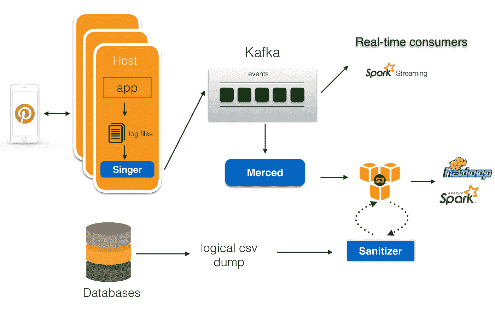

# Pinterest 上可扩展且可靠的数据摄取

> 原文：<https://medium.com/pinterest-engineering/scalable-and-reliable-data-ingestion-at-pinterest-b921c2ee8754?source=collection_archive---------0----------------------->

杨宇| Pinterest 工程师，数据

在 Pinterest，我们使用数据来获得洞察力，以便为所有事情做出决策，并最终改善 Pinners 的整体体验。每天我们记录超过 100 的数据。为了有效地使用数据，我们首先必须可靠地接收数据，并为下游使用做好准备。在本帖中，我们将介绍我们的数据接收管道的发展，并展示我们当前的数据接收基础设施。展望未来，我们将有一系列后续文章来更详细地描述每个组件。

## **数据摄取概述**

数据接收就是从各种来源收集数据，并将其移动到持久存储中。数据通常以各种格式分布在成千上万的主机上，因此以可靠、高效和可扩展的方式做到这一点是一项具有挑战性和趣味性的任务。

数据接收通常有以下要求:

*   可靠性:数据收集和传输应该可靠，数据丢失最小
*   性能:管道应该具有高吞吐量和低延迟
*   高效:应该使用最少的计算和存储资源
*   灵活性:它应该支持各种来源和数据格式
*   自治:系统应该以最小的操作开销运行

在 Pinterest，数据集主要有两类:在线服务日志和数据库转储。服务日志是由跨越数千台主机的服务生成的连续日志流。收集服务日志的管道通常由三个阶段组成:日志收集、日志传输和日志持久化。数据库转储是逻辑数据库备份，每小时或每天生成一次。数据库接收通常包括数据库转储生成和后期处理。

Figure 1\. Data ingestion infrastructure in 2014

图 1 显示了 2014 年的摄入管道。那时，我们在在线服务端使用卡夫卡作为中央消息传送器。应用服务器直接向 Kafka 写日志消息。每个 Kafka broker 上的数据上传器将 Kafka 日志文件上传到 S3。在数据库转储方面，我们有一个定制的 Hadoop 流作业，从数据库中提取数据并将结果写入 S3。但是，这种设置存在一些问题:

*   通过从 appserver 直接写入 Kafka，如果 Kafka 代理出现故障，消息需要在服务器端缓冲到内存中。由于缓冲区大小有限，长时间的 Kafka 中断会导致数据丢失。
*   卡夫卡 0.7 没有复制。Kafka broker 故障会导致数据丢失。
*   为了最小化在线服务的影响，我们只能从从属节点获取数据库转储。我们需要跟踪主从映射，频繁的数据库转储故障转移会增加这些作业的失败。
*   操作开销很高。

Figure 2\. Data Ingestion infrastructure in late 2016

为了解决这些问题，我们增强了数据接收的各个阶段。图 2 显示了更新的架构，其中我们对数据接收管道进行了以下更改:

*   对于在线服务日志记录，服务将日志消息写入本地磁盘，而不是直接写入 Kafka。
*   我们构建了一个名为 [Singer](https://www.slideshare.net/DiscoverPinterest/singer-pinterests-logging-infrastructure) 的高性能日志代理，它将日志消息从主机上传到 Kafka。Singer 支持多种日志格式，并保证日志消息至少发送一次。
*   我们发展了 [Secor](/@Pinterest_Engineering/introducing-pinterest-secor-e868d9400bec#.wwf6vz3pc) 并建立了一个名为 Merced 的数据持久化服务，将数据从 Kafka 转移到 S3。Merced 使用低级消费者来读取来自 Kafka 的消息，并采用主-工人方法在工人之间分配数据持久化工作负载。默塞德保证从卡夫卡到 S3 的消息只持续一次。
*   我们为数据清理任务(例如，模式强制检查、重复数据删除、数据策略强制等)添加了一个清理阶段。
*   在数据库接收端，数据库直接将逻辑转储存储到 S3，并使用清理框架来生成下游处理所需的数据集，而不是使用 Hadoop 流从数据库中提取数据。
*   我们建立了端到端的审计和数据完整性检查，并提高了管道每个阶段的可见性，以减少运营开销。

通过这种设置，我们每天能够处理超过 1500 亿条消息和超过 50TB 的逻辑数据库转储。随着每月 1.75 亿用户群的增长，以及 1000 亿 pin 图的不断扩大，我们每天都面临着新的挑战:

*   由于数据库主服务器故障转移，逻辑 CSV 转储生成通常会延迟。这阻止了下游及时获得新数据。我们需要以增量方式接收数据库数据，以提高数据库接收的可靠性和性能。
*   需要进一步简化数据管道的创建和启动。
*   当我们扩大 Kafka 集群的规模时，Kafka 运营就成了一个挑战。
*   由于各种原因，更多的事件可能会迟到，我们需要一致地处理迟到的事件。

我们将继续改进我们的数据接收渠道，并将在后续帖子中分享更多内容。如果这些是让你兴奋的问题，[加入我们的](https://careers.pinterest.com/)。

*鸣谢:Pinterest 的许多工程师帮助建立和改进了 Pinterest 的数据接收基础设施，包括 Henry Cai、Roger Wang、Indy Prentice、Shawn Nguyen、Yi Yin、Dan Frankowski、Rob Wultsch、Ernie Souhrada、、Dmitry Chechik 和许多其他人。*