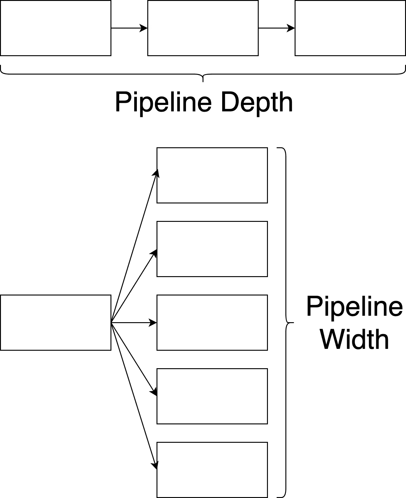
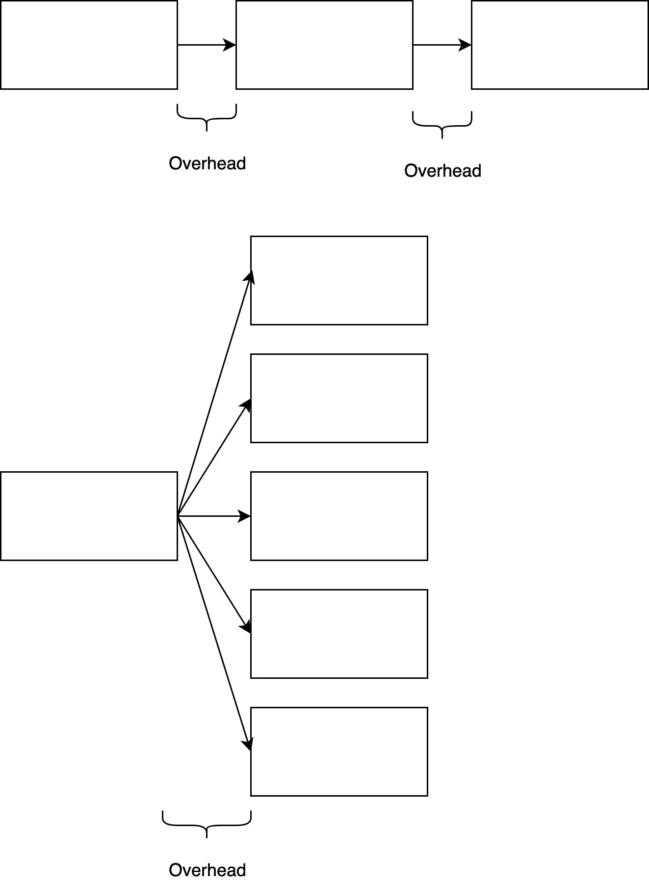
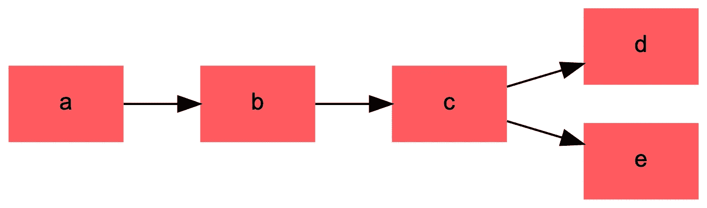
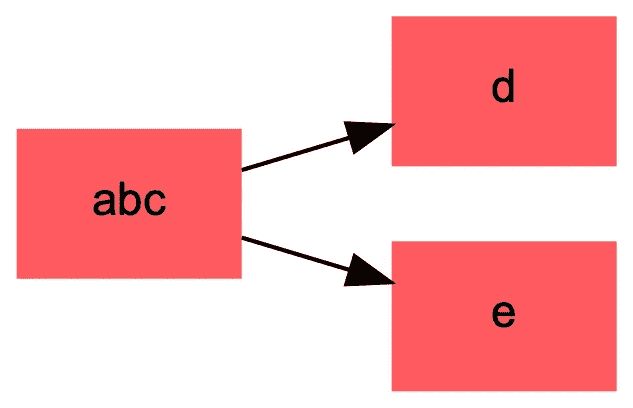

# 扩展成熟的数据管道—管理开销

> 原文：<https://medium.com/airbnb-engineering/scaling-a-mature-data-pipeline-managing-overhead-f34835cbc866?source=collection_archive---------0----------------------->

## 通常有一个隐藏的性能成本与数据管道的复杂性相关，即开销。在这篇文章中，我们将介绍它的概念，并研究在我们的数据管道中避免它的技术。

**作者**:扎卡里·恩南加

The view from the third floor at Airbnb HQ!

# 背景

数据管道的工具、组织和技术基础经常会有自然的演变。大多数数据团队和数据管道都是从一个庞大的查询集合中诞生的。随着管道变得越来越复杂，利用 Java 或 Python Spark 库，并在代码中实现 map reduce 逻辑，而不是在原始查询中，变得很明智。整体被打破了，你用编排的复杂性换取了逻辑的简单性。您的一个整体工作变成了十几个漂亮的、范围紧密的步骤，这些步骤被构造成某种依赖图。

然而，编排的复杂性是有代价的:开销。广义地说，开销是*你的管道正在做的除了计算之外的任何事情:*执行 IO，等待资源被分配给你的作业，等待你的作业被调度，等等。开销是阴险的:它随着您的管道缓慢增长，并且通常只有当您有几十个任务要管理时才成为问题。此时，有许多变量会影响管道性能，观察和隔离开销源会非常困难，尤其是当您的管道合理地花费大量时间进行计算时。

支付团队运营着许多时间敏感的 Spark 管道，我们团队的核心目标是通过这些管道及时交付数据。然而，随着 Airbnb 的成熟和发展，我们的管道必须不断增加，以应对我们业务规模和范围带来的挑战。

曾经有一段时间，每天运行一次我们的管道就足以满足我们的交付 SLA，并管理随后 24 小时内发生的数据完整性问题的风险。然而，每天处理数据越来越不能满足我们的需求。因此，我们开始研究运行每小时数据管道的技术可行性。

于是我们意识到了我们的开销问题:由于我们在如何构建我们的业务和编排逻辑方面做出了许多选择，我们发现我们完全无法实现每小时管道，直到我们的开销得到控制。

# 技术堆栈

在深入我们的细节之前，我想花点时间讨论一下支持我们管道的技术堆栈。

我们的平台混合使用了 **Spark** 和 **Hive** jobs。我们的核心管道主要是用 Scala 实现的。然而，我们在某些情况下利用 Spark SQL。

我们利用 **YARN** 进行作业调度和资源管理，并在 Amazon EMR 上执行我们的作业。

我们使用**气流**作为我们的任务编排系统，负责编排逻辑。对于数据管道，我们将编排逻辑定义为便于执行任务的逻辑。它包括用于定义依赖图、配置系统、Spark 作业运行程序等的逻辑。换句话说，运行您的管道所需的任何东西，如果不是 map-reduce 作业或其他业务逻辑，都可能是编排逻辑。总的来说，我们的管道由一千多个任务组成。

# 案例研究:集成测试管道

我们的发现之旅始于一个不太可能的地方，一个集成测试管道。这是一组由支付团队管理的特殊管道，它获取单元测试发出的事件，并在整个管道中运行它们，以在支付团队的代码被合并到主分支之前检测代码中的问题。

就结构、范围和配置而言，集成测试管道与我们的生产管道相同。唯一的区别是，集成测试每次运行处理几百条记录的数据量，这是一个难以置信的小数据量:即使生产中每小时一次的流水线处理的数据也比这多几个数量级。也就是说，与当前的每日管道相比，每小时管道的性能可能更接近集成测试管道。

我们管道的核心部分，满负荷运行，预计每天需要 6 个小时完成。假设相同的资源分配，理论上，每小时的流水线应该花费 6 小时的 1/24，或者 15 分钟。相比之下，由于数据负载很小，集成测试管道应该几乎不需要时间。
T5 不过，执行时间大致是 *2 小时*。调整 Spark 配置来处理较小的数据负载几乎没有效果。当我们进一步调查时，我们发现执行 ETL 操作或任何 Spark 计算的时间*接近于 0。很明显，管道在花时间做别的事情。这是我们团队不希望看到的。因为记帐逻辑本质上是有状态的，所以要开始新的管道运行，它需要前一次运行完成。很明显，我们甚至无法用每小时一次的流水线开始我们的实验，*除非我们能把执行时间控制在一个小时之内*。*

# 头顶:无声的黑仔

我们预计我们的管道会有一些开销，但我们不知道有多少。当我们测试我们的作业时，我们通常不使用与我们在整个生产流水线中使用的相同的编排工具——我们使用单元测试，或者单独运行作业。此外，我们使用不同的资源分配运行测试，并且在不同的 map-reduce 集群上运行测试，而不是在生产管道上运行测试。所有这些都有助于模糊开销对我们管道造成的影响。

所以我们退一步，整体分析我们的管道。虽然开销的确切来源会因管道结构和堆栈的不同而有很大差异，但我们确定了一些常见的来源:

调度器延迟:无论是 crontab、Airflow、任务队列还是其他什么，每个复杂的数据管道都有一些管理依赖关系和作业调度的系统。通常，在一个作业完成和下一个作业开始之间会有一些延迟。

**预执行延迟:**太好了，作业已经安排好了——现在怎么办？在许多情况下，在工作开始之前，需要执行一些准备工作。例如，我们必须将我们的 JAR 推到正在执行我们的任务的机器上，并执行一些健全性检查以保证来自先前任务的数据已经到达。最后，初始化应用程序代码，加载任何配置或系统库依赖项，等等。

**Spark 会话实例化和资源分配:** Spark 会话需要时间来设置，因此您启动和停止会话越频繁，花费的时间就越长。此外，您的作业必须从集群中获取所有必要的资源。动态分配等 Spark 特性可以加快速度，但总会有一些加速时间。这也会在集群级别影响您的管道。当使用像 Amazon EMR 这样的自动扩展集群时，虽然理论上您可以访问大型资源池，但通过扩展操作将它们分配到您的特定集群可能会花费大量时间。

**保存和加载数据:**在一个复杂的管道中，经常会有需要持久化的中间结果，供其他管道或作业消耗。将管道分成离散的步骤通常是一个好主意，这样既可以管理逻辑复杂性，又可以限制作业失败对管道运行时间的影响。然而，如果您使您的步骤*过于粒度化，您最终会花费大量不必要的时间将记录序列化和反序列化到 HDFS。

然而，所有这些影响都很小，大约几分钟——它们无法解释 *2 小时的延迟*。*

# 评估您的渠道

我们意识到，开销的影响取决于管道的大小和形状。数据管道中相关任务之间的关系往往被结构化为有向非循环图，或 DAG。这里有一个有用的练习，如果你没有一个带有 UI 的工具(比如 Airflow)来帮你画管道的结构。将每个不同的任务作为 DAG 中的一个节点，您将得到如下图像。

DAG 的形状和大小可以用两个因素来衡量:深度和宽度。

深度是任何给定任务与其最近的边节点之间有多少链接的度量。宽度是给定深度的节点数。

开销往往随着图的深度而增加，特别是在图的“线性”部分，任务是连续执行的。但是，宽图也不能避免开销—在保存和加载 HDFS 记录时，您必须小心花费的时间。IO 具有固定开销，因此虽然任务的着陆时间可能不会受到影响，但总计算时间会受到影响，这可能会导致计算成本增加。(管理成本超出了本文的范围，所以我将把事情留在这里，但是尽量避免用时间问题来换取成本问题。)

所以，有了这个框架，我们意识到了我们管道的结构是我们开销问题的根本原因。那么我们决定做什么？

简单——按比例缩小！

# 惊人的数据处理，小小的流水线

虽然在理想情况下，您可以简单地直接删除或减少开销来源，但这通常是不可行的，或者会花费不合理的开发时间。因此，剩下的唯一解决方案就是缩小管道的尺寸。

这并不是说要削减你的管道的范围，或者，真的，根本不改变。这实际上是业务逻辑和编排逻辑之间的区别。

通常，数据管道反映了底层应用的结构。在这种情况下，向集群提交作业的常见方式是通过 spark 提供的 spark-submit 脚本，这种情况很容易结束。脚本要求您提供一个类，因此您倾向于创建一个映射到管道中单个任务的类。类通常是由传统的软件工程原理设计的，因此，执行单一的严格限定范围的转换操作。

这是有问题的，原因有很多——通常编排逻辑与业务逻辑是分开的，所以您会遇到这样的情况，对您的管道进行更改需要您将更改的部署同步到多个系统，这从来都不是一个好地方。当然，如果不考虑逻辑抽象的编排含义，这样做会导致巨大的开销。

我们认识到，我们的业务逻辑应该以*可维护和可扩展的方式*设计，我们的编排逻辑应该设计为*最大化我们的管道的性能、可见性和可靠性*。

虽然这是一个相当显而易见的陈述，但不太清楚的是，当业务和编排结构(即定义业务和编排逻辑的实际类)耦合在一起时，系统的目标通常是相互对立的。正如我们已经讨论过的，当直接映射到 DAG 时，严格限定范围的逻辑抽象会导致管道足够宽或足够深，从而导致显著的开销。我们决定做的是在我们的业务逻辑和编排逻辑之间构建一个应用程序层，让我们能够满足每个系统的需求。

考虑以下数据管道:

传统上，您的应用程序代码看起来像这样:

在这个设置中，每个类映射到一个逻辑转换步骤。

然而，我们已经设计了一个单一的入口点，它定义了编排系统和我们的业务逻辑之间的一个契约，这个契约与我们的应用程序逻辑没有内在的关联。

它的基本用法看起来像是:

这个例子在功能上与初始设置非常相似——我们仍然在 1:1 的基础上将管道中的任务映射到代码中的类。

然而，这给了我们一些好处。例如，我们可以按照自己的意愿重组底层类，而无需对编排系统进行任何更改。我们可以做类似的事情:

这里要实现的关键目标是将管道的编排与业务逻辑的结构完全分离，这样，与编排相关的组件可以被设计成最小化开销，而业务逻辑可以被构造成最小化复杂性。换句话说，您希望构建您的应用程序，以便 DAG 的结构完全独立于业务逻辑的结构。

利用上述系统，我们可以很容易地将我们的管道重组为:

通过这样做，我们大大减少了开销，而没有对我们的业务逻辑结构或任务的交付顺序进行任何更改。

# 关于容错的讨论

这里的最后一个考虑是容错。广义而言，作业在分布式计算环境中运行的时间越长，就越有可能失败。

一般来说，数据作业很容易以幂等的方式重试，所以失败作业的成本通常是直到失败所花费的时间加上重试所花费的时间。这是在努力解决开销时需要考虑的事情——理论上，将所有工作合并到一个巨大的任务中会消除所有开销，但会大大增加失败的风险，这会消耗掉您通过消除开销来源而节省的所有时间。

总的来说，这是一种平衡。在我们的例子中，对于管道的大部分，重试的成本和风险要比将任务分开产生的开销低得多，但是这并不总是正确的。一个好的经验法则是，如果您的开销等于或大于作业执行时间的 10%，那么合并它们可能是一个安全的选择。

# 结论

那么，我们学到了什么？

*   数据管道的自然演变，从脚本的整体集合到 Spark 应用程序，自然地推动您在管道中编码应用程序结构。
*   开销是除了计算之外，管道正在做的所有事情。这是由编排的复杂性引起的，并且会随着管道的深度而扩展。
*   在管道中编码应用程序结构意味着您将应用程序逻辑与编排逻辑内在地耦合在一起。这意味着您经常通过使地图缩减任务过于精细来增加开销。
*   通过将业务流程逻辑与应用程序逻辑分离，您可以获得工具来对抗开销，而不会影响应用程序的质量。
*   当试图减少数据管道的运行时间时，请注意不要错过林中的树。分析整个管道的执行时间，而不仅仅是明显的因素，比如减少计算时间。
*   不能忽视容错方面的考虑。确保你不要因为花费在重试经常失败的任务上而浪费了你节省下来的降低开销的时间。

虽然我们的开销减少措施仍在执行中，但早期测试表明，我们能够将开销从 **2 小时**减少到**15–30 分钟。**这不仅会缩短我们管道的交付时间，还能让我们在未来追求每小时一次的管道。

如果你对解决类似的管道扩展问题感兴趣，Airbnb 的 [**支付**](https://www.airbnb.com/careers/departments/engineering/payments) 团队正在招聘！查看我们的[空缺职位](https://www.airbnb.com/careers/departments/engineering)并申请！