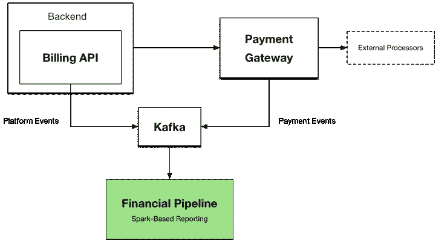

# 扩展 Airbnb 的支付平台

> 原文：<https://medium.com/airbnb-engineering/scaling-airbnbs-payment-platform-43ebfc99b324?source=collection_archive---------0----------------------->

## 由[安吉拉朱](https://www.linkedin.com/in/angelazhu1) & [凯伦金](https://www.linkedin.com/in/hijookim)，Airbnb 支付工程

当人们想到 Airbnb 时，他们通常会想到美丽的旅行目的地，独特的家园，以及像当地人一样的生活。大多数人不认为 Airbnb 是一家支付公司。然而，就像 PayPal 对易贝作为第一个全球在线市场的成功至关重要一样，Airbnb 的支付对 Airbnb 作为全球旅游平台的增长至关重要。

在本帖中，我们将探索 Airbnb 支付的起源，以及我们建立如此庞大的内部支付业务的原因。我们还将了解一些帮助 Airbnb 扩展到 191 个国家、70 多种货币和 20 多种支付方式的技术。

# 早期

2008 年，Airbnb 刚起步时，客人和主人通过这个平台找到彼此，除此之外别无其他。Airbnb 今天提供的许多信任功能，如真实身份、客人和主人之间的消息传递以及专业摄影都不存在。支付在客人和主人之间直接离线处理。你可以想象，这并不总是一帆风顺。

例证:2008 年初，联合创始人布莱恩·切斯基(Brian Chesky)前往奥斯汀参加 SXSW，很自然地住在了一家 Airbnb。当他到达他的清单时，Brian 身上没有任何现金，但他向他的主人保证，他会在那天参加活动时顺便去一趟自动取款机。然而，在 SXSW 的兴奋中，他忘记了他的计划，空手而归。第二天早上，他的主人问起钱的事，布莱恩不得不再次(不好意思地)答应白天取钱。然而那天晚上，他又一次忘记了。他们两人之间的关系开始变得相当尴尬。

虽然布赖恩最终设法帮他弄到了钱，但他意识到肯定有更好的办法。回到旧金山的 Airbnb 总部(也就是他公寓的客厅)，布莱恩宣布 Airbnb 必须开始自己处理支付事宜。这将消除面对面现金交易的不便和尴尬，也将允许 Airbnb 在出现任何问题的情况下支持客人和主人。由此，Airbnb 支付基础设施的开端诞生了。

# 走向全球

作为当时唯一的工程师，Brian 的技术联合创始人 Nate 的任务是让支付在平台上发生。当时，没有太多现成的解决方案来处理双向转账，所以他实施了最简单的解决方案:客人通过 PayPal 付款，主人收到一张纸质支票。

该平台发展壮大，用户开始要求 PayPal 的替代品，因此 Nate 联系了加工商，建立合作伙伴关系，使 Airbnb 能够接受信用卡。此外，Brian 厌倦了手写支票，因此 Nate 增加了对自动银行转帐的支持。

随着在美国之外的使用，这一系统的局限性变得明显。希望在美国预订房源的欧洲客人将被收取美元费用，并最终支付额外的转换费。在德国等一些国家，信用卡并不普遍，德国客人无法用他们最信任的支付方式付款。对于美国以外的主机来说，在 PayPal 账户中接收美元并不总是方便的(甚至是不可能的)，而且美国的银行转账也不起作用。这让创始人对支付产生了下一个重大的见解——要成为一家真正的全球旅游公司，他们必须建立一个全球支付业务。

一个很好的考验来自巴西。由于存在众多相互竞争的支付网络，巴西的支付支持极其分散，并且由于政府法规，大多数巴西信用卡不能在国际上使用。许多公司以简单的名义选择跳过对本地卡的支持，但我们的目标是在平台上创建归属感，这肯定不是一个选项。我们希望确保增加对本地信用卡的支持，作为我们在巴西扩张的一部分。

此外，基于现金的机制在巴西非常流行，用于处理在线支付(参考:[Airbnb 如何为里约奥运会让巴西人更容易使用其支付系统](http://www.fastcompany.com/3060291/most-innovative-companies/how-airbnb-made-its-payments-system-more-accessible-to-brazilians-))。为了支持基于现金的支付，我们最终以 Boletos 的形式引入了一种新的支付方式。在这个模型中，客人可以选择使用 Boleto 进行预订，Boleto 是 Airbnb 欠款的发票。客人可以将牛肝菌带到当地银行或便利店，用现金或直接从他/她的银行账户中支付欠款。一旦 Airbnb 确认付款，预订将从待付款状态进入确认状态。将 Boletos 引入我们的平台不仅为我们提供了支持巴西新用户的机会，还让我们开发了异步支付和预订的通用模式，该模式现已被用于许多其他国家的新支付方式。

随着我们的国际扩张，像这样的本地需求不断出现，我们早期的基础设施并不总是很适合添加新处理器和流程的任务。接下来，我们将了解支付基础设施的历史，以及它如何随着时间的推移而发展，以满足不断增长的业务需求。

# > rails 新的航空床和早餐

一开始，支付集成是以特别的方式引入的，很少考虑代码重用。由于没有集成处理器的真正框架，每个新的集成都必须从头开始构建，这非常耗时。此外，每个集成都增加了系统的复杂性，并引入了潜在的新错误和问题。

因为我们使用 Rails，所以我们依赖简单的 ActiveRecord 模型来访问数据库及其数据；因此，我们的核心支付对象在默认情况下是可变的。由于我们的低级数据模型暴露的方式，我们缺乏一个清晰的机制来从我们的应用程序中跟踪这些变化，并开始依赖我们的核心支付表上的数据库级触发器来捕获单独审计跟踪表中的创建/更新/删除操作。在下游，我们必须对这些审计条目进行逆向工程，以推断生产系统中发生了什么，并使用复杂的 SQL 查询来处理这些数据，生成我们需要的各种财务报告。

这个初步的系统在一段时间内运行良好，但随着时间的推移，通过我们平台流动的资金急剧增长。我们遇到的第一个真正的成长烦恼来自我们的报告渠道。随着时间的推移，维护这些庞大的 SQL 查询变得越来越困难，记录的巨大数量开始推动我们的报告数据库的极限。支持新的报告需求和产品变更变得越来越昂贵，我们的报告流程的总体运行时间增长到许多小时。

# 付款，V2

让我们回顾一下我们当时面临的最大挑战:

*   集成新的支付处理器非常耗时，并不断增加代码的复杂性。
*   由于缺乏清晰的计费和支付界面，很难引入对新产品和新功能的支持。
*   财务报告是从审计跟踪逆向工程而来的，容易出错，限制了我们更改核心数据库表模式的能力。

为了应对这些挑战，我们推出了三个新的独立系统，它们代表了下一代支付平台的核心组件。

# 计费接口 API

从历史上看，Airbnb Payments 非常好地处理了基本用例。客人预订并付款，预订被确认，主人被付款——每个人都很高兴。随着时间的推移，当我们开始增加事务的复杂性时，这些简单的假设就失效了。例如，当预订被更改时，重新计算价格、费用和税收很快变得异常复杂。我们很难将额外的财务行为与预订相关联，例如解决方案付款、保证金、专业摄影费用和优惠券。税收的增加，如欧洲的增值税，使事情变得更加复杂。

我们新的计费界面解决了所有这些问题，它将每一件 Airbnb 产品和每一个项目(预订住宿、费用、税收等)视为独立的项目。它支持统一的结账流程，删除产品细节，并用抽象的数据模型和属性(如定价和税收)来代替。通过抽象处理每个产品的接口，我们可以轻松地在我们的平台上集成新产品。

各种产品的结账流程变得非常相似:首先，我们检查产品库存，然后我们带买家通过标准的结账流程，最后，我们执行一个履行流程。最终的结帐结果是使用我们的规范化数据模型表示的，其中包括费用、税收和应付款等元素。这个数据模型作为购买的任何后续变化的真实来源。在幕后，计费接口以一致的模式生成一系列平台事件，这些事件将通过我们的 Kafka 消息总线分发给所有感兴趣的消费者。

这个新的计费界面让我们可以在 Airbnb 平台上轻松创建、编辑和删除产品。我们乐观地认为，随着对我们基础设施的投资，我们将通过提高交易各个部分的透明度，继续增加对 Airbnb 平台的信任。

# 支付网关和交易模式

为了解决现金支付的特殊性，我们开发了明确的预订状态和计时器，以便双方都知道谁需要采取行动以及该阶段还剩多少时间。我们还为异步支付和预订实现了一个通用模式，该模式现在正被用于在许多其他国家启用新的支付方式。我们将支付网关设计为提供统一的 API，支持所有处理器之间的双向交易。所有支付交易都通过这个 API 层，并使用只附加数据模型进行记录。该系统产生具有单独的明确定义的模式的支付事件，这些事件再次通过 Kafka 分发。通过使用这种统一的 API，我们可以在全球范围内添加新的本地支付和支出方式时重复使用支付模式。

通过投资我们的基础设施来处理不同的支付交易模式，我们可以增加对许多不同支付方式的全球支持。由于交易行为因地区而异，这将大大有助于我们的使命，使我们的客人和主人能够轻松地兑换货币。

# 金融数据管道

我们的金融数据管道系统是我们支付生态系统中最大的进步。去年，我们建立了第二代金融数据处理系统。这是一个基于 Spark + Scala 的财务报告应用程序。它是围绕离散财务事件的概念构建的，具有明确定义的模式，映射到我们平台上发生的预订、支付和补充事件。这完全取代了我们基于 SQL 的报告系统。这个新系统已经被证明比遗留系统更容易调试、维护和扩展，并且被设计为水平扩展。

财务系统跟踪财务帐户(如应收款、应付款、收入和税)，以及资金如何在这些帐户之间转移。它不依赖于产品细节，如预订如何阻止日历、如何通知用户活动或任何其他业务逻辑。财务管道从计费接口接收平台事件，从支付网关接收支付事件，然后将这些事件转换为会计信息。然后，我们基于离散事件构建统一的报告逻辑，并将其过滤到不同的帐户中，如应收款、负债、收入等。金融数据管道也是围绕复式簿记原则构建的，这意味着钱必须在某个地方增加，从另一个地方移走。换句话说，钱不可能凭空产生。

这条新的财务数据管道现在为监管机构、地方政府甚至 Airbnb 的投资者提供财务报告所需的所有数据。在以后的博客文章中，我们会更深入地探讨这个话题。

# 展望未来

随着这些服务的完成，我们为下一代支付处理系统打下了坚实的基础。展望未来，我们可以在此基础上开始构建，通过向我们的堆栈添加复杂性，利用新的数据流，采用机器学习技术，以及总体上使系统更加灵活和智能。我们正在计划的一些事情:

*   对于信用卡等许多支付方式，我们通常有多种选择，可以选择使用网关、处理器和收单机构的哪种组合。这些决策会影响交易风险、接受率和处理成本。通过利用机器学习和消费来自生产系统和处理器的信号，我们可以做出关于如何路由交易的动态决策，优化成本、接受度或速度。
*   通过在我们的支付网关后引入储值系统，我们可以开始允许用户维护系统中的余额。这可以实现一些功能，比如让主人把他们的收入花在旅行上，并提供一个统一的系统来跟踪礼物积分、推荐积分等等。
*   我们还可以从基于批处理的财务报告生成模式转移到流接收模式，这种模式允许我们近乎实时地提供准确的财务信息，并在问题和异常发生时及时发现。

自从布莱恩和他的主人第一次尴尬的互动以来，Airbnb 的支付已经有了很大的进步。随着 Airbnb 在全球扩展到 191 个国家，当时做出的拥有支付并将其作为平台体验核心部分的决定仍然是正确的。没有这种所有权，我们就无法增加像 Airbnb 这样的市场为数百万人服务所需的信任、归属感和合法性。

如果这听起来对你来说是一个有趣的挑战——而且你一直坚持到这篇文章结束——我们正在招聘[工程师](https://www.airbnb.com/careers/departments/engineering)、[数据科学家](https://www.airbnb.com/careers/departments/data-science-analytics)和[顾问](https://www.airbnb.com/careers/departments/legal)。

*感谢 Brian Wey* 、 *Ian Logan、Lou Kosak、John Terenzio、Jiang、Sharda Caro 和 Marissa 阅读草稿并进行编辑！*

## 在 [airbnb.io](http://airbnb.io) 查看我们所有的开源项目，并在 Twitter 上关注我们:[@ Airbnb eng](https://twitter.com/AirbnbEng)+[@ Airbnb data](https://twitter.com/AirbnbData)