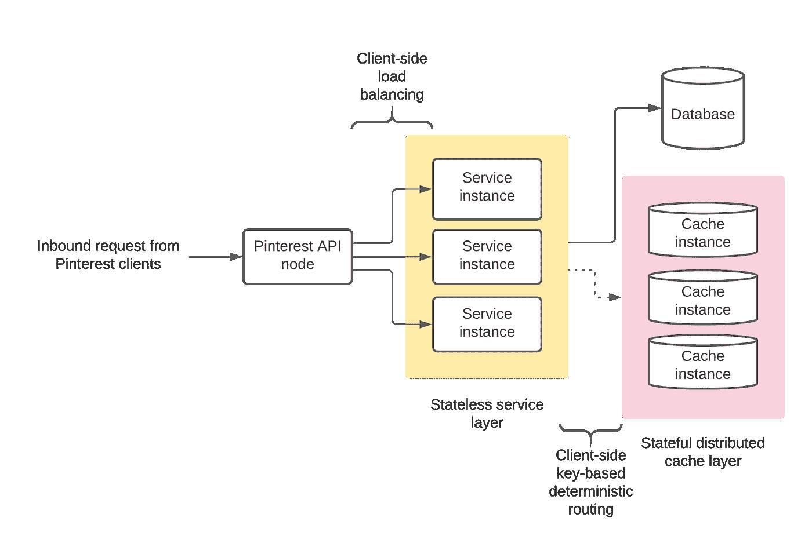
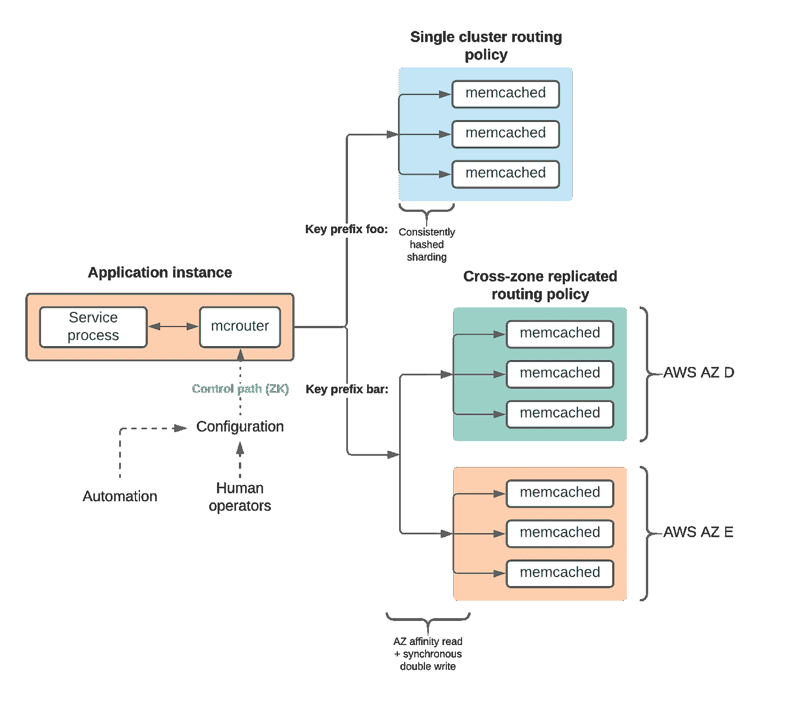
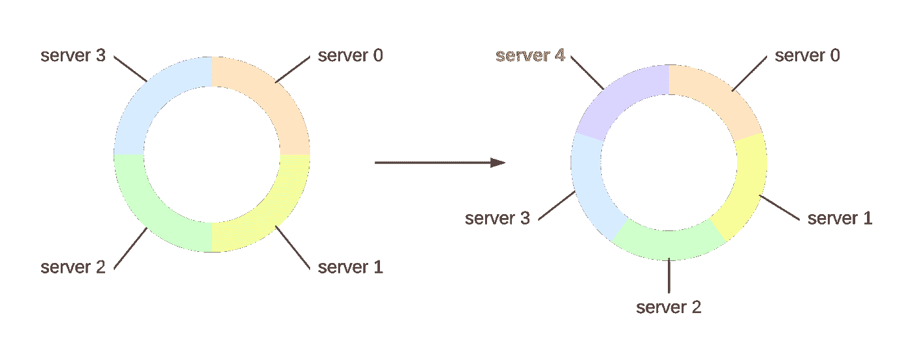

# 扩展 Pinterest 的缓存基础设施

> 原文：<https://medium.com/pinterest-engineering/scaling-cache-infrastructure-at-pinterest-422d6d294ece?source=collection_archive---------0----------------------->

林义杰|软件工程师，存储和缓存

随着越来越多的 Pinterest 用户到 Pinterest 寻找灵感，对 Pinterest 核心基础设施系统的需求正以前所未有的速度增长。面向许多服务和数据库的分布式缓存层是我们的核心存储系统之一，位于 Pinterest 基础设施堆栈的底部，负责吸收这一增长所驱动的绝大多数后端流量。

Pinterest 的分布式缓存车队跨越由数千台机器组成的 EC2 实例足迹，缓存数百 TB 的数据，峰值时每秒超过 1.5 亿次请求。该缓存层通过降低整个后端堆栈的延迟来优化顶级性能，并通过减少昂贵的后端所需的容量来提供显著的成本效益。我们将对支持 Pinterest 大规模缓存车队的基础设施进行深入的技术探讨。

# 应用程序数据缓存

每个传入 Pinterest 内部的 API 请求都会通过堆栈扇出到一个复杂的 RPC 树，在完成其关键路径之前会触及数十个服务。这可以包括查询核心数据(如电路板和引脚)的服务、提供相关引脚的推荐系统以及垃圾邮件检测系统。在这些层中的许多层，只要输入数据可以用唯一的键描述，离散工作单元的结果可以缓存在临时存储中以供将来重用。

在 Pinterest，分布式缓存层最常见的用途是存储带有后备语义的中间计算结果。这使得缓存层能够吸收大量流量，否则这些流量将流向计算成本高或存储成本高的服务和数据库。凭借个位数毫秒级尾部延迟和极低的每请求基础设施成本，分布式缓存层提供了一种高性能且经济高效的机制来扩展各种后端，以满足不断增长的 Pinterest 需求。

*Figure 1: Highly simplified lifecycle of an API request through Pinterest’s main API service, its dependency service backends, and the distributed cache layer.*

将分布式缓存层作为服务提供，使应用程序开发人员能够专注于实现业务逻辑，而不必担心分布式数据一致性、高可用性或内存容量。缓存客户端使用通用路由抽象层，确保应用程序具有容错和一致的数据视图。此外，服务器群可以独立于应用层进行横向扩展，从而透明地调整内存或吞吐量，以适应资源使用情况的变化。

# 分布式缓存的支柱:Memcached 和 Mcrouter

Memcached 和 mcrouter 构成了 Pinterest 分布式缓存基础设施的主干，在 Pinterest 的存储基础设施堆栈中发挥着关键作用。M [emcached](https://github.com/memcached/memcached) 是一个用纯 c 语言编写的开源、高效、内存中的键值存储。M [crouter](https://github.com/facebook/mcrouter) 是一个[第 7 层](https://en.wikipedia.org/wiki/OSI_model#Layer_7:_Application_Layer) memcached 协议代理，位于 memcached 车队的前面，提供强大的高可用性和路由功能。

Memcached 作为缓存解决方案是一个有吸引力的选择:

*   部分由于其异步事件驱动架构和多线程处理模型，memcached 非常高效，并且易于进行水平扩展以满足容量需求。
*   [Extstore](https://github.com/memcached/memcached/wiki/Extstore) 通过位于实例的 NVMe 闪存磁盘上的二级热存储层，帮助实现令人难以置信的存储效率优势。
*   Memcached 刻意简化的体系结构提供了在其上构建抽象的灵活性，并提供了简单的水平可伸缩性来满足不断增长的需求。单个 memcached 进程本身就是一个简单的键值存储，并且故意不知道它的对等体，甚至不知道 memcached 集群的概念。
*   Memcached 在过去几十年的发展中已经在准确性和性能方面经受了考验，并被一个活跃的开源社区所包围(该社区也接受了上游的几个 Pinterest 补丁)。
*   Memcached 附带了对 TLS 终止的本机支持，允许我们通过相互 TLS 认证的流量来保护整个车队(内部构建了额外的基于 [SPIFFE](https://spiffe.io/) 的授权访问控制)。

Mcrouter 是脸书在 2014 年开源的，并且[在扩展他们的 memcached 部署](https://www.usenix.org/system/files/conference/nsdi13/nsdi13-final170_update.pdf)中发挥了至关重要的作用。出于类似的原因，它非常适合 Pinterest 的架构:

*   Mcrouter 作为整个 memcached 服务器群的有效抽象，为应用程序开发人员提供了与整个缓存群交互的单一端点。此外，使用 mcrouter 作为系统的单一接口可确保 Pinterest 上所有服务和机器的通用、全球一致的流量行为。
*   Mcrouter 提供了一个解耦的控制平面和数据平面:memcached 服务器群的整个拓扑被组织成“池”(逻辑集群)，而所有请求路由策略和指示客户端与服务器池之间交互的行为都是独立管理的。
*   Mcrouter 的配置 API 为复杂的路由行为提供了强大的[构建模块，包括区域关联路由、数据冗余复制、多级缓存层和影子流量。](https://github.com/facebook/mcrouter/wiki/List-of-Route-Handles)
*   作为使用 [memcached 的 ASCII 协议](https://github.com/memcached/memcached/blob/master/doc/protocol.txt)的第 7 层代理，mcrouter 公开了智能协议特定的功能，如请求操作(TTL 修改、动态压缩等)。
*   丰富的可观察性特性是免费提供给客户端应用程序的，提供了对我们所有基础设施上的 memcached 流量的详细可见性。对我们来说最重要的是百分比请求延迟、沿单个客户端和服务器维度划分的吞吐量、按关键前缀和关键模式划分的请求趋势，以及检测行为不当的服务器的错误率。

*Figure 2: Overview of request routing from mcrouter to memcached. Every key prefix is associated with a routing policy; two examples are shown.*

在实践中，mcrouter 被部署为服务托管的进程外代理 sidecar。如图 2 所示，应用程序(用任何语言编写)在回环上向 mcrouter 发送 memcached 协议请求，mcrouter 将这些请求代理到数千个上游 memcached 服务器。这种架构允许我们在*完全管理的*缓存服务器群中构建健壮的功能，对消费服务完全透明。

*虽然 memcached 从早期就已经是 Pinterest 基础设施堆栈的一部分，但我们围绕扩展其客户端对等物的策略已经在这些年里发生了显著的变化。具体来说，路由和发现首先是在客户端库中完成的(客户端库很脆弱，需要二进制部署)，然后是内部构建的路由代理(它不提供可扩展的构建块来实现高可用性)，最后是 mcrouter。*

# 计算和存储效率

Memcached 非常高效:单个 r5.2xlarge EC2 实例能够支持每秒超过 10 万个请求和数万个并发 TCP 连接，而没有明显的客户端延迟下降，这使得 memcached Pinterest 成为吞吐量效率最高的生产服务。这部分是由于编写良好的 C 及其架构，它利用多个工作线程独立运行一个“libevent”驱动的事件循环来服务传入的连接。

在 Pinterest，memcached 的 extstore 在存储效率方面取得了巨大的胜利，从视觉搜索到个性化搜索推荐引擎。除了 DRAM 之外，Extstore 还将缓存数据容量扩展到本地装载的 NVMe 闪存盘，从而将每个实例的可用存储容量从大约 55 GB (r5.2xlarge)增加到近 1.7 TB (i3.2xlarge)，而实例成本只是其一小部分。在实践中，尽管 DRAM 和 SSD 响应时间相差几个数量级，但 extstore 在不牺牲端到端延迟的情况下，使数据容量受限的用例受益。Extstore 的内置调优旋钮使我们能够找到一个平衡点，平衡磁盘 I/O、磁盘到内存的重新缓存率、压缩频率和积极性以及客户端尾部响应时间。

# 高可用性

Pinterest 的所有基础设施系统都是高度可用的，我们的缓存系统也不例外。利用 mcrouter 中丰富的路由功能，我们的 memcached 车队具有广泛的容错功能:

*   **部分降级或完全脱机的服务器的自动故障转移。**网络本来就脆弱且有损耗；整个缓存堆栈都认为这是一个不可否认的事实，并且旨在当服务器不可用或速度慢时保持可用性。幸运的是，缓存数据本质上是短暂的，这降低了对数据持久性的要求，否则像数据库这样的持久性存储就需要数据持久性。在 Pinterest 中，当单个服务器离线或对请求的响应太慢时，mcrouter 会自动将请求故障转移到全局共享集群，并通过主动健康检查自动将服务器带回服务池。结合针对单个服务器故障的丰富代理层工具，这使得运营商能够在最短的生产停机时间内识别和更换行为不当的服务器。
*   **通过透明的跨区域复制实现数据冗余。**跨不同 AWS 可用性区域(AZs)的多个集群复制关键用例。这允许在零宕机的情况下完全丢失 AZ:所有请求都自动重定向到位于单独 AZ 中的健康副本，在该副本中有完整的数据冗余副本可用。
*   **针对真实生产流量的隔离阴影测试。【mcrouter 中的流量路由功能使我们能够针对实际生产请求执行各种弹性练习，包括集群到集群的暗流量以及人为延迟和停机时间注入，而不会影响生产。**

# 负载平衡和数据分片

分布式系统的关键特征之一是水平可伸缩性——横向扩展*而不是纵向扩展*以适应额外流量增长的能力。在 Pinterest，我们的绝大多数缓存工作负载都受到吞吐量的限制，这就要求集群中的实例数量与入站请求量大致成线性比例。然而，memcached 本身是一个非常简单的键值存储，它本身并不知道集群中的其他对等点。每秒数以亿计的请求实际上是如何通过网络路由到正确的服务器的？**

Mcrouter 对每个传入请求的缓存关键字应用哈希算法，以确定性地将请求分割到池中的一台主机。这对于在服务器之间均匀分布流量非常有效，但 memcached 有一个独特的要求，即其集群需要*可任意扩展*——运营商需要能够自由调整集群容量以响应不断变化的流量需求，同时最大限度地减少对客户端的影响。

一致的散列确保即使合格碎片的总数增加或减少，大多数键空间分区也映射到同一个服务器。由于高度本地化和可预测的命中率影响，这使得系统可以对客户端层透明地进行横向扩展，从而降低了容量的微小变化导致群集范围命中率灾难性下降的可能性。

*Figure 3: Consistent hashing keeps most of the keyspace server allocation intact when one node is added to an existing pool.*

客户端路由层将单个密钥前缀映射到若干路由策略之一背后的一个或多个这样的一致散列池，包括用于跨 AZ 复制集群的 AZ-affinity 首选路由、用于由基于闪存的故障转移容量集群支持的内存集群的 L1L2 路由等等。这允许隔离流量，从而按客户端用例分配容量，并确保 Pinterest 机群中任何客户端机器的缓存路由行为一致。

# 权衡和考虑

所有足够复杂的基础设施系统都有一个特点，那就是(通常是非常细微的)权衡。在构建和扩展我们的缓存系统的过程中，我们权衡了许多权衡的成本和收益。下面重点介绍几个例子:

*   中间代理层会带来额外的计算和 I/O 开销，尤其是对于具有严格延迟 SLO 的性能关键型系统。然而，mcrouter 提供的高可用性抽象、灵活的路由行为和许多其他功能远远超过了性能损失。
*   全球共享的代理配置在变更部署中存在风险，因为所有控制平面变更都在 Pinterest 部署的数万台机器上应用。然而，这也确保了对 memcached 车队拓扑和相关路由策略的全局一致了解，而不管客户端在 Pinterest 中的部署位置或部署方式。
*   我们运营着大约 100 个不同的 memcached 集群，其中许多具有不同的租用特征(专用与共享)、硬件实例类型和路由策略。虽然这给团队带来了相当大的维护负担，但它也允许对每个用例进行有效的性能和可用性隔离，同时还通过选择最适合特定工作负载使用情况的参数和实例类型来提供效率优化的机会。
*   在大多数情况下，利用一致的哈希方案在上游服务器池中进行负载分配非常有效，即使密钥空间的特征是前缀相似的密钥集群。但是，这并不能解决热键的问题——对于一组特定的键，请求量的异常增加仍然会导致服务器集群中的热碎片造成的负载不平衡。

# 未来的工作

展望未来，我们希望继续提高 Pinterest 缓存基础设施的效率、可靠性和性能。这包括实验项目，如将 memcached 核心直接嵌入到主机应用程序进程中，用于性能关键的用例(允许 memcached 与服务进程共享内存空间，并消除网络和 I/O 开销)，以及可靠性项目，如为多区域冗余设计可靠的解决方案。

感谢 Pinterest 的整个存储和缓存团队对这项工作的支持，特别是 Ankita Girish Wagh 和 Xu。