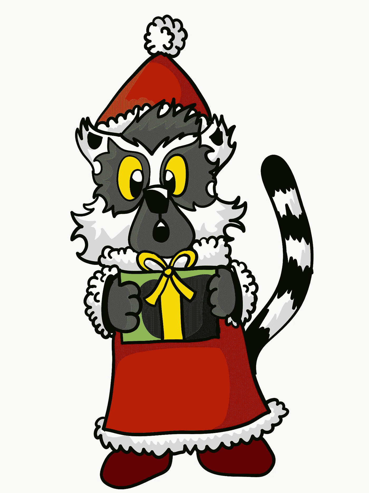
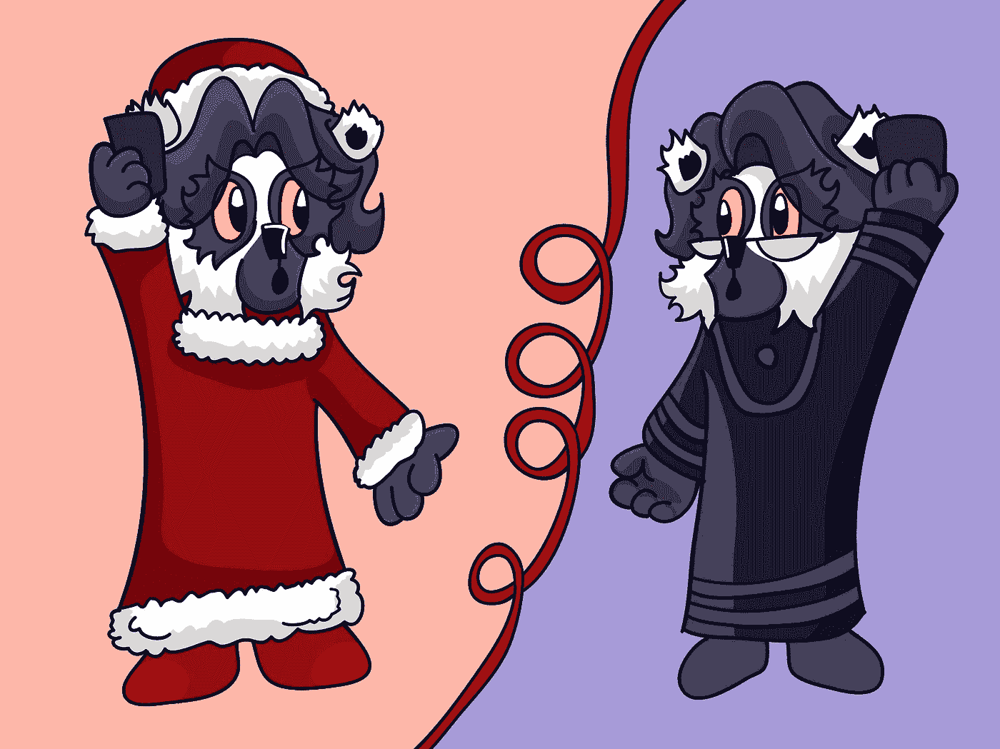
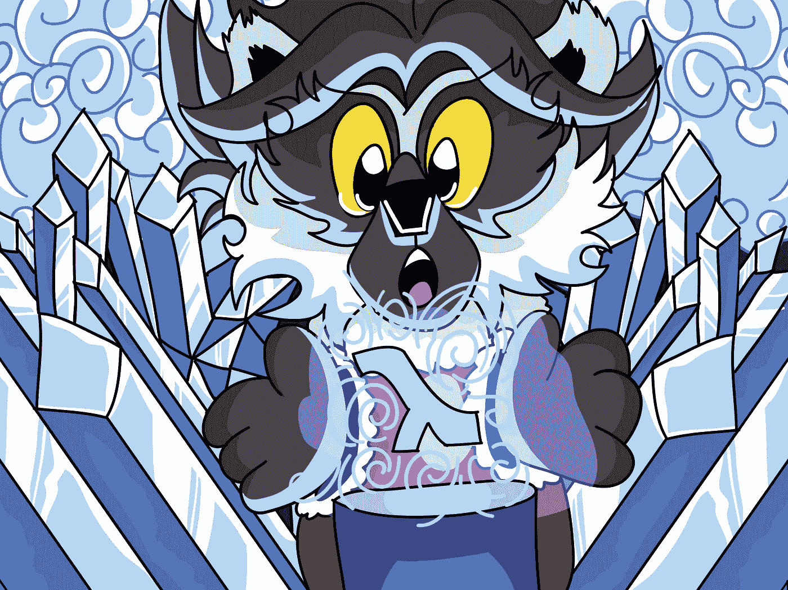
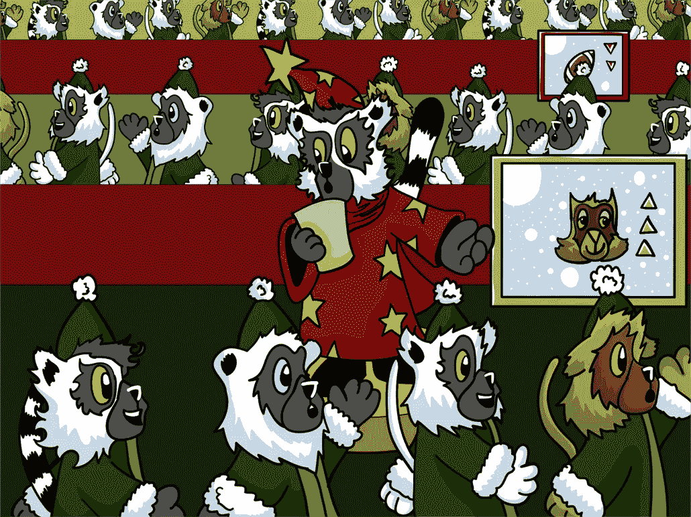
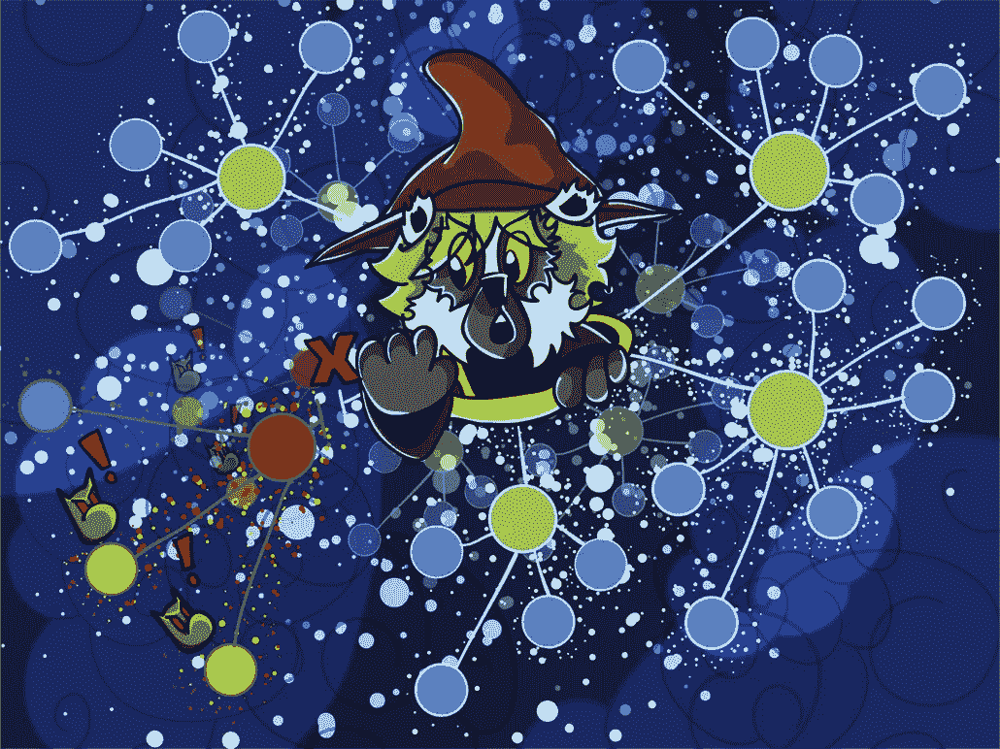

# 攀登圣诞节:图解冒险

> 原文：<https://medium.com/square-corner-blog/scaling-christmas-an-illustrated-adventure-a2ea739f5451?source=collection_archive---------5----------------------->

> 注意，我们已经行动了！如果您想继续了解 Square 的最新技术内容，请访问我们的新家[https://developer.squareup.com/blog](https://developer.squareup.com/blog)

狐猴回来了！这一次他们是来参加一个特别的圣诞主题冒险活动的，这次活动是关于圣诞节是如何度过的，他们在节日活动中运用了实践经验。

现在让我们看看他们今天要做什么。

# 遇见红色

你可能已经在过去的某个时候在其他的演讲和活动中见过瑞德。对于那些还没有享受过这种乐趣的人来说，红色是一种神奇的狐猴。他也特别喜欢圣诞节，尤其是礼物。

每年他都会给圣诞老人寄一封信，非常准时。每年，圣诞老人都会送来礼物。

这就提出了一个问题:圣诞老人到底是怎么做的？他是如何衡量圣诞节的？

让我们去北极旅行，看看能否找到一些答案。

# 北极

圣诞老人从他的小生意开始。他一年只需要去几个村庄，他完全能够做到。

随着时间的推移，对圣诞节的需求越来越大，很明显，目前的设置是不会削减它的。

几年后，我们来到了现在的北极。

# 今天的北极

圣诞节已经全球化，而且没有停止的迹象。它的规模扩大到令人难以置信的数字，持续增长像圣诞老人从来没有想象过。

这提出了一个好问题:什么改变了？狐猴究竟是如何从勉强能够服务一个小区域发展到为整个世界提供服务的？

你看，圣诞老人遇到了一个人。圣诞夫人。

# 克劳斯夫人:真正的策划者

圣诞夫人是圣诞节发展到今天规模的天才。她帮助启动了多地区递送系统、配送和其他技术，这些都是圣诞老人从未见过的。

就计划而言，她的才华是无止境的，圣诞老人的速度已经成为一个传奇。他们一起过圣诞节。

直到一个决定性的夜晚，圣诞老人生病了。

# 圣诞老人病了！

离圣诞节只有两天了，圣诞老人和他的技术领导得了讨厌的，故事方便的感冒！随着他们的退役，再多的计划也无法拯救圣诞节。

没有他们的线索，也没有圣诞老人，圣诞老奶奶打了个电话。

# 加强

是时候给*他们*打电话了。一个传奇的快乐狐猴乐队，因其愚蠢和对奇思妙想的热爱而闻名全国，彩虹旅。

# 说明

因此，克劳斯夫人打电话给他们的领导人维奥莱特，解释了情况。她告诉维尔莉特圣诞老人生病了，他们是如何失去线索的，他们是如何迫切需要帮助来维持各种各样的圣诞任务。

“别担心，”维奥莱特回应道，“我知道适合这项工作的狐猴。”

# 彩虹之旅

因此，维奥莱特召集了彩虹之旅的成员，并解释了所发生的一切。他们惊呆了！没有圣诞节？那永远不会发生。

狐猴们同意帮忙，所以 Violet 给他们布置了任务:攀登圣诞节。

# 代码冻结

克劳斯夫人负责代码冻结，以确保没有顽皮的狐猴可能会发布新的玩具版本，而他们仍然在用它的模板制作新玩具。

这种类型的努力必须在顶部的顶部进行，以确保所有的狐猴都清楚地意识到在整个北极不会有部署或改变。

# 记录和监控

维奥莱特负责监控和记录。

区域感知统计数据有助于他们决定谁淘气谁乖，预测容量需求，并能够查看过去的交付率和需求数据。如果没有监测和记录，狐猴将会盲目前进，所以这是一个特别关键的项目。

对于扩展和容量规划，数据是关键，因为它为决策提供信息，并为比较提供基础，以了解哪些可行，哪些不可行。

# 待命轮换

萨芙蕾负责随叫随到。

他确保当有东西着火时呼叫正确的狐猴，就像节日期间经常做的那样。他还决定某个事件是否真的需要分页，并帮助执行服务的基本维护，以保持它们平稳运行。

他密切关注日志和异常情况，以此作为应对网络瘫痪的第一道防线。

# 负载平衡

朱砂照顾弹性字母平衡。

她确保所有收到的信件都分发到正确的玩具工厂。她格外小心，确保来自一个地区的信件以最快的速度到达同一地区的玩具工厂。

如果美国西部地区的一只狐猴碰巧送来一封信，她会确保这封信被送到美国西部地区的一家玩具工厂。亚洲、欧洲和其他主要地区也是如此。

# 自动缩放

红色负责自动缩放。

现在对猫的需求显著上升，这意味着需要更多的玩具制造商从当地收容所为所有新的充满爱的家庭寻找和收养合适的猫。

同样，目前对足球的需求也不太高，所以 Red 减少了玩具制造商生产足球的数量。

他根据从 Violet 那里得到的关于有多少请求的信息做出这些决定。

# DDoS 预防和存在点

黄绿色负责确保巨魔不能利用一个叫做礼物点数的系统来破坏圣诞节。

巨魔特别喜欢 DDoS 攻击，或者说是分布式拒绝圣诞老人攻击。

每个请求首先通过一个地区点，如果太多的邮件从该地区发送，Chartreuse 可以关闭它，以确保其余的传递系统可以像正常一样运行。

她确保记录下其他地区交付后可能受到影响的任何优秀儿童，以给予额外的特殊礼物。

# 灾难恢复

因为所有的狐猴一起工作，如果事情真的发生了，他们有能力和信息从零开始重建一切。

你看，他们认为任何事情都可能在任何时候发生，所以他们准备了一种方法来恢复事情以防万一。

最有趣的时候是整个部署管道停止运行的时候。当您的部署方法失败时，部署修复程序是相当困难的。

在节日期间，可以很安全地假设总会有一些事情发生，所以最好有一个关于如何恢复所有服务的行动计划。

# 圣诞老人回来了！

但是等等！圣诞老人更好！(正好在我们的狐猴设法让圣诞节开始之后)…除了一群快乐的狐猴让圣诞节发生之外，他还能找到什么呢？

# 感谢给予

圣诞老人感谢所有狐猴为圣诞节的到来所做的辛勤工作，因为如果没有一个好的团队来照顾运营，假期根本不会发生。

因此，在这个假期，给你的运营朋友一个击掌、一个拥抱或其他他们可能喜欢的东西，因为在假期进行扩展是一项英雄任务。节日需要更多的英雄，幸运的是，这一季他们已经准备好了！

但是有一只狐猴不见了，一只特别混乱的狐猴！所以圣诞老人不得不问…

“靛蓝和埃舍尔 C.A.T .后来怎么样了？…你是如何设法让所有的礼物准时送达的？我不记得听过这部分。”

# 交货和玛奇纳之外

世界上有谁跑得够快，可以环游整个世界？为什么，靛蓝和他的朋友埃舍尔猫！埃舍尔有能力弯曲空间和时间，靛蓝设法装配了一个火箭雪橇只是为了这个场合。

“啊哈哈哈哈哈哈哈哈！”靛蓝尖叫着，和埃舍尔猫一起飞过天空。“亲爱的朋友，我们会让圣诞节来临的！右边第二颗星，一直往前走…！啊，对，错的童话。”

因此，两人去了，翘曲的时间，以确保所有的交付是正确的时间。

顺便说一句，Indigo 希望你们都考虑高顶礼帽，他发誓圣诞老人明年会戴一顶，那会很流行的。

# 包扎

一如既往，我希望你喜欢这个神奇的圣诞小故事。

应该指出的是，所有圣诞老人的助手狐猴都获得了公平合理的工资，并在节日期间持续工作。在这个故事中，没有狐猴或火箭雪橇受到伤害，但有一个特别晕机的电脑断层扫描仪不愿意再做一次。

祝大家节日快乐，无论你的节日是什么，也祝新年快乐！

