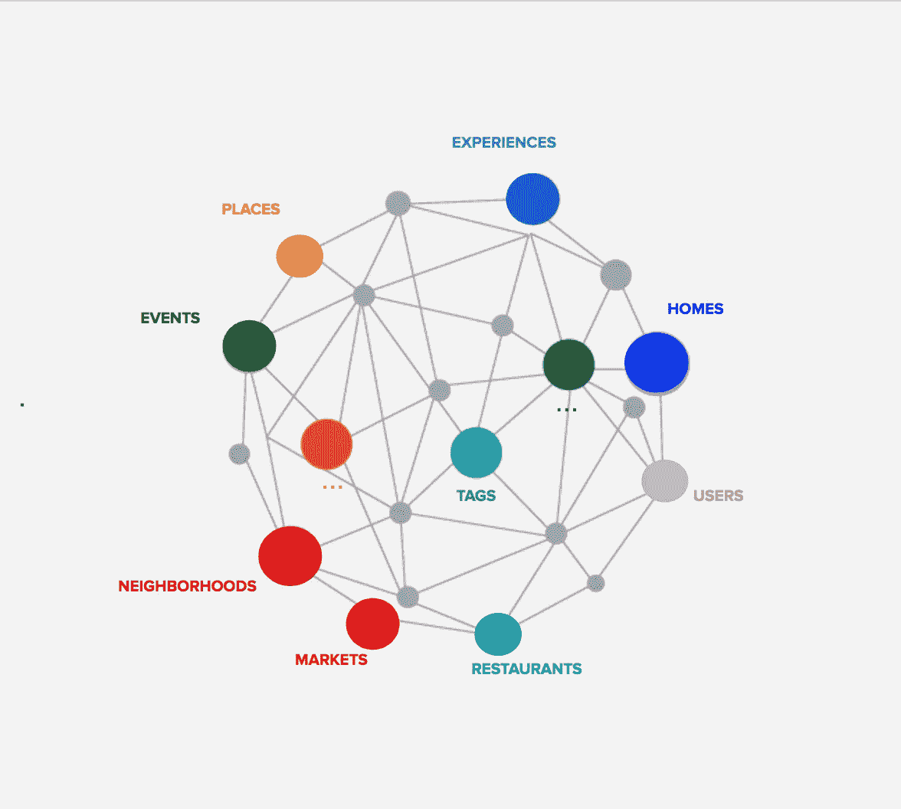
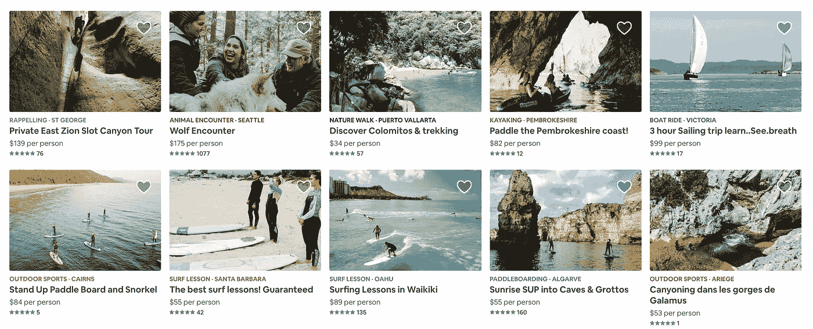
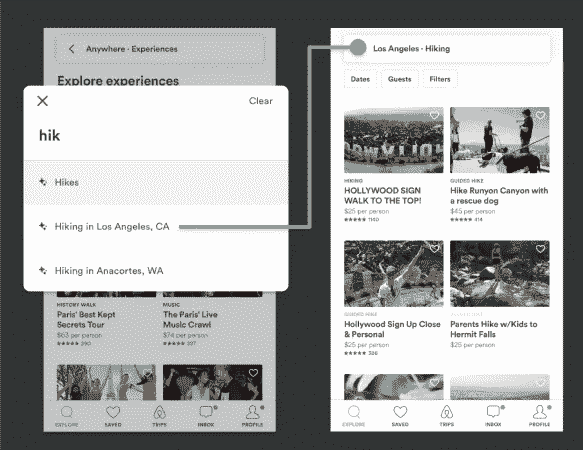
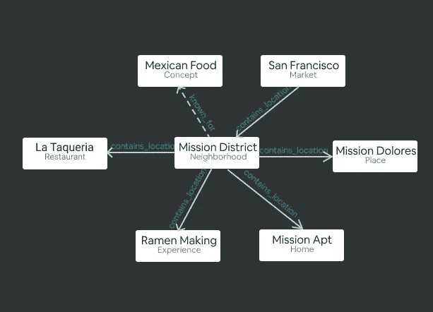
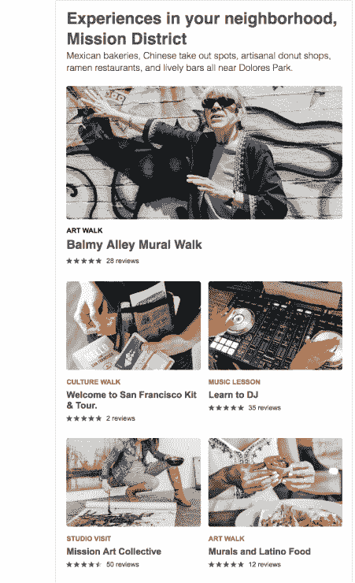

# 在 Airbnb 扩展知识访问和检索

> 原文：<https://medium.com/airbnb-engineering/scaling-knowledge-access-and-retrieval-at-airbnb-665b6ba21e95?source=collection_archive---------1----------------------->

## 介绍我们用于编码关系和呈现相关信息的知识图

Cherry blossoms in full bloom in [Tokyo](https://www.airbnb.com/s/Tokyo--Japan/all?refinement_paths%5B%5D=%2Ffor_you&place_id=ChIJ51cu8IcbXWARiRtXIothAS4&query=Tokyo%2C%20Japan)

想象一下，你终于可以去梦想中的地方度假了——三个国家，七个城市，几千英里。这是你想要的一切，甚至更多，对吗？但是你从哪里开始呢？你如何知道吃什么，去哪里，如何体验让你的目的地真正独特的东西？你要找的所有信息都在 Airbnb 上……在某个地方……问题是，“我们如何在你要找的确切时间把那些信息的*相关*部分呈现给你？”

发现你*想要的*和*需要的*对一个目的地的了解对整个旅行体验至关重要，尤其是当你去一个你从未去过的地方旅行时。为了向人们展示相关的上下文，我们需要某种方式来表示不同但相关的实体之间的关系(比如城市、活动、美食等等)。)上，以便轻松获取关于他们的重要相关信息。这些类型的信息将变得越来越重要，因为我们正在成为一个端到端的旅行平台，而不仅仅是一个呆在家里的地方。知识图是我们满足这一需求的解决方案，为我们提供了支持 Airbnb 所有垂直行业所需的技术可扩展性，以及定义抽象关系的灵活性。

在这篇文章中，我将首先给出知识图如何工作的高层次概述。然后，我们将更深入地探讨这是如何实现对整个平台的扩展的，以及我的引入位置数据的夏季项目是如何实现我们呈现相关内容的目标的。

# 旅行所需的信息类型

除了为你的旅行提供一个温馨的家外，你还需要知道什么才能像布莱恩说的那样获得 [11 星级体验](/@reidhoffman/how-to-scale-a-magical-experience-4-lessons-from-airbnbs-brian-chesky-eca0a182f3e3)？当你考虑去某个地方的时候，这里有一些你可能会想到的事情。

## 我去哪里旅行，住在什么地方？

在这个阶段，你需要决定你旅行的目的地，以及你想探索目的地的哪些部分。这可以包括:

*   哪些目的地在和我相似的人群中比较受欢迎/流行，哪些目的地有符合我兴趣的活动？
*   哪些街区符合我的兴趣？(我对亲近自然的社区更感兴趣，还是对以夜生活闻名的社区更感兴趣)

## 我该怎么办？

在第二阶段，你已经想好了你想去哪里旅游和住在哪里，但是你需要想好你真正想做什么和看什么。也许你会想:

*   **美食&饮品**(当地的美食以什么闻名？)
*   **娱乐/活动**(这个目的地有哪些好的活动？)
*   **地标/名胜**(这里有哪些受欢迎/受欢迎的地方？)

那么，我们如何以一种可概括和可扩展的方式将所有这些信息呈现给人们呢？

# 知识图表

A visualization of the Knowledge Graph

知识图并不是一个新概念。它已经在许多公司成功使用(最著名的例子是[谷歌](https://neilpatel.com/blog/the-beginners-guide-to-the-googles-knowledge-graph/)，它使用它来驱动他们的搜索引擎，并为特定的查询提供相关的上下文)。

## 为什么一个图结构是可伸缩的？

通常，工程师使用关系结构，其中模式定义了每行数据包含的内容。这是保存数据的首选方式，因为它非常适合事务性流程，因为它使访问数据行变得非常快。但是，当您有许多不同对象的表，而这些对象在各个列中可能包含相同的关系信息(例如:家庭或经历所在的城市，或经历和目的地已知的活动类型)时，会有操作负担。这就是图结构发挥作用的地方。

尽管我们的底层数据存储仍然是关系型的，但是根据这个图来组织我们的查询给了我们维护**数据语义**的能力。我们希望与体验相关的冲浪运动与夏威夷闻名的冲浪运动是一样的。这种围绕 Airbnb 平台上实体之间关系的结构类型为我们提供了将分类扩展到任何数量的事物所需的可伸缩性和灵活性。通过用同一个对象来代表我们世界中的所有事物，每当我们向我们的平台引入新产品时，我们就消除了重新定义世界的操作开销。

通过这种方式，我们可以支持我们的目标:1)对实体之间数量呈指数增长的关系进行编码，以及 2)使沿着这些连接的遍历变得容易。

## 图的结构

sample “taxonomy” of our graph

我们知识图表的分类是指我们用来描述我们的库存和我们周围世界的词汇。分类法是分层的(如上所示)，因此我们可以将像“运动”这样的高级概念映射到一个非常具体的活动，比如“冲浪”我们想要维护的主要约束是知识图是[互斥的和集体穷举的](https://www.caseinterview.com/mece)，这样我们可以保持分类法非常精简，以避免重复数据。由于我们拥有的图形结构，很容易将这种分类法扩展到数十层或数百层深度，并且仍然呈现高层概念的相关清单。

在图中，我们有**节点**和**边**。节点是指 Airbnb 平台上的任何类型的实体(餐厅、邻里、体验、活动等。).边指的是图中任何实体之间存在的关系类型。在该模型下，对于不同类型的实体有不同类型的节点，对于不同类型的关系有不同类型的边(位于、标记等等)。).从那里，我们有一个灵活的 API 来查询由某些类型的关系连接的邻居，并可以通过知识图中相应表示的唯一标识符来索引我们的库存项目。

page from [https://www.airbnb.com/s/experiences?refinement_paths[]=/experiences/Concept/Refinement/Nature](https://www.airbnb.com/s/experiences?refinement_paths[]=/experiences/Concept/Refinement/Nature)

例如，您可以看到我们在搜索的 URL 中使用细化路径来填充给定类型的体验。

一旦达到数据的临界质量，我们就可以开始考虑根据图表中已经存在的数据进行自动推断。例如，如果某样东西被贴上“自然”和“徒步”的标签，也许我们可以推断它也应该被贴上“徒步”的标签。我们目前正在做一些工作，在图中的实体和关系上训练一个文本嵌入模型，以查看哪些边缘可能存在，而目前并不存在。将来，这种连接的自动推断将允许我们在库存到达我们的平台时对其进行快速分类，而不需要人工操作。

# 知识图中的位置数据

在夏季之前，知识图的主要用途是支持搜索我们的分类法，寻找与这些标签相关的体验。

searching for “Hiking” a tag in our taxonomy

我今年夏天的主要项目是将位置的概念引入知识图。为什么是地点？两个主要原因:

1.  **通过位置轻松遍历 Airbnb 库存:**这可以追溯到我们上面讨论过的图结构，它支持沿着关系轻松遍历。正因为如此，在图中直观地表示位置是有意义的，因为地理实体本质上是分层的(想想国家→城市→街区→餐馆等)。).
2.  **推断关于位置的属性以进行个性化:**我们可以改善 Airbnb 旅行者发现体验的方法之一是通过位置对我们展示的内容进行个性化。你可能会想象当你搜索东京和纽约时，不同类型的食物/活动会被强调。也许东京最好的寿司店的部分出现在顶部附近，而纽约的特色部分是百老汇体验。当我们将体验与标签和概念联系起来时，这种个性化就可以实现了(比如“剧院”与“纽约”，寿司与“东京”)。

## 地理层级节点/边的结构

Visualization of the hierarchy for location relationships

如上图所示，我们现在可以轻松地在 Airbnb 上表示事物之间的地理关系。在任何给定的市场中，都有几个街区，每个街区都包含 Airbnb 上成吨的库存项目(*体验*、*家园*、*场所*和*餐厅*)。

*邻域*、*市场*和其他位置节点在知识图中具有不同的类型，因为不同的位置类型可能需要不同类型的信息，并且显式编码层级使得容易找到期望粒度的适当级别。此外，还有一个表示地理层次结构的单个边缘类型， *contains_location，*，以便简化从高级地理节点到叶库存实体的遍历。

作为概念验证，我在我们的房屋预订后电子邮件中推出了一个社区部分的实验，以展现客人所住社区的描述和体验，为客人提供更多当地背景。你可以想象在未来，搜索结果会按照人们所熟知的社区(夜生活、食物等社区)进行分组。)，以及个性化我们展示的跨垂直领域的库存种类(人们在该地区经常进行的活动的体验和该地区特色美食的餐厅)。

neighborhood section in email

# 最后的想法

知识图谱是一个基金会的开端，该基金会使 Airbnb 能够将旅行规划变得比以前更加直观和个性化。通过提供基础设施和界面来访问关于我们周围世界的干净、结构化的数据，知识图可以让 Airbnb 社区发现他们以前从未接触过的东西。想象一下，您可以看到您可能需要的信息，而不必在搜索栏中明确键入这些信息。Airbnb 可以为旅行提供灵感，然后告诉人们如何充分利用他们的旅行到一个特定的目的地。在旅行规划和决策过程的每一步，我们都可以为每个人提供个性化的额外背景和内容，使您从脑海中的梦想之旅变得前所未有的轻松，置身于新的环境中，并结识令人惊叹的当地人。

## 承认

感谢我的经理 [Elizabeth Ford](https://www.linkedin.com/in/infraredflower/) 、帮助我撰写这篇文章的知识图谱团队:[魏](https://www.linkedin.com/in/xiaoyawei)、[石勒](https://www.linkedin.com/in/leishi777/)、 [Manuel Ebert](http://1450.me/) ，以及 Inform 和 Trip 平台上所有一路帮助我的人，包括 Yizheng Liao 和 [Chris Zhu](https://www.linkedin.com/in/chris-zhu) ，他们让我对 Airbnb 的数据科学/推理工作有了更多的了解，还有 Xiaoyou Wang 和 Lumen Bigott，他们帮助我启动了邻里电子邮件实验！今年夏天我过得很愉快，真的很享受拥有一些东西的感觉，这些东西有望在未来几年里帮助 Airbnb 社区:)向所有出色的实习生和我遇到的让这个夏天变得如此有趣和有益的人大声欢呼！我会想念乒乓球桌和拉面吧:’(

如果你对我在 Airbnb 的经历或其他任何事情有任何疑问，请随时[联系](https://www.linkedin.com/in/spencerchang1/) [和](http://spencerchang.me)！！

## 在 [airbnb.io](http://airbnb.io) 查看更多我们的精彩作品，并在 Twitter 上关注我们: [@AirbnbEng](https://twitter.com/AirbnbEng)