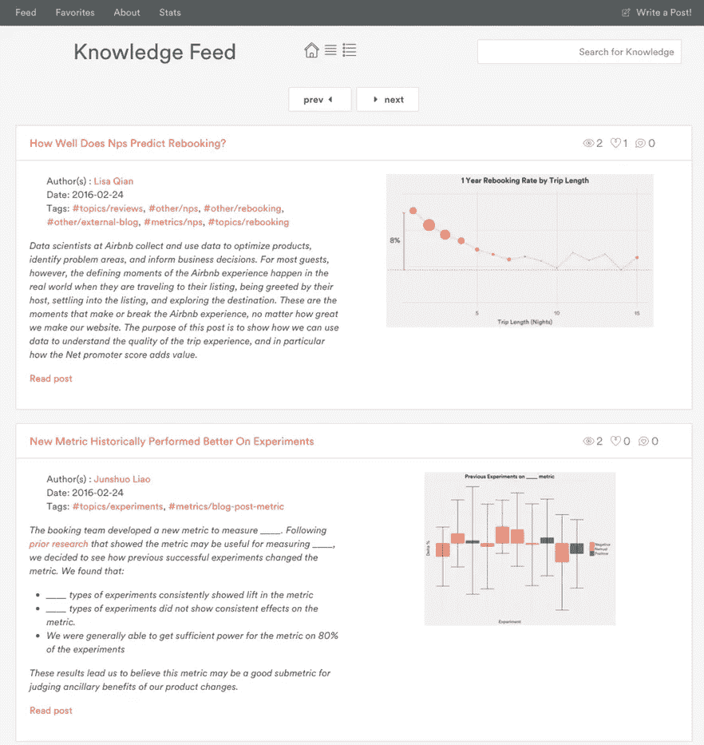
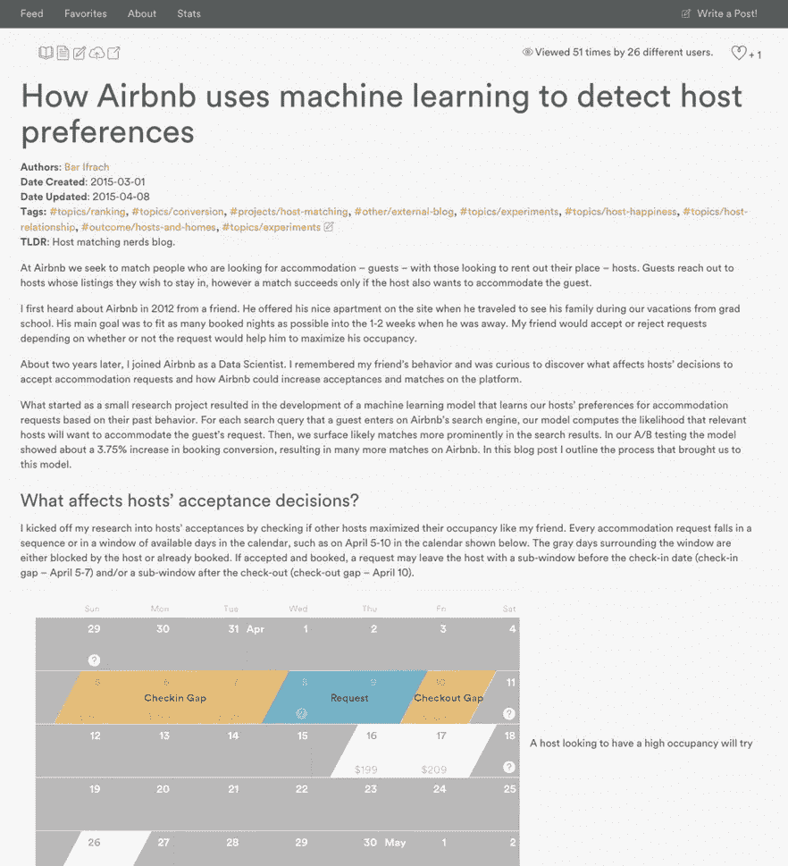

# 在 Airbnb 扩展知识

> 原文：<https://medium.com/airbnb-engineering/scaling-knowledge-at-airbnb-875d73eff091?source=collection_archive---------0----------------------->

由[切坦·夏尔马](https://medium.com/u/f9f49731249a?source=post_page-----875d73eff091--------------------------------)和[简·奥弗古尔](https://medium.com/u/fbd0429a73e?source=post_page-----875d73eff091--------------------------------)

# **问题**

Airbnb 数据团队的一项职责是[提升](http://nerds.airbnb.com/scaling-data-science/)利用数据做出决策的能力。我们将[数据访问](http://airbnb.io/airpal/)民主化，让所有员工能够做出基于数据的决策，让每个人都能够使用[实验](http://nerds.airbnb.com/experiment-reporting-framework/)来正确衡量他们决策的影响，并将对用户偏好的洞察转化为[数据产品](http://nerds.airbnb.com/airbnb-machine-learning/)，从而改善 Airbnb 的使用体验。最近，我们开始解决一个不同类型的问题。随着组织的成长，我们如何确保一个人发现的洞察力有效地传递到目标接收者之外？在内部，我们称之为**扩展知识**。

当我们的团队只有几个人时，分享和发现研究成果和技术是很容易的。但是随着我们团队的成长，曾经是小问题的问题变得越来越重要。以 Jennifer 为例，她是一名新的数据科学家，希望扩展一位同事在主机拒绝主题方面的工作。以下是我们将会看到的情况:

1.  Jennifer 向团队中的其他人询问以前的工作，然后收到了一大堆演示文稿、电子邮件和 Google 文档。
2.  以前的作品没有最新的代码。Jennifer 在原作者的机器或过时的 GitHub 链接上找到了本地副本。
3.  摆弄完代码后，Jennifer 意识到它与之前的情节略有不同。Jennifer 决定要么修改偏离的代码，要么从头开始。
4.  在花时间复制结果或放弃并从头开始后，她开始工作。
5.  Jennifer 通过演示文稿、电子邮件或 Google Doc 分发结果，使循环永久化。

根据与其他公司的交谈，这种经历太普遍了。随着组织的成长，跨团队和跨时间传递知识的成本也在增加。一个无效率和无政府状态的研究环境增加了成本，减慢了分析和决策的速度。因此，更简化的解决方案可以加快决策速度，并使公司在不断增长的知识库上保持敏捷。

# 解决办法

当我们一次又一次地看到这个有问题的工作流程时，我们意识到我们可以做得更好。作为一个团队，我们一起决定了我们在 DS 研究中需要的五个关键原则:

*   *再现性* —不应该有代码分叉的机会。所有的查询、转换、可视化和记录都应该包含在每篇文章中，并根据结果进行更新。
*   *质量* —没有经过正确性和精确性的审查，任何研究都不应该被分享。
*   *可消费性*——结果应该让除了作者之外的读者也能理解。美学应该是一致的，并在跨品牌的研究。
*   *可发现性*——任何人都应该能够找到、浏览和更新关于某个主题的现有作品。
*   *学习* —与再现性一致，其他研究人员应该能够利用他人工作中的工具和技术扩展他们的能力。

带着这些原则，我们调查了已经孤立地解决了这些问题的现有工具集。我们注意到 R Markdowns 和 iPython 笔记本通过结合代码和结果解决了可重复性的问题。Github 为审查过程提供了一个框架，但是不太适合代码和文字之外的内容，比如图像。可发现性通常基于文件夹组织，但是其他站点如 Quora 正在用标签构建多对一的主题继承。学习是基于网上或通过个人关系提交的任何代码。

我们一起将这些想法整合成一个系统。我们的解决方案将围绕贡献和评审工作的*流程*与呈现和分发工作的*工具*结合起来。在内部，我们称之为**知识回购**。

核心是一个 Git 存储库，我们将工作提交给它。帖子写在 Jupyter 笔记本、Rmarkdown 文件或普通 markdown 中，但所有文件(包括查询文件和其他脚本)都被提交。每个文件都以少量结构化元数据开始，包括作者、标签和 TLDR。Python 脚本验证内容，并使用 Markdown 语法将帖子转换成纯文本。我们使用 GitHub 的拉式请求系统进行审核。最后，还有一个 Flask web 应用程序，它将回购的内容呈现为一个内部博客，按照时间、主题或内容进行组织。

除了这些工具之外，我们还有一个专注于确保所有研究都是高质量和可消费的流程。与工程代码不同，低质量的研究不会产生指标下降或崩溃报告。相反，低质量的研究表现为知识不和谐的环境，团队只阅读和信任他们自己创造的研究。

为了防止这种情况发生，我们的过程结合了工程的代码评审和学术界的同行评审，包装在工具中，使其以启动速度进行。如同在代码审查中一样，我们检查代码正确性以及最佳实践和工具。和同行评审一样，我们检查方法的改进，与已有工作的联系，以及解释性声明的精确性。我们通常不打算让一篇研究文章覆盖调查的每一个角落，而是更喜欢快速的迭代，这些迭代是正确的，并且对它们的局限性是透明的。我们的工具包括内部的 R 和 Python 库，以保持品牌、美学的一致性，与我们的数据仓库集成的功能，以及使 R 和 Python 笔记本文件适应 GitHub pull 请求的文件处理。

*Figure 1 — A screenshot of the knowledge feed showing the summary cards for two posts.*

*Figure 2 — An example of a post examining gap days in host acceptance decision making.*

总之，这为我们的知识原则提供了强大的功能:

*   *再现性* —整个工作，从核心 ETL 表的查询，到转换、可视化和记录，都包含在一个文件中，Jupyter notebook、RM Markdown 或 markdown 文件。
*   *质量* —通过依赖 GitHub 在发布前的拉请求功能，同行评审和版本控制被直接放入工作流程中。
*   *可消费性*——我们的网络应用提供的降价服务隐藏了代码，并使用了我们内部的品牌美学，使技术含量较低的读者更容易获得作品。同行评审过程还提供了写作和交流方面的反馈，从而提高了作品的影响力。
*   *可发现性* —结构化元数据允许更容易地浏览过去的研究。每篇文章都有一组标签，提供了超出文件文件夹位置的多对一主题继承。用户可以订阅主题并获得新贡献的通知。文章可以加入书签，被作者浏览，或者作为博客订阅源阅读。
*   *学习* —通过让以前的工作变得容易获取，相互学习变得更容易。例如，人们可以查看彼此的查询，查看用于创造性可视化的代码，并发现新的数据源。这让数据科学家接触到了新的方法和编码技术，加快了入门速度，并使我们团队以外的人有可能了解我们的领域。

知识仓库存储了大量的内容。大部分工作由旨在回答重要问题的深度探究组成，但我们的[实验记者](http://nerds.airbnb.com/experiment-reporting-framework/)未涉及的实验结果检查也很常见。其他帖子纯粹是为了扩大数据分析人员的基础而写的，包括新方法的文章、工具或包的示例以及 SQL 和 Spark 的教程。我们的公共数据博客文章现在也存在于知识回购中，包括这篇文章。一般来说，启发是:如果它可能对将来的某个人有用，就把它贴出来！

# 将来的

知识回购仍是一项进行中的工作。从事这项工作的小团队不断地处理功能需求。我们正努力让公司所有做研究的团队都采用它，比如不使用 GitHub 的定性研究人员。为此，我们正在测试一款内置于浏览器中的降价编辑应用的内部审核流程。另一个可能的功能是提议和投票支持研究主题的版主。我们也在考虑让现有的帖子更容易分叉，并继续将它们作为新的帖子。

我们正在研究的一个问题是个人所做工作的综合。现在我们有了知识线索的档案，我们有机会将它们编织成对 Airbnb 生态系统的共同理解。我们高度重视员工拥有自己的[战略影响力](http://nerds.airbnb.com/engineering-culture-airbnb/)，并希望让每个人都能对业务的任何方面有广泛而深入的了解。在公司快速发展和团队结构变化的同时，我们目前正在迭代保持内容最新和结构化的最佳方法。

尤其是在新兴的数据科学领域，不同的数据团队可能会定期重新发明轮子。在分享我们的过程中，我们希望激励其他组织致力于解决我们正在努力解决的问题，并分享他们的经验，以便我们能够合作产生最佳实践。

## 在 [airbnb.io](http://airbnb.io) 查看我们所有的开源项目，并在 Twitter 上关注我们:[@ Airbnb eng](https://twitter.com/AirbnbEng)+[@ Airbnb data](https://twitter.com/AirbnbData)