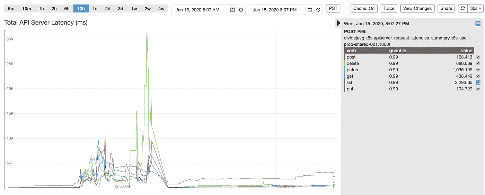
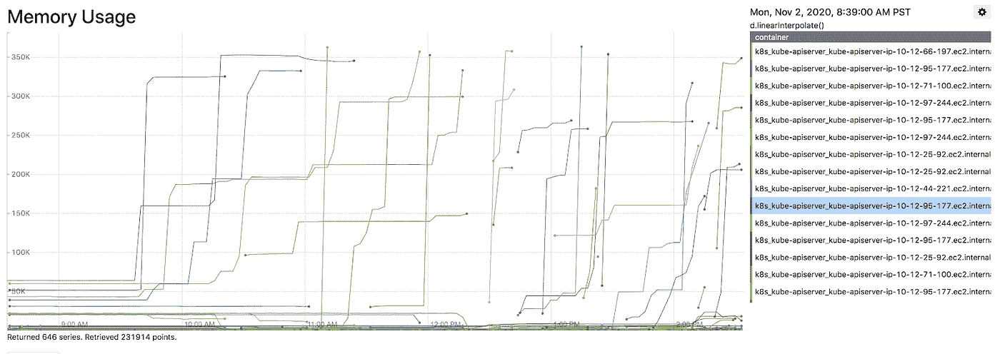
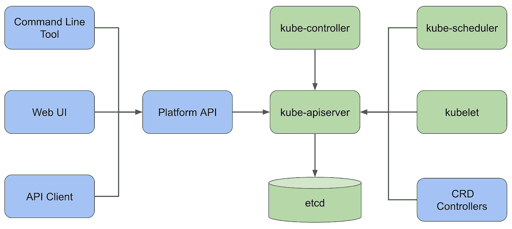
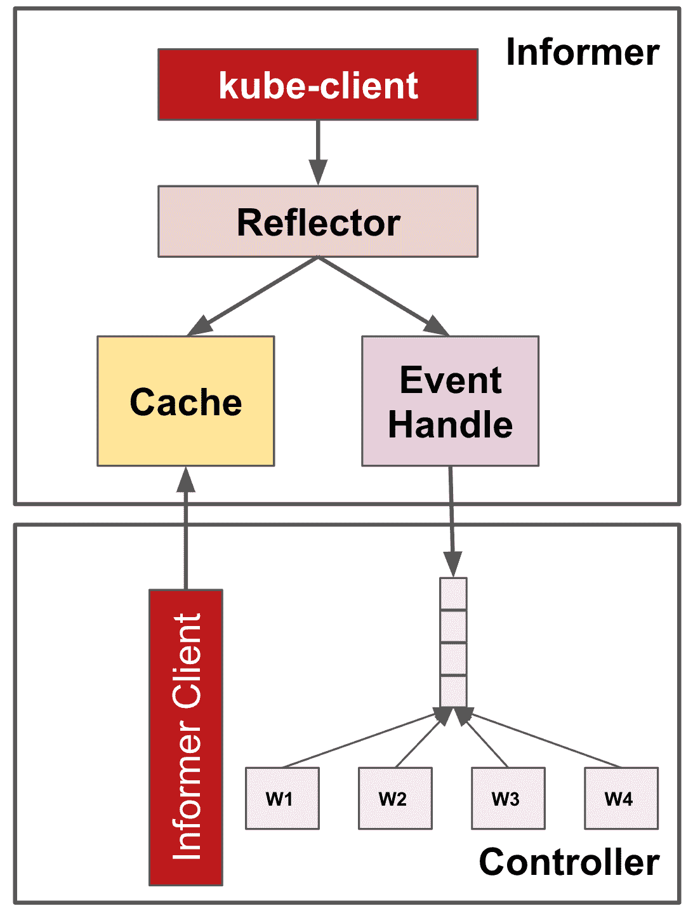
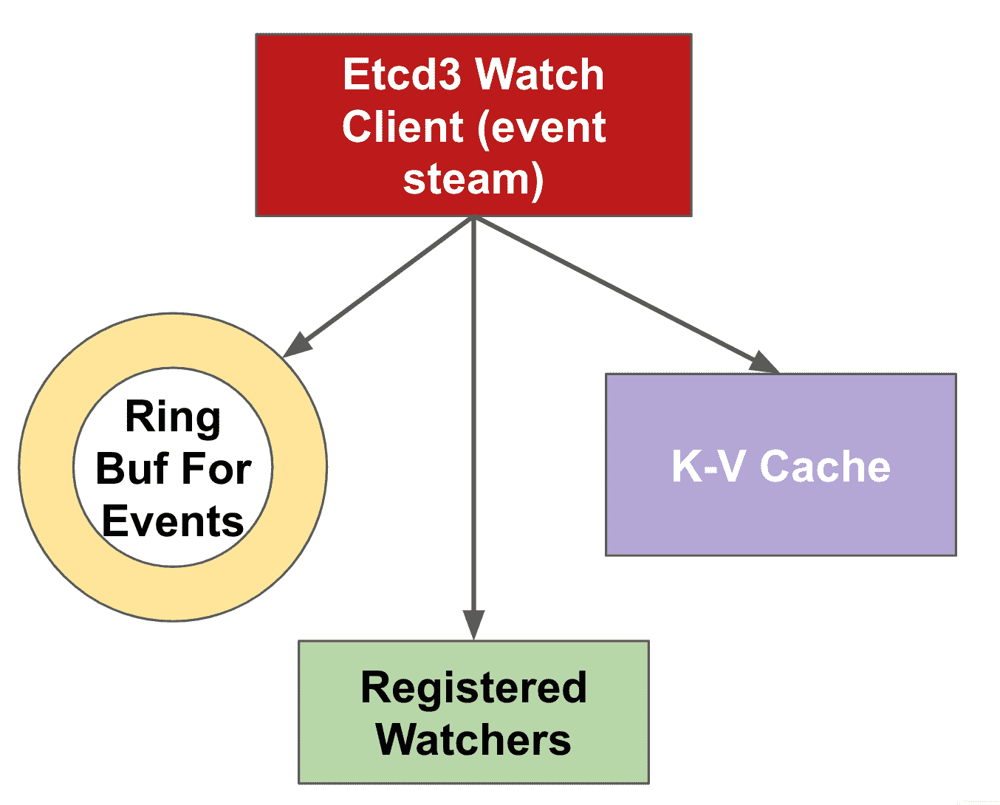
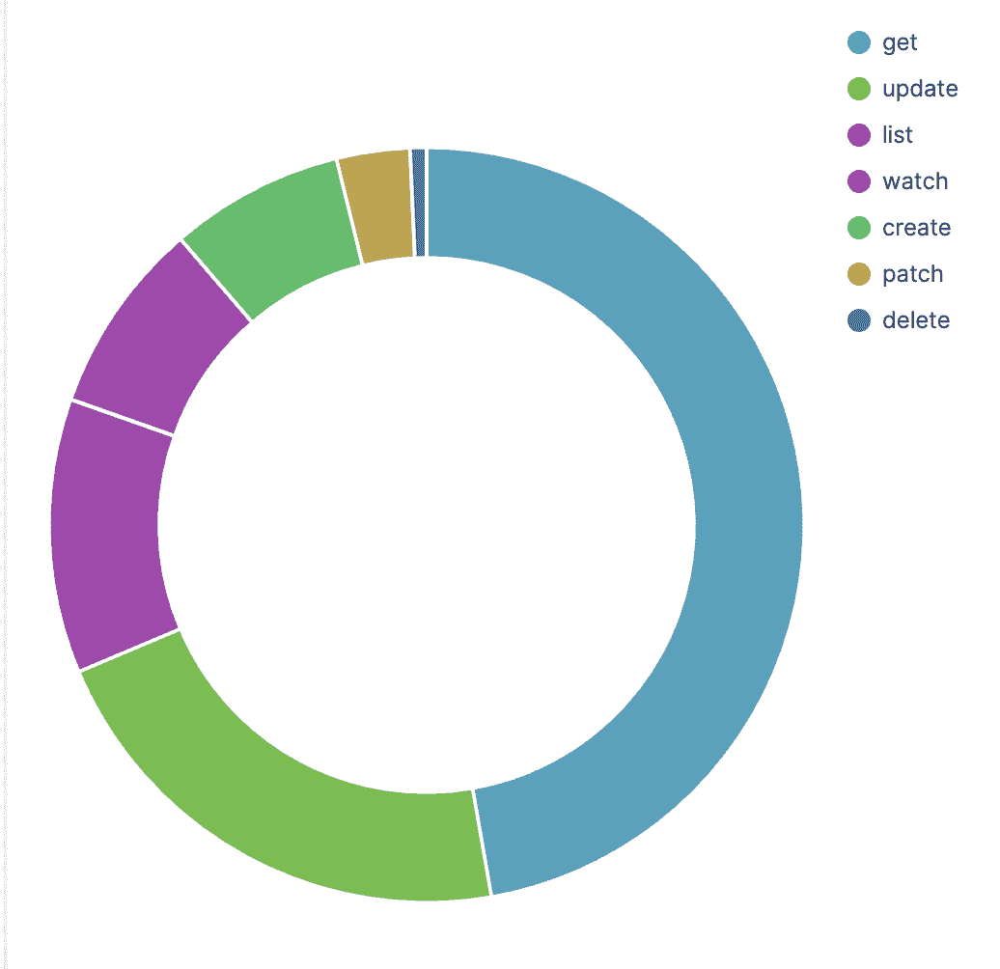
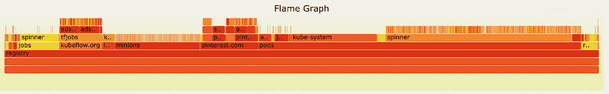
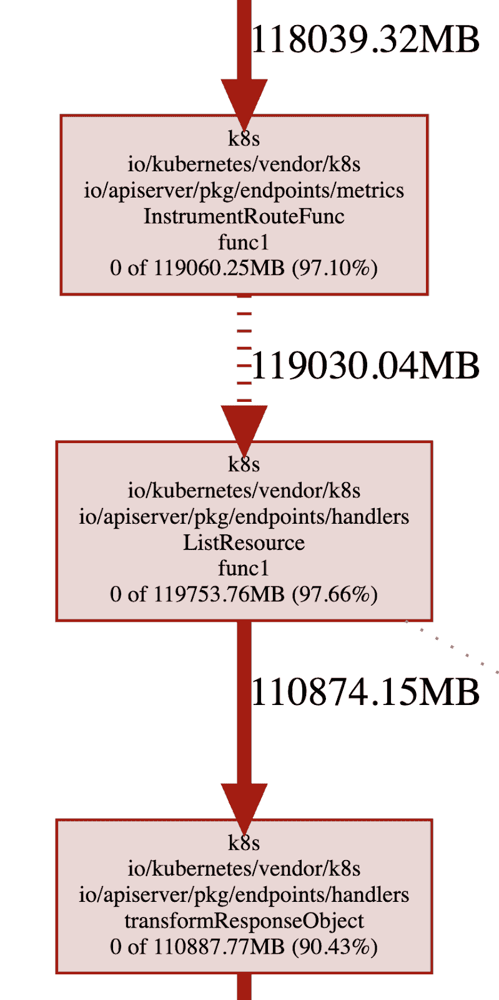
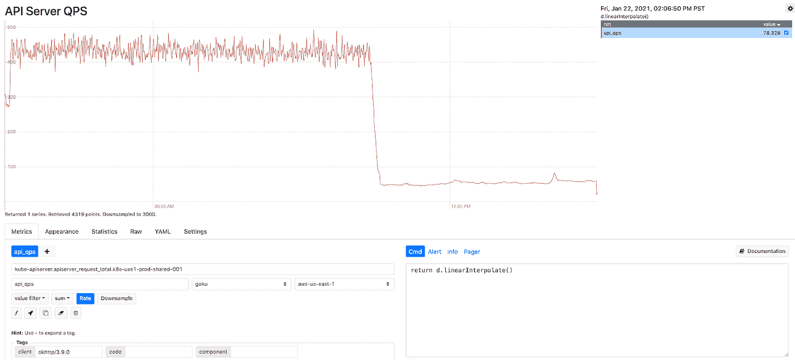

# 在 Pinterest 安全扩展 Kubernetes

> 原文：<https://medium.com/pinterest-engineering/scaling-kubernetes-with-assurance-at-pinterest-a23f821168da?source=collection_archive---------0----------------------->

Anson Qian|软件工程师，云运行时

# 介绍

自从我们在 Pinterest 分享我们的 [Kubernetes 之旅以来，已经一年多了。从那时起，我们提供了许多功能来促进客户采用，确保可靠性和可扩展性，并积累运营经验和最佳实践。](/pinterest-engineering/building-a-kubernetes-platform-at-pinterest-fb3d9571c948)

总的来说，Kubernetes 平台用户给予了积极的反馈。根据我们的用户调查，用户分享的三大优势是减轻管理计算资源的负担、更好的资源和故障隔离以及更灵活的容量管理。

到 2020 年底，我们在我们的 Kubernetes 集群中协调了 **35K+ pods** 和 **2500+节点**——支持广泛的 Pinterest 业务——有机增长仍然很高。

# 短篇小说中的 2020

随着用户采用率的增长，工作负载的种类和数量也在增加。它要求 Kubernetes 平台具有更高的可伸缩性，以便跟上工作负载管理、pods 调度和放置以及节点分配和取消分配带来的不断增长的负载。随着 Kubernetes 平台上的业务关键型工作负载越来越多，对平台可靠性的期望自然上升到了一个新的水平。

平台范围的中断确实发生了。在 2020 年初，我们的一个集群经历了 pod 创建的突然激增(比计划容量高出约 3 倍)，导致集群 autocalor 启动 900 个节点来满足需求。 [kube-apiserver](https://kubernetes.io/docs/concepts/overview/components/#kube-apiserver) 开始首先经历延迟峰值和错误率增加，然后由于资源限制而导致内存不足(OOM)死亡。Kubelets 的非绑定重试导致 kube-apiserver 负载增加了 7 倍。写入的激增导致 [etcd](https://etcd.io/) 达到其总数据大小限制，并开始拒绝所有写入请求，平台在工作负载管理方面失去了可用性。为了减轻事故，我们必须执行 etcd 操作，如压缩旧版本、整理过多的空间以及禁用警报来恢复它。此外，我们不得不暂时扩大 Kubernetes 主节点的规模，以减少资源限制。

Figure 1: Kubernetes API Server Latency Spikes

在 2020 年晚些时候，一个基础架构组件在 kube-apiserver 集成中出现了一个错误，导致对 kube-apiserver 的昂贵查询(列出所有 pod 和节点)激增。这导致 Kubernetes 主节点资源使用量激增，kube-apiserver 进入 OOMKilled 状态。幸运的是，有问题的组件很快被发现并回滚。但是在该事件中，平台性能下降，包括延迟的工作负载执行和过时的状态服务。

Figure 2: Kubernetes API Server OOMKilled

# 为规模化做好准备

在整个旅程中，我们不断反思我们的平台治理、弹性和可操作性，尤其是当事故发生并重创我们最薄弱的环节时。凭借一支工程资源有限的敏捷团队，我们不得不深入挖掘，找出根本原因，确定容易实现的成果，并根据回报和成本确定解决方案的优先级。我们处理复杂的 Kubernetes 生态系统的策略是尽最大努力减少与社区提供的内容的差异，并为社区做出贡献，但永远不排除编写我们自己的内部组件的选择。

Figure 3: Pinterest Kubernetes Platform Architecture (blue is in-house, green is open source)

# 管理

## 资源配额实施

Kubernetes 已经提供了[资源配额](https://kubernetes.io/docs/concepts/policy/resource-quotas/)管理，以确保任何名称空间都不能请求或占用大多数维度的**无限**资源:pods、cpu、内存等。正如我们在之前的事件中提到的，单个名称空间中 pod 创建的激增可能会使 kube-apiserver 过载并导致级联故障。为了确保稳定性，在每个名称空间中限制资源使用是很关键的。

我们面临的一个挑战是，在每个名称空间中强制实施资源配额隐含地要求所有的 pod 和 containers 具有指定的[资源请求和限制](https://kubernetes.io/docs/concepts/configuration/manage-resources-containers/#requests-and-limits)。在 Pinterest Kubernetes 平台中，不同名称空间中的工作负载由不同项目的不同团队拥有，平台用户通过 Pinterest CRD 配置他们的工作负载。我们通过为 CRD 转换层中的所有 pod 和容器添加默认资源请求和限制来实现这一点。此外，我们还拒绝了 CRD 验证层中任何没有资源请求和限制的 pod 规范。

我们克服的另一个挑战是简化跨团队和组织的配额管理。为了安全地启用资源配额实施，我们查看历史资源使用情况，在峰值之上添加 20%的余量，并将其设置为每个项目的资源配额的初始值。我们创建了一个 cron 作业来监控配额使用情况，并在项目使用接近某个限制时向项目所有团队发送工作时间警报。这鼓励项目所有者更好地进行容量规划，并请求资源配额变更。资源配额更改在签署后会得到手动审查和自动部署。

## 客户端访问实施

我们强制所有 KubeAPI 客户遵循 Kubernetes 已经提供的最佳实践:

## 控制器框架

[控制器框架](https://github.com/operator-framework)为优化读取操作提供了一个可共享的缓存，它利用了[信息器-反射器-缓存架构](https://godoc.org/k8s.io/client-go/informers)。**告密者**被设置来从 kube-apiserver 列出并观看感兴趣的对象。**反射器**将对象变化反映到底层**缓存**中，并将观察到的事件传播到事件处理程序。同一个控制器中的多个组件可以从 Informers 中注册 OnCreate、OnUpdate 和 OnDelete 事件的事件处理程序，并从缓存中获取对象，而不是直接从 Kube-apiserver 中获取。因此，它减少了进行不必要的和多余的呼叫的机会。

Figure 4: Kubernetes Controller Framework

## 限速

Kubernetes API 客户端通常由不同的控制器共享，API 调用由不同的线程进行。Kubernetes 的 API 客户端附带了一个[令牌桶速率限制器](https://en.wikipedia.org/wiki/Token_bucket)，它支持可配置的 QPS 和突发。超出阈值的 API 调用将被抑制，这样单个控制器就不会阻塞 kube-apiserver 的带宽。

## 共享缓存

除了控制器框架自带的 kube-apiserver 内置缓存，我们还在平台 API 中添加了另一个基于 informer 的直写缓存层。这是为了防止不必要的读调用重创 kube-apiserver。服务器端缓存重用也避免了应用程序代码中的胖客户端。

对于来自应用的 kube-apiserver 访问**，我们强制所有请求通过平台 API，以利用共享服务并为访问控制和流量控制分配安全身份。对于来自**工作负载控制器**的 kube-apiserver 访问，我们强制所有控制器基于具有速率限制的控制框架来实现。**

# 弹性

## 硬化库伯莱

Kubernetes 的控制平面进入级联故障的一个关键原因是遗留反射器实现在处理错误时有**无限制的**重试。这种缺陷可能会被夸大，特别是当 API 服务器被破坏时，这很容易导致集群中反射器的同步。

为了解决这个问题，我们与社区密切合作，报告[问题](https://github.com/kubernetes/kubernetes/issues/87794)，讨论解决方案，并最终审核和合并 pr([1](https://github.com/kubernetes/kubernetes/pull/87829)， [2](https://github.com/kubernetes/kubernetes/pull/87795) )。这个想法是用 jitter reflector 的 ListWatch 重试逻辑添加指数补偿，这样 kubelet 和其他控制器就不会在 kube-apiserver 过载和请求失败时试图敲打 kube-apiserver。这种弹性改进通常是有用的，但是我们发现随着 Kubernetes 集群中节点和 pod 数量的增加，这种改进在 kubelet 方面非常关键。

## 优化并发请求

我们管理的节点越多，创建和销毁工作负载的速度就越快，QPS 服务器需要处理的 API 调用就越多。我们首先根据估计的工作负载增加了变异和非变异操作的最大并发 API 调用设置。这两个设置将强制处理的 API 调用数量不超过配置的数量，因此将 kube-apiserver 的 CPU 和内存消耗保持在某个阈值。

在 Kubernetes 的 API 请求处理链中，每个请求的第一步都会通过一组过滤器。过滤器链是强制执行最大动态 API 调用的地方。对于超过配置阈值的 API 调用突发，将向客户端返回“请求过多”(429)响应，以触发适当的重试。作为未来的工作，我们计划对具有更细粒度准入控制的 [EventRateLimit 特性](https://kubernetes.io/docs/reference/access-authn-authz/admission-controllers/#eventratelimit)进行更多的研究，并提供更好的服务质量。

## 缓存更多历史记录

Watch cache 是 kube-apiserver 内部的一种机制，它将每种类型的资源的过去事件缓存在一个环形缓冲区中，以便尽最大努力为来自特定版本的 Watch 调用提供服务。缓存越大，服务器中可以保留的事件就越多，并且在连接中断的情况下，更有可能无缝地向客户端提供事件流。考虑到这一事实，我们还改进了 kube-apiserver 的目标 RAM 大小，根据为更健壮的事件流提供服务的试探法，它在内部最终被转移到观察器缓存容量。Kube-apiserver 提供了[更详细的方式](https://kubernetes.io/docs/reference/command-line-tools-reference/kube-apiserver/)来配置细粒度的观察缓存大小，这可以进一步用于特定的缓存需求。

Figure 5: Kubernetes Watch Cache

# 可操作性

## 可观察性

为了减少事件检测和缓解时间，我们不断努力提高 Kubernetes 控制平面的可观察性。挑战在于平衡故障覆盖率和信号灵敏度。对于现有的 Kubernetes 指标，我们筛选并选择重要的指标进行监控和/或提醒，以便我们能够更主动地发现问题。此外，我们使用 kube-apiserver 来覆盖更详细的区域，以便快速缩小根本原因的范围。最后，我们调整警报统计数据和阈值，以减少噪音和错误警报。

在高层次上，我们通过观察 QPS 和并发请求、错误率和请求延迟来监控 kube-apiserver 负载。我们可以按照资源类型、请求动词和相关的服务帐户来划分流量。对于像列表这样昂贵的流量，我们也通过对象计数和字节大小来测量请求负载，因为它们很容易使 kube-apiserver 过载，即使 QPS 很小。最后，我们监控 etcd 观察事件处理 QPS 和延迟处理计数作为重要的服务器性能指标。

Figure 6: Kubernetes API calls by type

## 可调试性

为了更好地了解 Kubernetes 控制平面的性能和资源消耗，我们还使用 [boltdb](https://github.com/etcd-io/bbolt) 库和 [flamegraph](https://github.com/brendangregg/FlameGraph) 构建了 etcd 数据存储分析工具，以可视化数据存储分解。数据存储分析的结果为平台用户提供了优化使用的见解。

Figure 7: Etcd Data Usage Per Key Space

此外，我们启用了 golang 分析 [pprof](https://blog.golang.org/pprof) 并可视化了堆内存占用。我们能够快速识别资源最密集的代码路径和请求模式，例如，在列表资源调用时转换响应对象。作为 kube-apiserver OOM 调查的一部分，我们发现的另一个重要警告是，kube-apiserver 使用的[页面缓存](https://www.kernel.org/doc/Documentation/cgroup-v1/memory.txt)被计入一个 cgroup 的内存限制，匿名内存使用可以窃取同一个 cgroup 的页面缓存使用。因此，即使 kube-apiserver 只有 20GB 的堆内存使用，整个 cgroup 也可以看到 200GB 的内存使用达到了极限。虽然当前的内核默认设置不是主动回收分配的页面以实现高效重用，但我们目前正在研究基于 memory.stat 文件的设置监控，并在内存使用接近限制时强制 cgroup 回收尽可能多的页面。

Figure 8: Kubernetes API Server Memory Profiling

# 结论

凭借我们在治理、弹性和可操作性方面的努力，我们能够显著减少计算资源的突然使用激增，控制平面带宽，并确保整个平台的稳定性和性能。优化部署后，kube-apiserver QPS(主要是读取)减少了 90%(如下图所示)，这使得 kube-apiserver 的使用更加稳定、高效和健壮。对 Kubernetes 内部的深入了解和我们获得的额外见解将使团队能够更好地进行系统操作和集群维护。

图 9:优化展示后 Kube-apiserver QPS 减少

以下是一些关键要点，希望可以帮助您解决 Kubernetes 的可伸缩性和可靠性问题:

1.  诊断问题，找到问题的**根源**。在决定“做什么”之前，先关注“是什么”解决问题的第一步是了解瓶颈是什么，为什么。如果你找到了根本原因，你就成功了一半。
2.  首先关注**小的增量改进**比立即致力于彻底的架构改变几乎总是值得的。这很重要，尤其是当你有一个敏捷的团队时。
3.  当您计划或优先考虑调查和修复时，做出**数据驱动的**决策。正确的遥测技术有助于更好地决定首先关注和优化什么。
4.  关键基础设施组件的设计应考虑弹性。分布式系统容易出现故障，最好**总是做最坏的打算**。正确的护栏有助于防止连锁故障，并将爆炸半径降至最低。

# 展望未来

## 联盟

随着我们的规模稳步增长，单一集群体系结构已不足以支持不断增加的工作负载。在确保高效、强大的单集群环境之后，让我们的计算平台能够横向扩展是我们前进的下一个里程碑。通过利用联合框架，我们的目标是以最小的操作开销将新的集群插入到环境中，同时保持最终用户的平台界面稳定。我们的联合集群环境目前正在开发中，我们期待它在产品化后带来更多的可能性。

## 容量规划

我们当前实施资源配额的方法是一种简化的反应式容量规划方式。随着用户工作负载和系统组件的增加，平台动态会发生变化，项目级别或集群范围的容量限制可能会过时。我们希望探索基于历史数据、增长轨迹和复杂容量模型进行预测的主动容量规划，该模型不仅可以涵盖资源配额，还可以涵盖 API 配额。我们希望更主动、更准确的容量规划能够防止平台过度使用和交付不足。

# 承认

Pinterest 的许多工程师帮助扩展了 Kubernetes 平台，以赶上业务增长。除了云运行时团队 June Liu、、Suli Xu、和 Quentin Miao 努力工作以实现我们今天拥有的可扩展和稳定的计算平台之外，Balaji Narayanan、Roberto Alcala 和 Rodrigo Menezes 领导我们的站点可靠性工程(SRE)工作，他们共同努力确保计算平台的坚实基础。领导容量工程工作的 Kalim Moghul 和 Ryan Albrecht 为项目身份管理和系统级配置做出了贡献。负责安全工程工作的 Cedric Staub 和 Jeremy Krach 保持了高标准，这样我们的工作负载就可以在多租户平台上安全运行。最后，我们的平台用户 Dinghang Yu、Karthik Anantha Padmanabhan、Petro Saviuk、Michael Benedict、Jasmine Qin 和许多其他人提供了许多有用的反馈和要求，并与我们一起努力实现可持续的业务增长。