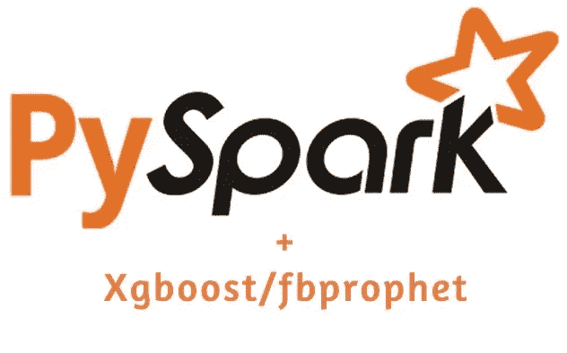

# 在 W-MLP 上用 pyspark 扩展机器学习算法(Fbprophet/XGBoost)

> 原文：<https://medium.com/walmartglobaltech/scaling-machine-learning-algorithms-fbprophet-xgboost-with-pyspark-on-w-mlp-405fadca1c19?source=collection_archive---------1----------------------->

## **沃尔玛—机器学习平台(W-MLP)**



Pyspark+xgboost/fbprophet. Source: [https://miro.medium.com/max/1200/1*nPcdyVwgcuEZiEZiRqApug.jpeg](https://miro.medium.com/max/1200/1*nPcdyVwgcuEZiEZiRqApug.jpeg)

W-MLP 是一个机器学习平台，为数据科学家和数据工程师提供端到端的能力，使他们能够更快地开发和部署模型。

它还提供了连接和接收来自不同数据源的数据的功能，这些数据源用于在生产中培训、测试和部署模型。

**W-MLP 提供的关键能力:**

*   访问不同来源的数据。
*   采购、管理和维护自有虚拟机。
*   管理和维护不同项目的环境(库和工具)。
*   合作和发展的能力。
*   减少重复，因为多个团队可以创建相似的数据集、模型并解决相似的问题。
*   重用组件的兼容性问题(不同的工具、版本等)。

# **问题陈述**

> W-MLP 遇到了各种各样的机器学习用例，这些用例的数据量非常大，而所使用的库本身并没有提供扩展用例的方法。我们能够支持西 MLP 的多个组织使用西 MLP 的 pyspark 扩展他们的预测算法。它的独特功能，如 spark 集群上库安装/分发的抽象，通过 W-MLP 平台上的 jupyter notebook 与现有 hadoop 集群进行交互的简单方式，以及将它们部署为具有调度功能的工作流，帮助这些用例轻松扩展并转移到生产环境。

# **使用案例:**

1)在特定级别(如类别/室/部门/日期等)对数据进行分组后，对客户的数据源运行 91 天的预测。预测逻辑需要在大约 90，000 个这样的组上运行，其中每个组包含超过 1000 条记录。执行预测的首选库是 fbprophet。Prophet 是一种基于加法模型预测时间序列数据的过程，在该模型中，非线性趋势与每年、每周和每天的季节性以及假日影响相适应。

2)执行预测，其中数据分组在部门和细线编号处完成。总的数据大小接近 35GB。首选库是 XGBoost。在一个简单的 python 笔记本中处理如此大量的数据并完成 SLA 内的预测是不可行的。

3)选择合适的商品组合极其重要，因为这是顾客感知商店的主要方式之一
这里的挑战在于规模，我们有大约 4500 家商店，大约 1700 个类别。我们如何扩展算法，为我们提供所有 4500 家商店所有类别的实时分类？

在执行预测之前，上述用例在数据汇总和数据分组的方式上有许多共同的模式。由于可以在特定级别对数据进行分组，这为数据分区开辟了道路，而数据分区是分配工作负载的关键。**上述用例中涉及的问题基本上可以归结为以下任务:**

1)有效地划分数据。
2)为每个分区添加预测逻辑。
3)使首选库在所有 spark worker 节点及其所有依赖项上可用。
4)确定扩展用例所需的 Spark 执行器/内核和内存的数量。
5)向所有节点广播小数据。

# **分区数据**

可以根据感兴趣的特定列对数据进行重新划分，如下所示

```
sparkDataFrame.repartition(*cols)
```

Spark 将检测指定列中的唯一值，并相应地对它们进行分区。因此，根据指定列的唯一值的数量，将会创建许多分区(如果您期望更少的分区数量，并注意到创建了 200 个分区，这是 spark 默认设置，可以使用**spark . SQL . shuffle . partitions**属性进行控制。只有预期数量的分区将有数据，您将看到其余的任务很快运行完成)。

在 spark 中，分区等同于任务，这些小单元将分布在工作节点上执行计算。重新分区将涉及 worker 节点之间的数据洗牌，以确保具有相同值的列都被移动到同一个执行器。例如:-如果您对具有唯一值 10、11、12 的部门编号进行分区，spark 将以这样的方式移动数据，即每个分区只有一个部门编号。一个可能减慢这一步的常见错误是加载不必要的列来触发 Dataframe，并且在执行分区之前没有删除它们。上述用例有 300 多列，而实际计算中只需要 150 列。通过确保只需要执行预测所需的列，数据大小将显著减少并加快分区过程。

# **将首选库发送给执行者**

W-MLP 抽象的航运图书馆的引擎盖下的执行者。你所需要做的就是从库向导安装这些库，然后当 spark 任务初始化时，W-MLP 让所有的执行器都可以使用这些库。W-MLP 使用 CONDA 环境来打包库，因此不需要担心与这些库相关联的所有依赖项或共享库。

# **添加每个分区的预测逻辑**

一旦重新分区发生，执行预测的逻辑可以添加到 *mapPartitions* 方法中。即使在使用 Spark 之前，模型拟合和预测的逻辑也可以保持不变。Spark 将负责在多个节点的多个分区上并行执行相同的逻辑。

```
sparkDataFrame.rdd.mapPartitions(forecasting_logic)
def forecasting_logic(partition_list):
    pdf = pd.DataFrame(partition_list)
    model=your_prefferred_lib.fit(pdf)
    predicted_pdf = model.predict()
    return predicted_pdf.values.tolist()
```

# **决定 spark 执行器/内核和内存**

将代码移植到 pyspark 时出现的一个常见问题是如何决定需要多少资源。虽然这完全取决于用例，但是可以遵循一些通用的准则。

在对要进行分区的特定列执行 group by 之后，执行简单的 spark SQL 来进行计数，这将提示单个任务将要处理的记录数量。结合对数据的理解来看这个数字，将有助于得出一个单个任务所需内存量的大概数字。需要记住的一点是，这个内存不能超过 Hadoop 集群中 executor 节点可用的总内存。例如，如果分配给 Hadoop 集群中单个节点的最大内存是 16 GB，那么我们就不能执行需要更大内存的任务。

# **让我们来看一个用例示例**

假设我们有一个根据部门 id 进行分区的数据。如果部门有 20 个唯一值，我们将得到 20 个分区。现在，如果我们可以分配 20 个内核，所有 20 个分区都可以并行计算。我们可以提供 4 个执行器和每个执行器 5 个内核的配置(4*5=20)。每个执行器最多 5 个内核是推荐的配置。然而，这意味着在一个执行程序中将同时运行 5 个任务。如果所有 5 个任务的数据都无法容纳在内存中，请确保分配较少的内核和较多的执行器。例如:- 10 个执行者和每个执行者 2 个核心(10*2=20)。

分配与分区数量一样多的执行器和核心可能在所有情况下都不可行。在这种情况下，查看在不影响同一队列中任何其他作业的情况下，可以从专用队列中分配给该作业的最大执行器和核心数

# **广播小数据/变量**

广播变量允许程序员在每台机器上缓存一个只读变量，而不是随任务一起发送一个副本。例如，它们可用于以高效的方式为每个节点提供大型输入数据集的副本。Spark 还尝试使用高效的广播算法来分发广播变量，以降低通信成本。

```
item_attribute_data=item_attribute_data.collect()
sc.broadcast(item_attribute_data)
# Above will broadcast item_attribute_data to all nodes of cluster.
```

# **监控 pyspark 作业**

Spark UI 提供了关于工作进展的足够详细的信息。为了确保您的作业获得指定数量的资源(内核/内存)，请查看 executor 选项卡。您可能需要根据您的工作来调整内存需求、执行器或内核。查看 spark UI 中的日志，您将能够发现是否有许多任务由于内存不足而失败。在这种情况下，提供更多内存或减少每个执行器的核心数

# 示例代码片段:

# **结论**

虽然这里讨论的用例主要是关于预测和扩展解决方案，但是这种模式可以用于任何 ml 算法，其中可以对数据进行分区(也可以放在内存中)以执行模型拟合/推理。一旦确定了分区逻辑，spark 就可以负责分配工作负载。为预测编写的原始代码在移植到 spark 时只需很少甚至不需要修改，W-MLP 图书馆管理使算法的扩展变得更加容易。

# 作者

1.  [舒布哈姆·阿格拉瓦尔](https://www.linkedin.com/in/shubhamgujarwasia/)，软件工程师 III，印度沃尔玛实验室
2.  [阿伦·奈尔](https://www.linkedin.com/in/arun-sasidharan-nair-67270a73/)，印度沃尔玛实验室软件工程师 IV

# 参考

1.*火花文档*:[https://spark.apache.org/docs/latest/](https://spark.apache.org/docs/latest/)
2。*FB prophet*:[https://facebook.github.io/prophet/docs/quick_start.html](https://facebook.github.io/prophet/docs/quick_start.html)
3。*py spark*:[https://spark.apache.org/docs/latest/api/python/index.html](https://spark.apache.org/docs/latest/api/python/index.html)