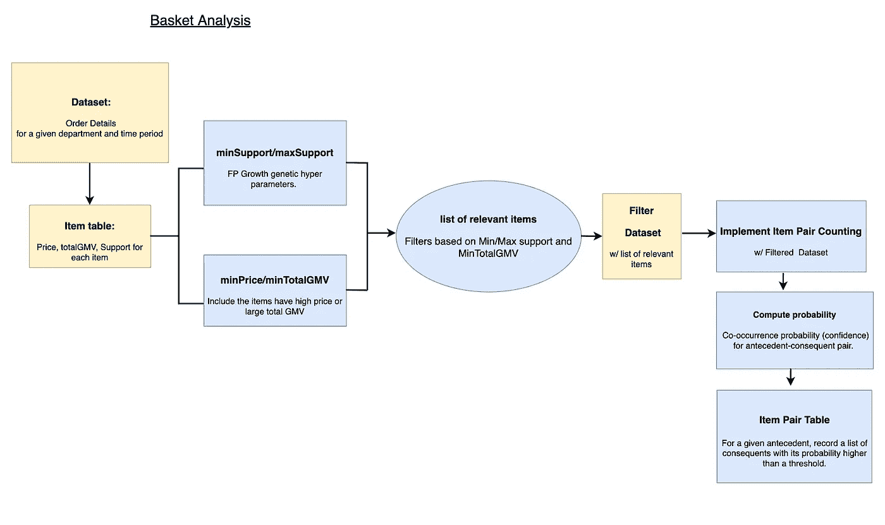
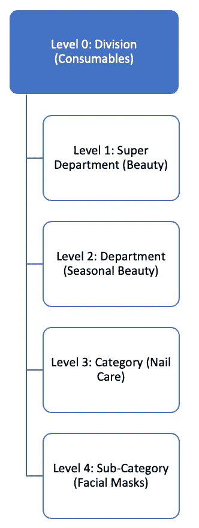
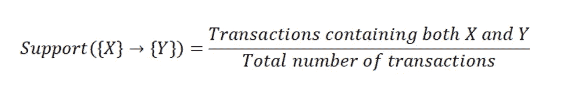
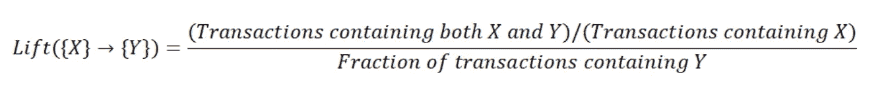
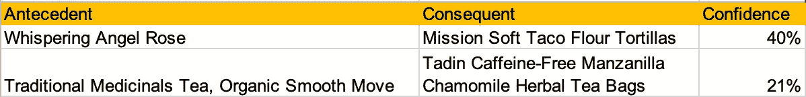
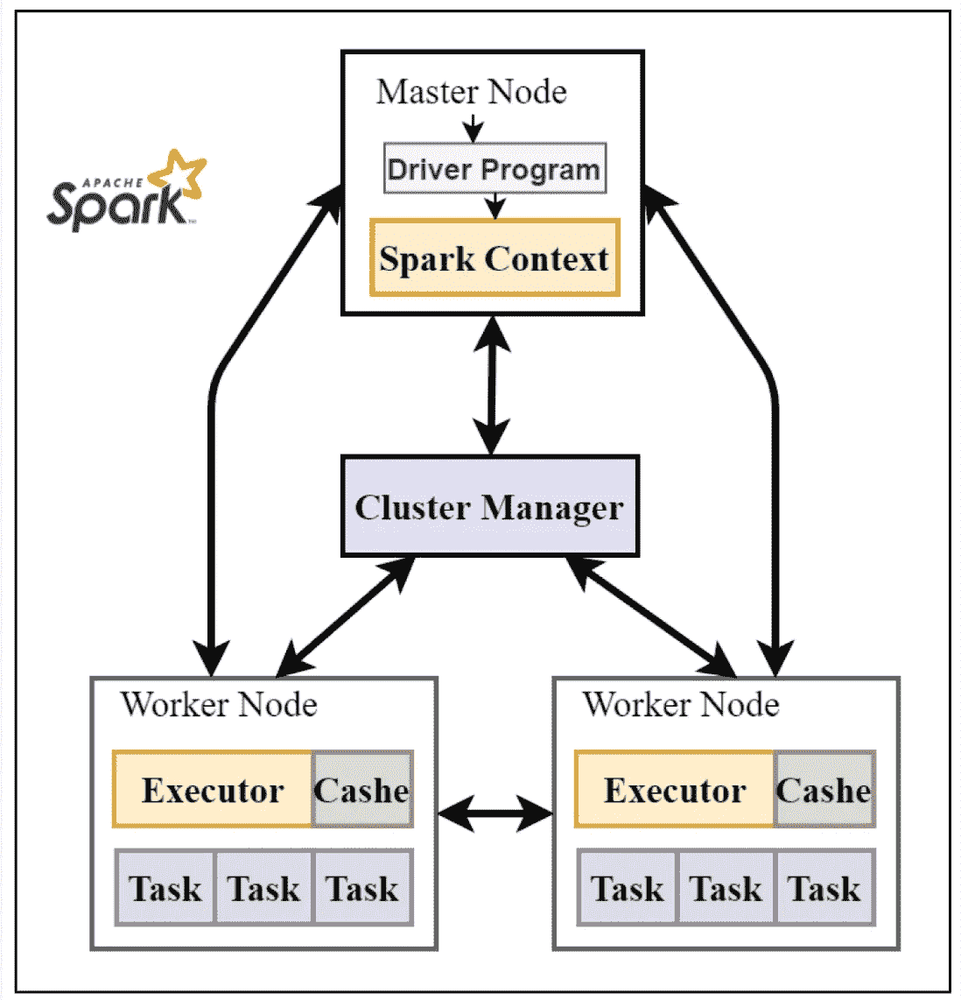
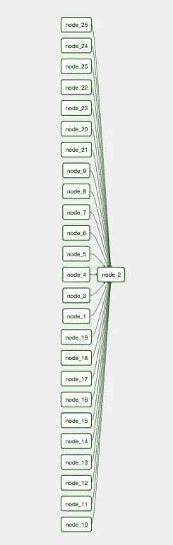

# 使用购物篮分析衡量产品推荐-第 1 部分

> 原文：<https://medium.com/walmartglobaltech/scaling-product-recommendations-using-basket-analysis-part-1-8434d4f8756f?source=collection_archive---------4----------------------->

Image source : [https://unsplash.com/photos/sq5P00L7lXc](https://unsplash.com/photos/sq5P00L7lXc) by Hanson Lu

包含数百万笔交易的大型产品目录使得了解向客户提供什么样的最佳产品组合变得非常复杂。为了了解顾客的购物行为，并基于购物篮历史提供有针对性的产品，产品推荐起着重要的作用。基于倾向的模型提供了对 Omni 交易(电子商务:E-comm & store)中共同购买产品的见解。基于先前购买历史的产品购买倾向和购物篮分析有多种现有应用，例如:

*   电子商务:在品牌网站中产生推荐和搜索功能
*   CRM:个性化电子邮件/直邮营销
*   供应链:需求预测，分类计划
*   促销/销售:捆绑产品、包装、促销优惠

# **问题陈述**

你如何发现适合沃尔玛顾客群的精选产品？精心策划的产品推荐增加了购物篮的容量，增加了收入。但是，我们能为所有部门扩展精选产品推荐模型，并找到交叉购买的机会吗？就复杂性、不断变化的真实世界数据集和内存消耗而言，构建可扩展的解决方案可能具有挑战性。可扩展产品推荐引擎是一种需要在产品组合和解决方案的复杂性之间进行权衡的解决方案。在这篇博客中，我们将描述一个基于交易的产品推荐引擎，我们使用 PySpark 来克服复杂性的挑战。

# **建模方法**

为了找到合适的产品推荐集，我们将问题分为 5 个步骤:

1.  取数据
2.  预处理和过滤事务
3.  建立产品关联模型发现关联规则
4.  输出验证
5.  面向所有部门的扩展解决方案

Modeling Framework( click to enlarge )

1.  **数据获取**

Ecomm 有多个部门，如电子玩具&季节性，服装，食品等。每个部门都有其部门，该部门有与其相关类别和子类别。我们在固定的时间范围内提取每个部门的所有交易数据。

Reporting Hierarchy for Products in E-commerce

**2。预处理-**

交易包含不同子类别的产品，每种产品都有不同的价格范围和特定的购物客户群。为了在选择产品建议时最大限度地减少偏差，我们应用过滤器来选择要包含在分析中的产品。

过滤器基于 3 个关键参数

1.  支持
2.  价格
3.  GMV(商品总值)贡献

什么是产品关联挖掘中的支持度、置信度和升力？

**支持**:定义*项目集*在所有事务中出现的频率

Support

**置信度**:定义购物车中已经有先行词的情况下，后续词出现的可能性

Confidence

**Lift** :与随机选择相比，衡量关联规则在预测特定结果时的性能。

提升值越大，关联越强。

Lift

*我们首先过滤掉* ***有单品的不相关交易*** *。*

*然后 m* ***最小和最大支持*** *根据分位数范围分布来计算子集交易和产品。*

> MinSupport *帮助移除很少购买的产品。例如:高尔夫配件、电刀。*
> 
> MaxSupport *删除日常常用的商品。例如:香菜，西红柿。*
> 
> 阈值*由产品的* ***最低价格*** *和该产品贡献的 GMV 决定。*

最初的关联规则发现只考虑了出现的频率。然而，我们购物篮分析的目标不仅是找到频繁项目，而且是增加收入/利润。因此，我们包括价格和 GMV 过滤器，以包括像跑步机和电视这样的项目。基于这些过滤器，产品和交易的最终子集被选择用于建模。

**3。建模**

有两种方法用于解决购物篮分析:

***A) FP 增长* :**

FP 增长从事务数据中生成频繁模式，而没有候选生成。 **PySpark ML 分布式 FP growth** 算法用于预处理数据之上，以发现由 M *inSupport* 和 M *inConfidence* 参数调整的频繁项目配对和产品关联规则。

计算每个规则的支持度，并基于支持度、置信度和提升度的组合进行分析。使用 3 个指标执行的评估有助于决定哪些规则对于不同子类别的一组产品组合是重要的。

**B) *基于概率的方法***

我们没有使用任何产品关联模型，而是开发了我们自己的基于分布概率的项目配对方法。在这种方法中，我们查看篮子并计算同现的概率。从每个子类别级别中选择规则，以从不同的产品类别中提供不同的推荐。

**推荐示例**:属于类别:护发素的产品 A 将与属于类别:护发素的产品 B 一起推荐。

总体而言，基于这两种方法，基于概率的方法被选为所有部门最有效的解决方案，基于两个因素:
1。它只考虑两个单独项目之间的关系，而关联规则挖掘(FPGrowth)考虑多项目关系。
2。由于我们排除了多商品关系，计算费用从 O(n^n)减少到 O(n)，其中 n 是给定购物篮的平均商品数量。

**4。输出验证**

在固定时间段内从所选模型生成的规则用于对一起提供的产品组合做出决策。在每个部门级别生成成千上万的规则，这些规则最终被排序以提供最佳产品推荐。

Sample Product association rules

一个月与三个月的关联规则验证结果相比，我们观察到三个月比一个月更独特的查询/前提和规则:

Rules stats

**5。缩放**

Overview of Spark framework. The master node contains driver program, which drives the application by creating Spark context object. Spark context object works with cluster manager to manage different jobs. Worker nodes job is to execute the tasks and return the results to Master node. Picture from [https://www.mdpi.com/2076-3417/10/10/3382/htm](https://www.mdpi.com/2076-3417/10/10/3382/htm)

交易数据可能有数十亿笔交易，包含不同子类别的产品。从这些交易中理解购物行为是复杂的，最重要的是，这是一种代价高昂的内存计算。为了能够大规模地分析数据，我们使用 PySpark 来支持分布式处理，同时为多个部门一起运行作业。与在部门级别运行相比，这使得处理速度更快。

Airflow workflow setup

超级部门是根据交易量和目录多样性划分的。根据子部门为所有部门设置气流工作流，以处理固定时间范围内的购物篮分析。结果被成批计算，并被合并到由超级部门聚集的主表中。整个工作流的执行大约需要 6 个小时来涵盖建模的所有 4 个步骤。

# 结论

基于交易的产品推荐产生了许多有用的产品集，这些产品集是互补的，有助于增加购物篮的大小。然而，这种方法存在冷启动问题。为了处理新产品的冷启动问题，我们使用基于产品属性的方法扩展了基于交易的产品推荐。请继续关注产品推荐的第 2 部分。我真诚地希望这篇文章能够帮助那些寻求构建可扩展的推荐解决方案的人。如果你有任何建议，请发表评论。

# **确认**

沃尔玛全球技术部正在使用购物篮分析进行产品推荐。这个推荐引擎是和[jun wan Choi](https://medium.com/u/708bbde59bf3?source=post_page-----8434d4f8756f--------------------------------)共同开发的。特别感谢[Srujana Kaddevarmuth](https://medium.com/u/787269b21342?source=post_page-----8434d4f8756f--------------------------------)&[Jonathan Sidhu](https://medium.com/u/624981fd8f60?source=post_page-----8434d4f8756f--------------------------------)的倡议和支持， [Abin Abraham](https://medium.com/u/e9b6ea0ee89?source=post_page-----8434d4f8756f--------------------------------) 的贡献&支持，Data Venture 团队在整个工作中给予的帮助。

# **资源**

[https://spark . Apache . org/docs/latest/API/python/reference/API/py spark . ml . fpm . FP growth . html](https://spark.apache.org/docs/latest/api/python/reference/api/pyspark.ml.fpm.FPGrowth.html)