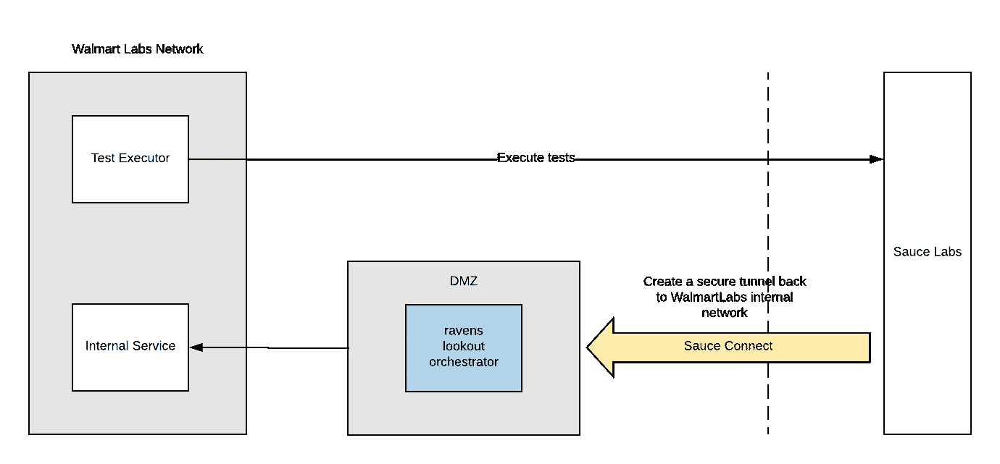
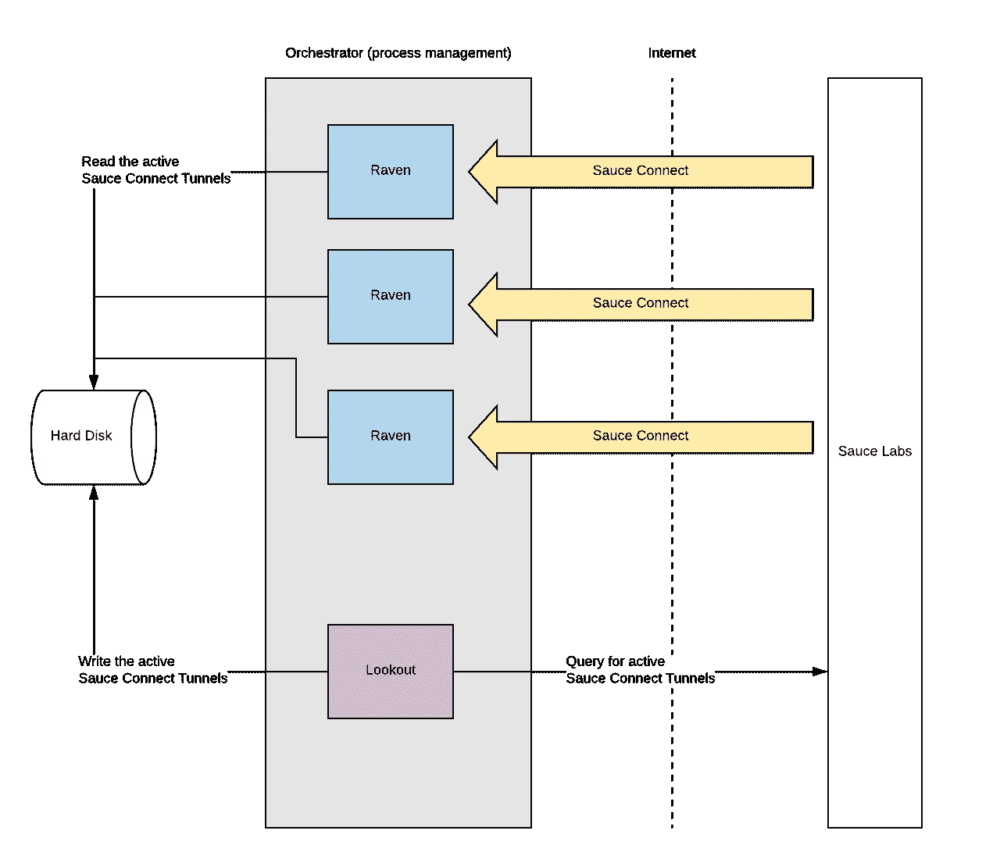

# 为浏览器测试扩展安全通道

> 原文：<https://medium.com/walmartglobaltech/scaling-secure-tunnels-for-browser-testing-9673c71505d?source=collection_archive---------6----------------------->

测试对沃尔玛成功的电子商务业务至关重要。全世界有数百个开发团队在编写代码，所有这些代码在投入生产之前都需要测试。但是，试图支持每一个浏览器和设备版本进行测试本身就是一项艰巨的任务。

我们通过一家名为 Sauce Labs 的供应商实现了这一目标。您给他们一个带有浏览器和版本的 selenium 脚本，他们将在指定的浏览器上执行测试。大多数情况下，这些测试会将服务调用返回到我们的内部网络，这会导致新的问题。我们不能向公众开放我们所有的测试 API。

Sauce Labs 拥有 Sauce Connect 隧道，允许我们创建一个安全的网络连接！

> Sauce Connect 是一个代理服务器，它在运行浏览器测试的 Sauce Labs 虚拟机和您想要测试的位于本地机器上或公司防火墙后的应用程序或网站之间建立安全连接

我们设置了多个 DMZ 箱来处理来自 Sauce Connect 隧道的入站流量。

虽然这听起来像是完美的设置，但是仍然需要做一些准备工作来确保可伸缩性和可用性。我们还遇到了以下两个问题:

1.  在没有通知的情况下，Sauce Connect 隧道将变得无响应
2.  Suace Labs 建议每 24 小时重启一次每个 Sauce Connect 隧道

# ***介绍瞭望者&渡鸦！***

*   Raven 是一个在 DMZ 中启动 Sauce Connect 隧道的应用程序
*   Lookout 是一个监控渡鸦健康状况的应用程序

Lookout — Raven — Orchestrator Architecture

渡鸦的唯一目的是启动和停止 Sauce Connect 隧道。健康检查逻辑被推给 lookout 应用程序，因为 Sauce Labs 对经过身份验证的请求进行速率限制。

> 对于经过身份验证的请求，这些限制是针对单个用户帐户的

限制是 3。如果我们有 3 只以上的渡鸦拥有相同的隧道凭证，我们将限制自己检查隧道的状态。

相反，我们将这个逻辑推到 Lookout 应用程序上。将为共享相同隧道 id 的 Ravens 集群部署单个 Lookout 应用程序。这允许我们检查具有相同凭证的隧道 id 集合的状态。一旦 Lookout 获得活动隧道的列表，它就将这些隧道写入文件。在这一点上，我们可以让我们所有的乌鸦检查文件，看看他们是否仍然是活跃的隧道。如果它们不在活动列表中，它们将自行终止。

我们所有的 Ravens 和 Lookout 应用程序都由一个配置文件和进程管理程序控制，我们称之为 Orchestrator。

Orchestrator 解决了以下问题:

*   可用性要求，方法是让流程管理器在 Raven 自行终止时重启它
*   部署到多台 DMZ 机器的要求
*   可扩展性要求，允许我们在不影响其他运行隧道的情况下添加/删除/重启隧道

*这些应用的影响*

*   自 Lookout 和 Raven 实施以来，无响应隧道的手动重启为零(以前需要手动重启约每周 4 次)
*   由于隧道中断，没有报告客户测试案例问题(以前每周收到约 1 个客户问题)
*   启动新隧道时，对现有隧道或运行测试案例没有影响

*结论*

确保代码在多种浏览器和版本上进行测试，对于任何一家有网站的公司来说都是非常重要的。有这么多不同版本的浏览器，建立正确的基础设施来处理这是一项伟大的事业。充分利用现有的工具，让它们为你带来好处。