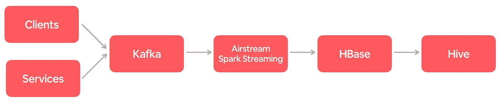
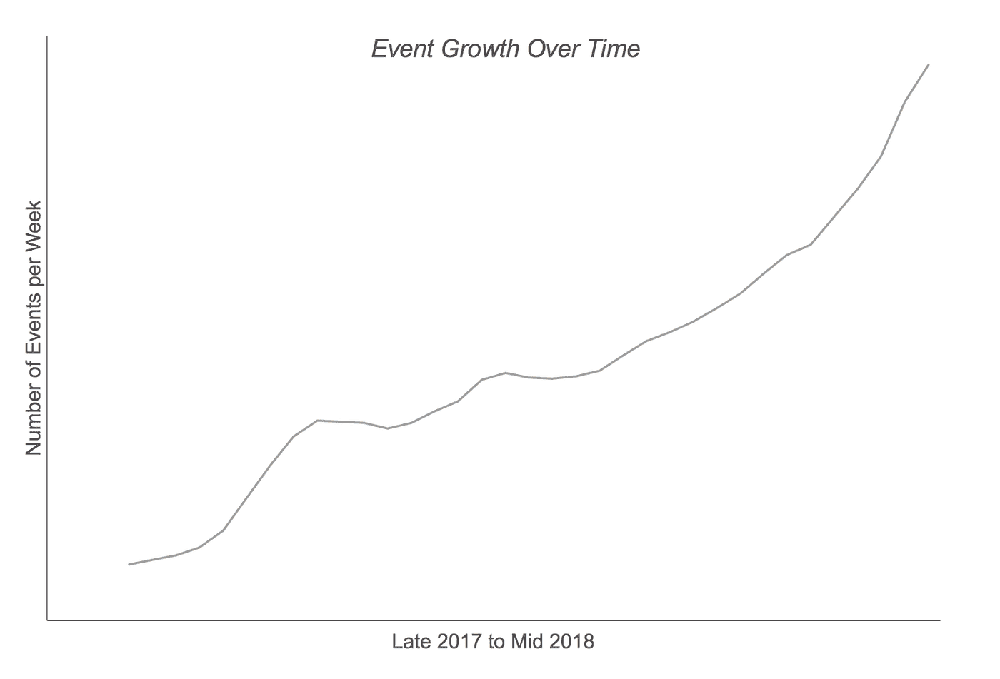
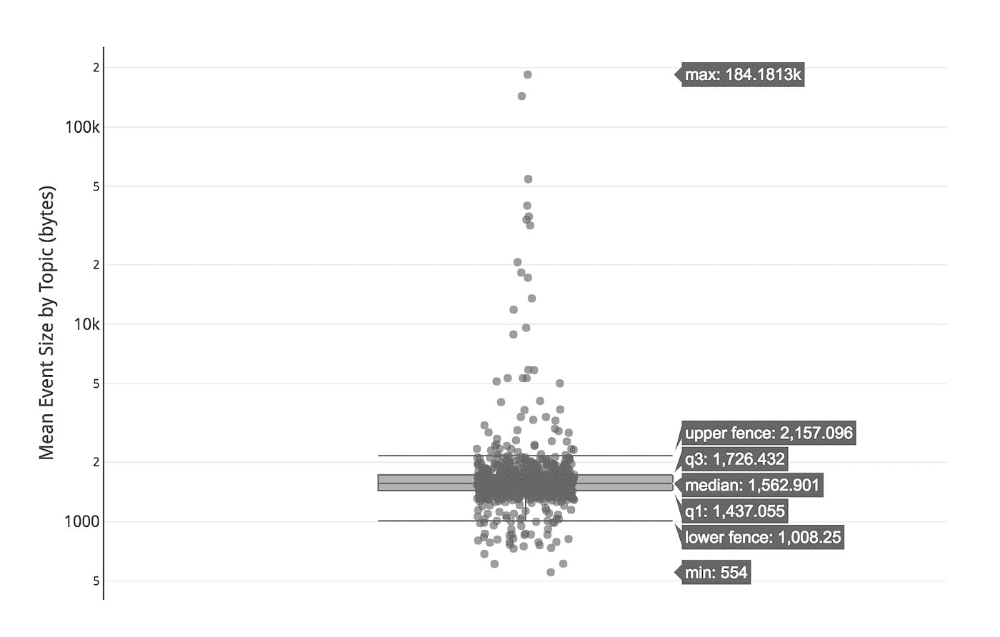
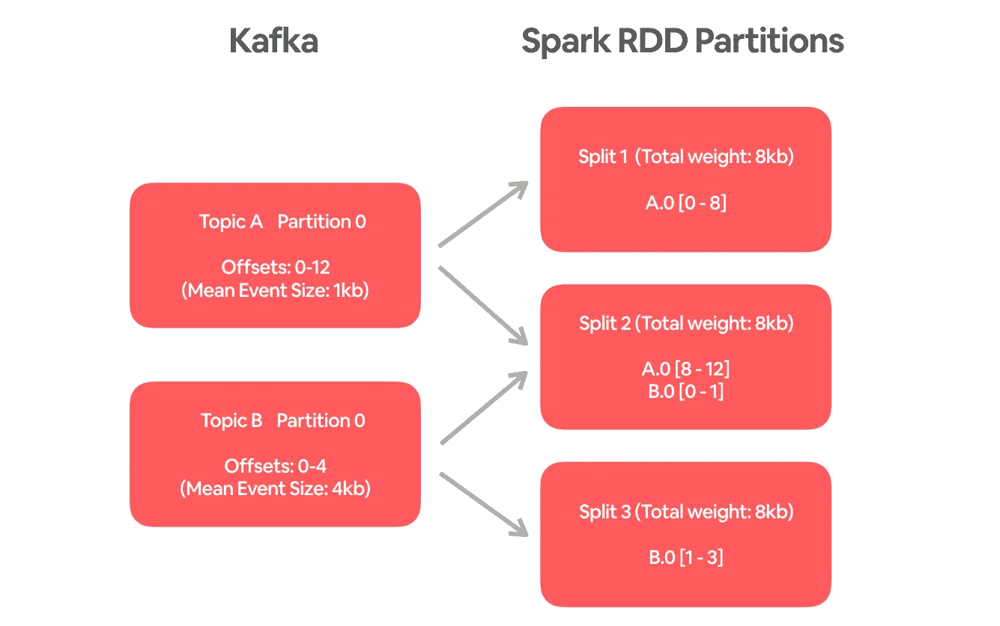
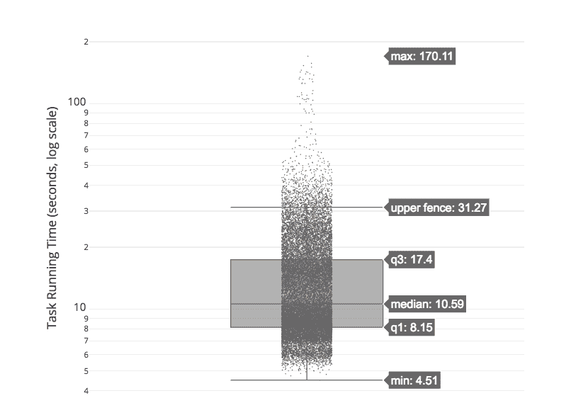

# 为记录事件摄取扩展火花流

> 原文：<https://medium.com/airbnb-engineering/scaling-spark-streaming-for-logging-event-ingestion-4a03141d135d?source=collection_archive---------1----------------------->

## Airbnb 如何通过一个新颖的平衡 Kafka 阅读器来扩展 Spark streaming，该阅读器可以近乎实时地从 Kafka 获取大量日志事件

由 [*【王昊】*](/@billhao)[*【唐】*](/@LiyinTang)

Walking over a stream during [an Airbnb Experience](https://www.airbnb.com/experiences/154403) in Kuala Lumpur. Searching, viewing, and booking such Experiences will all produce logging events that will be processed by our stream processing framework.

# 在 Airbnb 记录事件摄取

日志事件从客户端(如移动应用程序和 web 浏览器)和在线服务发出，包含有关操作或操作的关键信息和上下文。每个事件都携带一条特定的信息。例如，当一个客人搜索 Airbnb.com Malibu 的海滨别墅时，搜索事件包含位置、入住和退房日期等。将被生成(并且为了隐私保护而被匿名化)。

在 Airbnb，事件记录对于我们了解客人和主人，然后为他们提供更好的体验至关重要。它为商业决策提供信息，并推动搜索、实验、支付等工程功能的产品开发。作为一个例子，日志事件是训练机器学习模型用于列表搜索排名的主要来源。

日志事件被近乎实时地接收到数据仓库中，并作为许多 ETL 和分析作业的来源。事件从客户端和服务发布到 Kafka。Spark 流作业(构建在 Airbnb 的流处理框架 [Airstream](https://www.youtube.com/watch?v=tJ1uIHQtoNc) 之上)不断从 Kafka 读取事件，并将事件写入 HBase 进行重复数据删除。最后，事件每小时从 HBase 转储到一个 Hive 表中。由于日志事件被输入到整个公司的许多管道中，并为许多仪表板提供动力，因此确保它们及时到达数据仓库并满足 SLA 非常重要。

生成的事件数量巨大且在快速增加。这给现有的接收基础设施带来了严峻的挑战，特别是将事件从 Kafka 接收到 HBase 的 Spark 流作业。在本文中，我们将讨论扩展基础架构所面临的挑战，以及一种能够支持更高吞吐量和更高效率的解决方案。

As Airbnb’s business grows, so does the number of events per week.

# 挑战

## 1.火花并行性由 Kafka 分区的数量决定

在目前的 Spark Kafka 连接器中，Kafka 分区和 Spark 任务是一一对应的。基本上，一个 Spark 任务被实例化为从一个 Kafka 分区读取，以确保在 Spark 中处理事件时的顺序。然而，采用这种设计，我们不能简单地通过增加并行度和分配更多资源来扩展 Spark 流作业。

为了增加 Spark 并行性和吞吐量，必须为具有大型事件或高 QPS 事件的主题分配更多的 Kafka 分区。不幸的是，这是一个相当手工的过程，并且在有大量主题(不断增加)时不可伸缩。

另一个问题是，在 Kafka 中为一个主题分配更多的分区不能追溯到 Kafka 中已经存在的事件。附加分区仅可用于新事件。对我们来说，预测事件的高峰并事先给受影响的卡夫卡主题分配更多的分区是不切实际的。高峰可能在任何时候出现，可能是由于各种原因，如新产品功能或假期。

当事件量达到临界水平时，大型 Kafka 主题通常无法足够快地被数据仓库接收。我们接下来将讨论的事件中的数据偏差加剧了这个问题。

## **2。事件量和大小的偏差**

记录的不同事件类型在数量和大小上有很大差异。有些真的很稀疏，有些可能有几个数量级高的 QPS。事件类型的大小可以从数百字节到数百千字节不等。下面的方框图显示了 Kafka 主题的平均事件大小的巨大变化(注意 Y 轴是对数标度)。尽管我们试图为更大的事件分配更多的分区，Kafka 分区中仍然存在严重的偏差。

对于数据应用程序来说，偏斜通常是一个严重的问题。在这种情况下，一些 Spark 任务将比其他任务花费更长的时间来完成。当一个阶段中的所有任务完成后，一个 Spark 作业会转移到下一个阶段，这导致了许多执行器的闲置和资源的浪费。如果主题没有足够的分区，那么包含最大事件的 Kafka 分区将花费不合理的长时间来阅读。这导致火花流作业的滞后，因为批次是按顺序处理的。

## **3。近乎实时的摄取和迎头赶上的空间**

由于上述挑战，Spark 流作业的吞吐量几乎没有上升空间。一旦作业由于各种问题(如坏数据节点或 Hive Metastore 中断)而延迟，就需要很长时间才能赶上进度。

例如，假设一个间隔为 2 分钟的作业平均在 1 分钟内处理一批。如果工作落后 4 个小时，则需要另外 4 个小时才能赶上。如果我们希望它在 1 小时内赶上，那就需要 4 倍的空间(即在 24 秒内处理每批)。除了从事故中恢复之外，处理季节性高峰也需要较大的净空高度。因此，对于接近实时的接收，在吞吐量上有额外的余量是至关重要的。

# 解决方案

在理想的系统中，我们希望能够横向扩展 Spark 流作业(即通过增加并行性和分配更多资源来实现更高的吞吐量)。我们还希望这些作业负载均衡，这样每个任务花费大致相等的时间来阅读卡夫卡。

为了实现这两个目标，我们 Airbnb 数据平台团队开发了一个平衡的 Spark Kafka 阅读器，满足了这两个要求。

## 平衡火花卡夫卡阅读器

对于流式摄取，事件的排序不是必需的，因为摄取的事件被最低限度地处理，然后单独存储在 HBase 中。这允许我们重新思考模型，并寻找新的方法来解决扩展问题。因此，我们为 Spark 创建了一个新的平衡 Kafka 阅读器，它 1)允许任意数量的拆分，因此可以增加并行性以提供更高的吞吐量；2)根据事件量和大小计算拆分。

在高层次上，平衡的卡夫卡读者工作如下:

1.  它预先计算每个主题中的平均事件大小，并将其保存在 CSV 文件中。
2.  当 Spark 流作业实例化平衡 Kafka 阅读器时，它会传递一个附加参数 *numberOfSplits* 来指定所需的并行度*。*
3.  对于每个 Kafka 分区，它计算要读取的偏移范围(从当前偏移到最新偏移)，并应用*maxratepartition*约束(如果设置的话)。
4.  它使用**平衡分区算法**(在下一节中描述)将偏移范围子集平均分配给分割。
5.  每个 Spark 任务根据拆分从 Kafka 读取一个或多个偏移范围。

下面是一个简单的例子，有 2 个卡夫卡主题和 3 个分裂。与主题 b 相比，主题 A 中的事件具有更高的 QPS，但大小更小。平衡的 Kafka 阅读器会将这些事件的子集分组在一起，以便每个拆分从 Kafka 读取 1/3 的数据。一个分割(分割 2)将包括来自主题 A 的 4 个事件和来自主题 B 的 1 个事件，因此每个分割的总大小为 8kb。

请注意，将来可以通过动态计算平均事件大小来改进步骤 1，以便更好地考虑新主题和事件大小频繁变化的主题。

## 平衡划分算法

将偏移范围均匀分配给拆分的问题与 NP-hard bin 装箱问题非常相似。最优解的复杂算法和非最优解的快速算法确实存在非线性计算复杂性。然而，它们不能被使用，因为我们的问题有些不同，因为 1)分裂(或箱)的数量是固定的；2)偏移范围(或项目)可以被分割成更小的部分。

我们没有采用复杂的现有算法，而是开发了一种简单而有效的算法，如下图所示。

1.  根据上面的公式计算理想的*每分割重量*。对于不在预计算列表中的新事件类型，请使用所有事件类型的平均大小。
2.  从分割 0 开始。对于每个偏移范围
3.  如果总重量小于*每次分割重量*，则将其分配给当前分割
4.  如果不适合，将其分开，并指定适合的偏移范围子集
5.  如果当前分割大于*每次分割的重量*，移动到下一个分割

这个算法的速度非常快，分裂次数为 O。它只是依次经历了分裂和卡夫卡式的分割。结果是，大多数拆分的权重都非常平衡，除了最后一个拆分的权重可能要小得多(这很好，因为我们最多浪费了一个任务的资源)。在一次测试中，估计的*每次拆分的重量*为 489，541，767，有 20，000 次拆分。最小和最大拆分的权重分别为 278，068，116 和 489，725，277。第二小的拆分的权重为 489，541，772。不包括最小的拆分，第二小拆分和最大拆分之间的差值为 183，505(仅为最大权重的 0.04%)。

平衡分区算法在测试和生产中都表现良好。Spark 任务运行时间的方差(如下图所示)比原来的 Spark Kafka 阅读器分布均匀得多。大多数任务在 2 分钟内完成。其中一小部分花了 2 到 3 分钟。与大范围的事件 QPS 和大小相比，任务运行时间的小变化证明了平衡分区算法令人难以置信的有效性。通过考虑事件的大小和数量，它可以确保摄取工作负载在执行者之间均匀分布。

## 上游和下游系统的改进

平衡的 Kafka 阅读器是扩展日志事件的流摄取的关键部分。确保上游和下游系统中没有其他瓶颈也很重要。在这种情况下，我们改进了 Kafka 和 HBase，以提高它们的吞吐量和可靠性。对于 Kafka，经纪人被转移到吞吐量是其 4 倍的 VPC。设置了一个流作业来监控每个 Kafka 分区的 QPS，以便当事件量增加时，可以及时添加更多分区。对于下游 HBase，HBase 表的区域数量从 200 增加到 1000，因此向 HBase 大容量加载事件可以具有更高的并行性(这由区域数量决定)。

对于 Spark 流作业，推测性执行可以更好地处理底层基础设施中的可靠性问题。例如，一个 Spark 任务可能由于从带有故障磁盘的坏数据节点中读取而停滞。有了推测性执行，作业就不太可能受到这类问题的影响。

# 最后的想法

由于平衡的 Kafka 阅读器，从 Kafka 消费的 Spark 应用程序现在可以通过任意并行进行水平扩展。平衡分区算法很简单，并且已经证明非常有效。由于这些改进，用于接收日志事件的 Spark 流作业可以处理比以前多一个数量级的事件。系统的稳定性已经有了很大的提高，自从部署了更改之后，我们没有看到任何明显的滞后。

对于未来的事件流量增长和峰值，用于记录事件摄取的 Spark 流作业将能够平稳高效地处理它们。不再担心事件中的偏差。如果由于底层基础设施的问题，工作碰巧滞后，it 将能够快速赶上。

我们这里解决的问题在大规模的 Spark 应用和一般的数据应用中并不少见。仔细理解数据本身以及如何在每个步骤中处理数据非常重要，这可以揭示潜在的瓶颈、数据偏差和优化机会。例如，Spark 提供了一个漂亮的 UI，显示每个作业的 DAG。由此，我们可以了解一个作业是如何执行的，以及是否可以通过缓存、重新分区等方式进行调整以获得更好的性能。

# 承认

扩展日志事件的流接收涉及许多上游和下游系统。该项目是 Airbnb 数据平台和生产基础设施四个团队的共同努力。没有朱聪、帕拉·穆提亚、、罗尼·朱和加布·莱昂斯的巨大贡献，这是不可能的。我们感谢徐章对卡夫卡的热心帮助。我们要感谢、Jonathan Parks、Gurer Kiratli、Xinyao Hu 和 Aaron Siegel 对这项工作给予的无与伦比的支持。

我们非常感谢 Gurer Kiratli 和 Xiaohan Zeng 在校对这篇博文时给予的帮助。

**Airbnb 的数据平台团队**一直在寻找具备相关技能的优秀工程师！如果您对构建这样的数据基础设施充满热情，并有兴趣加入该团队，请查看[我们的空缺职位](https://www.airbnb.com/careers/departments/engineering)并发送您的申请！