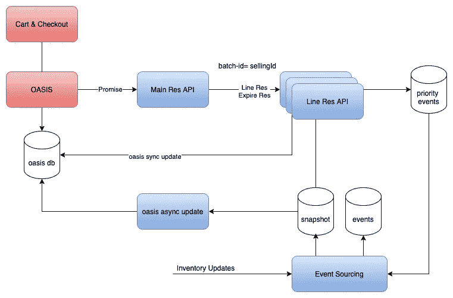

# 针对高峰流量扩展沃尔玛库存预订 API

> 原文：<https://medium.com/walmartglobaltech/scaling-the-walmart-inventory-reservations-api-for-peak-traffic-9ba37833ef9d?source=collection_archive---------0----------------------->


Photo by [Jake Givens](https://unsplash.com/photos/iR8m2RRo-z4) on [Unsplash](https://unsplash.com/)

当**顾客**在**Walmart.com**网站或手机 app 上下单时，就会发出**库存**预约电话。这捕获了对客户购物车中商品的需求。在感恩节假期或任何销售活动(例如，PS5 或 Xbox 活动)期间，库存预订请求的数量可能非常高。在这篇文章中，我想解释一下我们是如何克服扩展问题，现在能够无缝处理高峰流量的。

在进行优化之前，让我们了解一下可销售库存是如何计算的。

**可供销售=现有库存—订单进行中**

上面的公式简单地计算了可供销售的单位。现有库存根据库存摄取馈送进行更新。库存信息可以来自沃尔玛商店、配送中心或市场界面。需求\进行中的订单根据库存预订的数量进行更新。

```
{"id": "5a3adr7sehfe4y9a8ezb80da8sch6afz","sId": "65CED97DC02248478EAF8242FC808601-ss-1",//partition key"onHand" : 10,"ordersInProgress" : 4,"availableToSell" : 6...other fields omitted}
```

库存预订服务的第一个设计很简单。这是一个**水平扩展的 API** ，其中每个实例试图**执行**保留**命令**和**命令** ( *执行命令和应用事件概念是* [*事件源*](https://microservices.io/patterns/data/event-sourcing.html) *模式*的一部分)并将已执行的**保留** **事件**写入事件集合(CosmosDB 容器)。一旦预留事件被写入，则**快照**服务将**在库存快照上应用**预留事件。这意味着来自 reserved 事件的数量被聚合到库存快照上的 ordersInProgress 字段中(参见上面的 JSON)。


Reservation API without sticky session and header-based routing

通过这种方法，我们很快注意到，当 API 调用的数量增加时，会有大量的**写争用**。这意味着，如果有多个实例试图在同一个**分区键**上写入保留事件，它们将会因冲突而重试。

为了克服这种写争用，我们在新设计中利用了分散-收集技术。库存预订 API 被分成**主预订 API** 和**行预订 API** 。当主预订 API 接收到一个预订请求时，它将拆分按数据库分区键 sellingId 分组的预订行，并调用行预订 API。主预订 API 中的每个行项目都通过一个定制的 HTTP 头路由到行预订 API。这个 **HTTP 头**由 **Istio** sidecar 识别，使用一致的基于哈希的**目的地规则**将请求路由到同一个 **Kubernetes** pod。



Main and Line Reservation API with sticky session using batch-id header

通过进行这种设计更改，我们可以确保只有一个实例接收对同一个分区键的请求。然后在同一个 pod 中，传入的请求被路由到运行 **MailBoxProcessor** 的同一个**线程**。该技术用于实现**内存并发**。使用这个请求，路由试图写入分布式数据存储(CosmosDB)中的单个分区的进程\线程的数量减少到一个。


Mailbox processing using actor pattern

虽然我们可以通过这种设计减少写争用，但是我们遇到的下一个瓶颈是从单个实例写入数据库的保留事件的数量。CosmosDB 的每分区吞吐量上限为 **10，000 ru**。这意味着，如果每个保留的事件文档写入将使用 **5 个 RUs，**，那么我们的写入吞吐量将被限制在每秒 10，000/5= 2，000 个订单(OPS)。这意味着对于任何商品，我们每分钟只能接受**2000 份订单**或 **12 万份订单(OPM)。**

为了克服每个分区的写限制，我们创建的另一个**优化**是对保留的事件进行批处理，并创建一个单独的 **batchReserved** 事件，它可以将多个保留作为一个单独的文档写入。这意味着我们可以将写入吞吐量提高到 2000 次以上。我们对它进行了压力测试，以处理超过 5，000 次操作或超过 300，000 次 OPM。

我想强调的另一个优化是 T2 快照缓存。在执行保留命令之前，必须从数据库中读取分区键的当前状态或快照。由于每个预留调用都会发生快照读取，并且只有一个实例负责处理单个分区键的预留，因此在该实例中会维护一个具有 **TTL** 的内存快照缓存。并且有一个异步后台进程使快照缓存与数据库保持同步。这种优化减少了快照读取的总数，并降低了预订服务的读取 RUs 成本。

**总而言之，**下面列出了可以应用于任何**重写 API** 的所有优化。

1.  分散——用粘性会话收集 API 请求，这样数据库分区总是由同一个实例处理。
2.  使用带有邮箱的 actor 模式的内存中并发将单个分区的处理限制为单个线程。这也有助于相同分区请求的批处理。
3.  内存中的快照状态缓存可减少读取次数。

这些优化之所以成为可能，是因为我们优秀团队的共同努力:Shanawaaz Mohammed、Devesh Singh、Ammad Shaikh、Shanil Sharma、Mohammad Tariq 和 Murali Gadde。