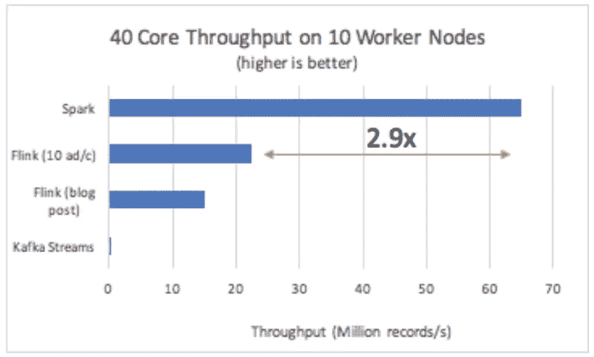
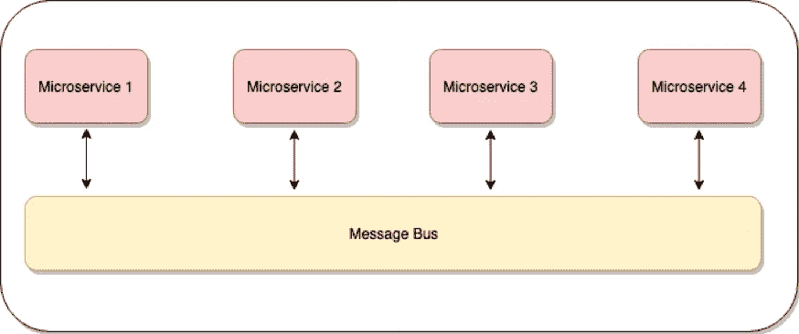
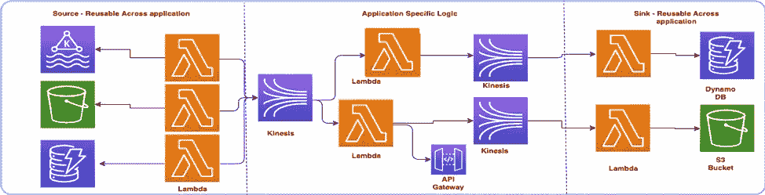
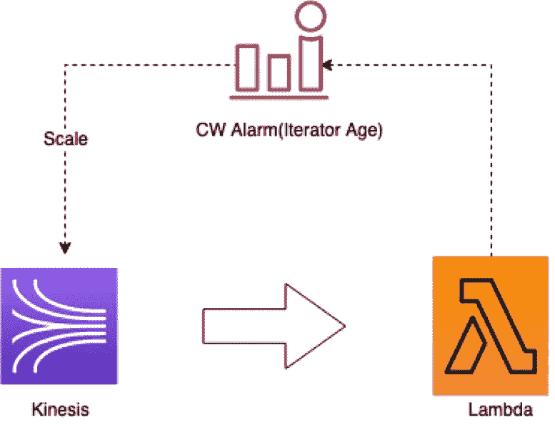
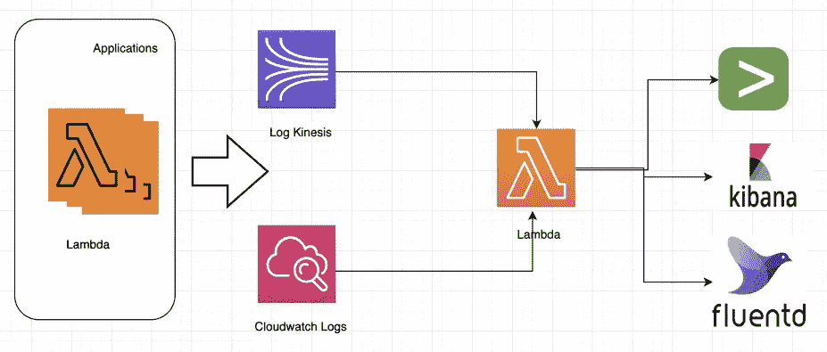

# 扩展到数十亿个请求 Capital One 的无服务器方式

> 原文：<https://medium.com/capital-one-tech/scaling-to-billions-of-requests-the-serverless-way-at-capital-one-e5958b4fa1b7?source=collection_archive---------0----------------------->

软件工程总监维杰·班塔努尔和软件工程师大师[马哈尔什·贾哈](https://medium.com/u/c5a1661fabbf?source=post_page-----e5958b4fa1b7--------------------------------)

有没有想过在等待月结单的时候发现账户上有错误的交易是什么感觉？也许你熬过来了，还留着剪纸疤痕为证。数字革命使得随时随地获取你需要的信息成为可能，我们离一个未来世界不远了，在这个未来世界里，相关信息会在发生时就出现在你面前，你不需要去寻找它。Capital One 正在努力实现我们所做的几乎所有事情的实时化，采用云计算和大数据工程工具为我们的解决方案带来实时性。

在我的团队中，一个由聪明的工程师、产品负责人和 scrum 大师组成的团队一直致力于为客户带来个性化的、实时的和相关的见解。我们留意那些不符合客户消费行为的交易；如餐馆交易有异常高的小费、重复账单的增加、新的免费试用的开始、多个重复交易等。

在 Capital One 的这些年里，Spark 框架发展成为满足大容量实时流和批处理需求的首选技术。强大的计算能力带来了更高的运营和维护成本，我们开始看到运营 Spark 基础设施以满足实时流需求的痛苦。因此，我的团队接受了挑战，找到了一个更简单、低维护、高度可扩展的模式，并围绕它设计了一个无服务器的流解决方案。

# 为什么 Apache Spark 不是所有实时流用例的灵丹妙药

据 [Databricks 博客](https://databricks.com/blog/2017/10/11/benchmarking-structured-streaming-on-databricks-runtime-against-state-of-the-art-streaming-systems.html)报道，Apache Spark 是处理大批量和流式数据最快的开源引擎之一。这是一件很容易的事。鉴于如此出色的性能，我们为什么会考虑使用其他产品呢？

*Source: Databricks blog (https://databricks.com/blog/2017/10/11/benchmarking-structured-streaming-on-databricks-runtime-against-state-of-the-art-streaming-systems.html)*

但是，让我们根据您的应用程序需求来评估这一点。例如:

*   您的应用程序每秒加载的典型记录是多少？如果低于每秒几千个，那么火花可能是过度杀伤。
*   为了实现高弹性，您的应用程序需要的最少驱动和工作容器数量是多少？如果您在云上，考虑将它分布在多个可用性区域和地区。
*   安装 Zookeeper 这样的资源管理器来维护 Spark 集群需要多少容器呢？
*   您是否考虑过云或数据中心的区域故障？如果是这样，您可能已经体验过跨地区使用 Spark 集群的架构复杂性。
*   你一整天都有恒定的负荷吗？如果是这样，太棒了，这对你的生意有好处。然而，大多数实时系统每天、每周和每年都有周期性负载，所以一定要考虑非高峰时段的系统利用率。
*   Spark 作业随时可能失败。您是否考虑过作业的错误处理、监控和自动可恢复性？开发人员为此付出了巨大的努力。
*   不要忘记开发人员的成本，这是最大的。想想工程师在 spark 基础设施上开发所需的所有特殊技能，如 scala 或 Python 等编程语言、安装和管理 Spark 基础设施的脚本知识、微调 Spark 缓存和从属节点等。

尽管 Apache Spark 的结果令人印象深刻，但是如果您担心 Apache Spark 的运行开销，那么无服务器流解决方案可能是更好的选择。实际上，大多数实时流用例的负载*远低于每秒 1000 个事务*。你不需要处理 Spark 的基础设施复杂性来解决这么小的负载。相反，使用无服务器流来简化您的代码，并大幅降低成本和复杂性。

# 一个架构良好的流解决方案包含什么？

在实施了几个与流相关的使用案例后，我认为理想的流解决方案应该满足以下要求:

## 缩放:

在现代应用程序架构中，自动伸缩应该是基本的设计考虑之一。在云计算时代，你可以根据需要获得无限的计算能力，因此没有必要为了峰值负载而扩展计算能力并支付额外费用。尽管您可以规划主要的周期性负载，但在传统的基于服务器的基础架构中，很难按分钟进行优化。理想情况下，应用程序应该能够在出现请求高峰时自动修复和自动伸缩。

## 节流:

流应用程序通常被设计为每秒接收数千个请求，并最终过滤到更易于管理的规模。当出现意外高峰时，流应用程序可以扩展，但下游阻塞调用(API、DB 等)可能无法扩展。因此，节流成为任何流式应用程序的基本要求之一。记住——你的系统的好坏取决于最薄弱的环节。

## 容错能力:

应用程序总是与 API、数据库等其他资源相连接..很难避免相关系统中的故障，但同时您也想保护您的应用程序免受这些问题的影响。在流应用程序中，容错是关键要求之一，因为您不想在后端系统停机时丢失数据。

## 可重用性:

关注重用而不是重新创建解决方案是很常见的。重用的程度取决于组件的模块化和大小，微服务是重用的最好例子。通过使流式解决方案的构建块变得小且可配置，我们可以强调跨多个应用程序的组件重用。

## 监控:

我不得不承认，当我知道我的应用程序到底发生了什么时，感觉最好。想象一下，数百万条消息/事件流经您的应用程序，您有能力跟踪每一条消息，并了解该消息到底发生了什么。当您正在构建面向关键客户的应用程序，并且需要找出特定客户事件到底发生了什么时，这变得更加重要。因此，监控对于同步或异步系统来说至关重要。

# 我们如何构建我们的无服务器流架构？

鉴于上述情况，我们如何构建我们的解决方案？我们的无服务器流架构模仿事件驱动的微服务架构，其中每个微服务通过消息总线相互连接。

事件驱动架构固有地提供了我们从流解决方案中需要的所有功能。通过将云提供商提供的托管服务与事件驱动架构相结合，可以构建无服务器的流媒体解决方案。

如果您可以将上述模式与 AWS Lambda 等托管服务映射为微服务，并将 AWS Kinesis 映射为消息总线，则可以使用无服务器堆栈实现事件驱动架构。

我们将整个架构分为三层——源、宿和处理。

*   **来源:**在这一层，微服务只负责从来源拉取数据。请将此视为事件进入您的流应用程序的入口点。*例如:阅读卡夫卡集群中的事件。*
*   **处理:**这一层负责处理你从源层得到的事件。你也可以把它想象成一个层，在这里你可以拥有你的应用程序特定的逻辑。*示例:过滤事件或调用 API 对事件做出决策。您可以使用一个或多个处理图层来映射、减少或增强您的消息。*
*   **Sink:** 这是您的应用程序的最后一层，在这里您对事件采取最后的行动。*示例:将事件存储到数据存储中或通过 API 调用触发其他进程。*

下面是从消息驱动架构到 AWS 服务的映射。

从上面的图表中，你可能会感觉到有很多重复的动作，特别是从 Lambda 到 Kinesis 的写/读。嗯，你可以发挥创造力，为重复的功能建立某种类型的库。

在 Capital One，我们正是这样做的，并构建了我们的内部 SDK 来抽象重复的任务。我们的 SDK 具有以下特性:

*   **从消息总线读写:**从消息总线读写事件(Kinesis 或将来的其他)。
*   **异常处理和重试:**有两种主要的重试类别，*阻塞和非阻塞*。当后端应用程序失败时，您可以让阻塞错误重试，直到它恢复。当您只想重试特定事件，并且对其他事件没有任何影响时，将使用非阻塞重试。
*   **秘密管理:**当您不想依赖在无服务器功能上存储凭证时，将需要此功能。您可以选择企业机密管理工具，并将它们集成为您的库的一部分
*   **监控:**我们创建了定制的消息信封，其中包含帮助我们跟踪每条消息的元数据。SDK 可以承担开发人员开销，并可以在每个微服务的入口/出口插入/移除信封。
*   **日志记录:**为了在所有微服务中获得统一的体验，您可以在 SDK 中构建一个日志记录模式。
*   **消息重复删除:**众所周知，大多数分布式快速数据系统保证至少一次传递。当您想要过滤掉重复的消息时，您可以考虑将其抽象出来作为库的一部分。您可以使用哈希或其他方法来实现亚毫秒级延迟的消息重复数据删除。

# 让我们看看这个解决方案如何实现我们理想的流解决方案的要求

正如我们之前所讨论的，任何无服务器流解决方案都需要解决伸缩性、节流、可重用性、容错和监控问题。那么这个赌注是怎么来的呢？

## 缩放:

这种架构模式与可扩展的云、服务相结合，从本质上使这成为可能。

*   Pattern 使用 Lambdas 实现微服务，并通过 Kinesis 连接。我们只需要缩放具有高 TPS 的 Lambdas，并且随着消息被过滤掉，相应地调整缩放配置。
*   根据设计，无服务器功能是可自动扩展的。*示例:如果您正在使用 Lambdas 和 Kinesis，并且您的消息吞吐量从 2MB/秒增加到 4mb/秒，则您可以缩放 Kinesis，这也将缩放连接到 Kinesis 的 Lambda 函数。*

## 节流:

节流的基本功能是基于如果您的输入请求速率远远高于下游所能支持的速率，则需要持有您的请求。消息总线的持久性本质可以在这里帮助我们，因为您只能选择一次可以处理的消息数，并持有其他消息。*示例:如果使用的是作为消息总线的驱动程序，则可以指定可以在函数中处理的批处理大小。*

## 可重用性:

如果我们能够以这样一种方式构建源和宿微服务，即它们没有任何业务功能，并且是配置驱动的，那么多个团队可以使用它们来消费事件。*示例:如果您可以构建源函数来消费来自卡夫卡的事件，这些事件允许对主题名称、经纪人地址等进行配置，则任何团队都可以根据需要使用该函数并将其部署到自己的堆栈中* s *，而无需进行任何代码更改。*

以上可以帮助我们实现代码级的可重用性。另一个可重用性是流本身的可重用性。如果为架构选择的消息总线是基于 pub-sub 的总线，则可以有多个订阅者订阅相同的事件。*示例:您可以将事件扇出到两个微服务，而无需编写单独的附加代码。*

## 容错:

同样，信息巴士可以拯救我们这里。考虑一下，如果您的后端服务出现错误，您可以将所有/失败的消息保存到消息总线中，然后重试，直到后端调用开始成功。

## 监控:

将元数据负载作为 SDK 的一部分进行记录有助于实现跨不同功能的统一日志。您还可以构建一个可重用的函数，将日志转发到首选的监控解决方案。

# 听起来无服务器的流媒体解决方案是解决问题的灵丹妙药，我不需要 Spark。

不尽然。Apache Spark 是一个分布式计算平台，非常适合大规模分布式数据处理负载。Spark 仍然是大容量计算和批处理领域的首选工具，在这些领域，数据和计算功能可以并行分布和执行。典型的例子包括机器学习用例的繁重的计算需求、涉及几百个文件的 map/reduce 范例、或者处理数十亿字节数据的长时间运行的进程等。Spark 也是实时流媒体领域的首选工具，但前提是流量非常大，每秒钟要处理数十万笔交易。

在 Capital One，我们使用多种大数据工程工具。在我的团队中，我将无服务器流用于高容量用例，例如基于每秒数千个事件的客户交易生成有意义的警报，以及用于低容量事件，例如每秒运行数十个事件的卡重新发行。我还使用 Spark 处理大型交易文件，使用机器学习模型生成客户的支出概况。这完全取决于具体的需求。

*最初发表于*[*【https://www.capitalone.com】*](https://www.capitalone.com/tech/cloud/serverless-streaming/)*。*

*披露声明:2020 资本一。观点是作者个人的观点。除非本帖中另有说明，否则 Capital One 不隶属于所提及的任何公司，也不被这些公司认可。使用或展示的所有商标和其他知识产权是其各自所有者的财产。*