# 3.扩展您的 OCI 网络服务器

> 原文：<https://medium.com/oracledevs/scaling-your-oci-web-server-203895180102?source=collection_archive---------0----------------------->


**注:2020 年 2 月 28 日**——我已经更新了本文中的一些信息，以符合 OCI 的当前版本。

在本系列的[第一期](/@jeffmdavies/getting-started-with-oracle-cloud-infrastructure-6b048dad480c?source=friends_link&sk=176c9109e0a77eda5a01371b9cc98a07)和[第二期](/@jeffmdavies/automatically-starting-your-web-server-2b7b793dfcb4?source=friends_link&sk=0ecdb9b31fdea89caedfe8874487089d)中，我向您展示了如何注册 Oracle Cloud Infrastructure (OCI)的免费试用版，以及如何创建一个简单的 web 服务器并将其部署到云中。我们还配置了实例，以便在服务器重启时 web 服务器会自动启动。在本文中，我将向您展示如何轻松地将单个 web 服务器扩展成数百个正在运行的实例。我们还将学习如何创建一个负载平衡器来平衡多个服务器之间的请求。

请注意，本文假设您拥有 OCI 的试用帐户，并且已经执行了第[篇第](/@jeffmdavies/getting-started-with-oracle-cloud-infrastructure-6b048dad480c?source=friends_link&sk=176c9109e0a77eda5a01371b9cc98a07)篇和第[篇第](/@jeffmdavies/automatically-starting-your-web-server-2b7b793dfcb4?source=friends_link&sk=0ecdb9b31fdea89caedfe8874487089d)篇文章中概述的所有步骤。本文直接建立在前两篇文章的基础上。

# OCI 的缩放

在 OCI 有两种主要的缩放方式，垂直和水平。我所说的“垂直”扩展是指将虚拟机的类型更改为更大、更强大的版本。水平扩展是简单地将更多的服务器添加到 web 服务器集合中，这些服务器都具有相同的部署特征(即每台服务器上加载相同的软件)。通常，当您水平扩展时，所有服务器的计算能力都是相同的。这使得在数百台相同的服务器之间实现负载平衡变得更加容易。然而，OCI 负载平衡器确实让您在一个服务器池中拥有不同计算能力的计算实例。

## 创建自定义图像

现在我们已经按照我们想要的方式配置了 webserver1 实例，让我们创建一个自定义图像，当我们开始垂直或水平缩放时，我们将使用它。我们将为运行我们 web 服务器的每个计算机实例应用该映像

在[https://cloud.oracle.com](https://cloud.oracle.com)登录您的试用帐户，并导航到您的计算实例。看到 webserver1 实例的详细页面后，从 Actions 菜单中选择 Create Custom Image，如下所示。

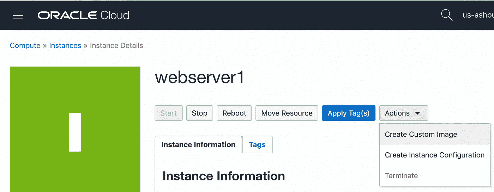

在创建自定义图像对话框中，将您的自定义图像命名为 ***webserver*** 。按下对话框底部的蓝色“创建自定义图像”按钮。

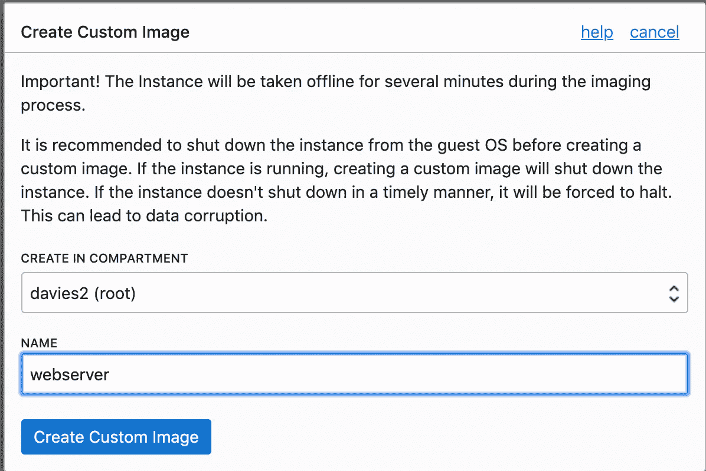

创建图像可能需要一些时间。要查看您的自定义图像，请导航至 ***计算- >自定义图像*** 。您将看到您的 ***webserver*** 实例被列出。

# 垂直缩放

让我们从一个垂直扩展 web 服务器的例子开始。在这个场景中，我们的 web 服务器开始达到容量极限，我们只想在一个更强大的服务器上运行它。我们将通过基于我们的自定义映像创建一个新的、更强大的计算实例来开始这一过程。

> ***注***
> 
> 您可能想删除 webserver1 实例，以便节省一些试用积分。不要这样做！在您的试用中，每个虚拟机形状只能有一个实例。出于我们的目的，will 将使用这些限制来探索垂直和水平缩放。在这篇文章的最后，我会告诉你如何缩小规模，以尽量减少您的试用信用使用。

按下蓝色的 ***创建实例*** 按钮，我们将创建新的更大的服务器。将新的计算实例命名为 ***webserver2*** 。选择 ***AD 2*** 作为可用性域(或者任何适用于您的试用实例的可用性域，并且不同于您在 webserver1 实例中使用的可用性域)。我们希望我们的两个 web 服务器位于不同的可用性域中

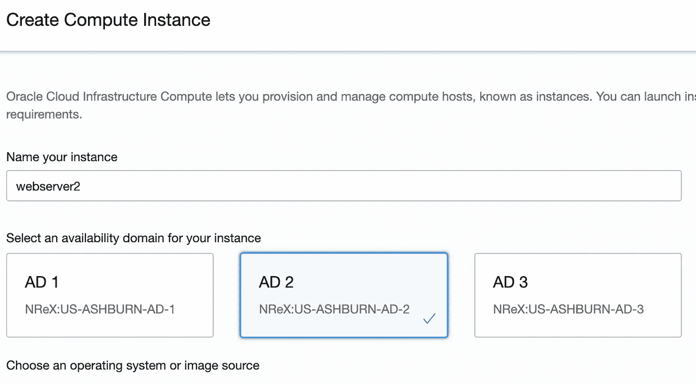

点击 ***改变图像源*** 按钮，选择 ***自定义图像*** 选项卡。然后勾选 ***webserver*** 自定义图像旁边的复选框并按下蓝色 ***选择图像*** 按钮。

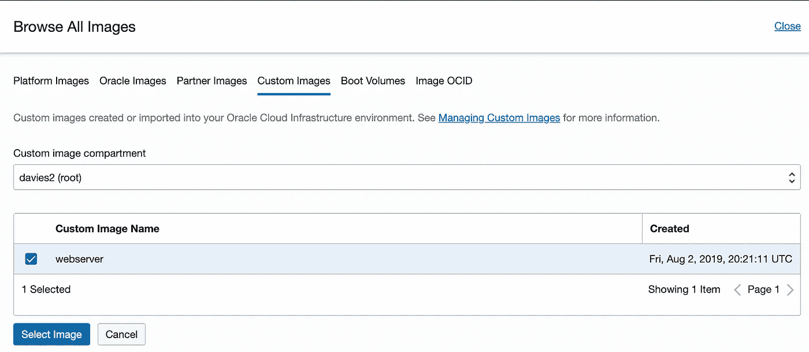

向下滚动一点，选择**和*虚拟机。标配 2.2*** 外形，2 个 OCPU，30 GB 内存。

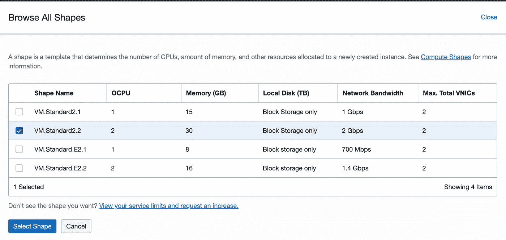

选择形状后，您需要选择公共 SSH 密钥，就像您在本系列的第一篇文章中所做的那样。您可以接受其他所有内容的默认值。一旦你按下 ***创建*** 按钮，给系统一点时间来完全配置你的新网络服务器。

一旦新实例被完全供应并运行。记下服务器的新公共 IP 地址。将您的浏览器指向 http:// <public ip="" address="">:3000，您应该会在浏览器中看到 ***健康的*** 响应。您刚刚在几分钟内将 web 服务器的计算能力提高了一倍！</public>

# 水平缩放

水平扩展是使用多台服务器来增加网站的工作容量。目前，我们使用单个网络服务器的 IP 地址来提供网页。要进行水平扩展，我们需要创建一个负载平衡器，向全世界提供一个 IP 地址，但实际上是将 web 调用分布在特定的 web 服务器实例上。这是水平缩放的一个例子。

> **注:**
> 
> 这是一种做事的“艰难方式”。由于试用账号的限制，我们无法利用 ***实例池******实例配置*** 。我将为运行完整 OCI 实例的人编写另一个版本，但是现在，我想把重点放在试用实例上。

为这两个实例创建工作负载平衡器需要两个步骤。

*   创建负载平衡器(使用监听器)
*   定义后端集

## 创建负载平衡器

要创建负载平衡器，使用菜单系统导航到 ***网络- >负载平衡器*** 并按下蓝色 ***创建负载平衡器*** 按钮。将负载平衡器命名为 ***webserverLB*** ，并确保将其设置为 ***Public*** 负载平衡器。选择 ***小*** 选项为带宽。

向下滚动一点，选择您的 VCN，然后为负载平衡器选择公共子网。

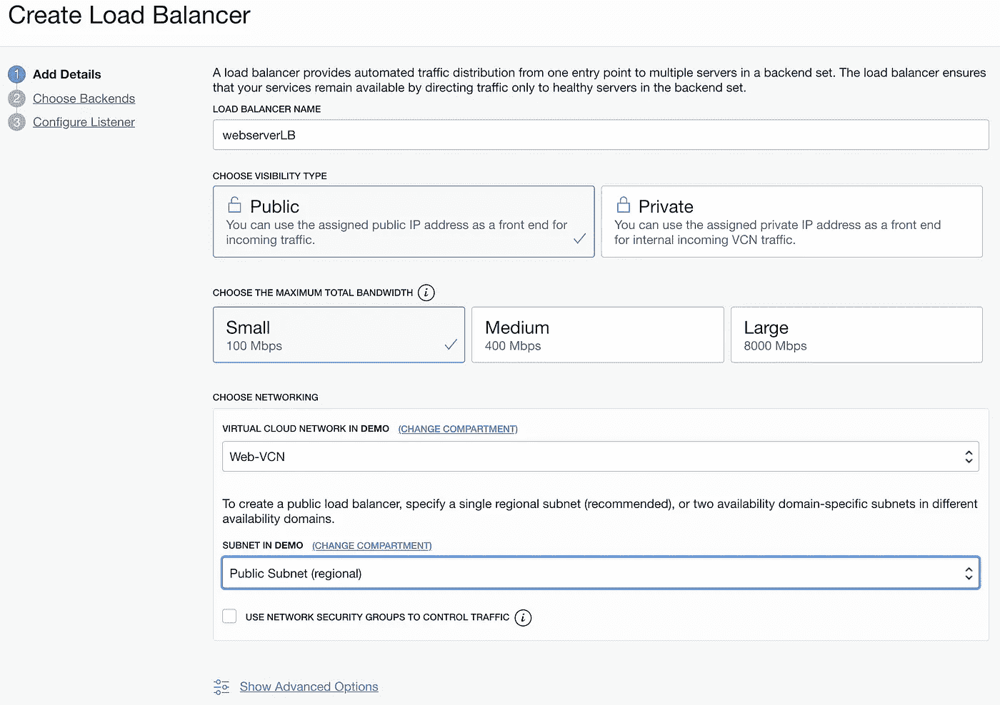

**注意:**在本文中，vcn 和 web 服务器的名称与我第一次写这篇文章时有所不同。请确保在创建负载平衡器时使用正确的 VCN 和公共子网。

按下蓝色的 ***下一个*** 按钮，进入向导的下一步。选择 ***加权循环调度*** 策略(我们稍后将使用权重来说明一个计算实例的容量是另一个的两倍这一事实)。

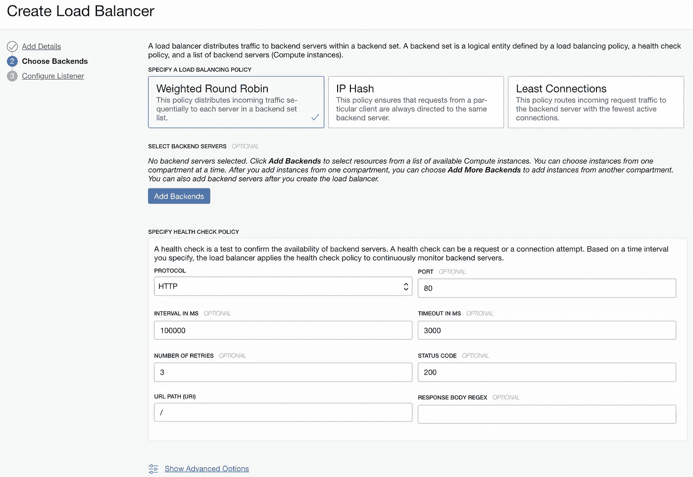

按下蓝色的**添加后端**按钮。选择运行 web 服务器的 2 个计算实例。您的实例名称将与此处显示的不同。准备好后点击**添加所选后端**按钮。

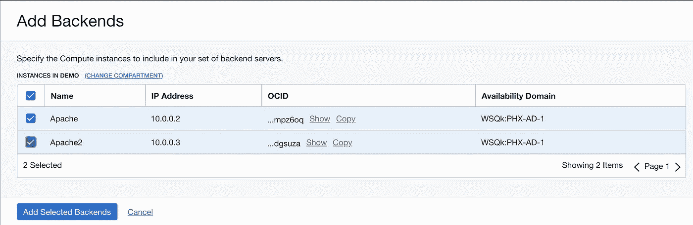

将 ***端口*** 字段设置为 3000。按下蓝色的 ***下一个*** 按钮。

在最后一步，为监听器选择 **HTTP** 选项。端口将自动更改为 80。将端口更改为 3000。最后，按下蓝色的 ***提交*** 按钮开始创建过程。负载平衡器的创建可能需要一段时间才能完成。等到它在你的仪表板上显示为绿色。

接下来，您将在仪表板中看到一个负载平衡器的示例。看一下 IP 地址(在我下面的图片中部分被编辑了),确保在 IP 地址的右边写着 Public。这是您稍后将用来测试负载平衡器的 IP 地址。

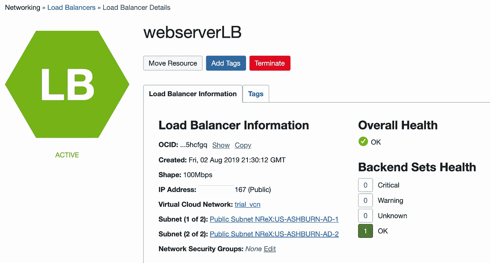

The dashboard for a load balancer

这个负载平衡器将成为我们 web 服务器的公众形象。所有对我们服务器的 HTTP 请求都将通过这个负载平衡器路由。如果我们还需要支持 HTTPS，我们必须为该协议创建第二个负载平衡器。

# 测试我们的负载平衡器

测试负载平衡器非常容易。只需打开浏览器，指向:

```
http://<load balancer IP address>:3000
```

您应该在浏览器窗口中看到响应 ***Healthy*** 。再按 5 或 6 次浏览器上的刷新按钮，将少量流量导向负载平衡器。

现在让我们 SSH 到我们的每个计算实例。为每个计算实例打开一个 SSH 控制台，并输入以下命令:

```
cd /var/log
sudo cat messages
```

如果您在每个计算实例上查看文件末尾的输出，您将看到***Hello World invoked…***的日志条目。您可以通过使用以下命令来“实时”查看此输出:

```
sudo tail -f messages
```

现在打开浏览器到`http://<load balancer IP.:3000/greeting`，点击刷新按钮 5 次左右。观察两个 SSH 控制台随着流量被路由到每个控制台而更新。

# ***在关闭***

如您所见，在试用环境中设置负载平衡器非常快速和简单。它易于创建和管理。除了试用环境之外，您还可以使用其他管理工具，通过添加(或删除)其他服务器、设置流量限制等来快速扩展您的环境。这是一个灵活而强大的系统。

> **注意:**
> 如果您想继续阅读本系列关于添加 HTTPS 支持的下一篇文章，请不要删除这些新资源(负载平衡器和第二个计算实例)。

如果您不打算继续阅读本系列的下一篇文章，您可以节省开支，删除负载平衡器和所有的子组件(即后端集和监听器)。您也可以删除 ***webserver2*** 实例。您可以从负载平衡器开始，通过为每个资产选择 ***终止*** 选项来删除这些资产。

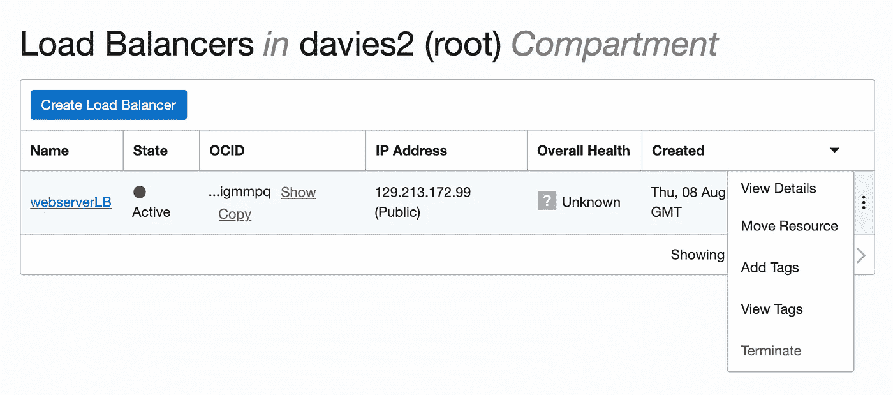

Terminate the load balancer and all of its associated assets

按照类似的过程删除 ***webserver2*** 实例。

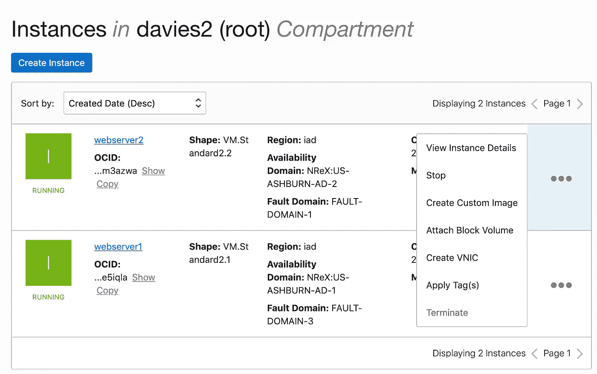

Terminate our second web server

我希望你喜欢这篇文章。在未来，我们将学习如何通过添加 HTTPS 支持、使用内置身份云服务(IDCS)对用户进行身份验证、连接到数据库、查看各种存储选项等来扩展我们的 web 服务器的功能。