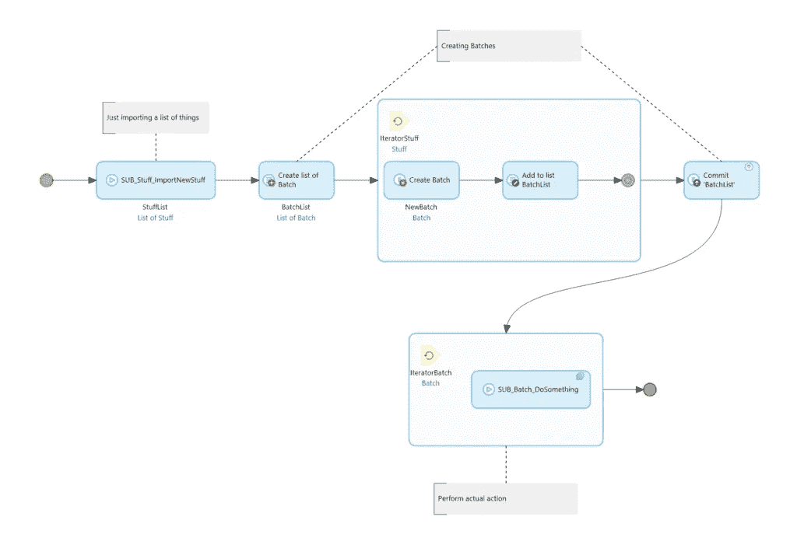
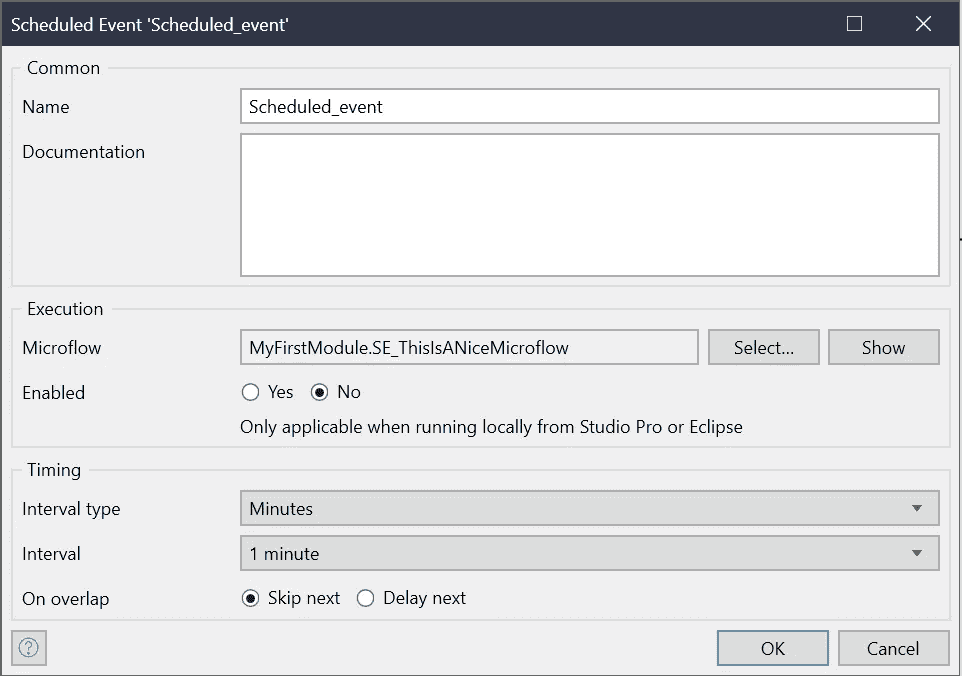
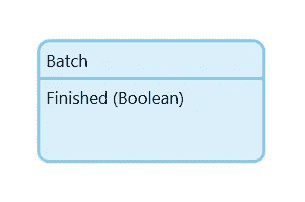
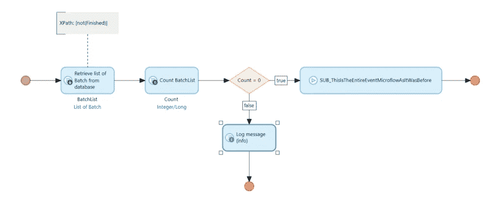
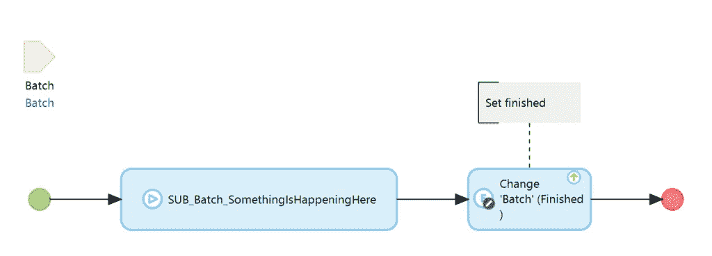
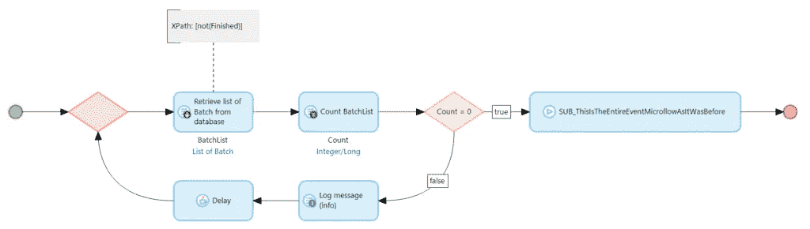

# 预定事件和队列处理— Mendix 和我

> 原文：<https://medium.com/mendix/scheduled-events-and-queue-processing-mendix-and-me-16e9bd3776b3?source=collection_archive---------0----------------------->

## 好吧，这种情况不常出现。然而，当它发生时，它可能会产生有问题的后果。如果它发生在生产环境中，可能会导致生产环境停止。

Scheduled Events and Queue Processing — Mendix and Me

## **用例**

在队列中运行进程(在 Mendix 中，我在下面使用术语 queue 来表示各种队列。我用它来指代进程队列和任务队列)是非常有用的东西。一方面，您可以将长时间运行的流程移至后台，为用户提供更流畅的体验；另一方面，您可以创建批处理，将大型操作(数据迁移、定期同步等)拆分为小型工作包。这样，您可以确保事务不会变得太大(这会导致系统崩溃)。

## **这和预定事件有什么关系？**

我遇到过好几次的一个具体用例是定期在后台运行的数据同步。我们的应用程序需要以一定的时间间隔从 API 中检索数据，然后在本地处理它。由于上面提到的原因，这个处理应该在工作包中完成。如果您已经处理过队列，解决方案是显而易见的。预定事件以固定的时间间隔从 API 中检索数据，创建工作包，然后在队列中处理它们。

这可能是最终的解决方案，没有什么你应该做“不同”。预定事件的典型微流如下所示:

首先，我们导入数据，然后我们创建工作包，最后我们在队列中执行它们的处理。

## **但是你为什么要写一篇关于它的博客文章呢？**

好吧，是什么让一个预定事件发生，也是什么让一个预定事件发生问题:它周期性地重复。

这通常正是我们想要用预定事件创建的行为。它应该每 X 秒/分钟/小时/天/…运行一次。但是，如果预定事件的执行时间比它被执行的时间长，该怎么办呢？

## **标准案例**

当然，Mendix 已经考虑到了上述问题，并建立了一种机制来解决这个问题。当您创建计划事件时，您可以定义它在这种情况下的行为。

> “On overlap”设置允许我们定义当执行时间超过周期时事件应该如何表现。您可以选择是跳过还是延迟事件的下一次执行。

如果选择“跳过下一个”，则在当前事件执行完毕之前，不会执行任何事件。之后继续正常周期。如果选择延迟，以下执行将被延迟。它们被放入一种队列中，并在第一次执行完成后立即被处理(这也有一定的风险，但这不是这里的重点)。

## **现在排队怎么办？**

如果工作包是在预定的事件中创建的，并且在队列中被处理，那么事件就不可能知道是否所有的事情都已经被处理了。它只能决定工作包的创建是否已经完成。如果现在包的实际处理时间比事件的两次执行之间的时间长，那么每次执行都会有越来越多的工作包被放入队列。大量的工作不断增加，从未得到处理。

使用默认的计划事件配置无法解决此问题。是的，你可以选择一个更长的时期作为预防措施。但是首先事情并不总是可预测的，用户可能希望数据尽快同步。

## **该怎么办？**

为了避免上面提到的问题，我们需要手动重新创建微流中预定事件通常自动执行的操作。我们必须查明前一次执行是否已经完成。为此，我们给批处理对象一个属性，作为处理是否已经完成的指示器。

在其最简单的形式中，这只是一个布尔属性。当创建批处理时，属性被设置为 false，在处理完成后，我们将其设置为 true。对于上面给出的微流程，我们引入了一个数据库查询来检查是否还有未执行的批处理。整个事情看起来是这样的:

我们首先统计是否还有批次没有处理。如果没有剩余的，我们执行第一个例子中使用的微流。在队列的实际执行中，我们当然要设置 Finished 属性。

现在，我们已经以一种非常简单的方式重新创建了用于队列的“跳过下一个”行为，并且不再冒由于事件执行过于频繁而使队列溢出的风险。

## **但是“延迟下一个”呢？**

即使我建议在大多数情况下不要使用 Delay next，为了完整起见，我还是想引入一个 Delay Next 变体。为此，我们必须在预定事件微流中构建一个循环，在这个循环中，我们一次又一次地检查前面的处理是否完成。我强烈建议使用延迟，因为否则数据库查询会一个接一个地执行，直到出现期望的结果。这会给系统带来巨大的负担。在[社区 Commons](https://marketplace.mendix.com/link/component/170) 中，有一个名为 Delay 的 Java 动作为我们做了这件事。它让系统等待。

有了这个延迟和循环，我们的事件微流现在看起来像这样:

不是中止执行，而是一次又一次地检查数据库，直到没有尚未处理的批处理。一旦出现这种情况，就会执行事件的实际逻辑。因此，事件的两种行为都可以用简单的方法扩展到队列，我们可以防止队列由于太多的事件执行而过载

当然，你不需要在每个事件中都这样。这是一个小特例。但是，每当您非常频繁地运行一个事件并且可能处理大量数据时，您应该考虑实现这样一种机制。它可以很快实施，可能会让你远离严重的问题。

我希望这是一个有趣的或其他的。一如既往，我很高兴收到反馈和评论。

*原文于 2022 年 12 月 23 日在* [*用德语发表 https://mendixamme . de*](https://mendixandme.de/index.php/2022/12/23/scheduled-events-und-queue-prozesse/)*。*

## 阅读更多

 [## 预定事件

### 配置计划事件的选项

docs.mendix.com](https://docs.mendix.com/refguide/scheduled-events/)  [## 任务排队

### 任务队列的概念和用法

docs.mendix.com](https://docs.mendix.com/refguide/task-queue/)  [## 恢复

### 这种活性可用于微流和纳流。1 简介检索活动可用于获取一个…

docs.mendix.com](https://docs.mendix.com/refguide/retrieve/#332-range) 

*来自发布者-*

*如果你喜欢这篇文章，你可以在我们的* [*中页*](https://medium.com/mendix) *找到更多喜欢的。对于精彩的视频和直播会话，您可以前往*[*MxLive*](https://www.mendix.com/live/)*或我们的社区*[*Youtube PAG*](https://www.youtube.com/c/MendixCommunity/community)*e .*

*希望入门的创客，可以注册一个* [*免费账号*](https://signup.mendix.com/link/signup/?source=direct) *，通过我们的* [*学苑*](https://academy.mendix.com/link/home) *获得即时学习。*

有兴趣更多地参与我们的社区吗？加入我们的 [*Slack 社区频道*](https://join.slack.com/t/mendixcommunity/shared_invite/zt-hwhwkcxu-~59ywyjqHlUHXmrw5heqpQ) *。*