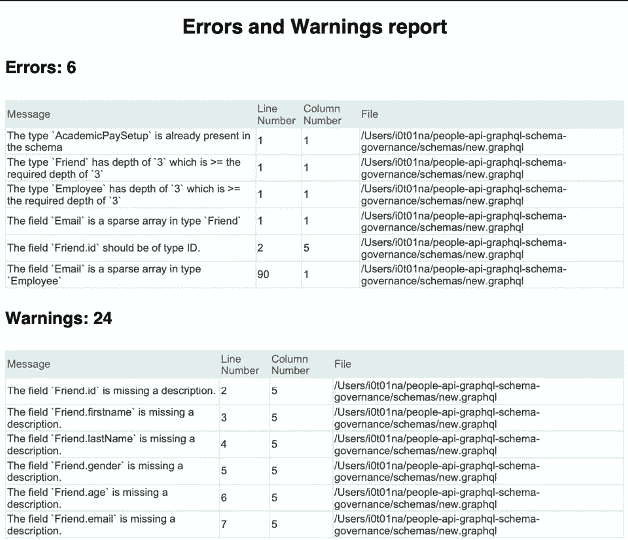

# GraphQL 的模式治理方法

> 原文：<https://medium.com/walmartglobaltech/schema-governance-approaches-for-graphql-68eaf32a48c0?source=collection_archive---------5----------------------->


这篇文章概述了我们在沃尔玛使用的一种方法，以确保无冲突、标准化的子图被装载到联邦网关上。使用我们内部的“GraphQL 模式治理工具”，我们通过使用 [graphql-schema-linter](https://www.npmjs.com/package/graphql-schema-linter) 和 [GraphQL Voyager](https://www.npmjs.com/package/graphql-voyager) 包，提前消除了开发周期中和入职前的各种顾虑。

# GraphQL 联盟

在进入治理工具的细节之前，让我们回顾一下 GraphQL 联邦的基础。

GraphQL federation 在后端提供了一个带有多个服务的 GraphQL API，允许不同的团队使用他们自己的服务处理他们自己的模式或子图。然后可以将这些模式集成在一起，形成一个超图。组合子图的任务由“网关”层完成，它不需要太多代码。

在任何服务中存在修改的情况下，前端层仅查询联合网关，而不必基于服务对查询进行改变。

我们分析了一些正在集成到我们的联邦网关中的子图，并观察了它们设计中的一些常见问题。这些启发了我们开发 GraphQL 模式治理工具。下面列出了其中的一些问题:

## 不一致的模式

联邦面临的挑战之一是难以管理来自不同来源的子图。团队可能最终会创建与另一个团队相同的*类型*，这可能会在集成到联合网关中之后导致冲突。


Team A and Team B create the same Type *Person* which leads to conflict

## 非标准开发实践

不同团队在联合网关上持续集成子图增加了冲突的可能性。开发人员在注意到网关上的冲突(例如使用相同的*类型*)之前，会经历整个软件开发生命周期(SDLC)。


Different datatypes used for the same field

## 代码质量保证

需要分析 GraphQL 模式以获得设计指南。这个过程可以通过使用一个可以解析模式并返回问题的工具来自动化。


## 缺乏分析问题的可视化工具

随着模式大小的增加，识别*类型*之间的偶然循环依赖变得越来越困难。然而，使用 GraphQL Voyager 这样的可视化工具，检测循环依赖关系会更容易，耗时也更少。


Cyclic dependency between Type Person and Type Contact

## 复杂图形

从我们的分析中，我们发现扁平图形比非扁平图形具有更低的响应时间。为了避免网关级别的性能问题，可以在集成之前识别复杂的图。


Complex graph for Type Person

# GraphQL 模式治理工具

为了解决上述挑战，我们通过利用 graphql-schema-linter 和 GraphQL Voyager 包开发了 GraphQL 模式治理工具。


The architecture of the GraphQL Schema Governance Tool

## 图表 SQL-模式-链接器

graphql-schema-linter 是一个 npm 包，用于根据某些规则验证模式定义语言(SDL)。该包提供了一个命令行实用程序，其中包含一组内置规则和几个用于验证的配置。该实用程序解析模式定义并生成一个可以配置成不同格式(text/compact/JSON)的报告。

除了内置规则之外，该库还允许开发人员编写一组定制规则，以满足他们组织的需求。例如，我们使用以下规则来确保有效、一致的模式:

*[C]表示我们开发的自定义规则。*

*   *字段有描述* 该规则将验证对象类型字段和接口类型字段有描述。
*   *字段是驼峰式大小写* 该规则将验证对象类型字段，接口类型字段名称是驼峰式大小写。
*   *模式深度检查器【C】* 该规则通过检查类型嵌套来检查模式的深度。如果深度大于某个阈值，就会抛出错误。
*   *循环检测器【C】* 该规则将检查子图中的循环依赖关系。
*   *id 应该是 ID [C]类型* 如果带有“ID”后缀的字段不是 ID 类型，此规则将引发验证错误。
*   *冲突检查器[C]:* 该规则将访问并获得超级图中可用类型的列表。如果子图中的任何类型出现在超图中，它将抛出一个错误。
*   *稀疏数组检查器【C】* 对于下面的类型，里面的感叹号表示数组中的任何值都将是一个*字符串*。如果缺少此感叹号，数组可能包含空值/未定义的值。外面的感叹号表示数组将始终返回，但可能为空。

此规则验证对于不可为空的数组，数组内的字段类型也不可为空。

```
type Person {contacts: [String!]!}
```

验证这些规则后，所有错误和警告的报告将发送给模式所有者。



The generated report

## GraphQL 航海家号

GraphQL Voyager 是一个用于任何 GraphQL API 的交互式可视化的包。在设计或讨论数据模型时，这是一个很好的工具。它可以与 GraphQL API 集成，并具有以下特性:

*   图表上的快速导航
*   左侧面板提供了每种类型的更多详细信息
*   “跳过中继”选项，通过删除中继包装类来简化图形
*   选择任何类型作为图的根的能力

知识图的可视化也被发送给模式所有者。这种可视化使开发人员能够更快地理解他们的模式的问题。

# 结论

从上面的挑战中，很明显模式治理工具对于复杂的超图是必要的。这有助于确保遵循联邦模式设计指南。此外，GraphQL 模式治理工具有助于实现以下目标:

*   深入了解标准模式设计实践
*   在集成到联邦之前理解模式冲突
*   在出现冲突的情况下，节省审查和重做开发工作的时间
*   通过在集成前检测复杂图形来防止性能问题

非常感谢 [Rohit Magazine](https://medium.com/u/b7654bf06923?source=post_page-----68eaf32a48c0--------------------------------) 和 [Rupesh Patel](https://medium.com/u/9fb04e6e3e94?source=post_page-----68eaf32a48c0--------------------------------) 对本文的贡献！