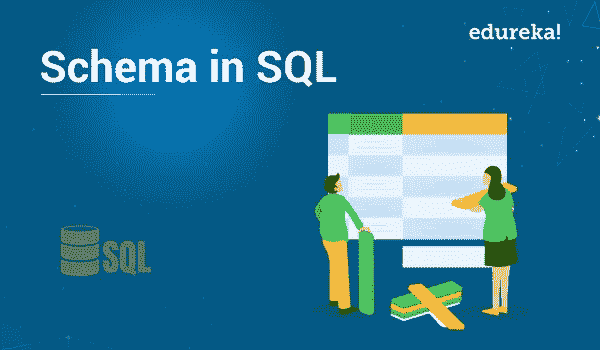
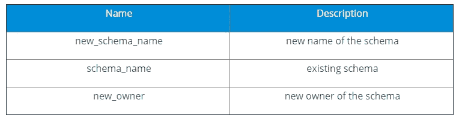

# 什么是 SQL 中的模式，如何创建它？

> 原文：<https://medium.com/edureka/schema-in-sql-816c6869073b?source=collection_archive---------0----------------------->



听说过模式这个术语吗？SQL 中的模式是与特定数据库用户名相链接的数据库对象的集合。我所说的用户名称为模式所有者，或者更恰当地说，相关对象组的所有者。让我们把这个话题挖深一点，详细讨论一下！本教程的日程如下

*   什么是 SQL？
*   什么是 SQL 中的模式？
*   使用模式的优势
*   如何创建模式？
*   使用 SQL Server Management Studio
*   如何改变模式？
*   参数
*   如何删除模式？

我们开始吧。

# 什么是 SQL？

大家可能都知道术语 SQL，代表结构化查询语言。SQL 是一种 ASI 标准语言，但是这种语言有许多不同的版本。SQL 是关系数据库系统的标准语言。它帮助你访问和操作数据库。可以对数据库执行几个查询。可以从数据库中检索数据。你可以在数据库中插入、更新、删除记录。它有助于创建新的数据库。还可以创建新的表和视图。

让我们继续下一部分。

# 什么是 SQL Server 中的架构？

SQL 中的模式是与数据库相关联的数据库对象的集合。数据库的用户名称为模式所有者(数据逻辑分组结构的所有者)。模式总是属于一个数据库，而一个数据库可以有一个或多个模式。此外，它也非常类似于存储数据库对象的单独的名称空间或容器。它包括各种数据库对象，包括表、视图、过程、索引等。

让我们继续，看看在 SQL 中使用模式的一些优点。

# 使用模式的优势

*   您可以根据用户访问权限应用安全权限来分隔和保护数据库对象。
*   可以在一个数据库中管理一组逻辑数据库对象。模式在将数据库对象组织到这些逻辑组中起着重要的作用。
*   在数据库对象名称相同的情况下，该模式也有所帮助。但是这些对象属于不同的逻辑组。
*   一个模式可以在多个数据库中使用。
*   该模式还有助于增加安全性。
*   它有助于操纵和访问对象，否则这将是一个复杂的方法。
*   您还可以转移多个模式的所有权。
*   在数据库中创建的对象可以在模式之间移动。

以上是一些优点，现在下一个主题是创建模式的方法。

# 如何创建模式？

**创建 SQL 的语法:**

```
CREATE SCHEMA [schema_name] [AUTHORIZATION owner_name] 
[DEFAULT CHARACTER SET char_set_name] [PATH schema_name[, ...]] [ ANSI CREATE statements [...] ] [ ANSI GRANT statements [...] ];
```

您可以使用 SQL server management studio 创建架构。按照提到的步骤！

## 使用 SQL Server Management Studio

按照步骤创建一个模式。

*   在对象资源管理器中，单击数据库文件夹。
*   在数据库下创建新的数据库模式。
*   右键单击安全文件夹，单击新建，选择架构。
*   在“模式-新建”对话框中，输入要为新模式创建的特定名称。
*   在“模式所有者”框中，输入数据库用户的名称，以便拥有该模式。单击搜索，打开搜索角色和用户对话框。

这就是模式的创建方式。现在让我们看看模式是如何改变的。

# 如何改变模式？

使用 altered schema 语句可以改变数据库中的模式。此语句专门用于重命名模式。新所有者必须是现有用户。

## 改变模式的语法:

```
ALTER SCHEMA schema_name [RENAME TO new_schema_name] [ OWNER TO new_user_name]
```

# 参数



理解了如何改变模式之后，让我们继续下一部分。我们将学习如何删除一个模式。

# 如何删除模式？

为了删除模式，我们使用以下语法:

```
DROP SCHEMA <schema name>
```

如果必须删除整个数据库，请遵循上述语法:

```
DROP DATABASE databasename;
```

这都是关于 SQL 中的模式。我希望这些内容解释了上述对你的知识的附加价值。继续阅读，继续探索！

如果你想查看更多关于人工智能、DevOps、道德黑客等市场最热门技术的文章，你可以参考 Edureka 的官方网站。

请留意本系列中解释 SQL 其他各方面的其他文章。

> *1。*[*SQL For Data Science*](/edureka/sql-for-data-science-a8fe10fe2ef9)
> 
> *2。* [*甲骨文面试前 50 题*](/edureka/oracle-interview-and-answers-d1a99534e2d0)
> 
> [*3。前 65 个 SQL 面试问题*](/edureka/sql-interview-questions-162f97f37ac2)

*原载于 2019 年 10 月 24 日 https://www.edureka.co**T21*[。](https://www.edureka.co/blog/schema-in-sql/)