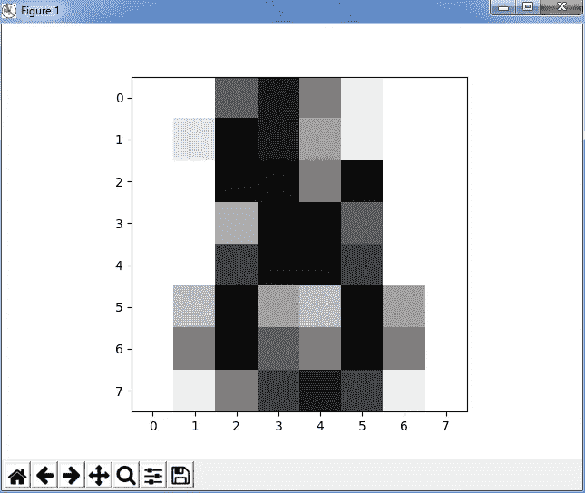

# Scikit Learn 初学者指南—在逻辑回归中实施 Scikit Learn

> 原文：<https://medium.com/edureka/scikit-learn-machine-learning-7a2d92e4dd07?source=collection_archive---------0----------------------->


Scikit Learn - Edureka

在本文中，我们将讨论 python 中的 Scikit learn。在谈论 Scikit learn 之前，我们必须了解机器学习的概念。有了机器学习，你不必手动收集你的见解。你只需要一个算法，机器会为你做剩下的事情！这难道不令人兴奋吗？Scikit learn 是我们可以使用 Python 实现机器学习的吸引力之一。这是一个免费的机器学习库，包含简单有效的数据分析和挖掘工具。我将带您浏览以下主题，这些主题将作为未来博客的基础:

*   什么是机器学习？
*   Scikit 学习概述
*   装置
*   用例-逻辑回归

# 什么是机器学习？

机器学习是一种人工智能，允许软件应用程序从数据中学习，并在没有人类干预的情况下更加准确地预测结果。但是这是怎么发生的呢？为此，机器需要对一些数据进行训练，并基于这些数据，它将检测模式来创建模型。从数据中获取知识并提供强大见解的过程都与机器学习有关。参考下图，更好地理解它的工作原理:


Working of Machine Learning- Sci-Kit Learn Tutorial

使用这些数据，系统学习一种算法，然后用它来建立一个预测模型。随后，我们使用反馈数据调整模型或提高模型的准确性。使用这些反馈数据，我们可以调整模型并预测对新数据集的操作。我们将讨论一个算法方法的用例，我们将训练和测试数据，这将帮助您更好地判断它是否适合您的特定问题。

接下来，有三种类型的机器学习:

## **监督学习**:

这是一个算法从训练数据集学习的过程。监督学习是在输入变量(X)和输出变量(Y)之间生成映射函数，并使用算法在它们之间生成函数。它也被称为预测建模，是指使用数据进行预测的过程。一些算法包括*线性回归、逻辑回归、决策树、随机森林、*和*朴素贝叶斯分类器*。我们将进一步讨论监督学习的一个用例，其中我们使用*逻辑回归*来训练机器。

## **无监督学习**:

这是一个使用未标记的信息来训练模型的过程。此过程可用于根据输入数据的统计属性对其进行分类。无监督学习也称为聚类分析，这意味着根据在描述对象或其关系的数据中找到的信息对对象进行分组。目标是一个组中的对象应该彼此相似，但不同于另一个组中的对象。一些算法包括 K 均值聚类、层次聚类等。

## **强化学习:**

强化学习是通过与空间或环境互动来学习。RL 代理从其行为的结果中学习，而不是从被明确教导中学习。它根据过去的经验(开发)和新的选择(探索)来选择行动。

# Scikit 学习概述

Scikit learn 是一个用于在 Python 中执行机器学习的库。Scikit learn 是一个开源库，在 BSD 下获得许可，可在各种上下文中重用，鼓励学术和商业使用。它在 Python 中提供了一系列监督和非监督学习算法。Scikit learn 由流行的算法和库组成。除此之外，它还包含以下软件包:

*   *NumPy*
*   *Matplotlib*
*   *SciPy(科学 Python)*

要实现 Scikit learn，我们首先需要导入上面的包。您可以使用命令行下载这两个包，或者如果您正在使用 PyCharm，您可以像安装其他包一样，通过进入您的设置来直接安装它。

接下来，以类似的方式，你要 ***导入 Sklearn*** 。Scikit learn 建立在 SciPy(科学 Python)的基础上，在使用 Scikit-learn 之前必须安装 SciPy。你可以参考这个网站下载同样的。另外，安装 Scipy 和 wheel 包，如果它不存在，您可以键入以下命令:

```
pip install scipy
```

我已经下载并安装了它，你可以参考下面的截图有任何困惑。


导入以上库后，我们再深入挖掘，了解 Scikit learn 到底是怎么用的。

Scikit learn 带有样本数据集，如*虹膜*和*数字*。您可以导入数据集并对其进行试验。之后，你要 ***导入 SVM*** 代表 ***支持向量机*** 。SVM 是一种用于分析数据的机器学习形式。

让我们举一个例子，我们将获取*数字*数据集，它将为我们对数字进行分类，例如- 0 1 2 3 4 5 6 7 8 9。请参考下面的代码:

```
**import** matplotlib.pyplot as plt
**from** sklearn **import** datasets
**from** sklearn **import** svmdigits**=** datasets.load_digits()
print(digits.data)
```

**输出—**

```
**[[ 0\. 0\. 5\. ..., 0\. 0\. 0.]
 [ 0\. 0\. 0\. ..., 10\. 0\. 0.]
 [ 0\. 0\. 0\. ..., 16\. 9\. 0.]
 ..., 
 [ 0\. 0\. 1\. ..., 6\. 0\. 0.]
 [ 0\. 0\. 2\. ..., 12\. 0\. 0.]
 [ 0\. 0\. 10\. ..., 12\. 1\. 0.]]**
```

在这里，我们刚刚导入了库、SVM、数据集并打印了数据。它是一个存储数据的长数组。它提供了对可用于分类*位数*样本的特征的访问。接下来，你也可以尝试一些其他的操作，如目标，图像等。考虑下面的例子:

```
**import** matplotlib.pyplot as plt
**from** sklearn **import** datasets
**from** sklearn **import** svmdigits**=** datasets.load_digits()
print(digits.target)
print(digits.images[0])
```

**输出**—

```
[0 1 2 ..., 8 9 8]                  // target of the data
[[ 0\. 0\. 5\. 13\. 9\. 1\. 0\. 0.]         // image of the data
 [ 0\. 0\. 13\. 15\. 10\. 15\. 5\. 0.]
 [ 0\. 3\. 15\. 2\. 0\. 11\. 8\. 0.]
 [ 0\. 4\. 12\. 0\. 0\. 8\. 8\. 0.]
 [ 0\. 5\. 8\. 0\. 0\. 9\. 8\. 0.]
 [ 0\. 4\. 11\. 0\. 1\. 12\. 7\. 0.]
 [ 0\. 2\. 14\. 5\. 10\. 12\. 0\. 0.]
 [ 0\. 0\. 6\. 13\. 10\. 0\. 0\. 0.]]
```

正如您在上面看到的，目标数字和数字的图像被打印出来。*数字。目标*给出了*数字*数据集的基本事实，即对应于每个数字图像的数字。接下来，数据总是具有形状(n_samples，n_features)的 2D 阵列，尽管原始数据可能具有不同的形状。但是在数字的情况下，每个原始样本是形状(8，8)的图像，并且可以使用*数字*来访问。*形象。*

## **学习和预测**

接下来，在 Scikit learn 中，我们使用了一个数据集(10 个可能类别的样本，从 0 到 9 的数字),我们需要预测给定图像时的数字。为了预测类别，我们需要一个*估计器*来帮助预测未知样本所属的类别。在 Scikit learn 中，我们有一个用于分类的估计器，它是一个 python 对象，实现了方法 *fit(x，y)* 和 *predict(T)。*让我们考虑下面的例子:

```
**import** matplotlib.pyplot as plt
**from** sklearn **import** datasets
**from** sklearn **import** svmdigits**=** datasets.load_digits()                     **//** dataset
clf **=** svm.SVC(gamma**=**0.001, C**=**100)
print(len(digits.data))
x,y**=**digits.data[:**-**1],digits.target[:**-**1]            **//** train the data
clf.fit(x,y)
print('Prediction:', clf.predict(digits.data[**-**1])) **//**predict data
plt.imshow(digits.images[**-**1],cmap**=**plt.cm.gray_r, interpolation**=**"nearest")
plt.show()**Output:
1796
Prediction: [8]**
```



在上面的例子中，我们首先找到了长度并加载了 1796 个例子。接下来，我们将此数据用作学习数据，我们需要测试最后一个元素和第一个负元素。此外，我们需要检查机器是否预测了正确的数据。为此，我们使用 Matplotlib 来显示数字的图像。因此，总结一下，你有数字数据，你有目标，你适合并预测它，因此你可以走了！真的是又快又简单不是吗？

您也可以使用图像可视化目标标签，只需参考以下代码:

```
**import** matplotlib.pyplot as plt
**from** sklearn **import** datasets
**from** sklearn **import** svmdigits**=** datasets.load_digits()
# Join the images and target labels in a list
images_and_labels **=** list(zip(digits.images, digits.target))# for every element in the list
**for** index, (image, label) **in** enumerate(images_and_labels[:8]):
    # initialize a subplot of 2X4 at the i+1-th position
    plt.subplot(2, 4, index **+** 1)
    # Display images in all subplots
    plt.imshow(image, cmap**=**plt.cm.gray_r,interpolation**=**'nearest')
    # Add a title to each subplot
    plt.title('Training: ' **+** str(label))# Show the plot
plt.show()
```

**输出—**


正如你在上面的代码中所看到的，我们使用了“zip”函数来连接列表中的图像和目标标签，然后将它保存到一个变量中，比如 images_and_labels。在那之后，我们在一个 2 乘 4 的网格中的每个位置索引了前八个元素。之后，我们刚刚在 Matplotlib 的帮助下显示了图像，并添加了标题“培训”。

# 用例—使用逻辑回归进行预测

**问题陈述** —某车企在市场上发布了一款全新 SUV。利用之前的 SUV 销售数据，他们希望预测可能有兴趣购买 SUV 的人群类别。

为此，让我们来看一个数据集，其中我将 *UserId、性别、年龄、估计工资和购买的商品*作为列。这只是一个样本数据集，你可以从 ***这里*** 下载整个数据集。一旦我们在 pyCharm 中导入数据，它看起来有点像这样。


现在让我们来理解这个数据。正如你在上面的数据集中看到的，我们有诸如 id、性别、年龄等类别。现在，基于这些类别，我们将训练我们的机器并预测购买数量。所以在这里，我们有**自变量**作为‘年龄’，**因变量**作为‘已购’。现在我们将应用监督学习，即*逻辑回归算法*来使用现有数据找出购买数量。

首先，让我们了解一下逻辑回归的概况。

**逻辑回归** —逻辑回归产生二进制格式的结果，用于预测分类因变量的结果。当因变量为二元时，即可用类别的数量为两个时，它的使用最为广泛，例如，逻辑回归的通常输出为:

*   既肯定又否定
*   真假
*   到处
*   通过和失败

现在从代码开始，我们将首先导入这些库——Numpy、Matplotlib 和 Pandas。按照以下步骤，在 Pycharm 中导入熊猫非常简单:

```
Settings -> Add Package ->  Pandas -> Install
```

之后，我们将导入数据集，并按以下方式将因变量(购买)和自变量(年龄、工资)分开:

```
dataset **=** pd.read_csv('Social_Network_Ads.csv')
X **=** dataset.iloc[:, [2, 3]].values
y **=** dataset.iloc[:, 4].values
print(X)
print(y)
```

下一步是训练和测试数据。一种常见的策略是将所有带标签的数据分成训练和测试子集，通常 70–80%用于训练子集，20–30%用于测试子集。因此，我们使用 cross_validation 创建了训练集和测试集。

```
**from** sklearn.cross_validation **import** train_test_splitX_train, X_test, y_train, y_test **=** train_test_split(X, y, test_size **=** 0.25, random_state **=** 0)
```

我们还可以使用 StandarScaler 缩放输入值以获得更好的性能，如下所示:

```
**from** sklearn.preprocessing **import** StandardScalersc **=** StandardScaler()X_train **=** sc.fit_transform(X_train)X_test **=** sc.transform(X_test)
```

现在我们将创建我们的逻辑回归模型。

```
**from** sklearn.linear_model **import** LogisticRegressionclassifier **=** LogisticRegression(random_state **=** 0)classifier.fit(X_train, y_train
```

我们可以利用这一点来预测我们的测试集的结果。

```
y_pred = classifier.predict(X_test)
```

现在，我们可以检查有多少预测是准确的，有多少没有使用**混淆矩阵**。让我们把 Y 定义为正例，把 N 定义为负例。这四种结果用 2*2 混淆矩阵表示，如下所示:


```
**from** sklearn.metrics **import** confusion_matrixcm **=** confusion_matrix(y_test, y_pred)print(cm)
```

输出–

```
[[65 3]
 [ 8 24]]
```

接下来，基于我们的混淆矩阵，我们可以计算准确度。所以在我们上面的例子中，精度是:

= TP + TN / FN + FP

= 65+24 / 65 +3+ 8 + 24

=89%

我们已经手动完成了！现在让我们看看机器是如何为我们计算的，因为我们有一个内置的函数“accuracy_score ”,它计算准确度并打印出来，如下所示:

```
// import the function accuracy_score
from sklearn.metrics import accuracy_score    

print(accuracy_score(y_test, y_pred)*100)     // prints the accuracy
```

输出–

```
89.0
```

万岁！因此，我们使用 Scikit learn 成功实现了逻辑回归，准确率为 89%。

至此，我们已经介绍了 python 提供的众多流行算法中的一种。我们已经介绍了 Scikit 学习库的所有基础知识，所以您现在可以开始练习了。你练习得越多，你学得就越多。

如果你想查看更多关于人工智能、DevOps、道德黑客等市场最热门技术的文章，你可以参考 Edureka 的官方网站。

请留意本系列中的其他文章，它们将解释 Python 和数据科学的各个方面。

> 1. [Python 教程](/edureka/python-tutorial-be1b3d015745)
> 
> 2. [](/edureka/python-functions-f0cabca8c4a) [Python 编程语言](/edureka/python-programming-language-fc1015de7a6f)
> 
> 3. [Python 函数](/edureka/python-functions-f0cabca8c4a)
> 
> 4.[Python 中的文件处理](/edureka/file-handling-in-python-e0a6ff96ede9)
> 
> 5. [](/edureka/scikit-learn-machine-learning-7a2d92e4dd07) [Python Numpy 教程](/edureka/python-numpy-tutorial-89fb8b642c7d)
> 
> 6. [Python 熊猫教程](/edureka/python-pandas-tutorial-c5055c61d12e)
> 
> 7. [Matplotlib 教程](/edureka/python-matplotlib-tutorial-15d148a7bfee)
> 
> 8. [Tkinter 教程](/edureka/tkinter-tutorial-f655d3f4c818)
> 
> 9.[请求教程](/edureka/python-requests-tutorial-30edabfa6a1c)
> 
> 10. [PyGame 教程](/edureka/pygame-tutorial-9874f7e5c0b4)
> 
> 11. [OpenCV 教程](/edureka/python-opencv-tutorial-5549bd4940e3)
> 
> 12.[用 Python 进行网页抓取](/edureka/web-scraping-with-python-d9e6506007bf)
> 
> 13. [PyCharm 教程](/edureka/pycharm-tutorial-d0ec9ce6fb60)
> 
> 14.[机器学习教程](/edureka/machine-learning-tutorial-f2883412fba1)
> 
> 15.[Python 中从头开始的线性回归算法](/edureka/linear-regression-in-python-e66f869cb6ce)
> 
> 16.[面向数据科学的 Python](/edureka/learn-python-for-data-science-1f9f407943d3)
> 
> 17. [Python 正则表达式](/edureka/python-regex-regular-expression-tutorial-f2d17ffcf17e)
> 
> 18.[Python 中的循环](/edureka/loops-in-python-fc5b42e2f313)
> 
> 19. [Python 项目](/edureka/python-projects-1f401a555ca0)
> 
> 20.[机器学习项目](/edureka/machine-learning-projects-cb0130d0606f)
> 
> 21.[Python 中的数组](/edureka/arrays-in-python-14aecabec16e)
> 
> 22.[在 Python 中设置](/edureka/sets-in-python-a16b410becf4)
> 
> 23.[Python 中的多线程](/edureka/what-is-mutithreading-19b6349dde0f)
> 
> 24. [Python 面试问题](/edureka/python-interview-questions-a22257bc309f)
> 
> 25. [Java vs Python](/edureka/java-vs-python-31d7433ed9d)
> 
> 26.[如何成为一名 Python 开发者？](/edureka/how-to-become-a-python-developer-462a0093f246)
> 
> 27. [Python Lambda 函数](/edureka/python-lambda-b84d68d449a0)
> 
> 28.[网飞如何使用 Python？](/edureka/how-netflix-uses-python-1e4deb2f8ca5)
> 
> 29.[Python 中的套接字编程是什么](/edureka/socket-programming-python-bbac2d423bf9)
> 
> 30. [Python 数据库连接](/edureka/python-database-connection-b4f9b301947c)
> 
> 31. [Golang vs Python](/edureka/golang-vs-python-5ac32e1ef2)
> 
> 32. [Python Seaborn 教程](/edureka/python-seaborn-tutorial-646fdddff322)
> 
> 33. [Python 职业机会](/edureka/python-career-opportunities-a2500ce158de)

*原载于 2017 年 12 月 4 日 www.edureka.co*[](https://www.edureka.co/blog/scikit-learn-machine-learning)**。**