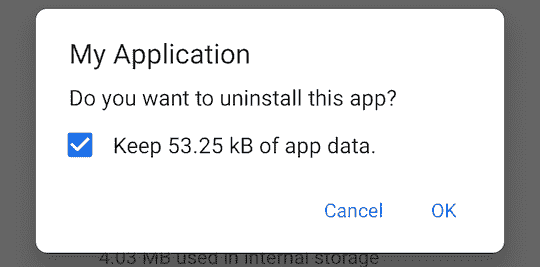

# 范围存储神话

> 原文：<https://medium.com/androiddevelopers/scope-storage-myths-ca6a97d7ff37?source=collection_archive---------3----------------------->


Illustration by [Molly Hensley](https://dribbble.com/Molly_Hensley)

Android 11 出来了，越来越多的设备在更新。按照传统，应用程序将被要求在下半年[将其](https://developer.android.com/distribute/best-practices/develop/target-sdk) `[targetSdkVersion](https://developer.android.com/distribute/best-practices/develop/target-sdk)`更新到 API 30——新应用程序在 8 月更新，现有应用程序在 11 月更新。

目标 API 30 带来的一个重大变化是要求使用作用域存储。

如此大的变化，尤其是在大型应用程序中，可能会令人害怕。更糟糕的是，我们在互联网上看到的一些关于如何适应作用域存储的建议有时令人困惑，甚至是误导。

为了帮助减轻这些恐惧，我们收集了一些关于作用域存储的常见问题。我们为如何调整您的应用提供了建议和可能的替代方案。

# 问:`android:requestLegacyStorage`要走了吗？

答:算是吧。

如果你的应用程序当前设置了`[android:requestLegacyStorage="true"](https://developer.android.com/training/data-storage/use-cases#opt-out-in-production-app)`，那么在`targetSdkVersion`设置为 30 之后，它应该会继续这样做。该标志对 Android 11 设备没有影响，但它将继续允许应用程序在 Android 10 设备上以旧方式访问存储。

如果您需要在 Android 10 设备的 AndroidManifest.xml 中使用`android:requestLegacyStorage="true"`,即使是在 Android 11 之后，也不要使用它。它仍然可以在 Android 10 设备上工作。

# 问:android:preserveLegacyStorage 是如何工作的？

答:如果你的应用程序安装在 Android 10 设备上，并且在设备更新到 Android 11 时有`android:requestLegacyStorage="true"`，它甚至会在 Android 11 上保留传统存储访问权限。

⚠️如果该应用程序被卸载，或者首次安装在 Android 11 上，那么该应用程序将无法访问传统存储。此标志仅用于进一步帮助设备从传统存储升级到作用域存储。

# 问:如果我的应用程序无法访问照片、视频或音频文件，我还需要请求 READ_EXTERNAL_STORAGE 权限吗？

答:不，从 Android 11 开始，`READ_EXTERNAL_STORAGE`只需要权限就可以访问其他应用拥有的媒体文件。如果您的应用程序只处理应用程序自己创建的非媒体文件(或应用程序创建的媒体文件)，则不再需要请求此权限。

要在 Android 11 和更高版本上停止请求此权限，只需更改应用程序的 AndroidManifest.xml 文件中的`<uses-permission>`标记，添加`[android:maxSdkVersion](https://developer.android.com/guide/topics/manifest/uses-permission-element#maxSdk)="29"`:

```
<**uses-permission
    android:name="android.permission.READ_EXTERNAL_STORAGE"
    android:maxSdkVersion="29"** />
```

# 问:我想访问我的应用程序不拥有的照片、视频或音频片段。我必须使用系统文件选择器吗？

答:不。如果你想，那么你可以，这是支持回到 Android KitKat (API 19)与`ACTION_OPEN_DOCUMENT`和回到 API 1 与`ACTION_GET_CONTENT`。这两者都使用系统文件选择器。这仍然是首选的解决方案，因为它不需要任何许可。

如果你不想使用系统文件选择器，那么你仍然可以请求`READ_EXTERNAL_STORAGE`权限，这将使你的应用程序访问所有照片、视频和音频，**包括访问文件 API**！

如果你需要使用`File` API 访问媒体内容，那么记得设置`android:requestLegacyStorage="true"`，否则`File` API 将无法在 Android 10 上工作。

# 问:我想保存非媒体文件，但不希望在卸载我的应用程序时删除它们。我需要使用 SAF 吗？

答:也许吧。

如果文件是用户可以不用你的应用程序就能使用的文档，那么使用系统文件选择器是正确的选择。使用`ACTION_CREATE_DOCUMENT`创建一个文件。也可以使用`ACTION_OPEN_DOCUMENT`打开一个现有的文件。

如果应用程序过去曾创建一个目录来存储所有这些文件，最好的选择是使用带有`ACTION_OPEN_DOCUMENT_TREE`的系统文件选择器，这样用户就可以选择一个特定的文件夹来使用。

如果这些文件仅用于您的应用程序，请考虑在应用程序的 AndroidManifest.xml 文件的`<application>`标记中设置标志`android:hasFragileUserData="true"`。这将允许用户即使在卸载应用程序时也能保留这些数据。



Image of the uninstall dialog for an app that has “fragile user data”. The dialog contains a checkbox to indicate if the system should retain the app data or not.

设置此标志后，存储文件的最佳位置取决于内容。保存敏感或个人信息的文件应存储在`Context#getFilesDir()`返回的目录中。不太敏感的数据应该存储在`Context#getExternalFilesDir()`返回的目录中。

# 问:我可以在没有任何许可的情况下将非媒体文件放入其他文件夹，如下载。这是个 bug 吗？

答:不会。应用程序可能会向这些集合提供文件，对非媒体文件同时使用下载和文档集合是一种最佳做法。但是，请记住，默认情况下，只有创建这些文件的应用程序才能访问它们。其他应用程序需要通过系统文件选择器获得访问权限，或者拥有对外部存储的广泛访问权限(即:`MANAGE_EXTERNAL_STORAGE`权限)。

⚠️对`MANAGE_EXTERNAL_STORAGE`权限的访问通过[游戏策略](https://support.google.com/googleplay/android-developer/answer/10467955)来控制。

# 问:我需要保存一个文档，我需要使用 SAF 吗？

答:不需要。应用程序可以向文档和下载集合贡献非媒体文件，无需任何特殊权限。只要安装了向这些集合提供文档的应用程序，该应用程序就可以完全访问这些文件。

💡如果你的应用程序需要请求`READ_EXTERNAL_STORAGE`权限才能保存这样的文档，那么在 Android 11 或更高版本中就不再需要请求该权限了。通过将权限请求更改为以下内容，可以做到这一点:

```
<**uses-permission
    android:name="android.permission.READ_EXTERNAL_STORAGE"
    android:maxSdkVersion="29"** />
```

要访问由其他应用程序添加的文档，或者卸载后由您的应用程序添加的文档，则有必要使用带有`ACTION_OPEN_DOCUMENT`意图的系统文件拾取器。

# 问:我想与其他应用共享我的应用文件。我需要使用 SAF 吗？

答:不能。有几种方法可以与其他应用程序共享文件。

*   [分享](https://developer.android.com/training/sharing/send):使用`Intent.ACTION_SEND`，你可以允许你的应用程序的用户将各种格式的数据分享给设备上的其他应用程序。如果你使用这个，使用 [AndroidX 的 FileProvider](https://developer.android.com/training/secure-file-sharing/setup-sharing) 自动将`file://`uri 转换成`content://`uri 可能会有帮助。
*   [创建您自己的文档提供者](/androiddevelopers/building-a-documentsprovider-f7f2fb38e86a):这允许您的应用程序继续使用您的应用程序的私有目录中的内容(或者`Context#getFilesDirs()`或者`Context#getExternalFilesDirs()`)，同时仍然提供对使用系统文件选择器的其他应用程序的访问。(请记住，在卸载应用程序后，可以保存这些文件——请参见上面的`android:hasFragileUserData="true"`了解如何使用！)

# 最后的想法

作用域存储是一项旨在提高用户隐私的重大变革。仍然有许多不依赖于使用存储访问框架的方式来处理内容。

如果数据只针对你的应用，我们强烈建议使用[应用特定目录](https://developer.android.com/training/data-storage/app-specific)。

如果数据是媒体，如照片、视频或音频，[使用 MediaStore](https://developer.android.com/training/data-storage/shared/media) 。记住，从 Android 10 开始，[贡献内容不需要权限](https://developer.android.com/training/data-storage/shared/media#scoped_storage_enabled)！

不要忘记`ACTION_SEND`到[与其他应用](https://developer.android.com/training/sharing/send)共享数据(或者允许他们[与你的](https://developer.android.com/training/sharing/receive)共享数据)！