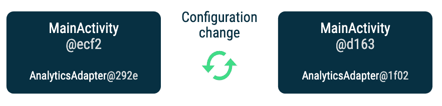
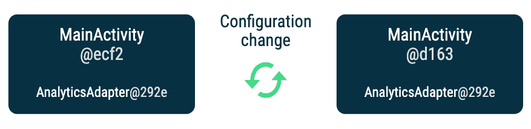

# Android 和 Hilt 中的范围

> 原文：<https://medium.com/androiddevelopers/scoping-in-android-and-hilt-c2e5222317c0?source=collection_archive---------0----------------------->


Illustration by [Virginia Poltrack](https://twitter.com/VPoltrack)

**将**一个对象`A`限定为另一个对象`B`意味着在`B`的整个生命周期中，它将始终拥有同一个`A`实例。当谈到依赖注入(DI)时，一个作用于容器的对象`A`意味着容器将一直提供相同的`A`实例，直到容器被销毁。

在 Hilt 中，您可以使用注释将类型的范围扩大到容器或组件。例如，假设您的应用程序有一个处理登录和注销的`UserManager`类型。您可以使用`@Singleton`注释将此类型的范围扩大到`ApplicationComponent`(这是一个由应用程序生命周期管理的容器)。应用程序组件中的作用域类型沿着组件层次结构向下流动:在本例中，相同的`UserManager`实例将被提供给层次结构中的其余[句柄组件。应用程序中依赖于`UserManager`的任何类型都将接收相同的实例。](https://developer.android.com/training/dependency-injection/hilt-android#component-hierarchy)

> 注意:默认情况下，刀柄绑定为 ***未绑定*** 。它们不是任何构件的一部分，可以在整个项目中访问。每次请求时，都会提供该类型的不同实例。当您将绑定范围限定到组件时，它会限制该绑定的使用位置以及该类型可以拥有的依赖项。

在 Android 中，你可以通过使用 Android 框架，在没有阿迪库的情况下手动确定范围。让我们看看你如何做到这一点，以及如何映射到范围与柄。最后，我们将比较用 Android 框架手动确定范围和用 Hilt 确定范围之间的区别。

# Android 中的范围

根据上面的定义，你可以说你可以通过在一个特定的类中使用一个该类型的实例变量来确定一个类型的范围，这是真的！没有 DI，您可以这样做:

```
class ExampleActivity : AppCompatActivity() {
  private val analyticsAdapter = AnalyticsAdapter()
  ...
}
```

`analyticsAdapter`变量的作用域是`ExampleActivity`的生命周期，这意味着只要这个活动没有被销毁，它就是同一个实例。如果另一个类由于某种原因需要访问这个限定了作用域的变量，它们每次也会得到相同的实例。当`ExampleActivity`的一个新实例被创建时(例如，活动经历了一个配置变更)，一个`AnalyticsAdapter`的新实例将被创建。

对于 Hilt，等效代码是:

```
**@ActivityScoped**
class AnalyticsAdapter @Inject constructor() { ... }@AndroidEntryPoint
class ExampleActivity : AppCompatActivity() { **@Inject** lateinit var analyticsAdapter: AnalyticsAdapter}
```

每次创建`ExampleActivity`时，它都会保存一个`ActivityComponent` DI 容器的*新*实例，该实例将为[组件层次结构](https://developer.android.com/training/dependency-injection/hilt-android#component-hierarchy)中位于其下的依赖项提供相同的`AnalyticsAdapter`实例，直到活动被销毁。



*You get a new instance of AnalyticsAdapter and MainActivity after a configuration change*

# 使用 ViewModel 确定范围

然而，我们可能希望`AnalyticsAdapter`在配置改变后仍然存在！我们可以说，我们希望将该实例的范围扩大到活动，直到用户离开它。

为此，您可以使用一个[架构组件视图模型](https://developer.android.com/topic/libraries/architecture/viewmodel),因为它能够经受住配置的变化。

如果没有依赖注入，您可能会有这样的代码:

```
class AnalyticsAdapter() { ... }class **ExampleViewModel() : ViewModel()** {
  val analyticsAdapter = AnalyticsAdapter()
}class ExampleActivity : AppCompatActivity() { private val viewModel: **ExampleViewModel by viewModels()**
  private val analyticsAdapter = viewModel.analyticsAdapter}
```

通过这种方式，您可以将`AnalyticsAdapter`限定到视图模型。因为活动可以访问 ViewModel，所以它总是可以获取同一个`AnalyticsAdapter`实例。

使用 Hilt，您可以通过将`AnalyticsAdapter`作用于`ActivityRetainedComponent`来实现相同的行为，这也可以在配置更改后保持不变:

```
**@ActivityRetainedScoped** class AnalyticsAdapter @Inject constructor() { ... }@AndroidEntryPoint
class ExampleActivity : AppCompatActivity() { **@Inject** lateinit var analyticsAdapter: AnalyticsAdapter}
```



*You get the same instance of AnalyticsAdapter after a configuration change using ViewModel or Hilt’s ActivityRetainedScope annotation*

如果您仍然希望保留 ViewModel，因为它需要在遵循良好的 DI 实践的同时执行一些视图逻辑，那么您可以按照[文档](https://developer.android.com/training/dependency-injection/hilt-jetpack#viewmodels)中的说明，使用`@ViewModelInject`来提供 ViewModel 依赖项。这一次，`AnalyticsAdapter`不需要作用于`ActivityRetainedComponent`，因为它现在被手动作用于 ViewModel:

```
class AnalyticsAdapter **@Inject** constructor() { ... }class ExampleViewModel **@ViewModelInject** constructor(
  val analyticsAdapter: AnalyticsAdapter
) : ViewModel() { ... }@AndroidEntryPoint
class ExampleActivity : AppCompatActivity() { private val viewModel: **ExampleViewModel by viewModels()**
  private val analyticsAdapter = viewModel.analyticsAdapter}
```

到目前为止，我们所看到的可以应用于所有由 Android 框架生命周期类管理的 Hilt 组件；参见[此处提供的示波器完整列表](https://developer.android.com/training/dependency-injection/hilt-android#component-scopes)。回到我们最初的例子，作用于`ApplicationComponent`与在 application 类中有一个该类型的实例而不使用 DI 原则是一样的。

# 使用 Hilt 和 ViewModel 确定范围

用 Hilt 限定范围的优点是，限定范围的类型在 Hilt 组件层次结构中是可用的，而用 ViewModel，您必须从 ViewModel 手动访问限定范围的类型。

使用 ViewModel 确定范围的优点是您可以在应用程序中拥有任何`[LifecycleOwner](https://developer.android.com/reference/androidx/lifecycle/LifecycleOwner)`对象的 ViewModel。例如，如果您使用 [Jetpack 导航库](https://developer.android.com/guide/navigation/navigation-getting-started)，您可以在[导航图](https://developer.android.com/reference/androidx/navigation/fragment/NavHostFragment)上附加一个视图模型。

希尔特提供了有限数量的范围。您可能会发现您没有特定用例的范围——例如，当使用嵌套片段时。在这种情况下，您可以使用 ViewModel 来确定范围。

# 用柄注入视图模型

如上所述，您可以使用`@ViewModelInject`将依赖项注入视图模型。在幕后，这些绑定保存在`ActivityRetainedComponent`中，这就是为什么您只能注入未被划分范围的类型，或者范围为`ActivityRetainedComponent`或`ApplicationComponent`的类型。

Hilt 生成的 ViewModel 工厂在`@AndroidEntryPoint`的`getDefaultViewModelProviderFactory()`方法中可用——带注释的活动和片段。这为您提供了更多的灵活性，因为您可以在`ViewModelProvider`中使用它来获得其他视图模型，例如那些作用于`BackStackEntry`的视图模型。

作用域的开销可能很大，因为提供的对象会一直留在内存中，直到持有者被销毁。在应用程序中使用作用域对象时要考虑周全。合适的范围是具有需要使用相同实例的内部状态的对象、需要同步的对象或您认为创建成本很高的对象。

然而，当你需要确定范围时，你可以直接使用 Hilt 的范围注释或者 Android 框架。