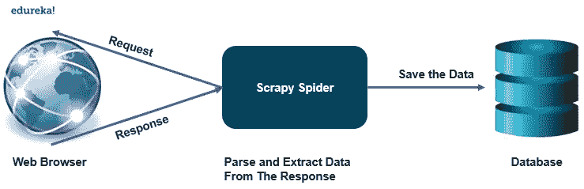
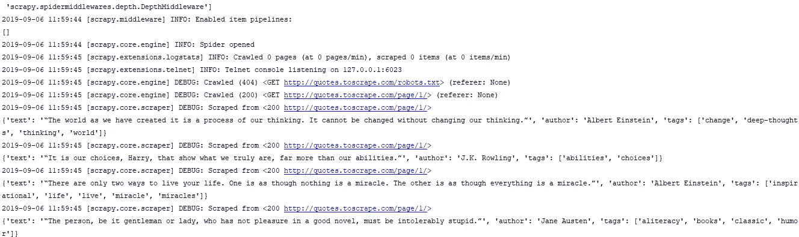

# Scrapy 教程:如何使用 Scrapy 制作网络爬虫？

> 原文：<https://medium.com/edureka/scrapy-tutorial-5584517658fb?source=collection_archive---------2----------------------->


Scrapy Tutorial — Edureka

Web 抓取是从网页中收集数据的一种有效方式，已经成为数据科学中的一种有效工具。有了 beautifulsoup 等各种用于 web 抓取的 python 库，数据科学家的工作就变得最佳了。Scrapy 是一个强大的网络框架，用于提取、处理和存储数据。在这篇文章中，我们将学习如何使用 scrapy 制作一个网络爬虫，以下是这篇博客中讨论的主题:

*   什么是 Scrapy？
*   什么是网络爬虫？
*   Scrapy 怎么安装？
*   开始你的第一个 Scrapy 项目
*   制作你的第一只蜘蛛
*   提取数据
*   存储提取的数据

# 什么是 Scrapy？

Scrapy 是一个用 python 编写的免费开源网络爬行框架。它最初是为执行 web 抓取而设计的，但也可以用于使用 API 提取数据。它由 Scrapinghub 有限公司维护。

Scrapy 是一个完整的软件包，可以下载网页，处理和存储数据库中的数据。

它就像一个发电站，有多种方式来抓取网站。Scrapy 可以轻松处理更大的任务，在不到一分钟的时间内抓取多个页面或一组 URL。它使用异步工作的 twister 来实现并发性。

它提供了蜘蛛契约，允许我们创建通用和深度爬虫。Scrapy 还提供了项目管道来创建 spider 中的函数，这些函数可以执行各种操作，如替换数据中的值等。



# 什么是网络爬虫？

网络爬虫是一种自动在网上搜索文件的程序。它们主要是为自动浏览的重复动作而设计的。

## 它是如何工作的？

网络爬虫很像图书管理员。它在 web 上查找信息，对信息进行分类，然后对信息进行索引和编目，以便相应地检索和存储爬取的信息。

爬虫要执行的操作是预先创建的，然后爬虫自动执行所有那些将创建索引的操作。输出软件可以访问这些索引。

让我们来看看网络爬虫的各种应用:

*   价格比较门户使用网络爬虫搜索特定的产品细节，以便对不同平台上的价格进行比较。
*   网络爬虫在数据挖掘领域的信息检索中起着非常重要的作用。
*   数据分析工具使用网络爬虫来计算页面视图、入站和出站链接的数据。
*   爬虫也服务于信息中心，收集数据，例如新闻门户。

# Scrapy 怎么安装？


要在你的系统上安装 scrapy，建议安装在专用的 virtualenv 上。安装工作与 python 中的任何其他包非常相似，如果您使用的是 [conda](https://www.edureka.co/blog/python-anaconda-tutorial/) 环境，请使用以下命令安装 scrapy:

```
conda install -c conda-forge scrapy
```

您也可以使用 pip 环境来安装 scrapy，

```
pip install scrapy
```

根据您的操作系统，可能会有一些编译依赖关系。Scrapy 是用纯 python 编写的，可能依赖于一些 python 包，如:

*   lxml——它是一个高效的 xml 和 HTML 解析器。
*   parcel——基于 lxml 编写的 HTML/XML 提取库
*   w3lib——它是处理 URL 和网页编码的多用途助手
*   twisted——一个异步网络框架
*   加密技术—它有助于满足各种网络级别的安全需求

# 开始你的第一个 Scrapy 项目

要启动您的第一个 scrapy 项目，请转到您想要保存文件的目录或位置，并执行以下命令

```
scrapy startproject projectname
```

执行该命令后，您将在该位置创建以下目录。

*   项目名称/

scrapy.cfg:它部署配置文件

*   项目名称/

__init__。py:项目的 python 模块

items.py:项目项定义文件

py:项目中间件文件

项目管道文件

settings.py:项目设置文件

*   蜘蛛/

__init__。py:一个目录，稍后你会把你的蜘蛛放在那里

# 制作你的第一只蜘蛛

蜘蛛是我们定义的类，scrapy 用它从网络上收集信息。你必须子类化 scrapy。Spider 并定义要发出的初始请求。

您在一个单独的 python 文件中为您的蜘蛛编写代码，并将其保存在项目的 projectname/spiders 目录中。

**quotes_spider.py**

```
import scrapy

class QuotesSpider(scrapy.Spider):
    name = "quotes"
    def start_request(self):
          urls = [ '<a href="[http://quotes.toscrape.com/page/1/](http://quotes.toscrape.com/page/1/)">[http://quotes.toscrape.com/page/1/](http://quotes.toscrape.com/page/1/)</a>',
                       [http://quotes.toscrape.com/page/2/](http://quotes.toscrape.com/page/2/),
                     ]
          for url in urls:
              yield scrapy.Request(url=url , callback= self.parse)

def parse(self, response):
     page = response.url.split("/")[-2]
     filename = 'quotes-%s.html' % page
     with open(filename, 'wb') as f:
           f.write(response.body)
     self.log('saved file %s' % filename)
```

如你所见，我们在蜘蛛中定义了各种功能，

*   名称:它识别蜘蛛，它必须在整个项目中是唯一的。
*   start_requests():必须返回蜘蛛开始爬行的请求的 iterable。
*   parse():这个方法将被调用来处理每个请求下载的响应。

# 提取数据

直到现在蜘蛛没有提取任何数据，它只是保存了整个 HTML 文件。scrapy spider 通常会生成许多包含从页面中提取的数据的字典。我们在回调中使用 python 中的 yield 关键字来提取数据。

```
import scrapy

class QuotesSpider(scrapy.Spider):

       name = "quotes"
       start_urls = [ [http://quotes.toscrape.com/page/1/'](http://quotes.toscrape.com/page/1/'),
                             [http://quotes.toscrape.com/page/2/](http://quotes.toscrape.com/page/2/),
                           ]

       def parse(self, response):
            for quote in response.css('div.quote'):
                  yield {
                              'text': quote.css(span.text::text').get(),
                              'author': quote.css(small.author::text')get(),
                              'tags': quote.css(div.tags a.tag::text').getall()
                             }
```

当您运行这个蜘蛛时，它将输出提取的数据和日志。



# 存储数据

存储提取数据的最简单方法是使用 feed exports，使用以下命令来存储数据。

```
scrapy crawl quotes -o quotes.json
```

这个命令将生成一个 quotes.json 文件，包含所有抓取的项目，以 json 序列化。

这就把我们带到了本文的结尾，在这里我们学习了如何使用 python 中的 scrapy 制作一个网络爬虫来抓取网站并将数据提取到一个 JSON 文件中。我希望你清楚本教程中与你分享的所有内容。

如果你想查看更多关于人工智能、DevOps、道德黑客等市场最热门技术的文章，你可以参考 Edureka 的官方网站。

请留意本系列中的其他文章，它们将解释 Python 和数据科学的各个方面。

> *1* 。[Python 中的机器学习分类器](/edureka/machine-learning-classifier-c02fbd8400c9)
> 
> 2. [Python Scikit-Learn 备忘单](/edureka/python-scikit-learn-cheat-sheet-9786382be9f5)
> 
> 3.[机器学习工具](/edureka/python-libraries-for-data-science-and-machine-learning-1c502744f277)
> 
> 4.[用于数据科学和机器学习的 Python 库](/edureka/python-libraries-for-data-science-and-machine-learning-1c502744f277)
> 
> 5.[Python 中的聊天机器人](/edureka/how-to-make-a-chatbot-in-python-b68fd390b219)
> 
> 6. [Python 集合](/edureka/collections-in-python-d0bc0ed8d938)
> 
> 7. [Python 模块](/edureka/python-modules-abb0145a5963)
> 
> 8. [Python 开发者技能](/edureka/python-developer-skills-371583a69be1)
> 
> 9.[哎呀面试问答](/edureka/oops-interview-questions-621fc922cdf4)
> 
> 10.[Python 开发者简历](/edureka/python-developer-resume-ded7799b4389)
> 
> 11.[Python 中的探索性数据分析](/edureka/exploratory-data-analysis-in-python-3ee69362a46e)
> 
> 12.[带 Python 的乌龟模块的贪吃蛇游戏](/edureka/python-turtle-module-361816449390)
> 
> 13. [Python 开发者工资](/edureka/python-developer-salary-ba2eff6a502e)
> 
> 14.[主成分分析](/edureka/principal-component-analysis-69d7a4babc96)
> 
> 15. [Python vs C++](/edureka/python-vs-cpp-c3ffbea01eec)
> 
> 16.[用 Python 进行网页抓取](/edureka/web-scraping-with-python-d9e6506007bf)
> 
> 17. [Python SciPy](/edureka/scipy-tutorial-38723361ba4b)
> 
> 18.[最小二乘回归法](/edureka/least-square-regression-40b59cca8ea7)
> 
> 19. [Jupyter 笔记本小抄](/edureka/jupyter-notebook-cheat-sheet-88f60d1aca7)
> 
> 20. [Python 基础知识](/edureka/python-basics-f371d7fc0054)
> 
> 21. [Python 模式程序](/edureka/python-pattern-programs-75e1e764a42f)
> 
> 22.[Python 中的发电机](/edureka/generators-in-python-258f21e3d3ff)
> 
> 23. [Python 装饰师](/edureka/python-decorator-tutorial-bf7b21278564)
> 
> 24. [Python Spyder IDE](/edureka/spyder-ide-2a91caac4e46)
> 
> 25.[在 Python 中使用 Kivy 的移动应用](/edureka/kivy-tutorial-9a0f02fe53f5)
> 
> 26.[十大最佳学习书籍&练习 Python](/edureka/best-books-for-python-11137561beb7)
> 
> 27.[使用 Python 的机器人框架](/edureka/robot-framework-tutorial-f8a75ab23cfd)
> 
> 28.[使用 PyGame 的 Python 中的贪吃蛇游戏](/edureka/snake-game-with-pygame-497f1683eeaa)
> 
> 29. [Django 面试问答](/edureka/django-interview-questions-a4df7bfeb7e8)
> 
> 30.[十大 Python 应用](/edureka/python-applications-18b780d64f3b)
> 
> 31.[Python 中的哈希表和哈希表](/edureka/hash-tables-and-hashmaps-in-python-3bd7fc1b00b4)
> 
> 32. [Python 3.8](/edureka/whats-new-python-3-8-7d52cda747b)
> 
> 33.[支持向量机](/edureka/support-vector-machine-in-python-539dca55c26a)
> 
> 34. [Python 教程](/edureka/python-tutorial-be1b3d015745)

*原载于 2019 年 9 月 6 日*[*https://www.edureka.co*](https://www.edureka.co/blog/scrapy-tutorial/)*。*