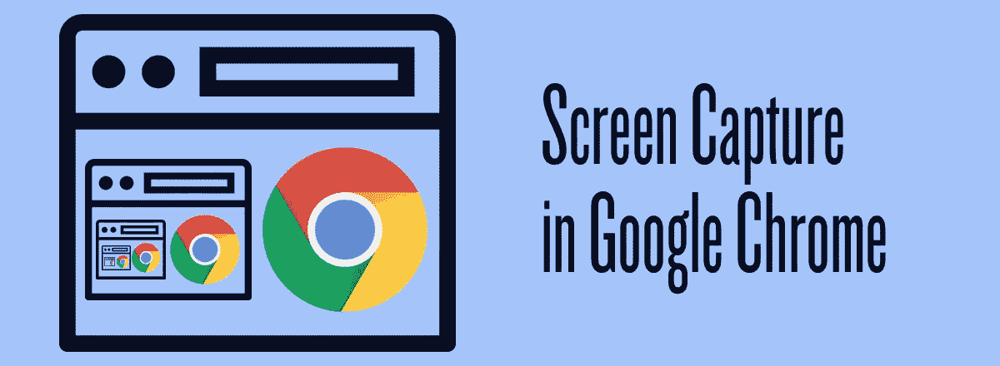
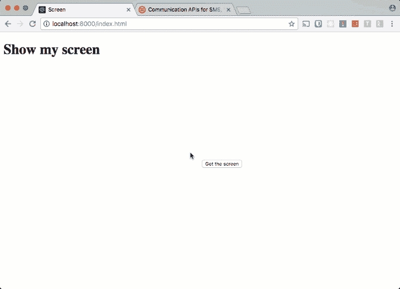
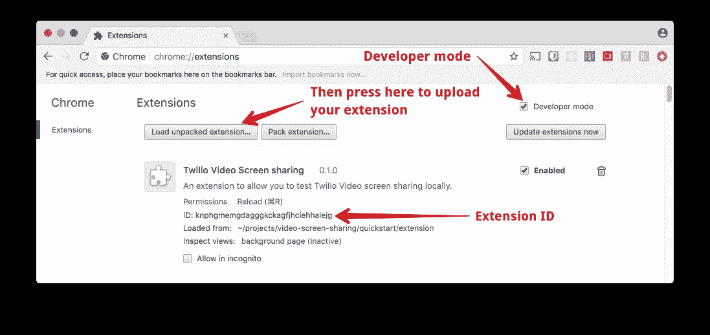

# 谷歌浏览器中的屏幕截图

> 原文：<https://medium.com/google-developer-experts/screen-capture-in-google-chrome-8fd99ace5fd3?source=collection_archive---------2----------------------->



要在 WebRTC 视频聊天应用程序中构建屏幕共享功能，您必须首先能够捕捉屏幕上的内容。在这篇文章中，我们将看到如何在一个网络应用程序中使用谷歌浏览器的截屏功能。



# 你需要什么

为了构建这个项目，您需要:

*   [谷歌浏览器](https://www.google.com/chrome/index.html)
*   文本编辑器
*   本地 web 服务器——我喜欢用 [servedir](https://www.npmjs.com/package/servedir) 来做这样的事情

# 屏幕共享

目前，Chrome 不允许你通过“媒体设备”API 访问屏幕内容。有一个“getDisplayMedia”方法的[草案规范](https://w3c.github.io/mediacapture-screen-share/)，但是还没有浏览器实现它。对于最终用户来说，网络上的屏幕共享有很多安全问题，所以浏览器在处理这一功能时会有所顾虑。

那我们现在能做什么？

嗯，在 Chrome 中，我们可以编写一个扩展，让我们能够访问屏幕、应用程序窗口和浏览器标签。Chrome 扩展具有扩展的权限和 API，允许访问页面上常规 JavaScript 不能访问的资源。

让我们编写一个扩展来访问屏幕截图，然后在页面上显示结果。

# 构建 Chrome 扩展

我们将要构建的扩展非常简单。它由两部分组成:一个描述扩展的“manifest.json”文件和我们想要运行的脚本，我们称之为“extension.js”。

## 扩展清单

创建一个新目录来构建我们的应用程序，一个用于扩展本身的目录，以及文件“manifest.json”和“extension.js”。

```
mkdir screen-capture
cd screen-capture
mkdir extension
touch extension/manifest.json extension/extension.js
```

在您最喜欢的文本编辑器中打开“manifest.json”。我们需要向清单添加一些基本的细节:名称、描述、我们的扩展版本以及我们需要的清单文件格式的版本，在本例中是 2。

```
{
  "name": "Desktop Capture",
  "description":
  "Allows you to capture your desktop for use in video applications",
  "version": "0.1.0",
  "manifest_version": 2
}
```

现在我们需要描述扩展是如何工作的。将以下内容添加到清单中:

```
 "manifest_version": 2,
  "background": {
    "scripts": ["extension.js"],
    "persistent": false
  },
  "externally_connectable": {
    "matches": ["*://localhost/*"]
  },
  "permissions": ["desktopCapture"]
}
```

这告诉 Chrome 这个扩展实际上做了什么。

首先，它在后台运行文件“extension.js”。“persistant”:false”选项表示我们正在构建一个[事件页面](https://developer.chrome.com/extensions/event_pages)。这意味着当不需要扩展时，它会被卸载，不会占用系统资源。

成为 [`externally_connectable`](https://developer.chrome.com/extensions/manifest/externally_connectable) 意味着该扩展可以接收来自匹配 URL 上的网页的消息。在这种情况下，这是一个开发扩展，将只适用于“本地主机”。如果您想将它构建为您站点的扩展，您需要在这里添加您自己的域匹配代码。

最后，权限部分意味着我们想要访问 Chrome 扩展的[桌面捕获 API](https://developer.chrome.com/extensions/desktopCapture) 。当我们为扩展本身编写代码时，我们将看到它是如何工作的。

## 扩展代码

要构建事件页面，我们需要创建一个事件监听器。我们将等待来自网页的[消息，因此打开“extension.js”并开始输入:](https://developer.chrome.com/apps/messaging#external-webpage)

```
chrome.runtime.onMessageExternal.addListener((message, sender, sendResponse) => {});
```

[`chrome.runtime`](https://developer.chrome.com/apps/runtime) 是我们用来响应扩展外部事件以及返回关于扩展本身的其他细节的 API。“onMessageExternal”在收到来自扩展外部的消息时触发，因此我们需要侦听它。当我们的侦听器被调用时，它接收三个参数，我们从页面发送的消息，一个 [`runtime.MessageSender`](https://developer.mozilla.org/en-US/Add-ons/WebExtensions/API/runtime/MessageSender) 对象和一个我们最多可以使用一次将消息发送回页面的函数。

一旦这个事件触发，我们就需要使用[` chrome . desktop capture . choose desktop media `](https://developer.chrome.com/extensions/desktopCapture#method-chooseDesktopMedia)来弹出屏幕共享选项。我们需要传递一组源来捕获。[这些可以是“屏幕”、“窗口”、“标签”或“音频”](https://developer.chrome.com/extensions/desktopCapture#type-DesktopCaptureSourceType)我们将在发送的消息中从网页传递它们。我们还将发送消息的选项卡传递给扩展。最后，我们需要传递一个回调函数，一旦函数为我们请求访问的流返回一个“streamId ”,就会调用这个回调函数。为了让我们异步使用“sendResponse”函数，我们还需要在侦听器函数的末尾“返回 true”。

```
chrome.runtime.onMessageExternal.addListener((message, sender, sendResponse) => {
  const sources = message.sources;
  const tab = sender.tab;
  chrome.desktopCapture.chooseDesktopMedia(sources, tab, (streamId) => { });
  return true;
});
```

一旦我们得到了对回调的响应，我们就差不多完成了扩展。我们需要做的只是检查用户是否授权访问屏幕，并使用“sendResponse”将不成功的响应或流的 ID 发送回网页。

```
chrome.runtime.onMessageExternal.addListener((message, sender, sendResponse) =>; {
  const sources = message.sources;
  const tab = sender.tab;
  chrome.desktopCapture.chooseDesktopMedia(sources, tab, (streamId) => {
    if (!streamId) {
      sendResponse({
        type: 'error',
        message: 'Failed to get stream ID'
      });
    } else {
      sendResponse({
        type: 'success',
        streamId: streamId
      });
    }
  });
  return true;
});
```

这就是我们需要为这个版本的扩展编写的全部内容。现在我们需要在使用它之前安装它。

## 安装延伸部分

在 Chrome 中安装一个你正在开发的扩展来进行测试是非常简单的。只要在浏览器的地址栏输入 chrome://extensions 就可以打开扩展设置页面。

然后，要安装扩展，你需要选中“开发者模式”框，然后选择“加载未打包的扩展…”。从对话框中，导航到保存扩展的目录，并选择整个目录。

上传后，您需要记下您的分机 ID。我们将在下一部分用到它。



# 构建屏幕截图

在这篇文章的剩余部分，我们将会看到如何使用我们的新扩展来获取屏幕截图。现在，我们将在网页上的“T3”视频>元素中展示这一点。在另一篇文章中，我们将研究在视频聊天中使用流，这样我们就可以远程共享我们的屏幕。

首先在项目目录中创建名为“chrome”的目录，并在其中创建一个名为“index.html”的新 HTML 页面。

```
<!DOCTYPE html>
<html lang="en"><head>
  <meta charset="UTF-8">
  <meta name="viewport" content="width=device-width, initial-scale=1.0">
  <meta http-equiv="X-UA-Compatible" content="ie=edge">
  <title>Screen</title>
</head><body>
  <h1>Show my screen</h1> <video autoplay id="screen-view" width="50%"></video>
  <button id="get-screen">Get the screen</button>
  <button id="stop-screen" style="display:none">Stop the screen</button> <script>
  </script>
</body>
</html>
```

这是一个基本的 HTML 页面，里面有一个`'元素来显示我们的结果，两个按钮来启动和停止屏幕截图，还有一个`

我们将从收集将要使用的 DOM 元素开始编写代码。我们还为稍后将向扩展发出的请求设置了一个对象。请记住，我们可以提供我们想要选择的来源。在这个应用程序中，我们将能够从整个屏幕、应用程序的窗口或 Chrome 的标签中进行选择。您还需要之前将扩展加载到 Chrome 时的扩展 ID。将此内容添加到您的`<脚本>块中:

```
(() => {
 const EXTENSION_ID = 'YOUR_EXTENSION_ID';const video = document.getElementById('screen-view’);
 const getScreen = document.getElementById('get-screen');
 const stopScreen = document.getElementById('stop-screen');
 const request = { sources: ['window', 'screen', 'tab'] };
 let stream;})();
```

现在，开始捕捉桌面。当我们点击按钮进入屏幕时，我们向扩展发出请求，并在回调中得到响应。

```
 let stream;
  getScreen.addEventListener('click', event => {
    chrome.runtime.sendMessage(EXTENSION_ID, request, response => { });
  });
})();
```

一旦我们得到响应，我们就检查它是否成功。如果是这样，我们可以获取扩展返回给我们的流 ID，并将其传递给“media devices”API。如果没有，那么我们记录访问被拒绝。

```
 chrome.runtime.sendMessage(EXTENSION_ID, request, response => {
    if (response && response.type === 'success') {
      navigator.mediaDevices.getUserMedia({
        video: {
          mandatory: {
            chromeMediaSource: 'desktop',
            chromeMediaSourceId: response.streamId,
          }
        }
      });
    } else {
      console.error('Could not get stream');
    }
  });
```

在这段代码中，我们将选项传递给“mediaDevices.getUserMedia”的视频选项。“chromeMediaSource”应设置为“desktop”,“chrome media source Id”是我们从扩展中获得的流 ID。

我们需要编写的其余代码与常规的“getUserMedia”代码完全相同。该函数返回一个用流解析的承诺，因此我们需要将流设置为页面的`< video >'元素的源。我们还将隐藏 get screen 按钮，显示 stop screen 按钮，并捕捉任何可能发生的错误。

```
 navigator.mediaDevices.getUserMedia({
    video: {
      mandatory: {
        chromeMediaSource: 'desktop',
        chromeMediaSourceId: response.streamId,
      }
    }
  }).then(returnedStream => {
    stream = returnedStream;
    video.src = URL.createObjectURL(stream);
    getScreen.style.display = "none";
    stopScreen.style.display = "inline";
  }).catch(err => {
    console.error('Could not get stream: ', err);
  });
```

最后，我们可以编写代码来处理停止屏幕捕获。这将监听按钮上的点击，获取流的曲目并停止它们。它还从“”中删除了“src ”,并反转了可见按钮。

```
 } else {
        console.error('Could not get stream');
      }
    });
  }); stopScreen.addEventListener('click', event => {
    stream.getTracks().forEach(track => track.stop());
    video.src = '';
    stopScreen.style.display = 'none';
    getScreen.style.display = 'inline';
  });
})();
```

这是所有的代码。让我们运行这个。

# 捕捉屏幕

我们需要做的最后一件事是在本地主机上提供这个 HTML 文件。我通常使用一个名为 [servedir](https://www.npmjs.com/package/servedir) 的 npm 模块。如果您已经安装了 Node.js 和 npm，那么您可以使用

```
npm install servedir -g
```

然后，您可以使用命令行导航到保存文件的目录，并通过输入以下命令在 localhost:8000 上提供该文件:

```
serve .
```

如果您有另一种方法用于在本地主机上提供静态文件，您也可以使用这种方法。

打开页面，点击“获取屏幕”按钮，选择您想要共享的屏幕、窗口或选项卡。您已经捕获了您的屏幕！


# 后续步骤

如果你没有写下所有的代码，你也可以在[的 GitHub repo](https://github.com/philnash/screen-capture) 中查看结果。

我们在这里所做的一切都是针对 Chrome 浏览器的，但事实证明你也可以在 Firefox 中访问屏幕截图。理想情况下，我们可以将它封装在一个能在两种浏览器上无缝运行的函数中。请留意关于如何达到这一阶段的更多博客文章。

我们已经实现了所需扩展的一个非常小的版本来访问屏幕截图。对于更强大的版本，查看 Twilio 文档中的屏幕截图指南[。您还可以在那里找到更多关于如何在视频通话中使用 Twilio Video 的这一新功能进行屏幕共享的信息。](https://www.twilio.com/docs/api/video/screen-capture-chrome?code-sample=code-onmessageexternal-event-listener&code-language=js&code-sdk-version=default)

你有一个有趣的浏览器截屏用例吗？请在下面的评论中告诉我你的想法或任何问题。或者，你也可以在推特上通过@菲尔纳什联系我们，或者通过电子邮件联系 philnash@twilio.com。

[*谷歌 Chrome 中的截屏*](https://www.twilio.com/blog/2017/10/screen-capture-in-google-chrome.html) *原载于 2017 年 10 月 12 日* [*Twilio 博客*](https://www.twilio.com/blog) *。*